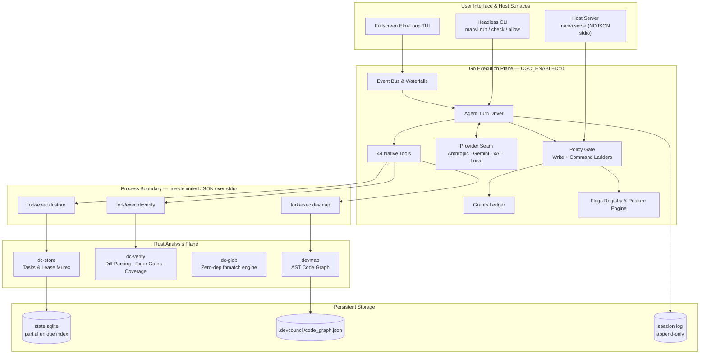
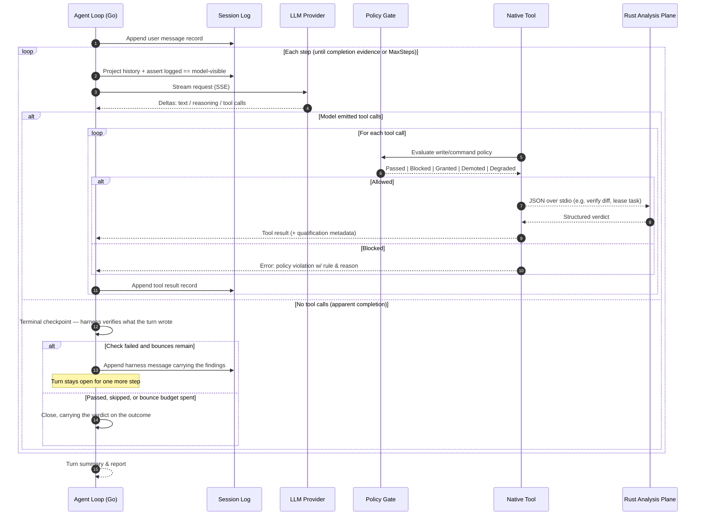
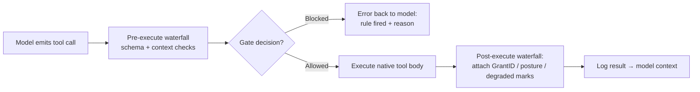
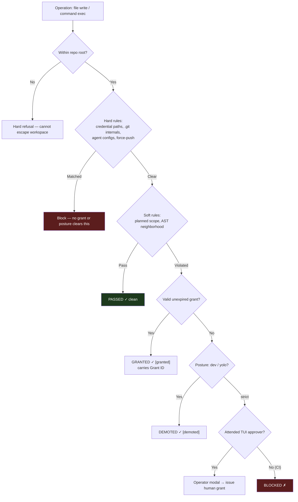
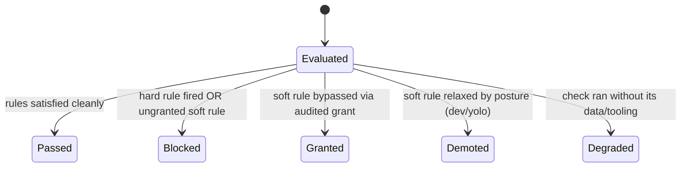
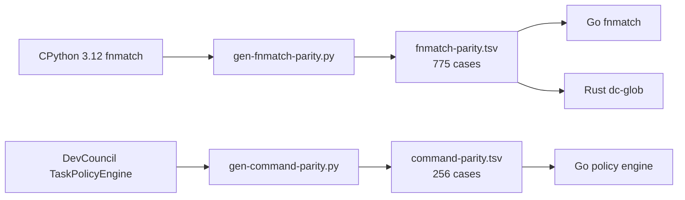
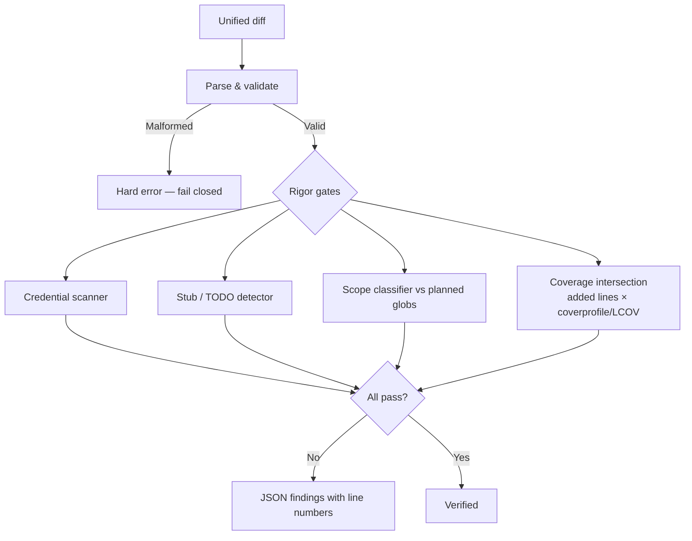
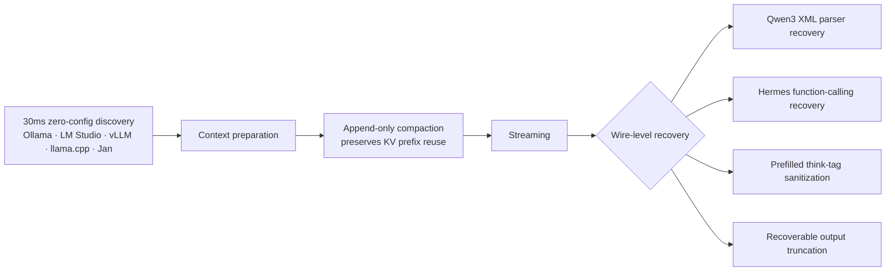

# MANVI

A lightweight, high-performance coding-agent harness in pure Go and Rust — designed for local models, customizable for specialized tools and use cases, and featuring additional capabilities from its dual-plane architecture.

**Status: runnable & fully certified.** Kernel, ported policy gates, git safety, override seam, flag registry, immutable session log, turn driver, multi-provider seam, Elm-loop TUI, embedded stdio host server (`manvi serve`), 44 native tools (including a native git integration, an MCP 2.0 client, and a bridge to the external `devcouncil` CLI), and the Go↔Rust process boundary — all verified against **1,031 parity cases** generated from the Python incumbent. Everything is certified by `./verify.sh`.

<br clear="left">

---

## Why MANVI?

MANVI was created as a new lightweight coding harness designed for local models, customizable for other tools and use cases, and featuring additional capabilities from the architecture:

- **Designed for Local Models**: Sub-30ms auto-discovery across local runners (Ollama, LM Studio, vLLM, llama.cpp, Jan), append-only context compaction preserving KV prefix caching (**1.5s warm vs 120s cold prefill on 27B models**), wire-level parser recovery (Hermes, Qwen3 XML), and prefilled `<think>` sanitization.
- **Customizable for Other Tools & Use Cases**: Zero-runtime overhead extension model, native tool execution (44 native tools, MCP 2.0 client, and tool bridges), and an embedded stdio host server (`manvi serve`) for embedding into custom IDEs, editors, and external toolchains.
- **Additional Architectural Capabilities**: Dual-plane process partition (pure Go concurrency + Rust CPU determinism with zero CGO), a 6-rung non-cheating policy ladder with audited override grants, and SQLite-backed multi-agent task concurrency that survives process termination.
- **Tested & Optimized Against Sibling Harnesses**: Empirical testing and experiments with lightweight and local harnesses (such as Pi, Oh My Pi, and Kon) informed key harness optimizations — notably replacing naive 24-step cutoffs with a 500-step ceiling backed by progress stall-cost tracking, eliminating volatile in-memory state, and preventing prefix-cache invalidation.

---

## The Approach

MANVI is built on a handful of deliberate design decisions that shape everything else:

1. **Two planes, split by workload.** IO-bound concurrency (event loops, streaming, cancellation) runs in pure Go (`CGO_ENABLED=0`); CPU-bound determinism (unified diff parsing, coverage intersection, AST indexing, SQLite persistence) runs in Rust. They never link.
2. **Process boundary, not CGO.** Go and Rust communicate exclusively via `fork`/`exec` child processes exchanging line-delimited JSON over stdio. This preserves static binaries, instant cross-compilation, and fault isolation — a crash in the analysis plane cannot take down the execution plane.
3. **Non-cheating invariants.** A check that did not run never reports as passed. A grant that cleared a rule never reports as a clean pass. Blocks are overridable when appropriate, but never invisible.
4. **Mutual exclusion in storage, not application code.** Multi-agent task concurrency is enforced by SQLite's partial unique index (`ON task_leases (task_id) WHERE status = 'active'`) — not by an in-memory lock that dies with the process.
5. **The log is the source of truth.** Model-visible history is *always* projected on demand from the append-only session log; nothing lives only in volatile memory. What the model saw is provably what was logged.

---

## Architecture

### System Overview



### Plane Responsibilities

| Responsibility | Plane | Package | Rationale |
|---|---|---|---|
| Agent loop, turn driving | Go | `manvi/agent` | Goroutine concurrency, stream cancellation |
| LLM provider seam | Go | `manvi/llm` | HTTP SSE client, multi-provider normalization |
| Policy gates & overrides | Go | `manvi/gate`, `manvi/policy`, `manvi/grants` | Fast in-memory evaluation, origin tracking |
| Terminal UI & telemetry | Go | `manvi/ui` | Event multiplexing, raw termios, damage-diffed rendering |
| Unified diff parsing | Rust | `crates/dc-verify` | CPU-bound text processing |
| Coverage intersection | Rust | `crates/dc-verify` | Line-level coverage bitsets (`-coverprofile`, LCOV) |
| Task & lease persistence | Rust | `crates/dc-store` | `rusqlite`, ACID transactions, exclusion index |
| Glob pattern matching | Both | `crates/dc-glob` ↔ `manvi/internal/fnmatch` | Shared 775-case CPython parity fixture |

---

## How a Turn Executes

Every turn is an evidence-driven state machine: project history → call the model → execute tool calls through the policy gate → log everything → repeat until completion evidence or step ceiling.



### The turn ends on a check, not on a claim

A turn that stops emitting tool calls looks finished. Whether it *is* finished is
decided by the harness, not by the model saying so:

- **The check runs itself.** A mutating turn is verified against the paths its own
  handlers reported writing — not against `git diff`, which also carries whatever
  was uncommitted before the turn began. A turn that changed nothing is skipped,
  and the skip is recorded, so "not owed" stays distinguishable from "did not run".
- **A failure is handed back once.** The findings are appended as a message from
  the harness — marked as such, so no face or resumed session shows them as the
  operator's words — and the turn takes another step. Bounced at most twice; past
  that it closes with `BouncesExhausted` set rather than riding the step ceiling.
- **A check that could not run is never a pass.** Missing verifier, unreadable
  diff, no file list: each reports `degraded`, which the run summary renders as a
  warning rather than a completion.
- **A second opinion is bought on evidence.** Only a turn that has already been
  told and failed again — or one the loop measures as going in circles — dispatches
  an adversarial reviewer, which answers against a fixed contract where a missing
  or self-contradicting verdict counts as *not* passed.

### Tool Execution Pipeline

Every dispatched tool call passes through pre-validation, gate evaluation, body execution, and post-qualification:



Stateful edits keep before/after hashes and in-memory snapshots, so a failed multi-file edit rolls back instead of leaving the tree half-mutated.

---

## The Policy Engine

### Evaluation Ladder

Operations resolve through six ordered checks. Hard rules are immutable and ungrantable; soft rules can be bypassed by audited grants or harness posture — but every bypass is *marked*, never silent.



### Five Outcome States



| Outcome | Marker | Semantics |
|---|---|---|
| **Passed** | `✓` green | All rules evaluated and satisfied |
| **Blocked** | `✗` red | Prevented; carries fired rule + reason |
| **Granted** | `✓ [granted]` yellow | Cleared by an explicit recorded override |
| **Demoted** | `✓ [demoted]` amber | Relaxed by `dev`/`yolo` posture |
| **Degraded** | `✓ [degraded]` magenta | Check ran without optional dependencies |

---

## Multi-Agent Concurrency

Leases live in SQLite, so mutual exclusion survives process death. Interrupting a run releases held leases using an uncancelled context — orphaned locks are impossible by construction.

Two bounds decide how wide a fan-out may go, and both answer to the hardware rather
than to intent:

- **A local session delegates nothing.** Not narrowly — at all. Children would
  contend with the parent for the same weights and the same memory, and the
  tightest a fan-out cap can express is "one child at a time", which is still a
  team. The escape is to point the session at a provider with the headroom.
- **The width follows where the children actually run.** A frontier parent placing
  builders on a local model resolves to the frontier width, and then dispatches all
  of them onto one device. The bound is now narrowed by the children's own
  placement, and the narrowing is reported — an operator who set 8 and got 2 is
  told which rule decided it.

```mermaid
flowchart TB
    Planner["Planner — read-only, fast model<br/>explores codebase, drafts tasks"] --> Orchestrator["Orchestrator — high-reasoning<br/>decomposes work, acquires leases"]
    Orchestrator --> Builder1["Builder 1<br/>lease: TASK-001"]
    Orchestrator --> Builder2["Builder 2<br/>lease: TASK-002"]
    Builder1 & Builder2 --> Reviewer["Reviewer<br/>dcverify diff audit + coverage"]
    Reviewer --> SQLite[("state.sqlite<br/>UNIQUE(task_id) WHERE status='active'")]

    style SQLite fill:#26203a
```



---

## Verification & Parity

Porting policy logic across languages fails subtly, not loudly — a glob rule that silently stops crossing `/` separators passes every conventional test. So MANVI generates shared corpora by running the *incumbent* engines, then requires byte-identical behavior from both implementations.



Before any patch is accepted, `dc-verify` runs rigor gates over added lines:



Coverage has three semantic states — **covered**, **uncovered** (ran tests, line never executed), and **unmeasured** (no profile provided). Unmeasured is a warning; it can never masquerade as covered.

---

## Documentation Lookup

The prompt used to tell every run to "verify current documentation" while nothing
here could fetch anything. `manvi/fetch` is the capability behind that instruction,
built on the standard library alone — this module still has **zero dependencies**.

It is in-process on purpose. An out-of-process fetcher (an MCP server, a sidecar, a
hosted crawler) can be gated on the *call* and not on where it then goes; an egress
policy is only enforceable where the socket is opened.

**Off by default.** With no `MANVI_FETCH_HOSTS` the tool is not on the surface at
all — not a tool that refuses, which would cost schema tokens and teach a model to
retry. The allowlist is read from the environment and never from settings: those
load from a file inside the repository, and the rung protecting it is disabled
under a relaxed posture.

```bash
MANVI_FETCH_HOSTS="go.dev,pkg.go.dev,docs.python.org" manvi
```

| Refused, on every request and every redirect hop | Reason |
|---|---|
| Anything but `https` | A position that can rewrite plaintext can write the model's instructions |
| Hosts off the allowlist | Whole-label matching: `go.dev` admits `pkg.go.dev`, not `notgo.dev` |
| Loopback, private, link-local, ULA, multicast, CGNAT, reserved | `169.254.169.254` is cloud metadata; `127.0.0.1` is whatever else runs on the box |
| Non-default ports, URLs carrying credentials, non-text bodies | The allowlist names hosts, not endpoints |

Addresses are re-resolved and re-checked inside the dialer, which then connects to
the vetted literal rather than the name — resolving once and handing the name to
the transport is the hole DNS rebinding aims at. Responses are bounded (20s, 2 MiB,
5 hops) and wrapped in `BEGIN/END UNTRUSTED WEB CONTENT` markers stating that the
enclosed text is evidence, not instruction. That framing is steering; the boundary
is still the gate every subsequent tool call passes.

---

## First-Class Local LLM Engineering



Append-only compaction means warm requests reuse the cached KV prefix — **1.5s vs 120s cold prefill on 27B models**. Certify the wire contract against a real endpoint with `manvi probe local`.

---

## Quick Start

```bash
# Run the complete test & verification suite (gofmt+vet+test, fmt+clippy+test, parity+interop)
./verify.sh

# Build both planes
go -C manvi build -o /tmp/manvi ./cmd/manvi
cargo build --manifest-path crates/Cargo.toml --bin dcstore --bin dcverify

# Interactive full-screen TUI
/tmp/manvi

# Headless single turn (exit codes: 0 ok · 1 failure · 2 step ceiling · 3 output cap · 4 no answer · 5 unfinished)
/tmp/manvi run -p "fix the failing test in src/calc.go"
/tmp/manvi run -p "..." --json --max-steps 40 --timeout 10m

# Local models: discover endpoints, then run against them
/tmp/manvi local
export MANVI_LLM_PROVIDER_DEFAULT=local
/tmp/manvi run -p "remove unused imports from helper.go"

# Expose gates + LLM prep over NDJSON stdio for IDE embedding
/tmp/manvi serve
```

---

## Cheat Sheet

### CLI Subcommands

| Command | Description |
|---|---|
| `manvi` | Full-screen interactive TUI (composer, transcript, approvals, dashboard) |
| `manvi doctor` | Check configuration, store reachability, weakened gates |
| `manvi run -p "..."` | One headless turn; exit 2 = step ceiling, 3 = output cap, 4 = no answer, 5 = unfinished |
| `manvi local` | Discover local model servers (~30ms) |
| `manvi pull` | Fast-forward the current branch; refuses a dirty tree |
| `manvi push` | Push the current branch to its configured upstream (never force) |
| `manvi issues` | Report up to 100 open GitHub issues, newest activity first |
| `manvi serve` | NDJSON stdio host plane for IDEs and desktop apps |
| `manvi check PATH` | Dry-run a file write against policy (no mutation) |
| `manvi allow PATH` | Record an audited human grant after a soft denial |
| `manvi lease list` | Show active task leases and lock holders |
| `manvi flags` | Show settings, active values, safety markings, origin layers |
| `manvi probe local` | Certify local LLM wire contract with a real tool-call response |

### TUI Keybindings

| Keybinding | Action |
|---|---|
| `Ctrl+P` | Command palette & slash commands |
| `Ctrl+N` / `Ctrl+T` | New session tab · `Ctrl+W` close tab |
| `Ctrl+S` | Session switcher modal |
| `Ctrl+Y` | Live theme switcher (`/theme`) |
| `Ctrl+G` | Global telemetry dashboard & lease inspector |
| `Ctrl+1`–`Ctrl+9` | Jump to session tab |
| `Ctrl+C` | Cancel running turn (releases leases cleanly) |
| `Tab` / `Shift+Tab` | Pane focus / autocomplete |

---

## Documentation

Full specifications live in [`docs/`](docs/README.md):

| Guide | Contents |
|---|---|
| [Technical Architecture](docs/ARCHITECTURE.md) | Dual-plane partition, stdio IPC protocol, session-log invariants, package map |
| [Policy & Safety Engine](docs/POLICY_AND_SAFETY.md) | 5-tier ladder, outcome states, Write/Command gates, grants ledger |
| [Agent & Turn Lifecycle](docs/AGENT_AND_TURN_LIFECYCLE.md) | Turn loop, tool waterfalls, compaction, lease concurrency |
| [Verification & Parity](docs/VERIFICATION_AND_PARITY.md) | Parity methodology, rigor gates, coverage semantics, `./verify.sh` |
| [Local LLMs](docs/LOCAL_LLMS.md) | Discovery, KV prefix preservation, wire recovery, server configs |
| [Stdio Host Plane](docs/SERVE_HOST_PLANE.md) | Zero-cgo NDJSON protocol, operations reference, IDE embedding |
| [Terminal UI & Events](docs/TUI_AND_EVENT_SUBSYSTEM.md) | Elm loop, tabs, themes, damage diffing, ANSI reduction |
| [CLI & Configuration](docs/CLI_AND_CONFIGURATION.md) | Commands, flag catalogue, mutability scopes, posture matrix |
| [Native Tool Suite](docs/TOOLS_REFERENCE.md) | All 44 native tools in Go and Rust |
| [Comparison](docs/COMPARISON.md) | MANVI vs SWE-agent, OpenHands, Aider, Claude Code |
| [Trade-offs](docs/TRADE_OFFS.md) | Write discipline vs shell breadth, two toolchains, zero-cgo costs |
| [Hardening Ledger](docs/HARDENING_LEDGER.md) | 30+ hardened invariants, bug patterns, test locations |
