# MANVI

A high-performance coding-agent harness in pure Go and Rust — no other runtime — that executes DevCouncil's tools natively rather than shelling out to external agent scripts.

<br clear="left">

**Status: runnable & fully certified.** The kernel, ported write and command gates, git safety, override seam, flag registry, immutable session log, turn driver, multi-provider seam, modernized Elm-loop TUI, embedded stdio host server (`manvi serve`), 23 native DevCouncil tools, and Go↔Rust process boundary compile and pass all tests — verified against 938 parity cases generated from the Python incumbent, plus live interop tests that drive Rust and Python against one `state.sqlite`. Everything is certified by `./verify.sh`.

---

## Quick Start

### 1. Build & Certify

```bash
# Run the complete test & verification suite
./verify.sh

# Build Go and Rust binaries
go -C manvi build -o /tmp/manvi ./cmd/manvi
cargo build --manifest-path crates/Cargo.toml --bin dcstore --bin dcverify
```

### 2. Interactive Terminal UI

```bash
# Launch the full-screen Elm-loop TUI
/tmp/manvi
```

### 3. Headless Execution (Scripts, CI & Benchmarks)

```bash
# Run a single turn
/tmp/manvi run -p "fix the failing test in src/calc.go"

# Stream JSON with bounded step and timeout limits
/tmp/manvi run -p "..." --json --max-steps 40 --timeout 10m
```

> **Exit Codes**: `0` = Success, `1` = Failure, `2` = Step Ceiling Reached (prevents committing incomplete work).

### 4. Running Against Local Models (Ollama, MLX, vLLM, llama.cpp)

```bash
# Discover local LLM endpoints in ~30ms
/tmp/manvi local

# Run using the discovered local runtime
export MANVI_LLM_PROVIDER_DEFAULT=local
/tmp/manvi run -p "remove unused imports from helper.go"
```

### 5. Embedded Stdio Host Server (`manvi serve`)

```bash
# Expose policy gates and LLM context preparation over NDJSON stdio for IDEs
/tmp/manvi serve
```

---

## Core Architectural Pillars

```mermaid
flowchart LR
    subgraph UI["Interactive & Host Surfaces"]
        TUI["Elm-Loop TUI (manvi)"]
        CLI["Headless CLI (manvi run)"]
        Serve["Host Server (manvi serve)"]
    end

    subgraph GoPlane["Go Execution Plane (CGO_ENABLED=0)"]
        Agent["Agent Turn Driver"]
        Gate["5-Tier Policy Ladder"]
        LLM["Multi-Provider & Local Engine"]
        Tools["23 Native Tools"]
    end

    subgraph RustPlane["Rust Analysis Plane (Stdio IPC)"]
        Verify["dc-verify (Diff, Rigor & Coverage)"]
        Store["dc-store (SQLite Task Mutex)"]
        Map["devmap (AST Code Graph)"]
    end

    UI --> GoPlane
    GoPlane <-->|"Zero-Cgo JSON over Stdio"| RustPlane
```



1. **⚡ Dual-Plane Determinism (Zero Cgo)**: IO-bound concurrency and event loops execute in pure Go (`CGO_ENABLED=0`); CPU-bound unified diff parsing, coverage intersection, AST indexing, and SQLite state persistence execute in Rust. The two planes communicate exclusively over child process boundaries (`fork`/`exec`) exchanging line-delimited JSON.
2. **🛡️ 5-Tier Policy Ladder & Non-Cheating Invariants**: Operations resolve into 5 explicit states: `Passed` (clean), `Blocked` (refusal), `Granted` (audited override), `Demoted` (relaxed posture), and `Degraded` (missing tooling). *A check that did not run is never reported as passed.*
3. **🧠 First-Class Local LLM Engineering**: Append-only compaction preserves KV prefix reuse (**1.5s warm vs 120s cold prefill on 27B models**), with 30ms zero-config discovery, wire-level function-calling parser recovery (Qwen3 XML, Hermes), prefilled `<think>` tag sanitization, and recoverable output truncation.
4. **🔒 Storage-Enforced Multi-Agent Concurrency**: Task checkouts and mutual exclusion are guaranteed by SQLite partial unique indexes (`WHERE status = 'active'`). Interrupting a run (`Ctrl+C`) releases held leases using an uncancelled context to prevent orphaned locks.
5. **🖥️ Modern Elm-Loop TUI**: Multi-session tab strip (`Ctrl+T`, `Ctrl+W`), dynamic live theme switcher (`/theme`, `Ctrl+Y`), searchable session switcher modal (`/sessions`, `Ctrl+S`), settings picker (`/settings`), and zero-allocation damage-diff rendering.
6. **🔌 Embedded Stdio Host Plane (`manvi serve`)**: Exposes policy gates, token budget preparation, and completion recovery over NDJSON on stdio for IDEs (VS Code, JetBrains), editors, and desktop applications.

---

## Essential Cheat Sheet

### Common CLI Subcommands

| Command | Description |
|---|---|
| `manvi` | Launch the full-screen interactive face (composer, transcript, approvals, dashboard). |
| `manvi doctor` | Check configuration, store reachability, and weakened gates. |
| `manvi run -p "..."` | Drive one turn headlessly. Exit code 2 indicates step ceiling reached. |
| `manvi local` | Discover running local model servers (Ollama, LM Studio, vLLM, llama.cpp, Jan). |
| `manvi serve` | Expose policy and local-LLM preparation planes to host processes over stdio. |
| `manvi check PATH` | Evaluate a file write against policy rules without filesystem mutation. |
| `manvi allow PATH` | Record an audited human grant in the ledger for a soft policy denial. |
| `manvi lease list` | Show active task leases and lock holders. |
| `manvi flags` | Show settings, active values, safety markings, and origin layers. |
| `manvi probe local` | Certify local LLM wire contract by requiring a real tool call response. |

### Essential TUI Keybindings

| Keybinding | Action |
|---|---|
| `Ctrl+P` | Open Command Palette & Slash Commands |
| `Ctrl+N` / `Ctrl+T` | Create New Session Tab |
| `Ctrl+W` | Close Current Session Tab |
| `Ctrl+S` | Open Interactive Session Switcher Modal |
| `Ctrl+Y` | Open Live Theme Switcher Modal (`/theme`) |
| `Ctrl+G` | Open Global Telemetry Dashboard & Active Lease Inspector |
| `Ctrl+1` – `Ctrl+9` | Switch Directly to Session Tab 1–9 |
| `Ctrl+C` | Cancel Running Turn (with clean lease release) |
| `Tab` / `Shift+Tab` | Switch Focus Between Panes / Autocomplete |
| `Enter` | Send Message in Composer / Confirm Selection |

---

## Documentation Directory

Comprehensive architectural specifications, guides, and reference catalogs are located in [`docs/`](docs/README.md):

| Guide | Description |
|---|---|
| [**Interactive Visual Architecture Guide**](docs/04-visual-architecture-guide.html) | Interactive component explorer, state machine explorer, and policy simulator (HTML). |
| [**Why MANVI is Different (Comparison)**](docs/COMPARISON.md) | Full comparative matrix vs SWE-agent, OpenHands, Aider, Claude Code, and deep-dive into the 6 core differentiators. |
| [**Technical Architecture Specification**](docs/ARCHITECTURE.md) | Dual-plane partition, stdio IPC protocol, session log invariants, and package map. |
| [**Policy & Safety Engine Specification**](docs/POLICY_AND_SAFETY.md) | 5-tier policy ladder, 5 outcome states, Write Gate, Command Gate, and Grants Ledger. |
| [**Agent & Turn Lifecycle Specification**](docs/AGENT_AND_TURN_LIFECYCLE.md) | Turn execution loop, tool waterfalls, compaction, and SQLite lease concurrency. |
| [**Running Against Local LLMs**](docs/LOCAL_LLMS.md) | 30ms discovery, KV cache prefix preservation, wire recovery, and server configurations. |
| [**Embedded Stdio Host Plane (`manvi serve`)**](docs/SERVE_HOST_PLANE.md) | Zero-cgo NDJSON stdio protocol, operations reference, and IDE embedding guide. |
| [**Terminal UI & Event Subsystem**](docs/TUI_AND_EVENT_SUBSYSTEM.md) | Elm-loop TUI, multi-session tabs, themes, damage diffing, and ANSI color reduction. |
| [**CLI & Configuration Reference**](docs/CLI_AND_CONFIGURATION.md) | Complete command options, flag catalogue, mutability scopes, and posture matrix. |
| [**DevCouncil Native Tool Suite**](docs/TOOLS_REFERENCE.md) | Detailed specifications for all 23 native tools in Go and Rust. |
| [**Hardening Ledger & Defects**](docs/HARDENING_LEDGER.md) | 30+ hardened invariants, bug patterns, consequences, and test files. |
| [**Architectural Trade-offs**](docs/TRADE_OFFS.md) | Strict write discipline vs shell breadth, and two toolchains / zero-cgo guarantees. |
| [**Verification & Parity Specification**](docs/VERIFICATION_AND_PARITY.md) | 938 parity test cases, diff coverage, rigor gates, and `./verify.sh` suite. |

---

## Verification & Parity

Each subsystem is validated against test corpora generated from the Python incumbent:
- `testdata/fnmatch-parity.tsv`: 682 glob test cases shared by Go and Rust
- `testdata/command-parity.tsv`: 256 command policy test cases

Run the complete verification gate:

```bash
./verify.sh          # gofmt + vet + go test, cargo fmt + clippy + cargo test, parity + interop
./verify.sh --fix    # format in place first
```
