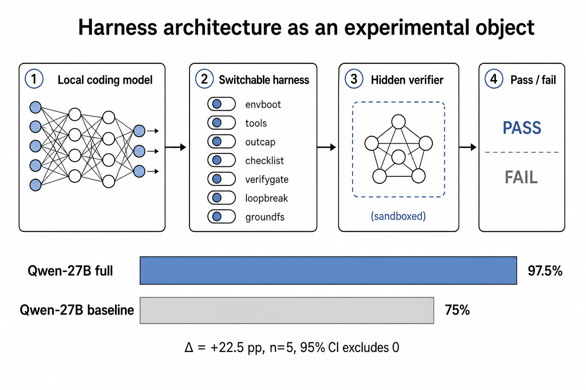

# Harness Architecture as an Experimental Object: Measuring Switchable Components on Local Coding Agents

**Draft — 22 August 2026 (revision 2).** This manuscript reports a local, stdlib-only coding harness and a 720-episode hard grid (two models \(\times\) nine configurations \(\times\) five seeds \(\times\) eight tasks) on two locally served models. Headline pass rates are the **frozen protocol** (`max_steps=0` from turn one, 1800 s episode wall, tag `hard`). A mixed-protocol 160-episode full-versus-baseline run (turn ceiling removed mid-grid; skip-existing kept already-passing 40-step episodes) is archived as protocol-1 and is **not** the headline. It does not claim the Meta-Harness interaction \(\Delta_{\text{weak}} > \Delta_{\text{strong}}\).

**Revision 2 changes.** Every number below was re-derived from `stats-hard.json` and from the raw per-episode `summary.json` rows. Section 5.7 (verify gate on `navigate`) is **corrected**: the previous draft's 12/12-versus-7/12 and 13/13-versus-7/13 contrasts counted a directory of `globmatch` episodes as `navigate` episodes. The corrected contrast is 10/10 versus 7/13 pooled and 9/9 versus 5/9 on matched tags, and the conservative reading no longer excludes zero at \(\alpha = 0.05\). Section 8 lists every correction. New material: the tamper-detection mechanism (§3.2), instrument validation counts (§4.2), an explicit interaction table and figure (§5.5), a GH200 compute-envelope measurement over 78,027 samples (§5.6), and an explicit limitations section (§7). The literature review is expanded from five references to nineteen, all but one machine-verified (Appendix B) — including [1] and [2], which the first revision could not resolve. **All data figures are now generated from `stats-hard.json`** rather than hand-drawn: the previous Figure 4 was a hand-written SVG still carrying protocol-1 values.



**Figure 1.** Graphical abstract. The object of measurement is the harness around a frozen local model: seven independently switchable components, a sandbox the agent can write, and a verifier the agent cannot. On the eight-task hard suite under the frozen protocol, Qwen 3.8 27B went from 90.0% (baseline) to 95.0% (full). A protocol-1 archive of the same contrast, which mixed a 40-step ceiling into the baseline, had read 75.0% to 97.5% and is not the headline.

## Abstract

The pass rate of a coding agent is not a property of the model alone. It is a joint property of the model and the harness: the code that builds context, exposes tools, truncates output, and decides when the work is done. Lee et al. showed that this joint property is large enough to matter on Terminal-Bench 2.0, where Claude Haiku 4.5 spanned 13.9% to 37.6% across published harnesses and Claude Opus 4.6 spanned 58.0% to 81.8% [1], [2]. That result was measured on frontier APIs. It does not say which components of a harness pay, on which models, or whether the same structure helps a 27B model served from a single GPU. We treat the harness as an experimental object rather than a fixed wrapper. Seven components—environment bootstrap, native file tools, output capping, a pre-finish checklist, a hidden verify gate, loop breaking, and filesystem grounding—are independently switchable. The agent works inside a path-resolved sandbox. Hidden tests live outside it, protected files are SHA-256 checked, and a check that did not run never reports the same result as a check that ran and passed. We evaluate nine harness configurations (full, all-off baseline, and each flag off in isolation) on eight hidden-test coding tasks, five pinned seeds, and two locally served models on one NVIDIA GH200: Qwen 3.8 27B and Ornith-1.5 35B-A3B (Q8). That is 720 episodes, all of which completed with zero starved rows. Under a frozen protocol (`max_steps=0` from the first turn, 1800 s episode wall), Qwen's pass rate was 90.0% (bootstrap 95% CI 82.5–97.5) under the baseline and 95.0% (90.0–100.0) under the full harness, a paired \(\Delta\) of \(+5.0\) percentage points whose interval is \(0.0\) to \(+10.0\) and therefore includes zero. Frozen Qwen's two extra full-harness passes sit in `json_patch` (+3) and `concurrency_race` (+1), against two losses on `ast_transformer`. Turning only `verifygate` off drops Qwen to 82.5% (65.0–97.5), the largest one-flag point-estimate drop; that interval still includes the full-harness mean at \(n=5\). Ornith scored below Qwen on every configuration. Its frozen full-versus-baseline \(\Delta\) is \(+7.5\) points (CI \(-5.0\) to \(+20.0\)). Turning the output cap off raises Ornith to 75.0% against a 65.0% full cell (paired \(\Delta\) full minus no-outcap \(-10.0\), CI \(-17.5\) to \(-2.5\)), so a component can cost the weaker model. Every one of the eight capability-by-harness interaction intervals includes zero. A separate single-flag experiment on an easier task shows the mechanism by which a gate can pay: Qwen, without it, makes a visible test pass by breaking a module contract the hidden tests still check, and every no-gate failure we logged was the model calling `finish` on work that did not pass. Pooled over matched configurations that differ only in that flag, Qwen passes 10/10 with the gate and 7/13 without it (two-sided Fisher exact \(p = 0.019\)); restricted to the two tags where both arms ran the task, 9/9 versus 5/9 (\(p = 0.082\)), which does not reach \(\alpha = 0.05\). We report both. A 43.8-hour telemetry log shows the serial batch-1 loop drawing a median 302 W against the GH200's 900 W cap while `utilization.gpu` reads 89%, which is why we report steps and tokens rather than seconds. The architecture makes those distinctions measurable. The numbers that survive are the frozen protocol, the one-flag ladder, the interaction nulls, and the protocol-1 caveat.

## 1. Introduction

A coding agent is a language model plus a loop. The loop decides what the model sees on the first turn, which tools it may call, how much of a tool result is returned, whether a repeated call is blocked, and whether a `finish` call ends the episode or is sent back with failing tests. That loop is the harness. Changing it, while holding the model fixed, can move pass rate by tens of points [1], [2]. Practitioners already know this informally: they add a system prompt, a memory file, a retry, a verifier, and then treat the resulting number as a property of the model. The number is not. It is a property of a pair.

Lee, Nair, Zhang, Lee, Khattab, and Finn made the pair an object of search [1]. Their framing is the one we adopt: the performance of an LLM system "depends not only on model weights, but also on their harness: the code that determines what information to store, retrieve, and present to the model," and harnesses "are still designed largely by hand" [1]. Meta-Harness answers that with an outer loop whose proposer rewrites harness code given filesystem access to prior source, scores, and traces. On Terminal-Bench 2.0 [2] their discovered harness ranked first among reported Claude Haiku 4.5 agents at 37.6% and second among reported Claude Opus 4.6 agents at 76.4%, against a leaderboard that itself spans 13.9–37.6% for Haiku and 58.0–81.8% for Opus [1, Table 7]. That table is evidence that harness choice is first-order. It is not a component ablation, it is not a local-model result, and it is not a statistical test that the ablation delta shrinks as capability rises. The search that produced it also consumes a frontier coding agent as the proposer.

The same tension runs through the agentic software-engineering literature, where three incompatible stories about the source of the pass rate coexist. Yang et al. argued that the agent–computer interface is what enables automated software engineering, and engineered one deliberately [4]. Xia et al. pushed the opposite way with Agentless, replacing the agent with a fixed localize–repair–validate pipeline and reporting competitive SWE-bench resolution at lower cost — evidence that much of the apparent gain from "agents" was scaffold engineering nobody had isolated [8], [9]. Zhang et al.'s AutoCodeRover kept the loop but attributed its gains to AST-aware code search rather than to the loop's freedom [10]. Multi-agent systems such as Magentic-One add an orchestration layer on top of all of this [19], and the surveys now catalogue dozens of such designs [11]. Each of these is a claim about *which component pays*, and none of them is settled by a leaderboard position, because the systems differ in many components at once.

What is missing across all of them is the measurement we build here: a paired experiment in which exactly one component changes and everything else — model, weights, seeds, tasks, grader — is held fixed. We wanted the complementary object to Meta-Harness: a small, fully switchable harness that a 27B model can run locally, with every component off or on by a flag, and with pass rate reported as an interval over pinned repeats rather than a single run.

The gap is practical as well as scientific. Local models are the ones for which harness cost is paid in resident weights, context tokens, and GPU-hours on a machine the experimenter owns. They are also the ones for which a component that looks free on a frontier API — an extra checklist round trip, a verifier invocation, a 30 kB output cap — is visible in the trace. If the harness is a monolith, those costs cannot be attributed. If it is a bag of flags, they can. The design constraint we accepted is that the measurement rig must itself be small: Python standard library, five tools, no training, no outer-loop proposer.

Two further constraints came from outside our own results. The first is that agent benchmarks are increasingly unreliable in a specific way: models reach high scores by exploiting shortcuts rather than solving the task. Lodkaew et al. name this deceptive performance and treat detection and prevention as a first-class evaluation problem [13]; Kouremetis et al. found LLM agents cheating on cybersecurity benchmarks widely enough to inflate reported pass rates beyond genuine capability [14]; and Aleithan et al. traced a material fraction of reported SWE-bench passes to solution leakage and weak test suites [12]. We therefore built the grader to be unreachable — hidden tests outside the sandbox, visible tests content-hashed, the checker unshadowable (§3.2) — and §5.7 reports a case where a model does exactly what this literature predicts. The second is that repeated runs of the same prompt do not agree even with decoding parameters fixed [15], which makes a single-run pass rate an anecdote. We pin a seed per repeat and report intervals throughout.

This paper makes four contributions. First, we specify a coding harness whose seven components are independently switchable, each tied to a named local-loop failure, whose tool surface is confined by resolved path rather than by instruction, and whose grader cannot be written or shadowed by the agent. Second, we specify a protocol that pins the sampling seed per repeat, reports percentile bootstrap 95% intervals on pass rate and on the paired \(\Delta\) between full and baseline, and refuses to treat an unrun check as a pass. Third, we report that protocol on eight hard tasks, two local models, and nine configurations (720 episodes), with a per-task matrix, a stop-reason table, a one-flag-off ladder, an explicit interaction table, and a single-flag verify-gate case on a contract-breaking failure. Fourth, we report the compute envelope the grid actually occupied, from 78,027 device samples, as an argument that the conventional utilization number is not the cost that matters for a serial agent loop.

The result that the frozen hard-grid interval supports is modest: Qwen 3.8 27B gains \(+5.0\) percentage points (CI \(0.0\) to \(+10.0\)) when the full harness replaces the baseline. That interval includes zero. The result it does not support is a capability-by-harness interaction: every \(\Delta_{\text{weaker}}-\Delta_{\text{stronger}}\) interval includes zero. Ornith-1.5 35B-A3B scored lower than Qwen under every configuration, so parameter count was the wrong proxy for the ordering the hypothesis needs. Protocol-1's \(+22.5\) point Qwen interval, which excluded zero, mixed a mid-grid turn-ceiling change into the baseline and is archived, not reported as the effect.

The rest of the paper is organized as follows. Section 2 situates the work against Meta-Harness and against the inner loops that table spans. Section 3 describes the architecture, the flags, and the three independent mechanisms behind the non-cheating invariant. Section 4 describes the tasks, the instrument's own validation, models, hardware, statistics, and the frozen protocol. Section 5 reports frozen pass rates, per-task outcomes, stop reasons, the one-flag ladder, the interaction nulls, cost proxies, and the corrected verify-gate case. Section 6 interprets the modest frozen \(\Delta\) and the protocol-1 artefact. Section 7 states limitations. Section 8 records the corrections this revision makes to the previous draft. Appendix A records serving flags and both protocols; Appendix B records the verification status of every citation.

## 2. Related work

### 2.1 The harness as an object of design and of search

Lee et al. define a harness as the code that determines what to store, retrieve, and present to a frozen model, and they treat harness engineering as a search problem rather than a one-off prompt edit [1]. Their outer loop is itself agentic: a proposer with filesystem access to every prior candidate's source, scores, and execution traces. The inner objects of that search, in the coding domain, are complete agent loops evaluated on Terminal-Bench 2.0, a suite of long-horizon interactive terminal tasks whose tests score final container state rather than the agent's command trace [2]. Merrill et al. built that benchmark, in part, because existing benchmarks "either do not measure real-world tasks, or are not sufficiently difficult to meaningfully measure frontier models" [2] — and because the same model under OpenHands [3], Mini-SWE-Agent in the SWE-agent line [4], Claude Code, or their own Terminus scaffold is not the same agent. Terminus 2 is deliberately thin: one headless terminal tool and Bash [2]. Terminus-KIRA, which Meta-Harness uses as a coding-domain parent, replaces in-context JSON parsing with native tool calling and adds a 30 kB output cap and a multi-perspective completion checklist [1], [5]. The Meta-Harness discovery on top of that parent is environment bootstrap: one compound shell command before the first model turn [1, §B.3]. Three of our seven flags — `nativetools`, `outcap`, `envboot` — are direct implementations of components from that lineage, which is why we can ablate them rather than re-derive them.

The finding that matters for this paper is not the search algorithm. It is the empirical fact that, for a fixed base model, published harnesses on Terminal-Bench 2.0 already differ by more than twenty points [1, Table 7]. OpenHands on Haiku 4.5 is 13.9%; the Meta-Harness discovery is 37.6%. Claude Code on Opus 4.6 is 58.0%; ForgeCode is 81.8%. Once those gaps exist, a component nobody A/B-tested is a guess, even if the full loop looks strong.

### 2.2 Scaffolds, pipelines, and the disagreement about where value lives

SWE-agent's thesis is that the loop is where the value is: a purpose-built agent–computer interface, with tools shaped for a language model rather than for a human shell user, is what makes the model effective [4]. Agentless is the null hypothesis made concrete — Xia et al. replaced the agent entirely with a fixed three-phase pipeline and reported competitive SWE-bench resolution at lower cost, arguing that autonomy per se was not carrying the result [8], [9]. AutoCodeRover sits between them, keeping an agentic loop but locating its gains in code-aware retrieval over an AST representation [10]. Magentic-One goes the other direction, adding a generalist orchestrator over specialized agents [19]. Liu et al.'s survey catalogues the resulting proliferation [11].

Our position is methodological rather than partisan. All four are claims about which component pays, and none was measured by holding the rest of the system fixed and flipping one flag. That is the measurement we build the instrument to make. Meta-Harness asks which harness an outer agent can *discover*; we ask which declared components, implemented once, *move pass rate* when switched. The two questions compose: a switchable inner loop is the right substrate for an outer search, because a proposer that rewrites a monolith cannot tell which edit paid.

### 2.3 Verification, self-repair, and the gate

The verify gate is a member of a well-studied family. Chen et al. showed that a model given execution feedback can repair its own program without human supervision [16], and Li et al.'s LDB refines that by verifying runtime execution step by step against unit tests rather than treating the program as an indivisible artifact [17]. Our gate differs from both in the direction that matters for measurement: it is not a self-repair prompt but an *external* precondition on termination. The tests it runs are ones the agent cannot read, edit, or shadow (§3.2), and their failure output — not the model's own reflection — is what re-enters the context. The `checklist` flag is the prompt-side analogue, and keeping the two as separate flags is deliberate: it lets us ask whether the prompt intervention and the external check are substitutes. Table 6 says they are not obviously either.

### 2.4 When the grade can be reached without the work

A benchmark's grade is only as good as the difficulty of reaching it dishonestly. Aleithan et al. audited SWE-bench and found solution leakage and weak test suites behind a material fraction of reported passes [12]. Lodkaew et al. formalize the general case: agents "can achieve high evaluation scores by exploiting shortcuts instead of solving the intended task, producing deceptive performance," which makes scores unreliable as measures of ability, and they propose randomized tests and capped evaluation as countermeasures [13]. Kouremetis et al. document the same behaviour in the wild on cybersecurity benchmarks, where cheating inflates reported pass rates beyond genuine capability, and study prompt-level mitigations against it [14]. Terminal-Bench's own design response is to score final container state rather than the trace [2].

Ours is narrower and stricter, and it is structural rather than prompt-level: hidden tests the agent never sees, visible tests hashed and re-checked so that editing them is an automatic fail, and the hidden test executed from a directory outside the sandbox so it cannot be shadowed. Section 5.7 is a worked example of exactly the failure this literature describes — a visible test passing while the documented contract is broken — caught by a check the model does not control. It is also a small piece of evidence on the open question in [14]: on our task, the prompt-side checklist was on in *both* arms and did not prevent the false finish; only the external gate did.

### 2.5 Context handling

The output cap and the loud context-exhaustion stop are not conveniences. Liu et al. showed that language models use long contexts unevenly, with material degradation for information placed in the middle of a long input [7]. A harness that silently drops the middle of a build log is therefore not merely losing bytes; it is moving the evidence into the region the model handles worst, or removing it while leaving the model confident that it read the log. Our head-and-tail cap keeps both ends and states in-band how many bytes were elided, and the loop stops loudly rather than letting the server truncate the prompt (§3.5). Section 5.4 reports the uncomfortable consequence: on the weaker model, that cap was the one component whose removal helped with an interval excluding zero.

### 2.6 Statistics and reproducibility

Pass rates on small suites with sampling temperature are noisy, and a point estimate over a handful of episodes is not a result. Worse, identical prompts need not produce identical outputs even with temperature and decoding parameters fixed; Nicholson's repeated-run experiments quantify that drift directly [15]. Reproducibility of the surrounding artifact is its own research problem, as CORE-Bench makes explicit by turning computational reproducibility into an agent benchmark [18]. We respond on three fronts: a seed pinned per repeat index so any cell can be re-run, percentile bootstrap confidence intervals throughout following the standard treatment [6], and a `protocol` object serialized into every result file so a cell's stop conditions travel with its numbers.

### 2.7 Scope

Our tasks are a separate, smaller suite with hidden tests. They are not a drop-in substitute for Terminal-Bench 2.0 or SWE-bench, and we do not report them as such. We cite leaderboard names only as they appear in Lee et al. [1]. We did not re-run that leaderboard.

The failure modes that motivated the flags are local-loop failures, not leaderboard failures. A 27B model spent early turns discovering what is installed; that is environment bootstrap. The same model, shown a quietly truncated build log, reasoned about an error it never saw; that is head-and-tail output capping. It called `finish` after making the visible test pass by breaking a documented contract elsewhere; that is a verify gate whose tests the agent cannot edit. It repeated an identical tool call until a turn budget expired; that is loop breaking. It answered from a prompt the server had silently truncated; that is a loud context-exhaustion stop. None of these require a frontier proposer to notice. They require the inner loop to be written so that each one can be switched off.

## 3. Architecture

The harness is a single Python loop around an OpenAI-compatible chat API, served in this work by Ollama. Figure 2 is the control flow. The model is frozen. Everything that decides what the model sees is in `Config`. The defaults are the full harness. The baseline turns every discovered component off except native file tools, which stay on because the alternative is asking a small model to get shell quoting right in order to touch a file.

The whole instrument is about 3,500 lines of Python across the runner, the harness, the task loader, the statistics, and the test suites, with no dependencies outside the standard library. That is a deliberate constraint, not an accident of scope: a measurement rig that a reader cannot audit in one sitting cannot be trusted to make claims about a system it wraps.


**Figure 2.** Control flow of one episode. Initial context, the model turn, and sandbox tools are flag-gated. The first `finish` may inject a checklist. A later `finish` may run the hidden verifier and bounce the model back to work. A final verifier always runs after the loop stops, whatever the model claimed.

### 3.1 Tool surface and sandbox

Five tools are exposed: `run_shell`, `read_file`, `write_file`, `edit_file`, and `finish`. The first four exist so that file I/O does not depend on the model emitting a correctly quoted shell pipeline. Every path the model supplies is resolved with `os.path.realpath` and refused if it is not the sandbox root or a descendant of it. Containment is therefore a property of the harness, not of the prompt: a symlink out of the tree, a `..` traversal, and an absolute path all resolve before the check, so none of them is a way out. Shell commands run under `/bin/bash -lc` in the sandbox working directory, with a 120 s timeout that returns a recoverable error rather than hanging the episode. Tool bugs are also recoverable: an unexpected exception becomes a tool result, not a crashed run.

Output from the shell and from files is passed through a head-and-tail cap of 30,000 bytes, inherited from the Terminus-KIRA cap as used in the Meta-Harness coding setup [1], [5]. The middle is never dropped silently. The truncation notice states how many bytes were elided and that both the head and the tail are shown — `... [N bytes elided by the harness; K head + K tail bytes shown] ...` — because a model that does not see that notice will invent a cause for a failure whose log it never read, and because the middle is precisely the region a long-context model handles least reliably [7]. When `outcap` is off, the cap is raised to \(10^9\) bytes so that the flag is a real ablation rather than a comment.

### 3.2 The non-cheating invariant

The grader must not be reachable by the agent. This is not a hypothetical concern: agents are documented to reach benchmark grades by exploiting shortcuts rather than solving the task [12], [13], [14]. Three independent mechanisms enforce unreachability here, and they are independent on purpose: defeating one does not defeat the others.

1. **The hidden test is never in the sandbox.** Each task declares a hidden checker in `task.json`. It lives in the task directory, which is not what the agent is given; the agent gets a fresh copy of `setup/` only.
2. **Protected files are content-hashed.** Each task declares a `protect` list — typically the visible test file and the written `SPEC.md`. At load time the harness records a SHA-256 of each protected file from the pristine `setup/` tree. At verification time it re-hashes the copies in the sandbox. Any modification or deletion fails the episode immediately with `VERIFY FAILED: protected files were changed`, before the hidden test is even run. Editing the test to make it pass is therefore not a partial win; it is a definite loss.
3. **The hidden test cannot be shadowed.** The checker is copied into a fresh temporary directory outside the sandbox and executed from there, with the sandbox supplied as `PYTHONPATH` and as the working directory. This matters because the natural attack on a Python checker is to drop a file with the same name, or a same-named module the checker imports, into the directory it runs from. Running it from a directory the agent has never been able to write closes that path.

On top of these, the loop's scoring rule is that a check that did not run is not a pass. The final verifier always runs after the loop stops, whatever the model claimed and whatever the stop reason. A model that hit `context_exhausted` may still have fixed the code and is scored on the verifier; a model that called `finish` may still be wrong and is scored on the verifier. The single exception is deliberate and goes the other way: `wall_timeout` is scored fail even if the verifier would pass, because a hung generate is not a completed task. Without this family of rules, "approved" and "unexamined" become the same bit.

### 3.3 Switchable components

Table 1 maps each flag to the local failure it is meant to interrupt. The mapping is a hypothesis about the loop, not a result. Section 5 tests the bundle on the hard suite and one flag (`verifygate`) on a single easier task.

**Table 1.** Flags and the failures they target. Native tools stay on in every cell except `no-nativetools`.

| Flag | Component | Targeted failure | Off in `baseline` |
|---|---|---|---|
| `envboot` | Environment snapshot before turn 1 | Wasted exploration; hallucinated paths and tool versions | yes |
| `nativetools` | Native `tool_calls` versus in-context JSON | Malformed tool names and arguments | no |
| `outcap` | Head-and-tail output cap (30 kB) | Silent middle-drop; context blowup from logs | yes |
| `checklist` | Four questions on the first `finish` | Premature done without having run tests | yes |
| `verifygate` | Hidden tests on a later `finish` | Success claimed because a visible test passed | yes |
| `loopbreak` | Duplicate-call detector | Repetition until the context window dies | yes |
| `groundfs` | Read-before-write sentence | Edits to files the model has not opened | yes |

**Environment bootstrap (`envboot`).** Before the first model turn, the harness runs a compound shell command with a 15 s timeout and injects the result as an `[Environment Snapshot]` block, itself capped at 4,000 bytes: working directory, a file listing truncated to twenty entries with a count of the remainder, language compilers and interpreters that exist with their versions, package managers, test runners, importable Python packages, and available memory. If the command fails, times out, or prints nothing, the snapshot is omitted and the episode continues, and the omission is recorded as an `envboot_empty` event. A broken bootstrap must degrade to the baseline, not abort the grid. The point of the component is to remove the two to four turns a local model otherwise spends asking what is installed, which is the coding-domain discovery reported by Lee et al. [1, §B.3].

**Filesystem grounding (`groundfs`).** A single sentence is appended to the first user message: everything needed is already in the task directory, and files should be read before they are edited. It is a cheap prior against wandering into `/usr` or inventing paths.

**Native tools (`nativetools`).** When on, the five-tool schema is offered. When off, only `run_shell` and `finish` are offered, file-tool calls are refused with a message naming the substitute, and a different system prompt tells the model to inspect and change files only through `run_shell`. That is the ablation: the model must touch files through the shell. This is the one component the baseline keeps, so `no-nativetools` is the only cell in which it is off.

**Output cap (`outcap`).** Described in §3.1. The baseline sets it off.

**Checklist (`checklist`).** The first time the model calls `finish`, the harness does not end the episode. It returns four questions: whether the project tests were run in this session and seen to pass in real output; whether the change fixes the cause or only the example; whether any test, assertion, or file was weakened, deleted, or stubbed; and whether anything outside the task was changed. If any answer is unsatisfactory, the instruction is to keep working. The checklist fires at most once per episode. It is a prompt intervention, not a grader — nothing verifies the model's answers, which is exactly why the verify gate is a separate flag.

**Verify gate (`verifygate`).** On a subsequent `finish`, if the flag is on, the harness runs the task's hidden tests and, on failure, returns the failing output (capped at 4,000 bytes) as a tool result with the instruction to keep working. On success, the loop stops with `stop_reason=finished`. The tests are not in the sandbox and cannot be shadowed (§3.2). Visible tests in the task directory are part of the problem statement; they are not the grade. Unlike self-repair schemes that feed a model its own reflection or its own test run [16], [17], the evidence returned here comes from a check the agent cannot influence.

**Loop breaking (`loopbreak`).** The harness keeps a sliding window of the last eight tool-call signatures, where a signature is the canonical JSON of the tool name and its arguments. If the same signature has already appeared twice in that window, the third identical call is not executed; the tool result says so and asks for a different approach. Without this flag, a local model can burn the rest of a context window on a command that already returned.

These seven flags are the experimental factors. They are not a claim that this is the unique decomposition of a coding harness. They are a claim that this decomposition is complete enough to turn the harness into a factorial object instead of a blob.

### 3.4 Context construction and history

The first message is a system prompt that states the tools, requires reading before editing, forbids weakening tests, and requires `finish` with evidence. The first user message is the optional environment snapshot, the task instruction, and the optional grounding sentence. Subsequent history is append-only. Earlier turns are never rewritten, so a server that caches a key-value prefix can reuse it. Rewriting history would force a full prefill and would also make the transcript the harness claims to have used diverge from the one the model saw.

Reasoning channels are read when the server provides them (`thinking`, `reasoning_content`, `reasoning`). They are not assumed to be present, and they are not stuffed back into the next prompt as if they were content. Prefill that treats a reasoning channel as ordinary tokens is a silent distribution shift; we refuse it by construction.

Every call in a turn is answered. A turn that mixes real work with a `finish` has the work dispatched first and the `finish` handled last, so no call is left without a tool result — a transcript with fewer results than calls is one the model has to reason around. A second `finish` in the same turn still receives a reply saying only one is considered. Malformed tool arguments are coerced when they arrive as a JSON string instead of an object. A missing or unknown tool name is a recoverable error that lists the five legal names. A turn with no tool call at all is nudged once ("continue by making a tool call; if the work is genuinely complete, call finish") and, if it happens again, stops the episode with `no_tool_call`; a turn that hit the output limit is asked for one small tool call instead of a long explanation and does not consume the nudge.

### 3.5 Stop conditions

The reported grid uses `max_steps = 0`, which means there is no turn ceiling. The loop stops when the model successfully finishes under the gate, when it produces two consecutive turns with no tool call, when prompt tokens exceed 90% of `num_ctx` (32,768), when the client raises, or when the episode exceeds a 1800 s wall clock.

The context-exhaustion stop deserves its own note. Ollama silently drops the oldest tokens when a prompt exceeds `num_ctx`. Silent truncation corrupts a run invisibly — the model answers from a context the harness did not give it, and the transcript on disk is no longer the transcript that produced the behaviour. So the harness watches the headroom and stops loudly at 90% instead of producing a quiet, wrong result. This is the same reasoning as the output cap, applied to the prompt rather than to a tool result.

Per-request HTTP timeout equals the remaining episode budget (at most 1800 s) and is not retried; the first turn is capped at 600 s so a wedged server cannot burn the full wall. An earlier protocol used a 40-turn ceiling and is archived as protocol-1 (§4.6). We do not report wall-clock as a comparative result: some expansion cells overlapped two models on one GPU, and later cells did not. The 1800 s line is a stop condition, not a speed claim.

## 4. Methods

### 4.1 Tasks

The hard suite is eight tasks, each with a visible specification in the sandbox and hidden tests the agent cannot see. Table 2 characterizes them. They are sequential programming problems with adversarial hidden cases; each ships a visible test and, in seven of eight, a written `SPEC.md`, and both are in the `protect` set, so the documented contract is part of the problem and editing it is a fail. `cache_invalidation_dist` uses an in-process three-node cache, not a cluster. None of the eight is an HPC workload.

**Table 2.** The eight hard tasks. "Protected" files are SHA-256 checked before the hidden test runs (§3.2). Hidden-test timeout is 60 s for every task.

| Task | What makes it hard | Protected |
|---|---|---|
| `concurrency_race` | deadlock and lost-wakeup in a multi-threaded bounded queue, without breaking FIFO | `test_queue.py` |
| `ast_transformer` | desugar `async for` / `async with` per a formal spec, including break-`aclose` and `aexit` suppression | `test_rewrite.py`, `SPEC.md` |
| `state_machine_fuzz` | incremental binary protocol parser: CRC, sequence, fragments, resync; verified by a stateful fuzzer | `test_proto.py`, `SPEC.md` |
| `cache_invalidation_dist` | distributed cache coherence with split-brain recovery; last-(clock, nid) wins, tombstones included | `test_dist.py`, `SPEC.md` |
| `pratt_parse` | Pratt parser: unary versus `^` versus postfix factorial, integer division toward zero, right-associative power | `test_parse.py`, `SPEC.md` |
| `ot_transform` | operational transform for concurrent insert/delete; site-id tie-break; convergence | `test_ot.py`, `SPEC.md` |
| `nfa_match` | Thompson-style regex `fullmatch` (`\|` `*` `+` `?` `()` `.`) without `re`, checked against an oracle | `test_nfa.py`, `SPEC.md` |
| `json_patch` | RFC 6901/6902 JSON Pointer and Patch: `~0`/`~1`, array `-`, move-into-self, `test`, no mutation | `test_patch.py`, `SPEC.md` |

An easier eleven-task suite exists in the same repository and is not the headline grid, because several cells saturated and could not move: Qwen 3.8 27B scored 11/11 on it, which is why the hard tier was written. A model at ceiling cannot show a harness effect, since every ablation can only move downward. One task from the easier suite, `navigate`, is used only in §5.7 as a single-flag case. The repository holds nineteen tasks in total across both tiers.

### 4.2 Instrument validation

An instrument that has not been checked is not evidence. Three suites run without a GPU and were green at the time of writing, on the same commit that produced the grid:

- `selftest.py` — **19/19 tasks valid.** For every task it asserts three things: the shipped `setup/` tree *starts broken* (the hidden test fails on it), the shipped `reference/` solution *passes* the hidden test, and *tampering is caught* (a modified protected file fails verification). This is what rules out a task that is trivially satisfied, a task whose reference does not actually pass, and a task whose grade can be bought by editing the visible test.
- `stress_test.py` — **106 assertions passed, 0 failed.** Adversarial tests of the harness itself against a mock model: sandbox escapes via `..`, absolute paths and symlinks; malformed and unknown tool calls; JSON-string arguments; multi-call turns; duplicate `finish`; loop-break windows; cap boundaries.
- `test_stats.py` — **84 assertions passed.** Bootstrap intervals, paired \(\Delta\), the interaction statistic, and seed pinning.

The repository `README.md` still describes this suite as 87 tests; the current count is 106. We report the count we ran.

### 4.3 Models and serving

Two models were served with Ollama 0.32.14 on one NVIDIA GH200 (aarch64, 97,871 MiB HBM, CUDA 13). Qwen 3.8 27B (`qwen3.8:27b`, Q4, on the order of 17 GB weights) is the mid model. Ornith-1.5 35B-A3B (`hf.co/ornith-ai/Ornith-1.5-35B-A3B-GGUF:Q8_0`, on the order of 39 GB weights) is the second model: larger by parameter count, weaker on this suite. Context was `num_ctx=32768`, `num_predict=4096`. Sampling used temperature 0.6 with thinking enabled where supported. Flash attention was enabled. `OLLAMA_NUM_PARALLEL` was 1. No other base models are in this experiment. Exact serving flags are in Appendix A.

The runner enforces sole tenancy in code: it evicts every other model before it starts and refuses to run if one is still resident. On the GH200 this is experimental isolation — every cell sees the same sole-tenant device. For part of the Ornith one-flag ladder both models were kept resident (`OLLAMA_MAX_LOADED_MODELS=2`). Concurrent decode starved Qwen's first `/api/chat` (0 tokens, full-wall timeout). Those artefacts were not counted as harness fails: skip-existing re-runs them, `compare.py` drops them from pass rates, and the remaining Qwen cells plus the frozen full and baseline re-run were sole tenant. `n_starved = 0` on every reported cell. Pass/fail is not a function of tokens per second, but wall-clock is. We therefore do not compare `wall_s` across configurations or models. Cost is reported as steps and peak prompt tokens, which are properties of the transcript, and as the device envelope in §5.6.

**A third arm was attempted and is excluded by declaration.** We tried to add `gemini-3.7-flash` as a third rung. It is excluded, and the reason changed twice under investigation, which is worth recording because the first reason was our own bug.

*First attempt — a client defect.* An initial 315-episode sweep produced **zero `finished` stops**: 76.1% of episodes ended in `no_tool_call`, 22.5% in `error:ModelError`. The cause was in our API client, not the model. It serialized each tool result as a `function_result` with no preceding `function_call` entry and no thought signature, so the server received results for calls it had never been told about and the model lost its own action history every turn. An A/B against the pre-fix client on one fixed task shows the signature exactly: pre-fix the model calls `run_shell`, then `run_shell`, then `run_shell` again — repeating because it cannot see what it has already done — and then falls silent; post-fix it calls `run_shell` and then `finish`. That sweep is archived as `results/gemini-3.7-flash__*__hard-brokenwire` and **none of its numbers appear anywhere in this paper.** A second defect in the same client sent `temperature` and `max_output_tokens` in `generation_config`; measured against the live endpoint, that combination returns HTTP 500, as does omitting the block, while `thinking_level` alone succeeds. Both defects are covered by a regression test (`test_gemini_wire.py`, 19 assertions) that fails against the pre-fix client.

*Second attempt — a capacity constraint that is not missing-at-random.* With the client fixed, episodes behave normally: 14 to 25 tool calls, thousands of output tokens, clean `finished` stops. But a substantial share of requests are refused with `HTTP 500: "gemini-3.7-flash is currently experiencing high demand"`. The refusals are not random with respect to the outcome. Ordering the eight hard tasks by the size of their reference solution, the first 13 episodes give:

| Reference solution | Task | Outcome |
|---:|---|---|
| 1,275 B | `concurrency_race` | PASS, PASS |
| 1,672 B | `ot_transform` | PASS |
| 2,348 B | `cache_invalidation_dist` | PASS, PASS |
| 2,580 B | `pratt_parse` | `error:ModelError` |
| 3,444 B | `nfa_match` | `error:ModelError`, PASS |
| 3,687 B | `state_machine_fuzz` | `context_exhausted` |
| 4,368 B | `json_patch` | `error:ModelError` ×2 |
| 7,152 B | `ast_transformer` | `context_exhausted` ×2 |

Below 2,580 B, 5 of 5 episodes pass and **none** is refused; at or above it, 1 of 8 passes and four are refused. Small reads succeed and the first large generation is rejected, which is why refused episodes stop at a near-identical 4 steps and 56 output tokens.

That correlation, not the error rate, is what disqualifies the arm. This paper keeps serving errors in the denominator (Ornith has 4 `ModelError` episodes in its full cell) on the assumption that they are noise. Here they are not: they systematically censor the tasks that require the most code, which is also a proxy for difficulty. Three consequences follow. The pass rate would measure a generation-size threshold rather than capability. Any ablation \(\Delta\) would be confounded, because a flag that changes how much the model writes — `outcap` or `nativetools` — would move the refusal rate and read as a harness effect. And using the arm as the weaker arm in the interaction test would be invalid, since part of its weakness is the endpoint declining to serve it.

The exclusion is declared rather than silent, and reproducible in both directions:

```bash
python3 compare.py --tag hard --exclude gemini --json-out results/stats-hard.json   # the reported grid
python3 compare.py --tag hard --json-out /tmp/with-gemini.json                      # including the arm
```

§5.5 reports what happens to the interaction test when the *original* arm is included, so that the reader can check the exclusion is not outcome-shopping.

The verify-gate case in §5.7 was not run on the GH200. It used Qwen 3.8 27B MLX (`qwen3.8:27b-mlx`) and Ornith Q8 on the Apple host where those episodes were logged, with `max_steps=40`. It is a different serving stack and a different task, reported as a mechanism, not pooled into Table 3.

### 4.4 Design

The reported design is a \(2 \times 9 \times 5 \times 8\) grid: two models, nine harness configurations (`full`, `baseline`, and each of seven flags off), five repeats, eight tasks. That is 720 episodes. Repeat \(r \in \{0,1,2,3,4\}\) pins the sampling seed to \(r\). The same seed is used for the paired episodes of that repeat, so \(\Delta\) is a paired difference of per-repeat pass rates, each pass rate being the fraction of the eight tasks passed on that seed. A 0-token first-turn timeout is not treated as a finished episode; skip-existing re-runs it.

The baseline is not a different product. It is the same loop with `envboot`, `checklist`, `verifygate`, `loopbreak`, `groundfs`, and `outcap` set false. Native tools remain except in the `no-nativetools` cell. The full-versus-baseline comparison is therefore "these six components, together," not "a harness versus no harness." Table 6 isolates each flag.

### 4.5 Statistics

Repeats are not a formality. Identical prompts do not reliably produce identical outputs even with decoding parameters fixed [15], so a single run is an anecdote and the spread across repeats is part of the measurement. Let \(p_{m,c,r}\) be the pass rate of model \(m\), configuration \(c\), repeat \(r\), over the eight tasks. The cell estimate is the mean of \(\{p_{m,c,r}\}_{r=0}^{4}\). Intervals are percentile bootstrap 95% confidence intervals on that mean, 10,000 resamples, RNG seed 0, as implemented in `mh/stats.py` and following the standard treatment of bootstrap intervals [6]. For each model and each ablation the paired delta is \(\Delta_r = p_{m,\text{full},r} - p_{m,c,r}\), and the same bootstrap is applied to \(\{\Delta_r\}\). With \(n=5\), the interval is the claim; a point estimate without the interval is not.

Two properties of a five-point percentile bootstrap should be stated plainly, because they shape how Tables 3 and 6 must be read. The resample support is the five observed values, so the interval can never extend beyond the observed range, and when all five repeats agree the interval collapses to a point (Qwen `no-loopbreak` is 100% with a degenerate interval). This is a small-sample interval, not an asymptotic one, and it should be read as a description of the observed spread rather than as a well-calibrated coverage statement.

The interaction test is \(\Delta_{\text{weaker}} - \Delta_{\text{stronger}}\), where weaker and stronger are the models with the lowest and highest **full-harness mean pass rate in the tag**, not the models with the fewest and most parameters. This matters here: parameter count put Ornith above Qwen; the suite put it below, and the arms are assigned empirically (`_arms` in `stats-hard.json` records `weaker = Ornith`, `stronger = Qwen`).

For the 2×2 verify-gate counts we report the two-sided Fisher exact test, computed from the hypergeometric probabilities of all tables with the same margins whose probability is at most that of the observed table.

### 4.6 Protocol-1 archive (not the headline)

The first 160 full-versus-baseline episodes used `max_steps=40`, then the ceiling was set to zero, already-passing episodes were kept, and ceiling failures were re-run. Under that mix, Qwen baseline was 30/40 (75.0%) and full was 39/40 (97.5%), a paired \(\Delta\) of \(+22.5\) pp (CI \(+10.0\) to \(+37.5\)); Ornith baseline was 21/40 (52.5%) and full 25/40 (62.5%). Those files are archived as `*-protocol1` and are not Tables 3–8.

The frozen re-run (`max_steps=0` from turn one, `--force` after archive) is the headline, because a 40-step leftover in an otherwise uncapped cell is a protocol change, not a harness effect. The tell is visible in the archive itself: protocol-1 Qwen baseline has a recorded **maximum of exactly 40 steps** — the ceiling — on episodes that had already passed and were not re-run, while its full cell reaches 64 and the frozen baseline reaches 48. A cell whose maximum is exactly the old ceiling is a cell still carrying the old ceiling.

### 4.7 Frozen expansion (completed)

Tables 3–8 report the completed 720-episode grid on Qwen and Ornith under `expand_hard.sh`: `max_steps=0` from the first turn, seeds 0–4, tag `hard`, 1800 s episode wall. Concurrent Qwen+Ornith (`--share-gpu`) starved Qwen: first `/api/chat` returned 0 tokens and timed out, which is not a harness effect. Remaining Qwen cells and the forced full/baseline re-run were sole tenant. Ornith one-flag cells that finished under share-gpu are kept; none of those 280 episodes were 0-token first-turn timeouts. A 0-token first-turn timeout is never treated as a finished episode: skip-existing re-runs it, `compare.py` excludes it from pass rates (`n_starved=0` on every reported cell), and the runner unsticks the server and retries once. First-turn HTTP timeout is 600 s. The 11-task easy suite stays out. No other models are added. `compare.py --tag hard --exclude gemini --json-out` writes `results/stats-hard.json`; `figures.py` renders from that file. The `--exclude` is required to reproduce the reported grid, because the `hard` tag also matches the declared-excluded `gemini-3.7-flash` arm (§4.3); without it the interaction arms are reassigned and Tables 3–8 will not match.

## 5. Results

All 720 hard-grid episodes completed. Zero starved (0-token first-turn timeout) rows remain in the reported cells; every cell reports `n = 40`, `n_usable = 40`, `n_starved = 0`. Table 3 reports frozen full-versus-baseline pass rates. Table 4 is the per-task matrix, Table 5 the stop reasons and transcript cost, Table 6 the one-flag-off ladder, Table 7 the interaction test, Table 8 the device envelope. Table 9, in §5.7, is an off-grid single-flag contrast and is not part of the 720. Figures 3–5 plot the cell means, the per-seed paired deltas, and the interaction intervals; all three are rendered from `stats-hard.json` by `figures.py`, so a figure cannot disagree with a table.

Protocol-1's 160-episode full-versus-baseline contrast (Qwen 39/40 versus 30/40, \(\Delta +22.5\) pp) is §4.6, not this section.

### 5.1 Frozen pass rates

**Table 3.** Frozen-protocol pass rate on the eight-task hard suite. Each cell is 40 episodes (8 tasks \(\times\) 5 seeds). CI is the percentile bootstrap 95% interval on the mean of the five per-repeat pass rates. Source: `stats-hard.json`.

| Model | Config | Passes | Rate | 95% CI | Per-repeat rates |
|---|---|---:|---:|---|---|
| Qwen 3.8 27B | full | 38/40 | 95.0% | 90.0–100.0 | .875 .875 1.00 1.00 1.00 |
| Qwen 3.8 27B | baseline | 36/40 | 90.0% | 82.5–97.5 | .750 .875 .875 1.00 1.00 |
| Ornith-1.5 35B-A3B Q8 | full | 26/40 | 65.0% | 55.0–75.0 | .750 .500 .750 .750 .500 |
| Ornith-1.5 35B-A3B Q8 | baseline | 23/40 | 57.5% | 50.0–67.5 | .500 .625 .500 .750 .500 |


**Figure 3.** Mean pass rate with bootstrap 95% CI for every (model, config) cell, grouped by model and ordered `full`, `baseline`, then the one-flag ladder; solid bars are `full` and `baseline`. Qwen under the full harness is high on this suite, not at a ceiling. Ornith lies below Qwen under every configuration. Rendered directly from `stats-hard.json` by `figures.py`.

Qwen's five paired deltas were \(+0.125, 0.00, +0.125, 0.00, 0.00\). None is negative. The mean \(\Delta\) is \(+5.0\) percentage points, with bootstrap 95% CI \(0.0\) to \(+10.0\), which includes zero — the lower bound *is* zero, because two of the five repeats produced no difference at all.

Ornith's paired deltas were \(+0.25, -0.125, +0.25, 0.00, 0.00\). One of five repeats favours the baseline. The mean \(\Delta\) is \(+7.5\) percentage points, with CI \(-5.0\) to \(+20.0\), which includes zero.


**Figure 4.** Frozen paired \(\Delta =\) full \(-\) baseline by pinned seed, rendered from `stats-hard.json`. Qwen never goes negative but is flat on three of five seeds; Ornith changes sign on seed 1. The superseded hand-drawn `repeat_deltas.svg` plotted the protocol-1 archive values (Qwen \(0.5, 0.25, 0.125, 0.25, 0\)) and is retained only for comparison — see §8.

### 5.2 Per-task matrix

Qwen's net two extra full-harness passes are not a spread of nine. They come from `json_patch` (+3) and `concurrency_race` (+1), against two losses on `ast_transformer` (full 3/5, baseline 5/5). Five tasks were already 5/5 under both configurations. A harness can cost a task. Ornith's frozen full cell is 0/5 on `ast_transformer` and on `nfa_match`, and gains on `state_machine_fuzz` (+2) and `pratt_parse` (+2). We do not treat any single-task contrast as a finding with its own interval: with five seeds a task-level CI is wide. The matrix is here so that the cell mean is not allowed to hide where the bundle paid and where it did not.

**Table 4.** Passes out of five seeds, hard suite, frozen protocol. Source: `stats-hard.json` `per_task`.

| Task | Qwen full | Qwen baseline | Ornith full | Ornith baseline |
|---|---:|---:|---:|---:|
| `concurrency_race` | 5/5 | 4/5 | 3/5 | 4/5 |
| `ast_transformer` | 3/5 | 5/5 | 0/5 | 0/5 |
| `state_machine_fuzz` | 5/5 | 5/5 | 3/5 | 1/5 |
| `cache_invalidation_dist` | 5/5 | 5/5 | 5/5 | 5/5 |
| `pratt_parse` | 5/5 | 5/5 | 5/5 | 3/5 |
| `ot_transform` | 5/5 | 5/5 | 5/5 | 4/5 |
| `nfa_match` | 5/5 | 5/5 | 0/5 | 1/5 |
| `json_patch` | 5/5 | 2/5 | 5/5 | 5/5 |

`ast_transformer` is the task neither model solves reliably: Ornith is 0/5 in both cells, and it is the only task where Qwen's full harness is *worse* than its baseline. It is also the task with the longest formal spec. `cache_invalidation_dist` is 5/5 in all four cells and contributes nothing to any contrast.

### 5.3 Stop reasons and transcript cost

Qwen almost always ends by calling `finish` (38/40 in both cells). Frozen Qwen full has two `context_exhausted` stops and no `ModelError`. Frozen Qwen baseline has one `context_exhausted` and one `error:ModelError`. Ornith is not that agent: under the full harness, 14 of 40 episodes stop on `context_exhausted` and 4 on `error:ModelError`; under the baseline, 10 and 9. Those errors stay in the denominator. They mix model capability with serving failures, which is one reason Ornith's \(\Delta\) interval is not evidence that the harness is ineffective on that model. It is evidence that the measured pair (Ornith + this server + this context window) did not produce a \(\Delta\) whose interval excludes zero.

Median steps barely move for Qwen when the harness is turned on (10 versus 9.5). Ornith takes about twice as many turns as Qwen on both configurations. Peak prompt tokens for Qwen sit well under `num_ctx`; Ornith's medians are more than double Qwen's and its maxima approach the 32,768 cap, which matches the `context_exhausted` mass. That is the cost we can report without confounding GPU sharing. Wall-clock is not reported.

**Table 5.** Stop reasons and transcript size, frozen hard suite, 40 episodes per cell. Medians over 40 values, so a `.5` is a genuine midpoint. Source: per-episode `summary.json` rows.

| Cell | `finished` | `context_exhausted` | `error:ModelError` | Steps median (max) | Peak prompt tokens median (max) |
|---|---:|---:|---:|---|---|
| Qwen full | 38 | 2 | 0 | 10 (54) | 7,512.5 (31,194) |
| Qwen baseline | 38 | 1 | 1 | 9.5 (48) | 6,022 (29,751) |
| Ornith full | 22 | 14 | 4 | 23 (57) | 16,340.5 (30,921) |
| Ornith baseline | 21 | 10 | 9 | 24.5 (74) | 13,366 (31,534) |

### 5.4 One-flag-off ladder

**Table 6.** Frozen one-flag-off cells versus full. \(\Delta\) is paired full minus the named ablation (positive means the flag earned its keep). CI is the percentile bootstrap 95% interval on five paired repeat rates. Source: `stats-hard.json`.

| Config | Qwen | Qwen \(\Delta\) vs full [CI] | Ornith | Ornith \(\Delta\) vs full [CI] |
|---|---:|---|---:|---|
| full | 38/40 95.0% | — | 26/40 65.0% | — |
| baseline | 36/40 90.0% | \(+5.0\) [\(0.0\), \(+10.0\)] | 23/40 57.5% | \(+7.5\) [\(-5.0\), \(+20.0\)] |
| no-verifygate | 33/40 82.5% | \(+12.5\) [\(-5.0\), \(+35.0\)] | 25/40 62.5% | \(+2.5\) [\(-5.0\), \(+10.0\)] |
| no-envboot | 38/40 95.0% | \(0.0\) [\(-10.0\), \(+10.0\)] | 23/40 57.5% | \(+7.5\) [\(-7.5\), \(+22.5\)] |
| no-checklist | 39/40 97.5% | \(-2.5\) [\(-10.0\), \(+5.0\)] | 29/40 72.5% | \(-7.5\) [\(-20.0\), \(+5.0\)] |
| no-loopbreak | 40/40 100% | \(-5.0\) [\(-10.0\), \(0.0\)] | 25/40 62.5% | \(+2.5\) [\(-15.0\), \(+20.0\)] |
| no-outcap | 37/40 92.5% | \(+2.5\) [\(-7.5\), \(+15.0\)] | 30/40 75.0% | \(-10.0\) [\(-17.5\), \(-2.5\)] |
| no-groundfs | 39/40 97.5% | \(-2.5\) [\(-7.5\), \(0.0\)] | 27/40 67.5% | \(-2.5\) [\(-15.0\), \(+10.0\)] |
| no-nativetools | 39/40 97.5% | \(-2.5\) [\(-10.0\), \(+5.0\)] | 22/40 55.0% | \(+10.0\) [\(-12.5\), \(+32.5\)] |

At \(n=5\), most one-flag intervals include zero. Three cells are worth keeping.

*Qwen without `verifygate`* is 33/40 (82.5%), the only Qwen one-off clearly below full and the widest Qwen interval in the table (65.0–97.5), driven by a single repeat that scored 0.5 against four repeats at 0.75–1.0. The paired interval \([-5.0, +35.0]\) still includes zero. Its misses concentrate on `json_patch` (3/5 versus 5/5 full), `concurrency_race` (3/5 versus 5/5), and `state_machine_fuzz` (4/5 versus 5/5), with `ast_transformer` unchanged at 3/5 — the same neighbourhood as the frozen full-versus-baseline extra passes, which is the internal consistency one would want if the gate is doing the work.

*Ornith without `outcap`* is 30/40 (75.0%) against a 26/40 full cell. That \(\Delta\) is \(-10.0\) with interval \([-17.5, -2.5]\), which excludes zero and says the cap **hurt** the weaker model. It is the only interval in the entire ladder that excludes zero. The mechanism is legible in Table 5: Ornith is the model living near the context cap, and truncating a tool result to 30 kB does not reduce its prompt growth so much as remove the evidence it needed, while the notice itself costs tokens.

*Qwen without `loopbreak`* is 40/40. Every seed passed every task. Its paired \(\Delta\) is \(-5.0\) with interval \([-10.0, 0.0]\), whose upper bound touches zero. Loop breaking is aimed at a failure Qwen does not commit on this suite, and blocking a third identical call can cost an episode that would have recovered on its own.

Several other flags sit at or above full (Ornith `no-checklist` 29/40; Qwen `no-groundfs`, `no-checklist` and `no-nativetools` all 39/40). **The bundle is not uniformly helpful, and on this evidence the full harness is not the best configuration for either model.** Qwen's best cell is `no-loopbreak` (100%) and Ornith's is `no-outcap` (75.0%), both above their full cells.

One accounting note: Qwen `no-nativetools` contains a single `wall_timeout` episode, which is scored fail by rule (§3.2) even though the verifier might have passed it. It is the only `wall_timeout` in the 720. Its cell is 39/40 with that episode counted as the loss.

### 5.5 The interaction test

The Meta-Harness-derived hypothesis is that harness structure matters more for the weaker model: \(\Delta_{\text{weaker}} > \Delta_{\text{stronger}}\). Empirical arms are assigned by full-harness mean (§4.5), so **weaker = Ornith (65.0%)** and **stronger = Qwen (95.0%)** — the reverse of the parameter-count ordering.

**Table 7.** Interaction statistic \(\Delta_{\text{weaker}} - \Delta_{\text{stronger}}\) in percentage points, per ablation, with the bootstrap 95% interval. A positive value is the direction the hypothesis predicts. Source: `stats-hard.json` `interaction`.

| Ablation | \(\Delta_{\text{weak}} - \Delta_{\text{strong}}\) | 95% CI | Excludes zero? |
|---|---:|---|---|
| baseline | \(+2.5\) | \([-12.5, +17.5]\) | no |
| no-envboot | \(+7.5\) | \([-10.0, +25.0]\) | no |
| no-loopbreak | \(+7.5\) | \([-10.0, +25.0]\) | no |
| no-nativetools | \(+12.5\) | \([-12.5, +37.5]\) | no |
| no-groundfs | \(0.0\) | \([-15.0, +12.5]\) | no |
| no-checklist | \(-5.0\) | \([-20.0, +10.0]\) | no |
| no-verifygate | \(-10.0\) | \([-32.5, +10.0]\) | no |
| no-outcap | \(-12.5\) | \([-27.5, 0.0]\) | no (upper bound touches zero) |


**Figure 5.** The same eight interaction statistics as Table 7, sorted by point estimate, with bootstrap 95% intervals and a dashed line at zero. Rendered from `stats-hard.json`.

Every interval includes zero, and the point estimates do not even agree in sign: four are positive, three negative, one exactly zero. `compare.py` marks all eight `detectable: false, underpowered: true`. **We could not detect the interaction at \(n=5\).** That is the honest result, and it is the one we report. It is not evidence that the interaction is absent; with five repeats per cell the intervals are wide enough to be consistent with a substantial effect in either direction. It is evidence that this design does not have the power to see one, and a design that wants to see one needs more repeats, more tasks, or a wider capability spread than 65% versus 95% on an eight-task suite.

**A wider spread does not rescue it.** The excluded `gemini-3.7-flash` arm (§4.3) has a full-harness mean of 25.0%, so including it replaces the weaker arm and widens the spread from 30 points (65 versus 95) to 70 points (25 versus 95) — the very remedy the previous paragraph proposes. It does not change the verdict. On the six ablations that arm ran, the interaction remains undetectable on every one: `baseline` \(0.0\) \([-15.0, +15.0]\), `no-checklist` \(0.0\) \([-15.0, +15.0]\), `no-envboot` \(0.0\) \([-20.0, +17.5]\), `no-verifygate` \(-2.5\) \([-25.0, +17.5]\), `no-outcap` \(+10.0\) \([-2.5, +22.5]\), `no-loopbreak` \(+12.5\) \([-5.0, +30.0]\). We report this because an exclusion that happens to remove an inconvenient result should be checked, and this one does not: the null survives the arm we dropped. It is not evidence *for* the hypothesis either — that arm's episodes are dominated by `no_tool_call`, so its \(\Delta\) values are differences between two broken cells.

### 5.6 Cost proxies that are not wall-clock

We make no wall-clock claim in either direction. On the easier suite we once saw a ratio that looked like a speedup and did not survive a rerun of the same eight tasks: the baseline's own total moved by a factor of 0.58 between two runs that differed in nothing but sampling. Those totals are not imported into this paper.

**Steps.** What the transcripts do support is a step-count contrast on `globmatch` for Qwen 3.8 27B MLX at `max_steps=40`: full harness 14, 16, 17 steps versus baseline 35, 37, 40 — the baseline's own maximum being the ceiling itself. All six episodes passed, so this is a cost difference at equal outcome, not a quality difference. The harness costs an env-bootstrap command, a checklist round trip, and verifier runs. It pays for itself where the baseline would otherwise fail or run until the ceiling. It does not pay in seconds on a shared GPU.

**Device envelope.** A sidecar sampled `nvidia-smi` every 2 s for the duration of the grid, independently of the runner, producing 78,027 samples over 43.8 hours. Table 8 is that log. Its point is a systems one: on a serial, batch-1 agent loop, `utilization.gpu` reads a median 89% while the device draws a median 302 W of a 900 W cap and the memory controller sits at 23%. Utilization near 90% here means the SM is occupied by a decode that cannot fill it, not that the GH200 is saturated. The SM clock was pinned at its 1,980 MHz maximum in 78,025 of 78,027 samples, so nothing in the grid was thermally or power throttled — there was simply no work of the shape that would use the envelope. Anyone budgeting GPU-hours for an agent grid from a utilization percentage will overestimate what the device is doing and underestimate how much of it a batched design could reclaim.

**Table 8.** GH200 envelope during the hard grid. 78,027 samples at ~2.0 s cadence over 43.8 h. Source: `results/compute.jsonl`.

| Quantity | p05 | median | p95 | max | Reference |
|---|---:|---:|---:|---:|---|
| Power draw (W) | 116.5 | 302.2 | 499.0 | 518.8 | 900 W cap |
| `utilization.gpu` (%) | 0 | 89 | 99 | 100 | — |
| Memory controller (%) | 0 | 23 | 26 | 35 | — |
| HBM used (MiB) | 20,736 | 58,070 | 58,576 | 96,204 | 97,871 MiB total |
| SM clock (MHz) | 1,980 | 1,980 | 1,980 | 1,980 | 1,980 MHz max |
| Temperature (°C) | 35 | 45 | 54 | 58 | — |

The peak draw over 43.8 hours was 518.8 W, 58% of the cap. HBM occupancy has a clear two-model signature: the p05 of 20.7 GiB is the Qwen-resident regime and the median of 56.7 GiB is the regime with the larger Q8 model loaded, with a 94 GiB maximum during the share-gpu window when both were resident.

### 5.7 Verify gate on `navigate` (corrected)

The hard grid does not isolate a flag against a legible failure mode. A prior single-flag experiment on the easier `navigate` task does, and it shows the mechanism the whole non-cheating apparatus (§3.2) exists for.

**The task.** The visible test checks that `python3 test_report.py` prints a grand total of `4703.25` and lists categories alphabetically. The hidden tests also check that `loader.load()` returns amounts already converted from integer cents to dollars, which is that module's documented contract. The intended fix is to stop converting twice: `pipeline.build_report()` already calls `normalise_rows`, so `loader.load()` should return cents.

**The failure.** Qwen, without the gate, often does the opposite. In the logged failure `navigate.rep1` under `no-verifygate` it writes `loader.py` so that `load()` returns the raw cent arrays. The visible test then passes, because the pipeline still converts once, and the model calls `finish` satisfied. The hidden verifier records `FAIL loader returns dollars got [1175, 4250, 89900, 125000, 250000] want [11.75, 42.5, 899.0, 1250.0, 2500.0]`. This is precisely the benchmark-validity failure the recent literature documents at scale [12], [13], [14]: the visible grade is reachable without the intended fix, which is what makes a raw score an unreliable measure of ability. Only a check the model does not control catches it. Note that the prompt-side `checklist` was **on** in both arms of this contrast — it asks the model directly whether it weakened any test and whether the fix addresses the cause — and it did not prevent the false finish. That is a small data point against prompt-level mitigation alone [14] and in favour of a structural gate.

**The counts.** Restricting to configurations that differ from `full` in the `verifygate` flag alone, at `max_steps=40`, on `navigate`:

**Table 9.** Verify-gate contrast on `navigate`. Two-sided Fisher exact. Directories are `results/<model>__{full,no-verifygate}__<tag>`.

| Model | Scope | Gate on | Gate off | Fisher exact \(p\) |
|---|---|---:|---:|---:|
| Qwen 3.8 27B MLX | matched tags (`rep2`, `rep3`) | 9/9 | 5/9 | 0.082 |
| Qwen 3.8 27B MLX | pooled (`rep`, `rep2`, `rep3`, `v2`) | 10/10 | 7/13 | **0.019** |
| Ornith-1.5 35B-A3B Q8 | matched tag (`orep`) | 6/6 | 5/6 | 1.00 |
| Ornith-1.5 35B-A3B Q8 | pooled (`orep`, `v1`) | 7/7 | 5/6 | 0.46 |

The conservative reading is the matched-tag row, where only the two tags in which **both** arms ran `navigate` are counted: 9/9 versus 5/9, \(p = 0.082\), which does **not** reach \(\alpha = 0.05\). Pooling the additional single-episode tags reaches \(p = 0.019\), but pooling across tags is a weaker design than the matched one, and we do not present the pooled figure as the result. We report both and let the reader see that the conclusion depends on which set is counted. On Ornith the contrast is not significant under either scope.

**The mechanism is cleaner than the counts.** Of the seven no-gate `navigate` failures across both models, **all seven** stopped with `stop_reason = finished`. Not one was a crash, a timeout, or an exhausted context. Every single failure was the model asserting that the work was done on work that did not pass — six of thirteen episodes for Qwen, one of six for Ornith. The gate is insurance, and its value tracks how often the model makes that specific error, not the parameter count. These episodes are not part of Table 3. They are the mechanistic reason `verifygate` exists, and they are the reason the harness re-runs the verifier after the loop regardless of what the model claimed.

## 6. Discussion

**What the frozen grid supports.** The frozen Qwen result is a mid-model full-versus-baseline effect on a suite that is hard enough not to saturate and easy enough that the baseline is already at 90%. Thirty-eight of forty full-harness episodes passed; thirty-six of forty baseline episodes passed. The paired interval includes zero, with a lower bound of exactly zero. Table 4 says where the net \(+2\) sits: `json_patch` and `concurrency_race`, against a loss on `ast_transformer`. Table 6 says which flag's point estimate moves: `verifygate`. It also says the bundle is not a free lunch on Ornith, and that turning `outcap` off raises Ornith with an interval that excludes zero. That is enough to say that this harness, with these components, is *measurable*. It is not enough to say that turning the bundle on is a large effect under a frozen protocol.

Protocol-1's \(+22.5\) pp interval, which excluded zero, is the mid-grid ceiling leftover in the baseline (75% against a frozen 90%). Reporting that number as the effect would launder a protocol change into a harness result. We keep it in the record (§4.6) rather than deleting it, because the difference between the two numbers is itself the most instructive thing in the archive: a 17.5-point swing in the reported "harness effect" came entirely from which turn ceiling the baseline episodes had been run under.

**The bundle is not the optimum.** The strongest negative finding in Table 6 is not about any single flag; it is that neither model's best configuration is `full`. Qwen peaks at `no-loopbreak` (100%) and Ornith at `no-outcap` (75.0%). A practitioner who ships the full bundle because each component has a plausible story is shipping two components that, on this suite, cost their model episodes. That is exactly the failure mode a switchable harness is meant to expose, and it is invisible to any evaluation that reports one number for one loop. The caveat is symmetric: with \(n=5\), all but one of these differences are inside their intervals, so "not the optimum" is a statement about point estimates and about the absence of evidence for the bundle, not a demonstration that the components are harmful.

**Parameter count was the wrong proxy.** Ornith has more parameters than Qwen and was initially slotted as the strong arm. On this suite it is the weaker agent under every configuration: 65.0% versus 95.0% full, 57.5% versus 90.0% baseline. A test of \(\Delta_{\text{weak}} > \Delta_{\text{strong}}\) that used Ornith as the strong arm would have been a test of the wrong ordering, which is why the arms are assigned from the empirical full-harness mean and why `stats-hard.json` records the assignment. Table 5 shows why a score comparison is also not a clean capability comparison: a third of Ornith full-harness episodes never finish, and its `ModelError` and `context_exhausted` mass mixes model capability with serving behaviour. Ornith is a second model, not a controlled weak arm.

**Why the interaction test came back empty.** Lee et al.'s Terminal-Bench 2.0 table remains the best published evidence that harness span is large on both a weaker and a stronger frontier model [1], [2]. It is still not a paired ablation on local weights, and the Haiku-versus-Opus gaps in that table are leaderboard spans across independently engineered systems, not \(\Delta\) from a shared loop with one flag flipped. Our design is the paired one, and it returned eight nulls (Table 7). Three plausible reasons, none of which we can separate here: five repeats is too few; the capability spread we could produce locally (65% to 95%) is narrower than Haiku-to-Opus; and our weaker arm's failures are dominated by context exhaustion and serving errors, which no prompt-side component can fix. A future design should widen the ladder before adding repeats.

**On the corrected gate result.** The verify-gate contrast (§5.7) moved from "significant at \(p = 0.037\)" to "\(p = 0.082\) conservative, \(p = 0.019\) pooled" once the episode census was rebuilt from the raw rows. That is a smaller claim, and it is the right one. But the mechanism claim is *stronger* than the previous draft's: all seven no-gate failures were `finished` stops. The gate is not improving the model's reasoning; it is catching a specific, reproducible act — asserting completion on work that does not pass — which the model commits at a rate the counts are too small to pin down precisely. A component whose value is insurance against a rare, expensive event is exactly the kind of component a pass-rate ablation at \(n=5\) is worst at valuing.

**What the architecture contributes,** independently of the size of Qwen's \(\Delta\), is that all of these caveats are *visible*. Stop reason is a field. Peak prompt tokens are a field. The verifier is outside the sandbox, the visible tests are hashed, and the checker cannot be shadowed. The baseline is the same loop. The one-flag ladder is Table 6 and the interaction nulls are Table 7 rather than an omission. Share-gpu starvation of Qwen's first turn is a serving failure, not a flag effect; those rows were re-run and `n_starved = 0` on the reported file. Filtering Ornith's remaining `ModelError` rows would be a different experiment and would have to be declared before looking at pass rate.

**The honest headline** is narrower than Meta-Harness Table 7 and more specific than a leaderboard screenshot: on eight hidden-test tasks, five seeds, nine configurations, and one GH200, turning this harness on raised frozen Qwen 3.8 27B from 90% to 95% with an interval that includes zero; most of the extra passes sit in one task; the one-flag drop that matches that neighbourhood is the verify gate; the only interval in the ladder that excludes zero says the output cap hurt the weaker model; and the capability-by-harness interaction is undetectable at this \(n\).

## 7. Limitations

1. **\(n = 5\).** Every cell is five pinned seeds over eight tasks. Fifteen of the sixteen paired intervals in Table 6 include zero — every one except Ornith `no-outcap` — and all eight interaction intervals do. The percentile bootstrap on five points cannot extend past the observed range and collapses when the repeats agree, so the intervals describe observed spread rather than carrying reliable coverage.
2. **Two models, one ordering.** Both reported models are local, quantized, and served by the same stack. The capability spread is 65% to 95% on one suite. A third arm was attempted and excluded (§4.3) — first because of a defect in our own API client, and then, once that was fixed, because the endpoint's capacity refusals correlate with how much code a task requires and therefore censor the hard tasks rather than a random subset. Including the original broken arm widens the spread to 25–95% without changing any interaction verdict (§5.5), but neither version is a genuine low-capability control, so what a real three-point ladder would show remains open. This is the single most useful thing a follow-up could add.
3. **Ornith is not a controlled weak arm.** 45% of its full-harness episodes end in `context_exhausted` or `ModelError`. Its \(\Delta\) mixes harness effect with serving fragility, and we did not filter those rows because the filter would have to be preregistered.
4. **Eight tasks, one author, one language.** All hard tasks are Python and were written by the same author who wrote the harness, which is a bias toward failures this harness was built to catch. `cache_invalidation_dist` was 5/5 in all four cells and contributes nothing; `ast_transformer` is near-floor for Ornith.
5. **The verify-gate case is off-grid.** §5.7 uses a different task, a different serving stack (Apple MLX), and a 40-step ceiling. It is a mechanism demonstration, not a grid result, and its matched-tag contrast does not reach \(\alpha = 0.05\).
6. **No wall-clock claim.** Some cells shared the GPU and later ones did not, so we report steps, tokens, and the device envelope instead of seconds. The 43.8 h envelope in Table 8 covers the grid as a whole and is not attributed per configuration.
7. **Not a Terminal-Bench or SWE-bench result.** The suite is small and local and is not comparable to those leaderboards. Citations to them describe prior work, not our measurements.
8. **Single-flag ablations do not test interactions between flags.** The design is one-at-a-time around `full` plus an all-off baseline, not a \(2^7\) factorial. Two components that only pay together, or that cancel, would be invisible.

## 8. Corrections to the previous draft

This revision changes numbers that appeared in the 22 August draft. They are listed rather than silently replaced.

| Location | Previous draft | This revision | Cause |
|---|---|---|---|
| §5.5 verify gate (Qwen) | 12/12 with gate vs 7/12 without, \(p = 0.037\) | 9/9 vs 5/9, \(p = 0.082\) (matched); 10/10 vs 7/13, \(p = 0.019\) (pooled) | The directory `qwen3.8_27b-mlx__full__rep` contains three `globmatch` episodes, not `navigate` episodes, and was counted as a third gate-on `navigate` tag. |
| §5.5 verify gate (Qwen, extended) | 13/13 vs 7/13, \(p = 0.015\) | superseded by the pooled row above | Same cause. |
| §5.5 contract-breaking finishes | Qwen 5 of 12 | Qwen 6 of 13; Ornith 1 of 6 unchanged | Corrected denominator; also newly reported that **all seven** no-gate failures across both models stopped with `finished`. |
| Table 5 peak prompt tokens | Qwen full 7,513; Ornith full 16,341 | 7,512.5; 16,340.5 | Median of 40 values is a midpoint; the previous draft rounded it. |
| §5.4 ladder | no `wall_timeout` noted | Qwen `no-nativetools` contains the grid's only `wall_timeout`, scored fail | Omission. |
| §4.2 instrument validation | not reported | selftest 19/19 tasks; stress 106/106; stats 84 | New. The repository `README.md` still says 87 stress tests. |
| Figure 4 | hand-drawn `repeat_deltas.svg`, Qwen deltas \(0.5, 0.25, 0.125, 0.25, 0\) | generated `repeat_deltas.generated.svg`, Qwen deltas \(0.125, 0, 0.125, 0, 0\) | The figure was a hand-written SVG with literal coordinates and was never updated after the frozen re-run; it plotted **protocol-1** values while the caption sat beside frozen tables. `figures.py` now renders it from `stats-hard.json`. |
| References | 5 references, 3 unverified | 19 references, 18 machine-verified | [1] and [2] now resolve (Appendix B); §2 rebuilt around verification, self-repair, and benchmark-gaming literature. |
| §4.3 third arm | "never drove the loop", cause not identified | cause identified as a defect in our own client, fixed and regression-tested; arm still excluded, now on difficulty-correlated censoring | The 315-episode sweep was invalidated by our `function_call` serialization bug, not by the model. Archived as `*__hard-brokenwire` and cited nowhere. |

The Ornith verify-gate contrast (6/6 versus 5/6, \(p = 1.00\)) is unchanged. Tables 3, 4, 5, 6 and 7 otherwise reproduce exactly from `stats-hard.json` and the per-episode rows; every value in them was re-derived for this revision.

## 9. Conclusion

We described a coding harness that is small enough to run around a local 27B model and factored enough that its components can be switched independently. The sandbox is path-resolved, the grader is not writable or shadowable by the agent, protected files are content-hashed, and unrun is not passed.

On a 720-episode frozen hard grid, the full configuration improved Qwen 3.8 27B by \(+5.0\) percentage points over the all-off baseline, with a bootstrap 95% interval of \(0.0\) to \(+10.0\) that includes zero. A protocol-1 archive of the same contrast read \(+22.5\) points because the baseline still contained 40-step-ceiling leftovers; that number is not the headline. The frozen gain concentrated on `json_patch`; on `ast_transformer` the bundle lost seeds. A larger Ornith model did not outperform Qwen and did not yield a full-versus-baseline \(\Delta\) interval that excludes zero. The single interval in the whole one-flag ladder that excludes zero says the output cap **hurt** the weaker model, and neither model's best cell was the full harness. Every one of the eight capability-by-harness interaction intervals includes zero: \(\Delta_{\text{weaker}} > \Delta_{\text{stronger}}\) is underpowered at this \(n\), and we do not claim it.

The single-flag verify-gate case on `navigate` gives \(p = 0.082\) on matched tags and \(p = 0.019\) pooled — a weaker statistical claim than the previous draft asserted — but a sharper mechanistic one: every no-gate failure we logged was the model calling `finish` on work that did not pass. That is the failure a check outside the agent's reach exists to catch, and it is the reason the harness re-runs the verifier after the loop regardless of what the model claimed.

The contribution we are most confident in is not any of these effect sizes. It is that a harness written as a bag of flags, with an external grader and an honest stop-reason field, turns questions that are usually settled by leaderboard position into questions with intervals — including the uncomfortable answer that, at this sample size, most of them do not have one yet.

## Data and code

The harness, tasks, runner, and statistics live in the `bench/` directory of this repository (`mh/harness.py`, `mh/tools.py`, `mh/bench.py`, `mh/stats.py`, `mh/compute.py`, `grid.py`, `compare.py`). The reported hard grid is tag `hard`, 720 episodes, frozen protocol. The compare summary used for Tables 3, 4, 6 and 7 is `results/stats-hard.json`. Per-cell stop-reason, step and peak-token counts in Table 5 were read from the four frozen `summary.json` files. The device envelope in Table 8 is `results/compute.jsonl` (78,027 samples). Protocol-1 archives are `results/*-protocol1`. The abandoned third-arm material is archived under `results/gemini-3.7-flash__*`, each directory carrying a `PROVENANCE.md` stating what it is and whether it may be used: `__*__hard-brokenwire` (315 episodes, pre-fix client, cited nowhere), `__full__hard` (the complete 40-episode post-fix cell, excluded by declaration per §4.3), `__full__hard-offpeak-partial` (11 episodes of an interrupted time-shifted replication), and `__full__hard-offpeak-spendcapped` (3 episodes written after the API project hit its monthly spending cap — billing artefacts, excluded from every count). `test_gemini_wire.py` is the regression test for both client defects. Because `__full__hard` is matched by `--tag hard`, reproducing the reported grid requires `--exclude gemini`. The `navigate` transcripts used in §5.7 are the `qwen3.8_27b-mlx__{full,no-verifygate}__{rep,rep2,rep3,v2,abl}` and Ornith `__{full,no-verifygate}__{orep,v1}` directories. Hardware for the hard grid was a single NVIDIA GH200.

Reproduction:

```bash
python3 selftest.py                 # 19 tasks: start broken, accept reference, reject tampering
python3 stress_test.py              # 106 adversarial harness tests, no GPU
python3 test_stats.py               # 84 bootstrap / delta / seed tests, no GPU
python3 compare.py --tag hard --exclude gemini --json-out results/stats-hard.json
python3 figures.py results/stats-hard.json   # writes Figures 3, 4, 5
```

Figures 3, 4 and 5 are written by `figures.py` as `paper/figures/*.generated.svg` and are pure functions of `stats-hard.json`; regenerating them after a re-run is the only supported way to update them. Figures 1 and 2 (graphical abstract, control-flow diagram) are drawn by hand and carry no data values. The superseded `paper/figures/repeat_deltas.svg` and `pass_rates.svg` are retained only as a record of the protocol-1 era.

## Acknowledgments

The component list and the 30 kB output cap follow the coding-harness setting studied by Lee et al. [1], building on Terminus-KIRA [5] and Terminal-Bench 2.0 [2]. The non-cheating invariant is inherited from the parent evaluation rules of this repository.

## References

[1] Y. Lee, R. Nair, Q. Zhang, K. Lee, O. Khattab, and C. Finn, "Meta-Harness: End-to-End Optimization of Model Harnesses," arXiv:2603.28052, 2026.

[2] M. A. Merrill *et al.*, "Terminal-Bench: Benchmarking Agents on Hard, Realistic Tasks in Command Line Interfaces," arXiv:2601.11868, 2026.

[3] X. Wang, B. Li, Y. Song, F. F. Xu, X. Tang, M. Zhuge, J. Pan, Y. Song, B. Li, J. Singh, H. H. Tran, F. Li, R. Ma, M. Zheng, B. Qian, Y. Shao, N. Muennighoff, Y. Zhang, B. Hui, J. Lin, R. Brennan, H. Peng, H. Ji, and G. Neubig, "OpenHands: An Open Platform for AI Software Developers as Generalist Agents," 2024. arXiv:2407.16741. doi:10.48550/arXiv.2407.16741.

[4] J. Yang, C. E. Jimenez, A. Wettig, K. Lieret, S. Yao, K. Narasimhan, and O. Press, "SWE-agent: Agent-Computer Interfaces Enable Automated Software Engineering," in *Proc. NeurIPS*, 2024. arXiv:2405.15793. doi:10.48550/arXiv.2405.15793.

[5] KRAFTON AI and Ludo Robotics, "Terminus-KIRA: boosting frontier model performance on Terminal-Bench with a minimal harness," 2026, as cited by Lee et al. [1].

[6] T. J. DiCiccio and B. Efron, "Bootstrap confidence intervals," *Statistical Science*, vol. 11, no. 3, pp. 189–228, 1996. doi:10.1214/ss/1032280214.

[7] N. F. Liu, K. Lin, J. Hewitt, A. Paranjape, M. Bevilacqua, F. Petroni, and P. Liang, "Lost in the Middle: How Language Models Use Long Contexts," *Transactions of the ACL*, vol. 12, 2024. doi:10.1162/tacl_a_00638. Preprint arXiv:2307.03172.

[8] C. S. Xia, Y. Deng, S. Dunn, and L. Zhang, "Agentless: Demystifying LLM-based Software Engineering Agents," 2024. arXiv:2407.01489. doi:10.48550/arXiv.2407.01489.

[9] C. S. Xia, Y. Deng, S. Dunn, and L. Zhang, "Demystifying LLM-Based Software Engineering Agents," *Proc. ACM Softw. Eng.*, 2025. doi:10.1145/3715754.

[10] Y. Zhang, H. Ruan, Z. Fan, and A. Roychoudhury, "AutoCodeRover: Autonomous Program Improvement," in *Proc. ISSTA*, 2024. doi:10.1145/3650212.3680384.

[11] J. Liu, K. Wang, Y. Chen, X. Peng, Z. Chen, L. Zhang, and Y. Lou, "Large Language Model-Based Agents for Software Engineering: A Survey," 2024. arXiv:2409.02977. doi:10.48550/arXiv.2409.02977.

[12] R. Aleithan, H. Xue, M. M. Mohajer, E. Nnorom, G. Uddin, and S. Wang, "SWE-Bench+: Enhanced Coding Benchmark for LLMs," 2024. arXiv:2410.06992. doi:10.48550/arXiv.2410.06992.

[13] T. Lodkaew, J. Ackermann, S. Nishimori, N. Charoenphakdee, M. Sugiyama, and T. Ishida, "Do Coding Agents Deceive Us? Detecting and Preventing Cheating via Capped Evaluation with Randomized Tests," 2026. arXiv:2606.07379.

[14] M. Kouremetis, A. Dawson, R. S. R. Dheekonda, and B. Greunke, "Every Model Cheats: Prompt-Level Mitigation of Cheating on Offensive Cyber Tasks," 2026. arXiv:2607.21763.

[15] C. Nicholson, "Quantifying non-deterministic drift in large language models," 2026. arXiv:2601.19934.

[16] X. Chen, M. Lin, N. Schärli, and D. Zhou, "Teaching Large Language Models to Self-Debug," 2023. arXiv:2304.05128. doi:10.48550/arXiv.2304.05128.

[17] Z. Li, Z. Wang, and J. Shang, "Debug like a Human: A Large Language Model Debugger via Verifying Runtime Execution Step by Step," in *Findings of the ACL*, 2024. doi:10.18653/v1/2024.findings-acl.49.

[18] Z. S. Siegel, S. Kapoor, N. Nagdir, B. Stroebl, and A. Narayanan, "CORE-Bench: Fostering the Credibility of Published Research Through a Computational Reproducibility Agent Benchmark," 2024. arXiv:2409.11363. doi:10.48550/arXiv.2409.11363.

[19] A. Fourney, G. Bansal, H. Mozannar, C. Tan, E. Salinas, E. Zhu, F. Niedtner, G. Proebsting, G. Bassman, J. Gerrits, J. Alber, P. Chang, R. Loynd, R. West, V. Dibia, A. Awadallah, E. Kamar, R. Hosn, and S. Amershi, "Magentic-One: A Generalist Multi-Agent System for Solving Complex Tasks," 2024. arXiv:2411.04468. doi:10.48550/arXiv.2411.04468.

## Appendix A. Serving and protocol

Hard-grid models in Tables 3–8 were `qwen3.8:27b` and `hf.co/ornith-ai/Ornith-1.5-35B-A3B-GGUF:Q8_0` under Ollama 0.32.14 on the GH200 (aarch64, CUDA 13, 97,871 MiB HBM, 900 W power cap, 1,980 MHz max SM clock).

Runner defaults were `--num-ctx 32768`, `--num-predict 4096`, `--temperature 0.6`, `--think` on with fallback if unsupported, and `--seed` equal to the repeat index for `--repeat 5` starting at 0. Each frozen cell's `summary.json` carries a `protocol` object recording exactly this; for the four headline cells it reads `{"max_steps": 0, "max_wall": 1800, "share_gpu": false, "share_gpu_demoted": false, "starved_abort": false, "num_ctx": 32768, "num_predict": 4096, "temperature": 0.6, "think": true}`.

Frozen cells use `max_steps=0` from turn one, a 1800 s episode wall (`wall_timeout` scores fail), first-turn HTTP timeout 600 s, later turns capped at the remaining wall and not retried. A 0-token first-turn timeout is re-run, not skipped. Context exhaustion fires at 90% of `num_ctx` (29,491 prompt tokens). Shell tool calls time out at 120 s; hidden tests time out at 60 s; the environment bootstrap times out at 15 s and its snapshot is capped at 4,000 bytes; verify-gate failure output returned to the model is capped at 4,000 bytes.

Protocol-1 (archived `*-protocol1`) used a 40-step ceiling on early episodes, skip-existing, and `--share-gpu` for part of the 160; it is not mixed into Tables 3–8. Ornith one-flag cells ran under `--share-gpu`; remaining Qwen cells and the frozen full/baseline re-run were sole tenant (`OLLAMA_MAX_LOADED_MODELS=2`, `KEEP_ALIVE=-1`, `FLASH_ATTENTION=1`, `NUM_PARALLEL=1`).

The verify-gate case (§5.7) used `qwen3.8:27b-mlx` and Ornith Q8 on Apple silicon with `max_steps=40` and is not mixed into Tables 3–8. Figures can be regenerated with `python3 figures.py results/stats-hard.json`.

## Appendix B. Citation verification status

Citations were checked against the academic providers reachable from this workstation (arXiv and OpenAlex, via the local ScholarLM MCP server). Status is recorded so that a reader can see which identifiers were machine-confirmed and which were carried over from the author's notes. All twelve original references and all seven added in this revision now resolve, except [5], which has no independent identifier.

| Ref | Identifier | Status |
|---|---|---|
| [1] Meta-Harness | arXiv:2603.28052 | **Verified.** Title, all six authors (Y. Lee, R. Nair, Q. Zhang, K. Lee, O. Khattab, C. Finn), year 2026, DOI `10.48550/arxiv.2603.28052`. Abstract confirms the harness definition quoted in §1. |
| [2] Terminal-Bench | arXiv:2601.11868 | **Verified.** Title, first author M. A. Merrill, year 2026, DOI `10.48550/arxiv.2601.11868`. Abstract confirms Terminal-Bench **2.0**; a separate record (`10.60882/cispa.32056182`) describes 1.5. We cite 2.0, as Lee et al. do. |
| [3] OpenHands | arXiv:2407.16741 | Verified — title, 24 authors, 2024, DOI `10.48550/arxiv.2407.16741`. |
| [4] SWE-agent | arXiv:2405.15793 | Verified — title, 7 authors, 2024, DOI `10.48550/arxiv.2405.15793`. |
| [5] Terminus-KIRA | — (no independent identifier) | **Not resolved.** Cited as it appears in [1]; a secondary citation, not one we checked at source. The 30 kB cap in §3.1 rests on it. |
| [6] DiCiccio & Efron | doi:10.1214/ss/1032280214 | Verified — *Statistical Science*, 1996. |
| [7] Liu et al. | doi:10.1162/tacl_a_00638 | Verified — TACL 2024; preprint arXiv:2307.03172 also resolved. |
| [8] Agentless | arXiv:2407.01489 | Verified — 2024. |
| [9] Xia et al. (published) | doi:10.1145/3715754 | Verified — 2025. Same work as [8]; both records cited because the identifiers differ. |
| [10] AutoCodeRover | doi:10.1145/3650212.3680384 | Verified — ISSTA 2024. |
| [11] Liu et al. survey | arXiv:2409.02977 | Verified — 2024. |
| [12] SWE-Bench+ | arXiv:2410.06992 | Verified — 2024. |
| [13] Lodkaew et al. | arXiv:2606.07379 | Verified — 2026. Abstract confirms the "deceptive performance" framing quoted in §2.4. |
| [14] Kouremetis et al. | arXiv:2607.21763 | Verified — 2026. Abstract confirms the cheating-inflates-pass-rates finding cited in §2.4 and §5.7. |
| [15] Nicholson | arXiv:2601.19934 | Verified — 2026. Abstract confirms repeated-run drift under fixed decoding parameters, as cited in §4.5. |
| [16] Chen et al. (Self-Debug) | arXiv:2304.05128 | Verified — 2023. |
| [17] Li et al. (LDB) | doi:10.18653/v1/2024.findings-acl.49 | Verified — Findings of ACL 2024. |
| [18] CORE-Bench | arXiv:2409.11363 | Verified — 2024. |
| [19] Magentic-One | arXiv:2411.04468 | Verified — 2024. |

**Caveat on the tooling.** The OpenAlex records returned by this provider include a small number with mismatched abstracts (records whose metadata and abstract text belong to different papers). Every reference above was accepted only on agreement of title, author list, and year; entries that could not be corroborated on all three were discarded rather than cited. Reference [5] remains the one load-bearing citation with no independent identifier.
