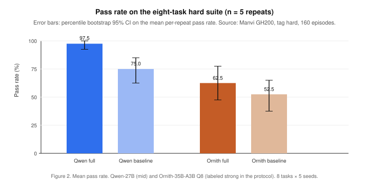
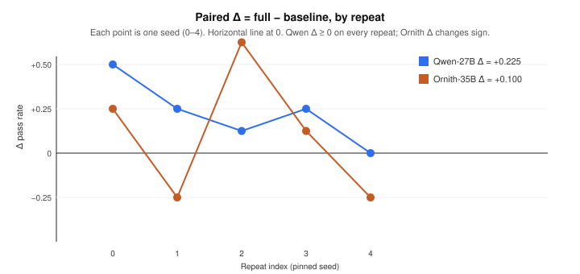

# Harness Architecture as an Experimental Object: Measuring Switchable Components on Local Coding Agents

**Draft — 20 August 2026.** This manuscript reports a local, stdlib-only coding harness and a 160-episode full-versus-baseline grid on two locally served models. It does not claim the Meta-Harness interaction \(\Delta_{\text{weak}} > \Delta_{\text{strong}}\).

**Figure 1.** Graphical abstract. The object of measurement is the harness around a frozen local model: seven independently switchable components, a sandbox the agent can write, and a verifier the agent cannot. On the eight-task hard suite, Qwen 3.8 27B improved from 75.0% to 97.5% pass rate when the full harness replaced the all-off baseline.

## Abstract

The pass rate of a coding agent is not a property of the model alone. It is a joint property of the model and the harness: the code that builds context, exposes tools, truncates output, and decides when the work is done. Lee et al. showed that this joint property is large enough to matter on Terminal-Bench 2.0, where Claude Haiku 4.5 spanned 13.9% to 37.6% across published harnesses and Claude Opus 4.6 spanned 58.0% to 81.8% [1], [2]. That result was measured on frontier APIs. It does not say which components of a harness pay, on which models, or whether the same structure helps a 27B model served from a single GPU. We treat the harness as an experimental object rather than a fixed wrapper. Seven components—environment bootstrap, native file tools, output capping, a pre-finish checklist, a hidden verify gate, loop breaking, and filesystem grounding—are independently switchable. The agent works inside a path-resolved sandbox. Hidden tests live outside it. A check that did not run never reports the same result as a check that ran and passed. We evaluate the full configuration against the all-off baseline on eight hidden-test coding tasks, five pinned seeds, and two locally served models on one NVIDIA GH200: Qwen 3.8 27B and Ornith-1.5 35B-A3B (Q8). Qwen’s pass rate rose from 75.0% (bootstrap 95% CI 62.5–85.0) under the baseline to 97.5% (92.5–100.0) under the full harness, a paired \(\Delta\) of \(+22.5\) percentage points whose interval excludes zero. The gain is not uniform: three of eight tasks account for seven of Qwen’s nine extra passes, and on Ornith the full harness loses a task the baseline wins. Ornith’s paired \(\Delta\) was \(+10.0\) points with an interval that includes zero, and Ornith scored below Qwen on both configurations, so it is not a strong-model control. A separate single-flag experiment on an easier task shows why a gate can pay: Qwen, without it, makes a visible test pass by breaking a module contract the hidden tests still check. The architecture makes those distinctions measurable. The numbers that survive are the Qwen full-versus-baseline result, the per-task heterogeneity, and the protocol that produced them.

## 1. Introduction

A coding agent is a language model plus a loop. The loop decides what the model sees on the first turn, which tools it may call, how much of a tool result is returned, whether a repeated call is blocked, and whether a `finish` call ends the episode or is sent back with failing tests. That loop is the harness. Changing it, while holding the model fixed, can move pass rate by tens of points [1], [2]. Practitioners already know this informally: they add a system prompt, a memory file, a retry, a verifier, and then treat the resulting number as a property of the model. The number is not. It is a property of a pair.

Lee, Nair, Zhang, Lee, Khattab, and Finn made the pair an object of search [1]. Meta-Harness is an outer loop whose proposer rewrites harness code given filesystem access to prior source, scores, and traces. On Terminal-Bench 2.0 their discovered harness ranked first among reported Claude Haiku 4.5 agents at 37.6% and second among reported Claude Opus 4.6 agents at 76.4%, against a leaderboard that itself spans 13.9–37.6% for Haiku and 58.0–81.8% for Opus [1, Table 7]. That table is evidence that harness choice is first-order. It is not a component ablation, it is not a local-model result, and it is not a statistical test that the ablation delta shrinks as capability rises. The search that produced it also consumes a frontier coding agent as the proposer. We wanted the complementary measurement: a small, fully switchable harness that a 27B model can run locally, with every component off or on by a flag, and with pass rate reported as an interval over pinned repeats rather than a single run.

The gap is practical as well as scientific. Local models are the ones for which harness cost is paid in resident weights, context tokens, and GPU-hours on a machine the experimenter owns. They are also the ones for which a component that looks free on a frontier API—an extra checklist round trip, a verifier invocation, a 30 kB output cap—is visible in the trace. If the harness is a monolith, those costs cannot be attributed. If it is a bag of flags, they can. The design constraint we accepted is that the measurement rig must itself be small: Python standard library, five tools, no training, no outer-loop proposer.

This paper makes three contributions. First, we specify a coding harness whose seven discovered components are independently switchable, each tied to a named local-loop failure, whose tool surface is confined by resolved path rather than by instruction, and whose grader cannot be written by the agent. Second, we specify a protocol that pins the sampling seed per repeat, reports percentile bootstrap 95% intervals on pass rate and on the paired \(\Delta\) between full and baseline, and refuses to treat an unrun check as a pass. Third, we report that protocol on eight hard tasks and two local models, with a per-task matrix and stop-reason table, plus a single-flag verify-gate case on a contract-breaking failure. The result that the hard-grid interval supports is that Qwen 3.8 27B gains \(+22.5\) percentage points (CI \(+10.0\) to \(+37.5\)) when the full harness replaces the baseline. The result the interval does not support is a capability-by-harness interaction. Ornith-1.5 35B-A3B, included as a larger model, scored lower than Qwen under both configurations, and its \(\Delta\) interval includes zero.

The rest of the paper is organized as follows. Section 2 situates the work against Meta-Harness and against the inner loops that table spans. Section 3 describes the architecture, the flags, and the non-cheating invariant. Section 4 describes the tasks, models, hardware, and statistics. Section 5 reports pass rates, per-task outcomes, stop reasons, cost proxies, and the verify-gate case. Section 6 interprets the Qwen result, explains why Ornith is not a strong control, and states what would be required to test the interaction claim. Section 7 concludes. Appendix A records serving flags and the mid-grid protocol change.

## 2. Related work

Lee et al. define a harness as the code that determines what to store, retrieve, and present to a frozen model, and they treat harness engineering as a search problem rather than a one-off prompt edit [1]. Their outer loop is itself agentic: a proposer with filesystem access to every prior candidate’s source, scores, and execution traces. The inner objects of that search, in the coding domain, are complete agent loops evaluated on Terminal-Bench 2.0, a suite of 89 interactive terminal tasks whose tests score final container state rather than the agent’s command trace [2]. Merrill et al. built that benchmark, in part, because the same model under OpenHands [3], Mini-SWE-Agent in the SWE-agent line [4], Claude Code, or their own Terminus 2 scaffold is not the same agent. Terminus 2 is deliberately thin: one headless terminal tool and Bash [2]. Terminus-KIRA, which Meta-Harness uses as a coding-domain parent, replaces in-context JSON parsing with native tool calling and adds a 30 kB output cap and a multi-perspective completion checklist [1], [5]. The Meta-Harness discovery on top of that parent is environment bootstrap: one compound shell command before the first model turn [1, §B.3]. The finding that matters for this paper is not the search algorithm. It is the empirical fact that, for a fixed base model, published harnesses on Terminal-Bench 2.0 already differ by more than twenty points [1, Table 7]. OpenHands on Haiku 4.5 is 13.9%; the Meta-Harness discovery is 37.6%. Claude Code on Opus 4.6 is 58.0%; ForgeCode is 81.8%. Once those gaps exist, a component nobody A/B-tested is a guess, even if the full loop looks strong.

We do not search over harness code. We factor one loop into flags so that a later search, or a later human, can turn a single component off and measure it. That is a different experimental object. Meta-Harness asks which harness an outer agent can discover. We ask whether a declared set of components, implemented once, moves pass rate on local models when they are all on versus all off. The two questions compose: a switchable inner loop is the right substrate for an outer search, because a proposer that rewrites a monolith cannot tell which edit paid.

The failure modes that motivated the flags are local-loop failures, not leaderboard failures. A 27B model spent early turns discovering what is installed; that is environment bootstrap. The same model, shown a quietly truncated build log, reasoned about an error it never saw; that is head-and-tail output capping. It called `finish` after making the visible test pass by breaking a documented contract elsewhere; that is a verify gate whose tests the agent cannot edit. It repeated an identical tool call until a turn budget expired; that is loop breaking. It answered from a prompt the server had silently truncated; that is a loud context-exhaustion stop. None of these require a frontier proposer to notice. They require the inner loop to be written so that each one can be switched off.

Our tasks are a separate, smaller suite with hidden tests. They are not a drop-in substitute for Terminal-Bench 2.0, and we do not report them as such. We cite leaderboard names only as they appear in Lee et al. [1]. We did not re-run that leaderboard.

## 3. Architecture

The harness is a single Python loop around an OpenAI-compatible chat API, served in this work by Ollama. Figure 2 is the control flow. The model is frozen. Everything that decides what the model sees is in `Config`. The defaults are the full harness. The baseline turns every discovered component off except native file tools, which stay on because the alternative is asking a small model to get shell quoting right in order to touch a file.

**Figure 2.** Control flow of one episode. Initial context, the model turn, and sandbox tools are flag-gated. The first `finish` may inject a checklist. A later `finish` may run the hidden verifier and bounce the model back to work. A final verifier always runs after the loop stops, whatever the model claimed.

### 3.1 Tool surface and sandbox

Five tools are exposed: `run_shell`, `read_file`, `write_file`, `edit_file`, and `finish`. The first four exist so that file I/O does not depend on the model emitting a correctly quoted shell pipeline. Every path the model supplies is resolved with `os.path.realpath` and refused if it is not the sandbox root or a descendant of it. Containment is therefore a property of the harness, not of the prompt. Shell commands run under `/bin/bash -lc` in the sandbox working directory, with a 120 s timeout that returns a recoverable error rather than hanging the episode. Tool bugs are also recoverable: an unexpected exception becomes a tool result, not a crashed run.

Output from the shell and from files is passed through a head-and-tail cap of 30,000 bytes, inherited from the Terminus-KIRA cap as used in the Meta-Harness coding setup [1], [5]. The middle is never dropped silently. The truncation notice states how many bytes were elided and that both the head and the tail are shown. A model that does not see that notice will invent a cause for a failure whose log it never read. When `outcap` is off, the cap is raised to \(10^9\) bytes so that the flag is a real ablation rather than a comment.

### 3.2 Switchable components

Table 1 maps each flag to the local failure it is meant to interrupt. The mapping is a hypothesis about the loop, not a result. Section 5 tests the bundle on the hard suite and one flag (`verifygate`) on a single easier task.

**Table 1.** Flags and the failures they target. F-numbers follow the design note in this repository. `nativetools` is on in every reported cell.

| Flag | Component | Targeted failure |
|---|---|---|
| `envboot` | Environment snapshot before turn 1 | Wasted exploration; hallucinated paths and tool versions |
| `nativetools` | Native `tool_calls` versus in-context JSON | Malformed tool names and arguments |
| `outcap` | Head-and-tail output cap | Silent middle-drop; context blowup from logs |
| `checklist` | Four questions on the first `finish` | Premature done without having run tests |
| `verifygate` | Hidden tests on a later `finish` | Success claimed because a visible test passed |
| `loopbreak` | Duplicate-call detector | Repetition until the context window dies |
| `groundfs` | Read-before-write sentence | Edits to files the model has not opened |

**Environment bootstrap (`envboot`).** Before the first model turn, the harness runs a compound shell command with a 15 s timeout and injects the result as an `[Environment Snapshot]` block: working directory, a short file listing, language compilers and interpreters that exist, package managers, test runners, and available memory. If the command fails, times out, or prints nothing, the snapshot is omitted and the episode continues. A broken bootstrap must degrade to the baseline, not abort the grid. The point of the component is to remove the two to four turns a local model otherwise spends asking what is installed, which is the coding-domain discovery reported by Lee et al. [1, §B.3].

**Filesystem grounding (`groundfs`).** A single sentence is appended to the first user message: everything needed is already in the task directory, and files should be read before they are edited. It is a cheap prior against wandering into `/usr` or inventing paths.

**Native tools (`nativetools`).** When on, the five-tool schema is offered. When off, only `run_shell` and `finish` are offered, file-tool calls are refused, and the system prompt says so. That is the ablation: the model must touch files through the shell. Native tools stay on in every cell except `no-nativetools`.

**Output cap (`outcap`).** Described above. The baseline sets it off.

**Checklist (`checklist`).** The first time the model calls `finish`, the harness does not end the episode. It returns four questions: whether the project tests were run in this session and seen to pass in real output; whether the change fixes the cause or only the example; whether any test, assertion, or file was weakened, deleted, or stubbed; and whether anything outside the task was changed. If any answer is unsatisfactory, the instruction is to keep working. The checklist is a prompt intervention, not a grader.

**Verify gate (`verifygate`).** On a subsequent `finish`, if the flag is on, the harness runs the task’s hidden tests and, on failure, returns the failing output as a tool result with the instruction to keep working. On success, the loop stops with `stop_reason=finished`. The tests are not in the sandbox. The agent cannot read or edit them. Visible tests in the task directory are part of the problem statement; they are not the grade.

**Loop breaking (`loopbreak`).** If the model emits the same tool name and arguments twice in a recent window, the third identical call is not executed. The tool result says so, and asks for a different approach. Without this flag, a local model can burn the rest of a context window on a command that already returned.

These seven flags are the experimental factors. They are not a claim that this is the unique decomposition of a coding harness. They are a claim that this decomposition is complete enough to turn the harness into a factorial object instead of a blob. Tables 2–4 still only contrast the bundle against the baseline. Section 4.6 is the one-flag-off ladder, including native tools, on the same two models.

### 3.3 Context construction and history

The first message is a system prompt that states the tools, requires reading before editing, forbids weakening tests, and requires `finish` with evidence. The first user message is the optional environment snapshot, the task instruction, and the optional grounding sentence. Subsequent history is append-only. Earlier turns are never rewritten, so a server that caches a key-value prefix can reuse it. Rewriting history would force a full prefill and would also make the transcript the harness claims to have used diverge from the one the model saw.

Reasoning channels are read when the server provides them (`thinking`, `reasoning_content`, `reasoning`). They are not assumed to be present, and they are not stuffed back into the next prompt as if they were content. Prefill that treats a reasoning channel as ordinary tokens is a silent distribution shift; we refuse it by construction.

Malformed tool arguments are coerced when they arrive as a JSON string instead of an object. A missing tool name is a recoverable error that lists the five legal names. `finish` is handled last in a mixed turn so that a call to `write_file` in the same step still receives a result.

### 3.4 Stop conditions and the non-cheating invariant

The reported grid uses `max_steps = 0`, which means there is no turn ceiling. The loop stops when the model successfully finishes under the gate, when it produces two consecutive turns with no tool call, when prompt tokens exceed 90% of `num_ctx` (32,768), when the client raises, or when the episode exceeds a 1800 s wall clock. The last of those scores fail even if the hidden verifier would pass: a hung generate is not a completed task. Per-request HTTP timeout equals the remaining episode budget (at most 1800 s) and is not retried. An early protocol used a 40-turn ceiling; episodes that died on that ceiling were re-run under the uncapped (turn) policy, and already-passing episodes were left in place. Appendix A records this change. We do not report wall-clock as a comparative result, because two models share one GPU; the 1800 s line is a stop condition, not a speed claim.

After the loop stops, the hidden verifier always runs. A model that hit `max_steps` or `context_exhausted` can still have fixed the code. A model that called `finish` can still be wrong. `wall_timeout` is scored fail even if that verifier would pass. A check that did not run is not recorded as a pass. That invariant is inherited from the parent project’s evaluation rules and is the reason the grader lives outside the sandbox. Without it, “approved” and “unexamined” become the same bit.

## 4. Methods

### 4.1 Tasks

The hard suite is eight tasks, each with a visible specification in the sandbox and hidden tests the agent cannot see: `concurrency_race`, `ast_transformer`, `state_machine_fuzz`, `cache_invalidation_dist`, `pratt_parse`, `ot_transform`, `nfa_match`, and `json_patch`. They are sequential programming problems with adversarial hidden cases (races, operator precedence, operational transformation, NFA matching, JSON Patch). `cache_invalidation_dist` uses an in-process three-node cache, not a cluster. None of the eight is an HPC workload. An easier eleven-task suite exists in the same repository and is not the headline grid, because several cells saturated and could not move. One task from that easier suite, `navigate`, is used only in Section 5.4 as a single-flag case.

### 4.2 Models and serving

Two models were served with Ollama 0.32.14 on one NVIDIA GH200 (aarch64, 97,871 MiB HBM, CUDA 13). Qwen 3.8 27B (`qwen3.8:27b`, Q4, on the order of 17 GB weights) is the mid model. Ornith-1.5 35B-A3B (`hf.co/ornith-ai/Ornith-1.5-35B-A3B-GGUF:Q8_0`, on the order of 39 GB weights) is the second model: larger by parameter count, weaker on this suite. Context was `num_ctx=32768`. Sampling used temperature 0.6. Flash attention was enabled. `OLLAMA_NUM_PARALLEL` was 1. No other base models are in this experiment. Exact serving flags are in Appendix A.

For part of the grid both models were kept resident (`OLLAMA_MAX_LOADED_MODELS=2`) so that Qwen and Ornith episodes could proceed in parallel. Resident weights then occupied on the order of 58 of 96 GiB HBM, and decode throughput for Qwen dropped while the GPU was shared. Pass/fail is not a function of tokens per second, but wall-clock is. We therefore do not compare `wall_s` across configurations or models. Cost is reported as steps and peak prompt tokens, which are properties of the transcript.

The verify-gate case in Section 5.4 was not run on the GH200. It used Qwen 3.8 27B MLX (`qwen3.8:27b-mlx`) and Ornith Q8 on the Apple host where those episodes were logged, with `max_steps=40`. It is a different serving stack and a different task, reported as a mechanism, not pooled into Table 2.

### 4.3 Design

The design is a \(2 \times 2 \times 5 \times 8\) grid: two models, two harness configurations (`full` and `baseline`), five repeats, eight tasks. That is 160 episodes. Repeat \(r \in \{0,1,2,3,4\}\) pins the sampling seed to \(r\). The same seed is used for the paired full and baseline episodes of that repeat, so \(\Delta\) is a paired difference of per-repeat pass rates, each pass rate being the fraction of the eight tasks passed on that seed. Existing result files were not overwritten; the runner skips a cell that already has `{task}.rep{rep}.json`.

The baseline is not a different product. It is the same loop with `envboot`, `checklist`, `verifygate`, `loopbreak`, `groundfs`, and `outcap` set false. Native tools remain. The comparison is therefore “these six components, together,” not “a harness versus no harness.”

### 4.4 Protocol change

The first episodes of this grid used `max_steps=40`. Two tasks in particular, `ast_transformer` and `nfa_match`, stopped on that ceiling with the code still wrong. The ceiling was then set to zero (uncapped), already-passing episodes were kept, and ceiling failures were re-run. Stops that remain are `finished`, `no_tool_call`, `context_exhausted`, and client `ModelError`. The reported 160-episode file is the post-change set. A reader who wants a frozen-from-the-first-turn protocol will need a new grid. We do not mix the 40-step deaths into the pass-rate table. Qwen baseline still shows a maximum of 40 steps, which is a leftover of the earlier ceiling on episodes that had already passed and were not re-run.

### 4.5 Statistics

Let \(p_{m,c,r}\) be the pass rate of model \(m\), configuration \(c\), repeat \(r\), over the eight tasks. The cell estimate is the mean of \(\{p_{m,c,r}\}_{r=0}^{4}\). Intervals are percentile bootstrap 95% confidence intervals on that mean, 10,000 resamples, RNG seed 0, as implemented in `mh/stats.py`. For each model the paired delta is \(\Delta_r = p_{m,\text{full},r} - p_{m,\text{baseline},r}\), and the same bootstrap is applied to \(\{\Delta_r\}\). With \(n=5\), the interval is the claim. A point estimate without the interval is not. The interaction test is \(\Delta_{\text{weaker}} - \Delta_{\text{stronger}}\), where weaker and stronger are the models with the lowest and highest full-harness mean pass rate in the tag, not the models with the fewest and most parameters. Parameter count put Ornith above Qwen; the suite put it below. For the 2×2 verify-gate counts we report two-sided Fisher’s exact test, computed from the hypergeometric probabilities of all tables with the same margins whose probability is at most that of the observed table.

### 4.6 Expansion grid (frozen protocol, in progress)

Tables 2–4 report the completed 160-episode full-versus-baseline contrast on Qwen and Ornith. That contrast does not isolate a flag, and it used a turn ceiling that was removed mid-grid. The expansion now running on the same GH200, under `expand_hard.sh`, freezes the turn budget that Section 4.4 lacked: `max_steps=0` from the first turn, seeds 0–4, tag `hard` so new cells join the existing ones. Qwen and Ornith decode concurrently (`--share-gpu`, one peer). Pass/fail and token counts are properties of the transcript and are the reported outcomes; wall-clock is not, because two models share the SMs. The first Qwen one-flag cells began as sole tenant; remaining cells, including all of Ornith, overlap. The 11-task easy suite stays out; it is saturated. No other models are added.

The new cells are the seven one-flag-off configurations (`no-verifygate`, `no-envboot`, `no-checklist`, `no-loopbreak`, `no-outcap`, `no-groundfs`, `no-nativetools`) on both Qwen 3.8 27B and Ornith-1.5 35B-A3B, then a forced re-run of `full` and `baseline` under the same uncapped budget so the paired \(\Delta\) does not mix the mid-grid ceiling change with the ladder. The first 160 episodes are archived as `*-protocol1` before that re-run. Results from this expansion are not in Tables 2–4 until it completes. `compare.py --json-out` writes per-task counts, stop reasons, and CIs; `figures.py` renders from that file.

## 5. Results

All 160 hard-grid episodes completed. Table 2 reports cell pass rates. Figure 3 plots the same means with bootstrap intervals. Figure 4 plots the five paired deltas. Table 3 is the per-task matrix. Table 4 is stop reasons and transcript cost.

**Table 2.** Pass rate on the eight-task hard suite. Each cell is 40 episodes (8 tasks \(\times\) 5 seeds). CI is the percentile bootstrap 95% interval on the mean of the five per-repeat pass rates.

| Model | Config | Passes | Rate | 95% CI |
|---|---|---:|---:|---|
| Qwen 3.8 27B | full | 39/40 | 97.5% | 92.5–100.0 |
| Qwen 3.8 27B | baseline | 30/40 | 75.0% | 62.5–85.0 |
| Ornith-1.5 35B-A3B Q8 | full | 25/40 | 62.5% | 47.5–77.5 |
| Ornith-1.5 35B-A3B Q8 | baseline | 21/40 | 52.5% | 37.5–65.0 |

**Figure 3.** Mean pass rate with bootstrap 95% CI. Qwen under the full harness is near ceiling on this suite. Ornith lies below Qwen under both configurations.

Qwen’s five full-harness repeat rates were \(1.00, 1.00, 1.00, 1.00, 0.875\). The corresponding baseline rates were \(0.50, 0.75, 0.875, 0.75, 0.875\). The five paired deltas were therefore \(+0.50, +0.25, +0.125, +0.25, 0.00\). All five are non-negative. The mean \(\Delta\) is \(+22.5\) percentage points, with bootstrap 95% CI \(+10.0\) to \(+37.5\), which excludes zero.

Ornith’s five full-harness rates were \(0.75, 0.50, 0.875, 0.625, 0.375\). The baseline rates were \(0.50, 0.75, 0.25, 0.50, 0.625\). The paired deltas were \(+0.25, -0.25, +0.625, +0.125, -0.25\). Two of five repeats favor the baseline. The mean \(\Delta\) is \(+10.0\) percentage points, with CI \(-17.5\) to \(+37.5\), which includes zero.

**Figure 4.** Paired \(\Delta =\) full \(-\) baseline by pinned seed. Qwen never goes negative. Ornith changes sign. That is the entire interaction-shaped picture this grid can support, and it is not an interaction test.

### 5.1 Per-task matrix

Qwen’s nine extra passes are not spread across the suite. They come from `json_patch` (+3), `concurrency_race` (+2), `ast_transformer` (+2), `state_machine_fuzz` (+1), and `ot_transform` (+1). Three tasks were already 5/5 under the baseline. Qwen’s only full-harness miss is `ast_transformer` on one of five seeds. Ornith is a different picture: the full harness is 0/5 on `ast_transformer` where the baseline is 1/5, and 4/5 on `json_patch` where the baseline is 5/5. A harness can cost a task. We still do not treat any single-task contrast as a finding with its own interval. With five seeds a task-level CI is wide. The matrix is there so that the cell mean is not allowed to hide where the bundle paid and where it did not.

**Table 3.** Passes out of five seeds, hard suite. Source: Manvi `summary.json` rows for tag `hard`.

| Task | Qwen full | Qwen baseline | Ornith full | Ornith baseline |
|---|---:|---:|---:|---:|
| `concurrency_race` | 5/5 | 3/5 | 4/5 | 3/5 |
| `ast_transformer` | 4/5 | 2/5 | 0/5 | 1/5 |
| `state_machine_fuzz` | 5/5 | 4/5 | 3/5 | 3/5 |
| `cache_invalidation_dist` | 5/5 | 5/5 | 4/5 | 3/5 |
| `pratt_parse` | 5/5 | 5/5 | 3/5 | 1/5 |
| `ot_transform` | 5/5 | 4/5 | 5/5 | 4/5 |
| `nfa_match` | 5/5 | 5/5 | 2/5 | 1/5 |
| `json_patch` | 5/5 | 2/5 | 4/5 | 5/5 |

### 5.2 Stop reasons and transcript cost

Qwen almost always ends by calling `finish` (38/40 full, 39/40 baseline). The remaining three Qwen stops are `context_exhausted`. Ornith is not that agent: under the full harness, 10 of 40 episodes stop on `context_exhausted` and 6 on `error:ModelError`; under the baseline, 9 and 9. Those errors stay in the denominator. They mix model capability with serving failures, which is one reason Ornith’s \(\Delta\) interval is not evidence that the harness is ineffective on that model. It is evidence that the measured pair (Ornith + this server + this context window) did not produce a \(\Delta\) whose interval excludes zero.

Median steps barely move for Qwen when the harness is turned on (13 versus 12). Ornith takes about twice as many turns as Qwen on both configurations. Peak prompt tokens for Qwen sit well under `num_ctx`; Ornith’s maxima reach the 32k cap, which matches the `context_exhausted` mass. That is the cost we can report without confounding GPU sharing. Wall-clock is not reported.

**Table 4.** Stop reasons and transcript size, hard suite, 40 episodes per cell.

| Cell | `finished` | `context_exhausted` | `error:ModelError` | Steps median (max) | Peak prompt tokens median (max) |
|---|---:|---:|---:|---|---|
| Qwen full | 38 | 2 | 0 | 13 (64) | 8,618 (29,694) |
| Qwen baseline | 39 | 1 | 0 | 12 (40) | 7,279 (30,297) |
| Ornith full | 24 | 10 | 6 | 28 (63) | 12,557 (32,620) |
| Ornith baseline | 22 | 9 | 9 | 26 (55) | 14,335 (31,813) |

### 5.3 A cost proxy that is not wall-clock

On the easier suite we once saw a wall-clock ratio that looked like a speedup and did not survive a rerun of the same eight tasks. The baseline’s own total moved by a factor of 0.58 between two runs that differed in nothing but sampling. We therefore make no time claim, in either direction, and we do not import those totals into this paper. What we can point at, because the transcripts are still on disk, is step count on `globmatch` for Qwen 3.8 27B MLX at `max_steps=40`: full harness 14, 16, and 17 steps versus baseline 35, 37, and 40 (three repeats; the baseline median is the ceiling itself). The harness costs an env-bootstrap command, a checklist round trip, and verifier runs. It pays for itself where the baseline would otherwise fail or run until the ceiling. It does not pay in seconds on a shared GPU.

### 5.4 Verify gate on `navigate`

The hard grid does not isolate a flag. A prior experiment on `navigate` does. The visible test checks that `python3 test_report.py` prints a grand total of `4703.25` and lists categories alphabetically. The hidden tests also check that `loader.load()` returns amounts already converted from integer cents to dollars, which is that module’s documented contract. The intended fix is to stop converting twice: `pipeline.build_report()` already calls `normalise_rows`, so `loader.load()` should return cents. Qwen, without the gate, often does the opposite. It removes the conversion from `loader.load()`’s neighbour or, in the logged failure `navigate.rep1` under `no-verifygate`, writes `loader.py` so that `load()` returns the raw cent arrays. The visible test then passes, because the pipeline still converts once, and the model calls `finish`. The hidden verifier records `FAIL loader returns dollars got [1175, 4250, 89900, 125000, 250000] want [11.75, 42.5, 899.0, 1250.0, 2500.0]`. Only a check the model does not control catches it.

On Qwen 3.8 27B MLX, three tagged repeat directories that differ in nothing but `verifygate` give 12/12 passes with the gate on and 7/12 with it off (two-sided Fisher exact \(p = 0.037\)). Including one extra full episode and one extra no-gate episode from adjacent tags yields 13/13 versus 7/13 (\(p = 0.015\)), which is the table previously written in the design note; the conservative count is the 12-versus-12 set. The same contrast on Ornith Q8 in the `orep` directories is 6/6 versus 5/6 (\(p = 1.0\)). Without the gate, Qwen commits the contract-breaking finish on 5 of 12 episodes; Ornith on 1 of 6. The gate is insurance, and its value tracks how often the model makes that error, not the parameter count. These episodes are not part of Table 2. They are the mechanistic reason `verifygate` exists.

## 6. Discussion

The Qwen result is a mid-model full-versus-baseline effect on a suite that is hard enough not to saturate. Thirty-nine of forty full-harness episodes passed. Thirty of forty baseline episodes passed. The paired interval excludes zero, and every repeat’s \(\Delta\) is at least zero. Table 3 says where that happened: mostly `json_patch`, `concurrency_race`, and `ast_transformer`. It also says the bundle is not a free lunch on Ornith. That is enough to say that this harness, with these six components on, moved Qwen on these tasks. It is not enough to say which component paid on the hard suite. The verify gate, the checklist, the bootstrap, and the loop breaker are still bundled there. Section 5.4 isolates the gate on one easier task and one failure mode. A later grid that turns one flag off at a time on the three hard tasks that moved is the measurement Table 1 was built for.

The same numbers rule out a particular overclaim. Ornith has more parameters than Qwen and was listed as the strong arm. On this suite it is the weaker agent under both configurations: 62.5% versus 97.5% full, 52.5% versus 75.0% baseline. Parameter count was the wrong proxy for capability here. Table 4 shows why a score comparison is also not a clean capability comparison: a quarter of Ornith episodes never finish. A test of \(\Delta_{\text{weak}} > \Delta_{\text{strong}}\) that used Ornith as the strong arm would have been a test of the wrong ordering. We did not run it. Lee et al.’s Terminal-Bench 2.0 table remains the best published evidence that harness span is large on both a weaker and a stronger frontier model [1], [2]. It is still not a paired ablation on local weights, and the Haiku versus Opus gaps in that table are leaderboard spans across independently engineered systems, not \(\Delta\) from a shared loop with one flag flipped.

Two protocol facts bound how far the Qwen interval should travel. The turn ceiling was removed mid-grid, and some episodes were re-run; a frozen protocol might move the point estimate. Two models shared one GPU for part of the run; that confounds time, not pass/fail, but it means we cannot claim the full harness is cheaper in wall-clock, which is why Section 5.3 exists. Filtering Ornith’s `ModelError` rows would be a different experiment, and would have to be declared before looking at pass rate.

What the architecture contributes, independently of the Qwen interval, is that those caveats are visible. Stop reason is a field. Peak prompt tokens are a field. The verifier is outside the sandbox. The baseline is the same loop. Section 4.6 is the one-flag-off ladder on the same two models under a frozen protocol. Until those cells finish, the headline remains the Qwen bundle contrast.

Until that pair exists, the honest headline is narrower than Meta-Harness Table 7 and more specific than a leaderboard screenshot: on eight hidden-test tasks, five seeds, and one GH200, turning this harness on raised Qwen 3.8 27B from 75% to 97.5%, the bootstrap interval on that paired difference does not include zero, and most of the extra passes sit in three tasks.

## 7. Conclusion

We described a coding harness that is small enough to run around a local 27B model and factored enough that its components can be switched independently. The sandbox is path-resolved. The grader is not writable by the agent. Unrun is not passed. On a 160-episode hard grid, the full configuration improved Qwen 3.8 27B by \(+22.5\) percentage points over the all-off baseline, with a bootstrap 95% interval that excludes zero. The gain concentrated on three tasks; on Ornith the same bundle lost a task. A larger Ornith model did not outperform Qwen and did not yield a \(\Delta\) interval that excludes zero, so Tables 2–4 do not test whether harness benefit shrinks with capability. A single-flag verify gate on `navigate` shows one component earning its keep when the model would otherwise ship a visible-test pass that breaks a hidden contract. The one-flag-off ladder on Qwen and Ornith, including a frozen re-run of full versus baseline, is running on the same host (Section 4.6). Their numbers are not in this draft.

## Data and code

The harness, tasks, runner, and statistics live in the `bench/` directory of this repository (`mh/harness.py`, `mh/stats.py`, `grid.py`, `compare.py`). The reported hard grid is tag `hard`, 160 episodes. The compare summary used for Table 2 is `stats-hard.json`. Per-task and stop-reason counts in Tables 3–4 were read from the four Manvi `summary.json` files for that tag. The `navigate` transcripts used in Section 5.4 are the `qwen3.8_27b-mlx__{full,no-verifygate}__rep{,2,3}` and Ornith `orep` directories. Hardware for the hard grid was a single NVIDIA GH200 (Manvi).

## Acknowledgments

The component list and the 30 kB output cap follow the coding-harness setting studied by Lee et al. [1], building on Terminus-KIRA [5] and Terminal-Bench 2.0 [2]. The non-cheating invariant is inherited from the parent evaluation rules of this repository.

## References

[1] Y. Lee, R. Nair, Q. Zhang, K. Lee, O. Khattab, and C. Finn, “Meta-Harness: End-to-End Optimization of Model Harnesses,” arXiv:2603.28052, 2026.

[2] M. A. Merrill *et al.*, “Terminal-Bench: Benchmarking Agents on Hard, Realistic Tasks in Command Line Interfaces,” arXiv:2601.11868, 2026.

[3] X. Wang *et al.*, “OpenHands: An Open Platform for AI Software Developers as Generalist Agents,” in *Proc. ICLR*, 2025. arXiv:2407.16741.

[4] J. Yang, C. E. Jimenez, A. Wettig, K. Lieret, S. Yao, K. R. Narasimhan, and O. Press, “SWE-agent: Agent-computer interfaces enable automated software engineering,” in *Proc. NeurIPS*, 2024. arXiv:2405.15793.

[5] KRAFTON AI and Ludo Robotics, “Terminus-KIRA: boosting frontier model performance on Terminal-Bench with a minimal harness,” 2026, as cited by Lee et al. [1].

## Appendix A. Serving and protocol

Hard-grid models in Tables 2–4 were `qwen3.8:27b` and `hf.co/ornith-ai/Ornith-1.5-35B-A3B-GGUF:Q8_0` under Ollama 0.32.14 on the GH200. Runner defaults were `--num-ctx 32768`, `--num-predict 4096`, `--temperature 0.6`, `--think` on with fallback if unsupported, `--seed` equal to the repeat index for `--repeat 5` starting at 0. `max_steps` defaulted to 0 (no turn ceiling) after the protocol change in Section 4.4; some already-passing Qwen baseline episodes retain a recorded maximum of 40 steps from the earlier ceiling. The runner skips `{task}.rep{rep}.json` if it exists. `--share-gpu` allowed one peer resident (`OLLAMA_MAX_LOADED_MODELS=2`, `KEEP_ALIVE=-1`, `FLASH_ATTENTION=1`, `NUM_PARALLEL=1`) on that first 160. Expansion cells (Section 4.6) use `max_steps=0` from turn one, a 1800 s episode wall (`wall_timeout` scores fail), per-request HTTP timeout equal to remaining wall (not retried), overlap Qwen with Ornith for GPU occupancy, and write a `protocol` object (including `share_gpu` and `max_wall`) into `summary.json`. Context exhaustion fires at 90% of `num_ctx`. The verify-gate case used `qwen3.8:27b-mlx` on Apple silicon with `max_steps=40` and is not mixed into Tables 2–4. Figures can be regenerated with `python3 figures.py results/stats-hard.json`.
