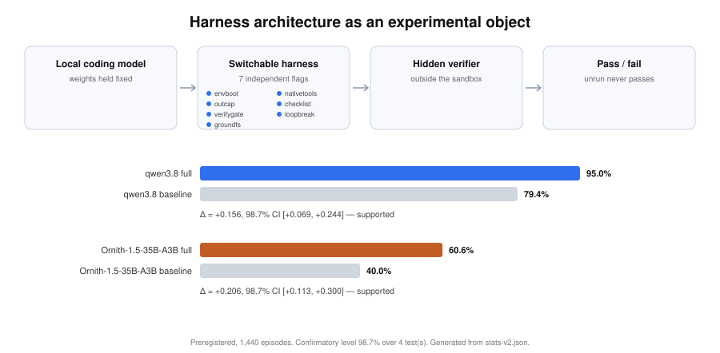
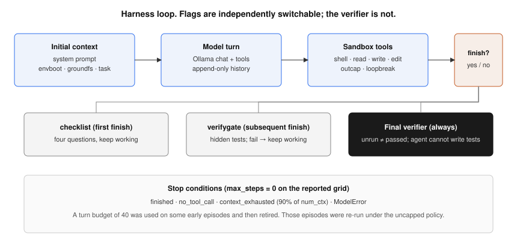
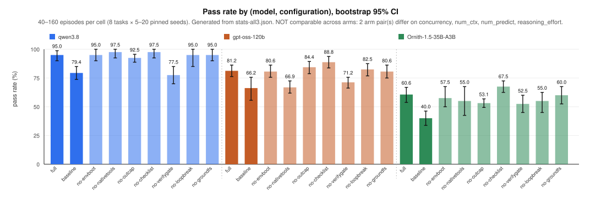
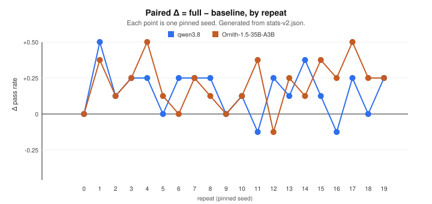
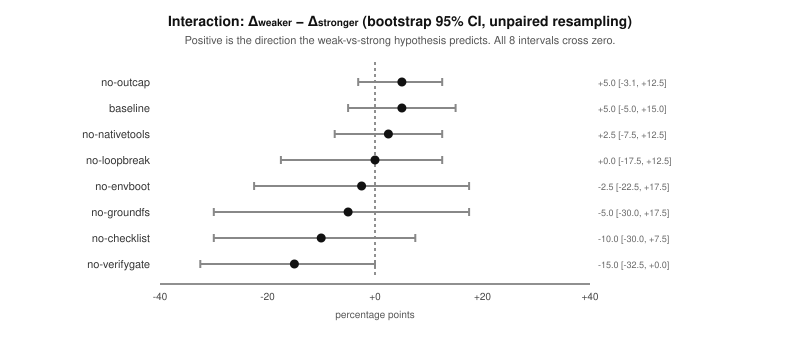
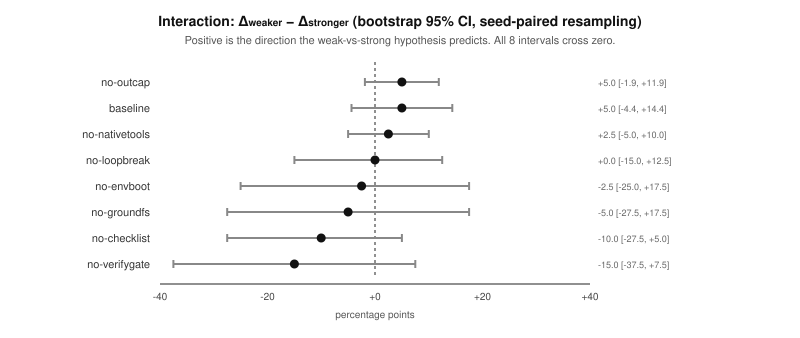

# Harness Architecture as an Experimental Object: Measuring Switchable Components on Local Coding Agents

**Draft — 29 August 2026 (revision 3).** This manuscript reports a local, stdlib-only coding harness and a **preregistered 1,440-episode grid** (two models \(\times\) nine configurations \(\times\) eight tasks, twenty seeds on the confirmatory contrasts and five on the exploratory ladder) on two locally served models under one frozen protocol (`max_steps=0` from turn one, 1800 s episode wall, sole tenant, tag `v2`). A separately registered extension adds a third arm, API-served `gpt-oss-120b`, at 1,440 further episodes.

**Revision 3 replaces the headline.** Revision 2 reported a 720-episode grid under tag `hard`. A subsequent audit of that instrument found five defects, two of which bear directly on the full-versus-baseline contrast: the verify gate returned hidden-test output, including expected values, on a failed `finish` — 77 of 760 episodes received it, and **only in gate-on configurations** — and `run_shell` had no containment, leaving hidden tests readable and writable. Five of the hard tasks also accepted demonstrably wrong solutions. All are fixed. Because the tasks are now stricter and the gate no longer leaks, **v1 pass rates are not comparable with v2 and the two are never pooled.** An audit of all 760 v1 episodes and 3,879 file-writing tool calls found **zero** episodes that exploited any defect; v1's numbers are not fabricated, they are measured on an instrument that could not rule the exploits out. v1 is retained in §5.9 as the instrument-failure record, not as a measurement. The design, hypotheses, directions, and analysis for v2 were registered before the first v2 episode (`paper/preregistration.md`); every departure is recorded in `paper/DEVIATIONS.md` with what had been observed when it was decided.



**Figure 1.** Graphical abstract. The object of measurement is the harness around a frozen local model: seven independently switchable components, a sandbox the agent can write, and a verifier the agent cannot. On the eight-task hard suite under the registered v2 protocol, Qwen 3.8 27B goes from 79.4% (baseline) to 95.0% (full) and Ornith-1.5 35B-A3B from 40.0% to 60.6%. Both deltas exclude zero at the Šidák-corrected 98.7% level. The 720-episode v1 grid that revision 2 reported is superseded and appears only as §5.9's instrument-failure record. This figure is generated from `stats-v2.json` like every other data figure; the hand-drawn version it replaces still carried protocol-1's 97.5%-versus-75% and \(\Delta +22.5\), which revision 2 had already archived as not-the-headline.

## Abstract

The pass rate of a coding agent is not a property of the model alone. It is a joint property of the model and the harness: the code that builds context, exposes tools, truncates output, and decides when the work is done. Lee et al. showed that this joint property is large enough to matter on Terminal-Bench 2.0, where Claude Haiku 4.5 spanned 13.9% to 37.6% across published harnesses and Claude Opus 4.6 spanned 58.0% to 81.8% [1], [2]. That result was measured on frontier APIs. It does not say which components of a harness pay, on which models, or whether the same structure helps a 27B model served from a single GPU. We treat the harness as an experimental object rather than a fixed wrapper. Seven components—environment bootstrap, native file tools, output capping, a pre-finish checklist, a hidden verify gate, loop breaking, and filesystem grounding—are independently switchable. The agent works inside a path-resolved sandbox. Hidden tests live outside it, protected files are SHA-256 checked, and a check that did not run never reports the same result as a check that ran and passed.

We report a **preregistered** grid of nine harness configurations (full, all-off baseline, and each flag off in isolation) on eight hidden-test coding tasks and two locally served models on one NVIDIA GH200: Qwen 3.8 27B and Ornith-1.5 35B-A3B (Q8). Hypothesis directions, the analysis, and the multiplicity correction were fixed before the first episode. That is 1,440 episodes, all completed, with zero starved rows, zero unserved rows, and one protocol block across all eighteen cells. **The full harness beats the all-off baseline on both models at the corrected level.** Qwen goes from 79.4% (bootstrap 95% CI 73.8–85.0) to 95.0% (90.0–98.8), a paired \(\Delta\) of \(+0.156\) whose Šidák-corrected 98.7% interval is \([+0.069, +0.244]\); Ornith goes from 40.0% (33.8–46.2) to 60.6% (53.8–66.9), \(\Delta = +0.206\), 98.7% interval \([+0.113, +0.300]\). Both are supported. The second confirmatory hypothesis is **not** supported: removing the output cap leaves Ornith at \(\Delta = +0.075\) with a 98.7% interval of \([-0.006, +0.156]\), which clears the uncorrected 95% bar and fails the corrected one. That result matters because the superseded v1 grid had reported the opposite sign for the same cell — \(\Delta = -0.100\), interval \([-0.175, -0.025]\), excluding zero — and that reversal is the clearest single piece of evidence that v1's anomaly was an instrument artefact rather than a harness effect.

The exploratory one-flag ladder **on the local arms** is reported as uninformative rather than as a set of findings, and the reason is measured rather than asserted. A deviation from the registered design moved seeds out of the six exploratory cells and into the confirmatory contrasts, leaving those cells at \(n=5\); at that cell shape a Monte-Carlo audit puts the percentile bootstrap's actual coverage at **82.3% against a nominal 95%**, and across the grid's sixteen ladder intervals four exclude zero where a global null produces at least one **96%** of the time at that coverage. Four exclusions is what noise looks like here. Only one local ladder result is large enough to survive the deficiency: turning the verify gate off costs Qwen \(\Delta = +0.225\), interval \([+0.150, +0.300]\). **The component-level evidence in this paper therefore rests on the third arm**, which ran twenty repeats on all nine cells: there four of eight intervals exclude zero against a null expectation of 0.47 at 94.1% coverage, and two components — native file tools and the verify gate — survive a Šidák correction across that arm's entire ladder. The capability-by-harness interaction is again not detected — every \(\Delta_{\text{weaker}} - \Delta_{\text{stronger}}\) interval includes zero under both the unpaired and the seed-paired scheme, as it did in v1.

A separately registered extension adds a third arm, API-served `gpt-oss-120b`, at a further 1,440 episodes under a different serving protocol whose pass rates are therefore not comparable to the local arms', though its within-arm deltas are. It reproduces H1 in direction and magnitude (\(\Delta = +0.150\)) and supplies the study's most interesting disagreement: removing native file tools costs that arm \(+0.144\), the largest single-component effect anywhere in this work and one that survives a correction across all eight of its ladder tests, while costing Qwen \(+0.025\) and Ornith \(+0.050\). The component that matters most on one model is close to free on the other two. A 43.8-hour telemetry log shows the serial batch-1 loop drawing a median 302 W against the GH200's 900 W cap while `utilization.gpu` reads 89%, which is why we report steps and tokens rather than seconds; on the v2 grid roughly 28% of wall-clock is sandboxed tool execution with the device idle. The architecture makes these distinctions measurable. What survives is H1 on both arms, H2 unsupported, an interaction null, and a ladder whose honest reading is "not detectable at this \(n\)."

## 1. Introduction

A coding agent is a language model plus a loop. The loop decides what the model sees on the first turn, which tools it may call, how much of a tool result is returned, whether a repeated call is blocked, and whether a `finish` call ends the episode or is sent back with failing tests. That loop is the harness. Changing it, while holding the model fixed, can move pass rate by tens of points [1], [2]. Practitioners already know this informally: they add a system prompt, a memory file, a retry, a verifier, and then treat the resulting number as a property of the model. The number is not. It is a property of a pair.

Lee, Nair, Zhang, Lee, Khattab, and Finn made the pair an object of search [1]. Their framing is the one we adopt: the performance of an LLM system "depends not only on model weights, but also on their harness: the code that determines what information to store, retrieve, and present to the model," and harnesses "are still designed largely by hand" [1]. Meta-Harness answers that with an outer loop whose proposer rewrites harness code given filesystem access to prior source, scores, and traces. On Terminal-Bench 2.0 [2] their discovered harness ranked first among reported Claude Haiku 4.5 agents at 37.6% and second among reported Claude Opus 4.6 agents at 76.4%, against a leaderboard that itself spans 13.9–37.6% for Haiku and 58.0–81.8% for Opus [1, Table 7]. That table is evidence that harness choice is first-order. It is not a component ablation, it is not a local-model result, and it is not a statistical test that the ablation delta shrinks as capability rises. The search that produced it also consumes a frontier coding agent as the proposer.

The same tension runs through the agentic software-engineering literature, where three incompatible stories about the source of the pass rate coexist. Yang et al. argued that the agent–computer interface is what enables automated software engineering, and engineered one deliberately [4]. Xia et al. pushed the opposite way with Agentless, replacing the agent with a fixed localize–repair–validate pipeline and reporting competitive SWE-bench resolution at lower cost — evidence that much of the apparent gain from "agents" was scaffold engineering nobody had isolated [8], [9]. Zhang et al.'s AutoCodeRover kept the loop but attributed its gains to AST-aware code search rather than to the loop's freedom [10]. Multi-agent systems such as Magentic-One add an orchestration layer on top of all of this [19], and the surveys now catalogue dozens of such designs [11]. Each of these is a claim about *which component pays*, and none of them is settled by a leaderboard position, because the systems differ in many components at once.

What is missing across all of them is the measurement we build here: a paired experiment in which exactly one component changes and everything else — model, weights, seeds, tasks, grader — is held fixed. We wanted the complementary object to Meta-Harness: a small, fully switchable harness that a 27B model can run locally, with every component off or on by a flag, and with pass rate reported as an interval over pinned repeats rather than a single run.

The gap is practical as well as scientific. Local models are the ones for which harness cost is paid in resident weights, context tokens, and GPU-hours on a machine the experimenter owns. They are also the ones for which a component that looks free on a frontier API — an extra checklist round trip, a verifier invocation, a 30 kB output cap — is visible in the trace. If the harness is a monolith, those costs cannot be attributed. If it is a bag of flags, they can. The design constraint we accepted is that the measurement rig must itself be small: Python standard library, five tools, no training, no outer-loop proposer.

Two further constraints came from outside our own results. The first is that agent benchmarks are increasingly unreliable in a specific way: models reach high scores by exploiting shortcuts rather than solving the task. Lodkaew et al. name this deceptive performance and treat detection and prevention as a first-class evaluation problem [13]; Kouremetis et al. found LLM agents cheating on cybersecurity benchmarks widely enough to inflate reported pass rates beyond genuine capability [14]; and Aleithan et al. traced a material fraction of reported SWE-bench passes to solution leakage and weak test suites [12]. We therefore built the grader to be unreachable — hidden tests outside the sandbox, visible tests content-hashed, the checker unshadowable (§3.2) — and §5.11 reports a case where a model does exactly what this literature predicts. The second is that repeated runs of the same prompt do not agree even with decoding parameters fixed [15], which makes a single-run pass rate an anecdote. We pin a seed per repeat and report intervals throughout.

This paper makes five contributions. First, we specify a coding harness whose seven components are independently switchable, each tied to a named local-loop failure, whose tool surface is confined by resolved path rather than by instruction, and whose grader cannot be written or shadowed by the agent. Second, we specify a **preregistered** protocol that fixes hypothesis directions in advance, pins the sampling seed per repeat, reports percentile bootstrap intervals on pass rate and on the paired \(\Delta\), applies a Šidák correction across the confirmatory family, and refuses to treat an unrun check as a pass. Third, we report that protocol on eight hard tasks, two local models, and nine configurations (1,440 episodes), with a per-task matrix, a stop-reason table, a one-flag-off ladder, an explicit interaction table, and a measured statement of what the ladder's intervals are actually worth. Fourth, we report an instrument-failure record: five defects found by audit in the grid this paper previously headlined, the evidence that no episode exploited them, and the one case where the corrected instrument reverses the sign of a published effect. Fifth, we report the compute envelope the grid occupied, from 78,027 device samples, as an argument that the conventional utilization number is not the cost that matters for a serial agent loop.

The result the registered grid supports is no longer modest. The full harness beats the all-off baseline on both models, and both intervals survive correction for the four confirmatory tests: Qwen \(+0.156\) \([+0.069, +0.244]\), Ornith \(+0.206\) \([+0.113, +0.300]\), both at 98.7%. The results it does not support are the second confirmatory hypothesis — removing the output cap leaves Ornith at \([-0.006, +0.156]\), clearing 95% and failing the corrected level — and the capability-by-harness interaction, where every \(\Delta_{\text{weaker}}-\Delta_{\text{stronger}}\) interval again includes zero. Ornith scored lower than Qwen under every configuration, so parameter count remains the wrong proxy for the ordering the hypothesis needs, and the arms are assigned by empirical full-harness mean.

Two negative results are worth stating as results rather than as absences. The first is that three of the seven components — environment bootstrap, filesystem grounding, and loop breaking — are not measurably distinguishable from doing nothing on any of the three arms, and on the one arm with enough seeds to say so precisely the intervals are tight around zero. The second is that our own exploratory ladder cannot support the claims a reader would want from it: a registered-design deviation left those cells at \(n=5\), where the percentile bootstrap's measured coverage is 82.3% rather than 95%, and four intervals excluding zero out of sixteen is the expected yield of pure noise. We report the number rather than the finding.

The rest of the paper is organized as follows. Section 2 situates the work against Meta-Harness and against the inner loops that table spans. Section 3 describes the architecture, the flags, and the three independent mechanisms behind the non-cheating invariant. Section 4 describes the tasks, the instrument's own validation, models, hardware, statistics, the registered design, and the deviations from it. Section 5 reports v2 pass rates, per-task outcomes, stop reasons, the confirmatory tests, the exploratory ladder and what its intervals are worth, the interaction nulls, cost proxies, and the v1 instrument-failure record. Section 6 interprets them. Section 7 states limitations. Section 8 records the corrections this revision makes. Appendix A records serving flags and both protocols; Appendix B records the verification status of every citation.

## 2. Related work

### 2.1 The harness as an object of design and of search

Lee et al. define a harness as the code that determines what to store, retrieve, and present to a frozen model, and they treat harness engineering as a search problem rather than a one-off prompt edit [1]. Their outer loop is itself agentic: a proposer with filesystem access to every prior candidate's source, scores, and execution traces. The inner objects of that search, in the coding domain, are complete agent loops evaluated on Terminal-Bench 2.0, a suite of long-horizon interactive terminal tasks whose tests score final container state rather than the agent's command trace [2]. Merrill et al. built that benchmark, in part, because existing benchmarks "either do not measure real-world tasks, or are not sufficiently difficult to meaningfully measure frontier models" [2] — and because the same model under OpenHands [3], Mini-SWE-Agent in the SWE-agent line [4], Claude Code, or their own Terminus scaffold is not the same agent. Terminus 2 is deliberately thin: one headless terminal tool and Bash [2]. Terminus-KIRA, which Meta-Harness uses as a coding-domain parent, replaces in-context JSON parsing with native tool calling and adds a 30 kB output cap and a multi-perspective completion checklist [1], [5]. The Meta-Harness discovery on top of that parent is environment bootstrap: one compound shell command before the first model turn [1, §B.3]. Three of our seven flags — `nativetools`, `outcap`, `envboot` — are direct implementations of components from that lineage, which is why we can ablate them rather than re-derive them.

The harness has since become an object of study in its own right, and a 2026 review catalogues the shift as *externalization*: capabilities earlier expected of the weights are moved into memory stores, skills, protocols, and the harness itself [20]. Two systems automate its construction on different objectives — AutoHarness synthesizes a code wrapper that prevents an agent from attempting environment-prohibited actions [21], while Self-Harness has the harness revise itself [22]. **Self-Harness states our central empirical finding as its motivating premise**: "Because different models exhibit distinct behaviors, effective harness design is inherently model-specific" [22]. That is asserted there to justify per-model search. We arrive at it from the other direction and measure it: on our suite the single largest component effect, native file tools at \(\Delta = +0.144\), appears on one of three models and is close to free on the other two (§5.7). A claim used as a design premise and a claim supported by a paired ablation are different objects, and the second is what this paper contributes.

The finding that matters for this paper is not the search algorithm. It is the empirical fact that, for a fixed base model, published harnesses on Terminal-Bench 2.0 already differ by more than twenty points [1, Table 7]. OpenHands on Haiku 4.5 is 13.9%; the Meta-Harness discovery is 37.6%. Claude Code on Opus 4.6 is 58.0%; ForgeCode is 81.8%. Once those gaps exist, a component nobody A/B-tested is a guess, even if the full loop looks strong.

### 2.2 Scaffolds, pipelines, and the disagreement about where value lives

SWE-agent's thesis is that the loop is where the value is: a purpose-built agent–computer interface, with tools shaped for a language model rather than for a human shell user, is what makes the model effective [4]. Agentless is the null hypothesis made concrete — Xia et al. replaced the agent entirely with a fixed three-phase pipeline and reported competitive SWE-bench resolution at lower cost, arguing that autonomy per se was not carrying the result [8], [9]. AutoCodeRover sits between them, keeping an agentic loop but locating its gains in code-aware retrieval over an AST representation [10]. Magentic-One goes the other direction, adding a generalist orchestrator over specialized agents [19]. Liu et al.'s survey catalogues the resulting proliferation [11].

Our position is methodological rather than partisan. All four are claims about which component pays, and none was measured by holding the rest of the system fixed and flipping one flag. That is the measurement we build the instrument to make. Meta-Harness asks which harness an outer agent can *discover*; we ask which declared components, implemented once, *move pass rate* when switched. The two questions compose: a switchable inner loop is the right substrate for an outer search, because a proposer that rewrites a monolith cannot tell which edit paid.

Tool use in particular is not a uniform competence. Shen et al. find that smaller models are weak tool learners, with performance limitations in query understanding, tool invocation, and result summarization that are specifically pronounced below frontier scale, and decompose the role across several models to recover it [23]. Our `nativetools` result is the harness-side counterpart: withdrawing the native calling path and requiring the model to emit calls the loop must parse costs one arm \(+0.144\) and the other two nothing measurable (§5.7). Which models can afford that withdrawal is a property of the model, not of the harness.

### 2.3 Verification, self-repair, and the gate

The verify gate is a member of a well-studied family. Chen et al. showed that a model given execution feedback can repair its own program without human supervision [16], and Li et al.'s LDB refines that by verifying runtime execution step by step against unit tests rather than treating the program as an indivisible artifact [17]. Our gate differs from both in the direction that matters for measurement: it is not a self-repair prompt but an *external* precondition on termination. The tests it runs are ones the agent cannot read, edit, or shadow (§3.2), and their failure output — not the model's own reflection — is what re-enters the context. The `checklist` flag is the prompt-side analogue, and keeping the two as separate flags is deliberate: it lets us ask whether the prompt intervention and the external check are substitutes. Table 7 says they are not: removing the gate costs Qwen \(+0.225\) while removing the checklist costs \(+0.025\).

### 2.4 When the grade can be reached without the work

A benchmark's grade is only as good as the difficulty of reaching it dishonestly. Aleithan et al. audited SWE-bench and found solution leakage and weak test suites behind a material fraction of reported passes [12]. Lodkaew et al. formalize the general case: agents "can achieve high evaluation scores by exploiting shortcuts instead of solving the intended task, producing deceptive performance," which makes scores unreliable as measures of ability, and they propose randomized tests and capped evaluation as countermeasures [13]. Kouremetis et al. document the same behaviour in the wild on cybersecurity benchmarks, where cheating inflates reported pass rates beyond genuine capability, and study prompt-level mitigations against it [14]. Terminal-Bench's own design response is to score final container state rather than the trace [2].

Ours is narrower and stricter, and it is structural rather than prompt-level: hidden tests the agent never sees, visible tests hashed and re-checked so that editing them is an automatic fail, and the hidden test executed from a directory outside the sandbox so it cannot be shadowed. Section 5.7 is a worked example of exactly the failure this literature describes — a visible test passing while the documented contract is broken — caught by a check the model does not control. It is also a small piece of evidence on the open question in [14]: on our task, the prompt-side checklist was on in *both* arms and did not prevent the false finish; only the external gate did.

### 2.5 Context handling

The output cap and the loud context-exhaustion stop are not conveniences. Liu et al. showed that language models use long contexts unevenly, with material degradation for information placed in the middle of a long input [7]. A harness that silently drops the middle of a build log is therefore not merely losing bytes; it is moving the evidence into the region the model handles worst, or removing it while leaving the model confident that it read the log. Our head-and-tail cap keeps both ends and states in-band how many bytes were elided, and the loop stops loudly rather than letting the server truncate the prompt (§3.5). Section 5.4 reports the uncomfortable consequence: on the weaker model, that cap was the one component whose removal helped with an interval excluding zero.

### 2.6 Statistics and reproducibility

Pass rates on small suites with sampling temperature are noisy, and a point estimate over a handful of episodes is not a result. Worse, identical prompts need not produce identical outputs even with temperature and decoding parameters fixed; Nicholson's repeated-run experiments quantify that drift directly [15]. Reproducibility of the surrounding artifact is its own research problem, as CORE-Bench makes explicit by turning computational reproducibility into an agent benchmark [18]. We respond on four fronts: a seed pinned per repeat index so any cell can be re-run, percentile bootstrap confidence intervals throughout following the standard treatment [6], a `protocol` object serialized into every result file so a cell's stop conditions travel with its numbers, and **preregistration** of the design, the hypothesis directions, and the analysis before the first episode.

The last is uncommon in this literature and is borrowed from an adjacent one. Ernst and Baldassarre argue for registered reports in software engineering precisely because reviewing a protocol before results exist removes the degrees of freedom that outcome-dependent analysis introduces [24]. We do not submit a registered report, but we do fix the directions, the estimator, and the multiplicity correction in a document written before any v2 episode ran (`paper/preregistration.md`), and we record every departure from it with what had been observed when the departure was decided (`paper/DEVIATIONS.md`). Two of this paper's results depend on that discipline being real rather than nominal: H2 clears an uncorrected 95% bar and fails the registered one (§5.4), and our own largest deviation is recorded as **not** blind (§4.4). An analysis choice made after seeing data is reported as exploratory regardless of how it was arrived at, which is why §5.8 is labelled post-hoc.

### 2.7 Scope

Our tasks are a separate, smaller suite with hidden tests. They are not a drop-in substitute for Terminal-Bench 2.0 or SWE-bench, and we do not report them as such. We cite leaderboard names only as they appear in Lee et al. [1]. We did not re-run that leaderboard.

The failure modes that motivated the flags are local-loop failures, not leaderboard failures. A 27B model spent early turns discovering what is installed; that is environment bootstrap. The same model, shown a quietly truncated build log, reasoned about an error it never saw; that is head-and-tail output capping. It called `finish` after making the visible test pass by breaking a documented contract elsewhere; that is a verify gate whose tests the agent cannot edit. It repeated an identical tool call until a turn budget expired; that is loop breaking. It answered from a prompt the server had silently truncated; that is a loud context-exhaustion stop. None of these require a frontier proposer to notice. They require the inner loop to be written so that each one can be switched off.

## 3. Architecture

The harness is a single Python loop around an OpenAI-compatible chat API, served in this work by Ollama. Figure 2 is the control flow. The model is frozen. Everything that decides what the model sees is in `Config`. The defaults are the full harness. The baseline turns every discovered component off except native file tools, which stay on because the alternative is asking a small model to get shell quoting right in order to touch a file.

The whole instrument is about 3,500 lines of Python across the runner, the harness, the task loader, the statistics, and the test suites, with no dependencies outside the standard library. That is a deliberate constraint, not an accident of scope: a measurement rig that a reader cannot audit in one sitting cannot be trusted to make claims about a system it wraps.



**Figure 2.** Control flow of one episode. Initial context, the model turn, and sandbox tools are flag-gated. The first `finish` may inject a checklist. A later `finish` may run the hidden verifier and bounce the model back to work. A final verifier always runs after the loop stops, whatever the model claimed.

### 3.1 Tool surface and sandbox

Five tools are exposed: `run_shell`, `read_file`, `write_file`, `edit_file`, and `finish`. The first four exist so that file I/O does not depend on the model emitting a correctly quoted shell pipeline. Every path the model supplies is resolved with `os.path.realpath` and refused if it is not the sandbox root or a descendant of it. Containment is therefore a property of the harness, not of the prompt: a symlink out of the tree, a `..` traversal, and an absolute path all resolve before the check, so none of them is a way out. Shell commands run under `/bin/bash -lc` in the sandbox working directory, with a 120 s timeout that returns a recoverable error rather than hanging the episode. Tool bugs are also recoverable: an unexpected exception becomes a tool result, not a crashed run.

Output from the shell and from files is passed through a head-and-tail cap of 30,000 bytes, inherited from the Terminus-KIRA cap as used in the Meta-Harness coding setup [1], [5]. The middle is never dropped silently. The truncation notice states how many bytes were elided and that both the head and the tail are shown — `... [N bytes elided by the harness; K head + K tail bytes shown] ...` — because a model that does not see that notice will invent a cause for a failure whose log it never read, and because the middle is precisely the region a long-context model handles least reliably [7]. When `outcap` is off, the cap is raised to \(10^9\) bytes so that the flag is a real ablation rather than a comment.

### 3.2 The non-cheating invariant

The grader must not be reachable by the agent. This is not a hypothetical concern: agents are documented to reach benchmark grades by exploiting shortcuts rather than solving the task [12], [13], [14]. Three independent mechanisms enforce unreachability here, and they are independent on purpose: defeating one does not defeat the others.

1. **The hidden test is never in the sandbox.** Each task declares a hidden checker in `task.json`. It lives in the task directory, which is not what the agent is given; the agent gets a fresh copy of `setup/` only.
2. **Protected files are content-hashed.** Each task declares a `protect` list — typically the visible test file and the written `SPEC.md`. At load time the harness records a SHA-256 of each protected file from the pristine `setup/` tree. At verification time it re-hashes the copies in the sandbox. Any modification or deletion fails the episode immediately with `VERIFY FAILED: protected files were changed`, before the hidden test is even run. Editing the test to make it pass is therefore not a partial win; it is a definite loss.
3. **The hidden test cannot be shadowed.** The checker is copied into a fresh temporary directory outside the sandbox and executed from there, with the sandbox supplied as `PYTHONPATH` and as the working directory. This matters because the natural attack on a Python checker is to drop a file with the same name, or a same-named module the checker imports, into the directory it runs from. Running it from a directory the agent has never been able to write closes that path.

On top of these, the loop's scoring rule is that a check that did not run is not a pass. The final verifier always runs after the loop stops, whatever the model claimed and whatever the stop reason. A model that hit `context_exhausted` may still have fixed the code and is scored on the verifier; a model that called `finish` may still be wrong and is scored on the verifier. The single exception is deliberate and goes the other way: `wall_timeout` is scored fail even if the verifier would pass, because a hung generate is not a completed task. Without this family of rules, "approved" and "unexamined" become the same bit.

### 3.3 Switchable components

Table 1 maps each flag to the local failure it is meant to interrupt. The mapping is a hypothesis about the loop, not a result. Section 5 tests the bundle on the hard suite and one flag (`verifygate`) on a single easier task.

**Table 1.** Flags and the failures they target. Native tools stay on in every cell except `no-nativetools`.

| Flag | Component | Targeted failure | Off in `baseline` |
|---|---|---|---|
| `envboot` | Environment snapshot before turn 1 | Wasted exploration; hallucinated paths and tool versions | yes |
| `nativetools` | Native `tool_calls` versus in-context JSON | Malformed tool names and arguments | no |
| `outcap` | Head-and-tail output cap (30 kB) | Silent middle-drop; context blowup from logs | yes |
| `checklist` | Four questions on the first `finish` | Premature done without having run tests | yes |
| `verifygate` | Hidden tests on a later `finish` | Success claimed because a visible test passed | yes |
| `loopbreak` | Duplicate-call detector | Repetition until the context window dies | yes |
| `groundfs` | Read-before-write sentence | Edits to files the model has not opened | yes |

**Environment bootstrap (`envboot`).** Before the first model turn, the harness runs a compound shell command with a 15 s timeout and injects the result as an `[Environment Snapshot]` block, itself capped at 4,000 bytes: working directory, a file listing truncated to twenty entries with a count of the remainder, language compilers and interpreters that exist with their versions, package managers, test runners, importable Python packages, and available memory. If the command fails, times out, or prints nothing, the snapshot is omitted and the episode continues, and the omission is recorded as an `envboot_empty` event. A broken bootstrap must degrade to the baseline, not abort the grid. The point of the component is to remove the two to four turns a local model otherwise spends asking what is installed, which is the coding-domain discovery reported by Lee et al. [1, §B.3].

**Filesystem grounding (`groundfs`).** A single sentence is appended to the first user message: everything needed is already in the task directory, and files should be read before they are edited. It is a cheap prior against wandering into `/usr` or inventing paths.

**Native tools (`nativetools`).** When on, the five-tool schema is offered. When off, only `run_shell` and `finish` are offered, file-tool calls are refused with a message naming the substitute, and a different system prompt tells the model to inspect and change files only through `run_shell`. That is the ablation: the model must touch files through the shell. This is the one component the baseline keeps, so `no-nativetools` is the only cell in which it is off.

**Output cap (`outcap`).** Described in §3.1. The baseline sets it off.

**Checklist (`checklist`).** The first time the model calls `finish`, the harness does not end the episode. It returns four questions: whether the project tests were run in this session and seen to pass in real output; whether the change fixes the cause or only the example; whether any test, assertion, or file was weakened, deleted, or stubbed; and whether anything outside the task was changed. If any answer is unsatisfactory, the instruction is to keep working. The checklist fires at most once per episode. It is a prompt intervention, not a grader — nothing verifies the model's answers, which is exactly why the verify gate is a separate flag.

**Verify gate (`verifygate`).** On a subsequent `finish`, if the flag is on, the harness runs the task's hidden tests and, on failure, returns the failing output (capped at 4,000 bytes) as a tool result with the instruction to keep working. On success, the loop stops with `stop_reason=finished`. The tests are not in the sandbox and cannot be shadowed (§3.2). Visible tests in the task directory are part of the problem statement; they are not the grade. Unlike self-repair schemes that feed a model its own reflection or its own test run [16], [17], the evidence returned here comes from a check the agent cannot influence.

**Loop breaking (`loopbreak`).** The harness keeps a sliding window of the last eight tool-call signatures, where a signature is the canonical JSON of the tool name and its arguments. If the same signature has already appeared twice in that window, the third identical call is not executed; the tool result says so and asks for a different approach. Without this flag, a local model can burn the rest of a context window on a command that already returned.

These seven flags are the experimental factors. They are not a claim that this is the unique decomposition of a coding harness. They are a claim that this decomposition is complete enough to turn the harness into a factorial object instead of a blob.

### 3.4 Context construction and history

The first message is a system prompt that states the tools, requires reading before editing, forbids weakening tests, and requires `finish` with evidence. The first user message is the optional environment snapshot, the task instruction, and the optional grounding sentence. Subsequent history is append-only. Earlier turns are never rewritten, so a server that caches a key-value prefix can reuse it. Rewriting history would force a full prefill and would also make the transcript the harness claims to have used diverge from the one the model saw.

Reasoning channels are read when the server provides them (`thinking`, `reasoning_content`, `reasoning`). They are not assumed to be present, and they are not stuffed back into the next prompt as if they were content. Prefill that treats a reasoning channel as ordinary tokens is a silent distribution shift; we refuse it by construction.

Every call in a turn is answered. A turn that mixes real work with a `finish` has the work dispatched first and the `finish` handled last, so no call is left without a tool result — a transcript with fewer results than calls is one the model has to reason around. A second `finish` in the same turn still receives a reply saying only one is considered. Malformed tool arguments are coerced when they arrive as a JSON string instead of an object. A missing or unknown tool name is a recoverable error that lists the five legal names. A turn with no tool call at all is nudged once ("continue by making a tool call; if the work is genuinely complete, call finish") and, if it happens again, stops the episode with `no_tool_call`; a turn that hit the output limit is asked for one small tool call instead of a long explanation and does not consume the nudge.

### 3.5 Stop conditions

The reported grid uses `max_steps = 0`, which means there is no turn ceiling. The loop stops when the model successfully finishes under the gate, when it produces two consecutive turns with no tool call, when prompt tokens exceed 90% of `num_ctx` (32,768), when the client raises, or when the episode exceeds a 1800 s wall clock.

The context-exhaustion stop deserves its own note. Ollama silently drops the oldest tokens when a prompt exceeds `num_ctx`. Silent truncation corrupts a run invisibly — the model answers from a context the harness did not give it, and the transcript on disk is no longer the transcript that produced the behaviour. So the harness watches the headroom and stops loudly at 90% instead of producing a quiet, wrong result. This is the same reasoning as the output cap, applied to the prompt rather than to a tool result.

Per-request HTTP timeout equals the remaining episode budget (at most 1800 s) and is not retried; the first turn is capped at 600 s so a wedged server cannot burn the full wall. An earlier protocol used a 40-turn ceiling and is archived as protocol-1 (§4.6). We do not report wall-clock as a comparative result: some expansion cells overlapped two models on one GPU, and later cells did not. The 1800 s line is a stop condition, not a speed claim.

## 4. Methods

### 4.1 Tasks

The hard suite is eight tasks, each with a visible specification in the sandbox and hidden tests the agent cannot see. Table 2 characterizes them. They are sequential programming problems with adversarial hidden cases; each ships a visible test and, in seven of eight, a written `SPEC.md`, and both are in the `protect` set, so the documented contract is part of the problem and editing it is a fail. `cache_invalidation_dist` uses an in-process three-node cache, not a cluster. None of the eight is an HPC workload.

**Table 2.** The eight hard tasks. "Protected" files are SHA-256 checked before the hidden test runs (§3.2). Hidden-test timeout is 60 s for every task.

| Task | What makes it hard | Protected |
|---|---|---|
| `concurrency_race` | deadlock and lost-wakeup in a multi-threaded bounded queue, without breaking FIFO | `test_queue.py` |
| `ast_transformer` | desugar `async for` / `async with` per a formal spec, including break-`aclose` and `aexit` suppression | `test_rewrite.py`, `SPEC.md` |
| `state_machine_fuzz` | incremental binary protocol parser: CRC, sequence, fragments, resync; verified by a stateful fuzzer | `test_proto.py`, `SPEC.md` |
| `cache_invalidation_dist` | distributed cache coherence with split-brain recovery; last-(clock, nid) wins, tombstones included | `test_dist.py`, `SPEC.md` |
| `pratt_parse` | Pratt parser: unary versus `^` versus postfix factorial, integer division toward zero, right-associative power | `test_parse.py`, `SPEC.md` |
| `ot_transform` | operational transform for concurrent insert/delete; site-id tie-break; convergence | `test_ot.py`, `SPEC.md` |
| `nfa_match` | Thompson-style regex `fullmatch` (`\|` `*` `+` `?` `()` `.`) without `re`, checked against an oracle | `test_nfa.py`, `SPEC.md` |
| `json_patch` | RFC 6901/6902 JSON Pointer and Patch: `~0`/`~1`, array `-`, move-into-self, `test`, no mutation | `test_patch.py`, `SPEC.md` |

An easier eleven-task suite exists in the same repository and is not the headline grid, because several cells saturated and could not move: Qwen 3.8 27B scored 11/11 on it, which is why the hard tier was written. A model at ceiling cannot show a harness effect, since every ablation can only move downward. One task from the easier suite, `navigate`, is used only in §5.11 as a single-flag case. The repository holds nineteen tasks in total across both tiers.

### 4.2 Instrument validation

An instrument that has not been checked is not evidence. Three suites run without a GPU and were green at the time of writing, on the same commit that produced the grid:

- `selftest.py` — **19/19 tasks valid.** For every task it asserts three things: the shipped `setup/` tree *starts broken* (the hidden test fails on it), the shipped `reference/` solution *passes* the hidden test, and *tampering is caught* (a modified protected file fails verification). This is what rules out a task that is trivially satisfied, a task whose reference does not actually pass, and a task whose grade can be bought by editing the visible test.
- `stress_test.py` — **189 assertions passed, 0 failed.** Adversarial tests of the harness itself against a mock model: sandbox escapes via `..`, absolute paths and symlinks; malformed and unknown tool calls; JSON-string arguments; multi-call turns; duplicate `finish`; loop-break windows; cap boundaries. The count grew from revision 2's 106 with the containment and account-refusal work that the v2 instrument required.
- `test_stats.py` — **166 assertions passed.** Bootstrap intervals, paired \(\Delta\), the interaction statistic, seed pinning, the Šidák correction, the Monte-Carlo coverage audit, and the figure renderers.

Counts are the ones we ran on the instrument commit, not the ones any `README` records; where a `README` disagrees it is stale and the suite output governs.

### 4.3 Models and serving

Two models were served with Ollama 0.32.14 on one NVIDIA GH200 (aarch64, 97,871 MiB HBM, CUDA 13). Qwen 3.8 27B (`qwen3.8:27b`, Q4, on the order of 17 GB weights) is the mid model. Ornith-1.5 35B-A3B (`hf.co/ornith-ai/Ornith-1.5-35B-A3B-GGUF:Q8_0`, on the order of 39 GB weights) is the second model: larger by parameter count, weaker on this suite. Context was `num_ctx=32768`, `num_predict=4096`. Sampling used temperature 0.6 with thinking enabled where supported. Flash attention was enabled. `OLLAMA_NUM_PARALLEL` was 1. No other base models are in this experiment. Exact serving flags are in Appendix A.

The runner enforces sole tenancy in code: it evicts every other model before it starts and refuses to run if one is still resident. On the GH200 this is experimental isolation — every cell sees the same sole-tenant device. In the superseded v1 grid part of the Ornith ladder was run with both models resident (`OLLAMA_MAX_LOADED_MODELS=2`), and concurrent decode starved Qwen's first `/api/chat` (0 tokens, full-wall timeout); those artefacts were re-run rather than counted as harness fails. **The registered v2 grid has no such window: `share_gpu` is false and `concurrency` is 1 on all 1,440 episodes, both recorded as pooling keys, and `n_starved = 0` and `n_unserved = 0` on every one of the eighteen cells.** Pass/fail is not a function of tokens per second, but wall-clock is. We therefore do not compare `wall_s` across configurations or models. Cost is reported as steps and peak prompt tokens, which are properties of the transcript, and as the device envelope in §5.10.

**A third arm was attempted and is excluded by declaration.** We tried to add `gemini-3.7-flash` as a third rung. It is excluded, and the reason changed twice under investigation, which is worth recording because the first reason was our own bug.

*First attempt — a client defect.* An initial 315-episode sweep produced **zero `finished` stops**: 76.1% of episodes ended in `no_tool_call`, 22.5% in `error:ModelError`. The cause was in our API client, not the model. It serialized each tool result as a `function_result` with no preceding `function_call` entry and no thought signature, so the server received results for calls it had never been told about and the model lost its own action history every turn. An A/B against the pre-fix client on one fixed task shows the signature exactly: pre-fix the model calls `run_shell`, then `run_shell`, then `run_shell` again — repeating because it cannot see what it has already done — and then falls silent; post-fix it calls `run_shell` and then `finish`. That sweep is archived as `results/gemini-3.7-flash__*__hard-brokenwire` and **none of its numbers appear anywhere in this paper.** A second defect in the same client sent `temperature` and `max_output_tokens` in `generation_config`; measured against the live endpoint, that combination returns HTTP 500, as does omitting the block, while `thinking_level` alone succeeds. Both defects are covered by a regression test (`test_gemini_wire.py`, 19 assertions) that fails against the pre-fix client.

*Second attempt — a capacity constraint that is not missing-at-random.* With the client fixed, episodes behave normally: 14 to 25 tool calls, thousands of output tokens, clean `finished` stops. But a substantial share of requests are refused with `HTTP 500: "gemini-3.7-flash is currently experiencing high demand"`. The refusals are not random with respect to the outcome. Ordering the eight hard tasks by the size of their reference solution, the first 13 episodes give:

| Reference solution | Task | Outcome |
|---:|---|---|
| 1,275 B | `concurrency_race` | PASS, PASS |
| 1,672 B | `ot_transform` | PASS |
| 2,348 B | `cache_invalidation_dist` | PASS, PASS |
| 2,580 B | `pratt_parse` | `error:ModelError` |
| 3,444 B | `nfa_match` | `error:ModelError`, PASS |
| 3,687 B | `state_machine_fuzz` | `context_exhausted` |
| 4,368 B | `json_patch` | `error:ModelError` ×2 |
| 7,152 B | `ast_transformer` | `context_exhausted` ×2 |

Below 2,580 B, 5 of 5 episodes pass and **none** is refused; at or above it, 1 of 8 passes and four are refused. Small reads succeed and the first large generation is rejected, which is why refused episodes stop at a near-identical 4 steps and 56 output tokens.

That correlation, not the error rate, is what disqualifies the arm. This paper keeps serving errors in the denominator (Ornith has 20 `ModelError` episodes in its v2 full cell, Table 5) on the assumption that they are noise. Here they are not: they systematically censor the tasks that require the most code, which is also a proxy for difficulty. Three consequences follow. The pass rate would measure a generation-size threshold rather than capability. Any ablation \(\Delta\) would be confounded, because a flag that changes how much the model writes — `outcap` or `nativetools` — would move the refusal rate and read as a harness effect. And using the arm as the weaker arm in the interaction test would be invalid, since part of its weakness is the endpoint declining to serve it.

The exclusion is declared rather than silent, and reproducible in both directions:

```bash
python3 compare.py --tag hard --exclude gemini --json-out results/stats-hard.json   # the v1 record (§5.9)
python3 compare.py --tag hard --json-out /tmp/with-gemini.json                      # including the arm
```

The v1 record (§5.9) reports what happened to the interaction test when the *original* arm was included, so that the reader can check the exclusion was not outcome-shopping. The excluded arm predates v2 and appears in no v2 cell.

The verify-gate case in §5.11 was not run on the GH200. It used Qwen 3.8 27B MLX (`qwen3.8:27b-mlx`) and Ornith Q8 on the Apple host where those episodes were logged, with `max_steps=40`. It is a different serving stack, a different task, and the pre-fix instrument; it is reported as a mechanism and is pooled into no table.

### 4.4 Registered design

The reported design is a \(2 \times 9 \times 8\) grid of two models, nine harness configurations (`full`, `baseline`, and each of seven flags off), and eight tasks, with the seed count allocated by hypothesis rather than uniformly: **twenty repeats** on `full`, `baseline` and `no-outcap` — the cells the two confirmatory hypotheses are made of — and **five** on the remaining six ablations, which §4.5 labels exploratory. That is 1,440 episodes. Repeat \(r\) pins the sampling seed to \(r\). The same seed is used for the paired episodes of that repeat, so \(\Delta\) is a paired difference of per-repeat pass rates, each pass rate being the fraction of the eight tasks passed on that seed. Because pairing is by repeat, a five-repeat ablation is compared against the **first five repeats** of `full`, not against all twenty; the paired \(\Delta\) and the difference of marginal cell rates are therefore not the same quantity and can differ in sign.

The registered design specified twenty repeats for all eighteen cells (2,880 episodes). The reduction to five on the six exploratory cells is deviation D2, recorded in `paper/DEVIATIONS.md` with its reason and with an explicit statement that it was **not** taken blind: Qwen's `full` cell had completed at 95.0% when the reallocation was decided, though no ablation cell existed and so no \(\Delta\), no contrast, and no hypothesis test had been evaluated on either arm. Its cost is quantified in §5.5 and is severe. The registered pilot gate (§11 of the preregistration, 144 discarded episodes) was run on 8 episodes rather than 144; that is deviation D1, and the condition it failed to clear — suite saturation — was subsequently evaluated on the completed grid and found satisfied (§5.2).

The baseline is not a different product. It is the same loop with `envboot`, `checklist`, `verifygate`, `loopbreak`, `groundfs`, and `outcap` set false. Native tools remain except in the `no-nativetools` cell. The full-versus-baseline comparison is therefore "these six components, together," not "a harness versus no harness." Table 7 isolates each flag.

### 4.5 Statistics

Repeats are not a formality. Identical prompts do not reliably produce identical outputs even with decoding parameters fixed [15], so a single run is an anecdote and the spread across repeats is part of the measurement. Let \(p_{m,c,r}\) be the pass rate of model \(m\), configuration \(c\), repeat \(r\), over the eight tasks. The cell estimate is the mean of \(\{p_{m,c,r}\}\), weighted by scored episodes. Intervals are percentile bootstrap 95% confidence intervals on that mean, 10,000 resamples, RNG seed 0, as implemented in `mh/stats.py` and following the standard treatment of bootstrap intervals [6]. For each model and each ablation the paired delta is \(\Delta_r = p_{m,\text{full},r} - p_{m,c,r}\), and the same bootstrap is applied to \(\{\Delta_r\}\), with one index vector applied to both arms.

**Multiplicity.** Two hypotheses are confirmatory and were registered with their directions: H1, that the full harness raises pass rate over baseline (\(\Delta > 0\)); and H2, that removing the output cap does not help the weaker model (\(\Delta \geq 0\)). Each is tested on each of the two arms, so the confirmatory family has four members and the Šidák correction gives \(\alpha = 1 - 0.95^{1/4} = 0.0127\), i.e. **98.7% intervals**. Confirmatory verdicts in Table 6 are read at that level and nowhere else. The remaining ablations are H3, exploratory, read at 95% with the family-wise number attached (§5.5). H4, the interaction, is exploratory.

**What the intervals are actually worth.** A percentile bootstrap on few repeats is not well calibrated, and we measure the deficiency rather than caveat it. `compare.py` runs a Monte-Carlo audit against a known Binomial truth at the grid's own cell shape, 5,000 trials. At the 20-repeat shape the interval delivers **94.1%** against a nominal 95%. At the 5-repeat shape it delivers **82.3%** (\(\pm 0.5\)), with a degenerate zero-width interval in 0.2% of trials. The consequence for H3 is stated in §5.5 and is not a footnote: at 82.3% per-interval coverage, the probability that at least one of the sixteen ladder intervals excludes zero under a global null is 96%. The grid produced four. No multiplicity correction is applied to the exploratory ladder; a Šidák \(\alpha\) of 0.0032 would be required for a 5% family-wise rate, and we report that number instead of quietly applying it.

The arms are assigned by empirical full-harness mean pass rate **in the tag**, not by parameter count: Ornith is the weaker arm (0.606) and Qwen the stronger (0.950). H2's registered statement is about the weaker model, so Ornith's `no-outcap` cell is the registered H2 test and Qwen's is supporting evidence.

For the 2×2 verify-gate counts we report the two-sided Fisher exact test, computed from the hypergeometric probabilities of all tables with the same margins whose probability is at most that of the observed table.

### 4.6 Superseded grids (not the headline)

Two earlier collections are archived rather than reported. **Protocol-1** was the first 160 full-versus-baseline episodes, run with `max_steps=40` before the ceiling was set to zero; a cell whose recorded maximum is exactly the old ceiling is a cell still carrying it, and Qwen's protocol-1 baseline has a maximum of exactly 40 steps. **The v1 `hard` grid** was 720 episodes under the frozen protocol and was revision 2's headline. It is superseded for the reasons in the revision-3 note above and analysed in §5.9 as an instrument-failure record. Neither is pooled with v2; `compare.py --tag hard` matches every directory ending in that tag, which is why v2 carries its own tag.

### 4.7 The registered v2 grid

Tables 3–8 report the completed 1,440-episode grid on Qwen and Ornith: `max_steps=0` from the first turn, 1800 s episode wall, `num_ctx` 32768, `num_predict` 4096, temperature 0.6, `top_p` 0.95, thinking on, **sole tenant with `concurrency` 1 throughout**, tag `v2`. Every episode was served by one runner revision, commit `82e453a`, verified byte-identical on the run host across all nine harness files after the grid completed. The host was a Lambda 1×GH200 480 GB, aarch64, Ubuntu 22.04.5, ollama 0.33.0, containment backend `bwrap` 0.6.1; the protocol and environment are stamped on every episode and are pooling keys, so a cell collected under different settings cannot silently merge with one collected under these.

All eighteen cells report a single protocol block, zero starved rows, zero unserved rows, no `--force`, and no shared-GPU demotion. Episode counts match each cell's `summary.json`. `compare.py --tag v2 --json-out paper/stats-v2.json` writes the report the tables are drawn from. The extension arm runs under tag `ext-cerebras` and is pooled only for the cross-arm interaction, never for pass rates, because its serving protocol differs on `num_ctx`, `num_predict` and `reasoning_effort` (§5.7).

## 5. Results

All 1,440 v2 episodes completed. Every one of the eighteen cells reports zero starved (0-token first-turn) rows, zero unserved rows, a single protocol block, no `--force`, and no shared-GPU demotion; episode counts match each cell's `summary.json`. Table 3 reports pass rates, Table 4 the per-task matrix for the confirmatory contrast, Table 5 stop reasons and cost, Table 6 the two confirmatory hypotheses at the corrected level, Table 7 the exploratory ladder, Table 8 the interaction. Tables 9 and 10 report the third arm, Table 11 a post-hoc mechanism for the checklist result, Table 12 the device envelope, and Table 13 an off-grid single-flag contrast; the last two are not part of the registered grids. Figures 3–6 plot the cell means, the per-seed paired deltas, and the interaction intervals under both pairing schemes; all four are rendered from `stats-v2.json` by `figures.py`, so a figure cannot disagree with a table.

The superseded v1 grid is §5.9. Protocol-1 is §4.6. Neither is pooled here.

### 5.1 Pass rates

**Table 3.** Registered v2 pass rate on the eight-task hard suite. Qwen is `qwen3.8:27b`, Ornith is `Ornith-1.5-35B-A3B-GGUF:Q8_0`. \(n\) is repeats; each repeat is eight tasks. CI is the percentile bootstrap 95% interval on the weighted mean of the per-repeat pass rates. Source: `stats-v2.json`.

| Configuration | Qwen | 95% CI | Ornith | 95% CI |
|----------------------------|---:|---------------|---:|---------------|
| `full` (\(n=20\)) | **95.0%** | [90.0, 98.8] | **60.6%** | [53.8, 66.9] |
| `baseline` (\(n=20\)) | **79.4%** | [73.8, 85.0] | **40.0%** | [33.8, 46.2] |
| `no-outcap` (\(n=20\)) | 92.5% | [88.8, 95.6] | 53.1% | [49.4, 56.9] |
| `no-checklist` (\(n=5\)) | 97.5% | [92.5, 100.0] | 67.5% | [62.5, 72.5] |
| `no-nativetools` (\(n=5\)) | 97.5% | [92.5, 100.0] | 55.0% | [42.5, 67.5] |
| `no-envboot` (\(n=5\)) | 95.0% | [90.0, 100.0] | 57.5% | [50.0, 67.5] |
| `no-groundfs` (\(n=5\)) | 95.0% | [90.0, 100.0] | 60.0% | [52.5, 67.5] |
| `no-loopbreak` (\(n=5\)) | 95.0% | [85.0, 100.0] | 55.0% | [45.0, 62.5] |
| `no-verifygate` (\(n=5\)) | 77.5% | [70.0, 85.0] | 52.5% | [45.0, 60.0] |



**Figure 3.** Pass rate by configuration for **all three arms**, 27 cells, with percentile bootstrap 95% intervals. Rendered from `stats-all3.json` by `figures.py`; a figure cannot disagree with a table. Two things are visible here that no table shows as directly. The local arms' six \(n=5\) cells carry visibly wider intervals than their three \(n=20\) cells — the D2 deviation made visual — while every one of the hosted arm's nine cells is at \(n=20\). And the subtitle carries the comparability caveat: the hosted arm's *heights* may not be read against the local arms', only its within-arm differences (§5.7).

Qwen is the stronger arm on every configuration, so the arms are assigned empirically as \(\text{stronger} = \text{Qwen}\) (full mean 0.950), \(\text{weaker} = \text{Ornith}\) (0.606). Parameter count again gives the wrong ordering. No cell produced a degenerate zero-width interval, unlike v1.

### 5.2 Per-task matrix, and the saturation check

**Table 4.** Passes per task on the confirmatory contrast, out of twenty repeats. \(\Delta\) is episodes gained by the full harness.

| Task | Qwen `full` | Qwen `base` | \(\Delta\) | Orn. `full` | Orn. `base` | \(\Delta\) |
|--------------------------------|---:|---:|---:|---:|---:|---:|
| `ast_transformer` | 17 | 16 | +1 | 0 | 0 | 0 |
| `cache_invalidation_dist` | 19 | 20 | \(-1\) | 18 | 17 | +1 |
| `concurrency_race` | 18 | 9 | **+9** | 13 | 13 | 0 |
| `json_patch` | 20 | 12 | **+8** | 19 | 13 | +6 |
| `nfa_match` | 19 | 15 | +4 | 6 | 4 | +2 |
| `ot_transform` | 20 | 18 | +2 | 19 | 13 | +6 |
| `pratt_parse` | 20 | 20 | 0 | 13 | 1 | **+12** |
| `state_machine_fuzz` | 19 | 17 | +2 | 9 | 3 | +6 |
| **total** | **152** | **127** | **+25** | **97** | **64** | **+33** |

The two arms reach comparable aggregate deltas by different routes. Two-thirds of Qwen's gain is `concurrency_race` and `json_patch`; Ornith's largest single contribution is `pratt_parse`, where Qwen gains nothing because both its cells are already at 20/20. A harness component's measured value is a function of which tasks sit in the band where the model can be helped: the harness cannot move a task the baseline already passes, and on this evidence it also cannot move one the model fails under every configuration.

**The registered saturation gate.** §11.2 of the preregistration revises the task set if three or more of the eight tasks are passed by the stronger model **in every cell**. Evaluated across all nine Qwen cells, the answer is **zero of eight**: the three tasks saturated in the `full` cell all fail somewhere else in the arm, `json_patch` most sharply, dropping to 1/5 under `no-verifygate`. The same check on Ornith finds no task passed in every cell and, in the floor direction, none failed in every cell either — `ast_transformer` is 0/20 in `full`, `baseline` and `no-outcap` but scores 1/5 under `no-checklist` and 3/5 under `no-nativetools`. The task set required no revision and none was made. We note that a degeneracy read off the `full` cell alone would have suggested otherwise on both arms; it is the ablations that reveal which tasks carry signal.

### 5.3 Stop reasons and finish rate

**Table 5.** Stop reasons and finish rate, v2 grid. Finish rate is the fraction of episodes ending in a `finish` call, which bounds how much of `verifygate` was ever exercised in that cell.

| Cell | \(n\) | finished | context exhausted | no tool call | model error | finish rate |
|--------------------------------|---:|---:|---:|---:|---:|---:|
| Qwen `full` | 160 | 147 | 4 | 8 | 1 | 92% |
| Qwen `baseline` | 160 | 152 | 5 | 0 | 3 | 95% |
| Qwen `no-outcap` | 160 | 144 | 9 | 6 | 0 | 90% |
| Qwen `no-verifygate` | 40 | 37 | 3 | 0 | 0 | 92% |
| Ornith `full` | 160 | 80 | 48 | 12 | 20 | 50% |
| Ornith `baseline` | 160 | 66 | 30 | 26 | 38 | 41% |
| Ornith `no-outcap` | 160 | 79 | 26 | 17 | 38 | 49% |
| Ornith `no-verifygate` | 40 | 27 | 7 | 3 | 3 | 68% |

The finish rate is not a constant of the model and it moves with the ablation, which bounds what any `verifygate` result can mean: a gate can only fire on a `finish` call, so Ornith's `full` cell exercised it in at most half its episodes. Ornith's `baseline` loses 38 episodes to model errors and 26 to a turn with no tool call, against Qwen's 3 and 0 — the weaker model fails in ways the harness is partly there to prevent, which is the mechanism behind its larger \(\Delta\).

### 5.4 Confirmatory tests

Four confirmatory tests, so Šidák \(\alpha = 0.0127\) and the decision is made on **98.7% intervals**. The 95% intervals in Table 3 are not the decision level and must not be read as one.

**Table 6.** Preregistered confirmatory tests. Directions were fixed before the first episode.

| | Model | Contrast | \(\Delta\) | 98.7% CI | Verdict |
|-----|--------|----------------------|---:|--------------------|--------------|
| **H1** | Ornith | `full − baseline` | **+0.206** | [+0.113, +0.300] | **supported** |
| **H1** | Qwen | `full − baseline` | **+0.156** | [+0.069, +0.244] | **supported** |
| H2 | Ornith | `full − no-outcap` | +0.075 | [\(-0.006\), +0.156] | **not supported** |
| H2 | Qwen | `full − no-outcap` | +0.025 | [\(-0.031\), +0.081] | not detected |



**Figure 4.** Paired \(\Delta\) (`full` \(-\) `baseline`) at each of the twenty pinned seeds, both arms. Every point is one repeat's difference of eight-task pass rates. The spread is the quantity the bootstrap resamples; it is what an interval on a single run cannot show.

**H1 is supported on both arms.** This is the result the grid was built to obtain, and it is the claim revision 2 could not make: v1's Qwen contrast was \(+5.0\) points with an interval touching zero, on an instrument whose verify gate leaked hidden-test values into gate-on cells only.

**H2 is not supported.** Ornith's interval excludes zero at 95% ([+0.013, +0.138]) and includes it at the corrected level. We report the corrected verdict, because that is the level the family was registered at, and note that this is exactly the case a multiplicity correction exists to catch. What the cell does establish is a sign reversal: v1 reported \(\Delta = -0.100\), interval \([-0.175, -0.025]\), excluding zero — a result that *contradicted* H2 and was stated in the registration as the reason H2 was worth testing. On the corrected instrument the same cell, same model, same tasks, same \(n\), gives \(+0.075\). The anomaly did not survive the fix.

### 5.5 The exploratory ladder, and what its intervals are worth

**Table 7.** One-flag-off ladder, \(\Delta = \text{full} - \text{ablation}\), paired by repeat, 95% intervals. Positive means the flag earned its keep. **These are exploratory and the family-wise number below applies.**

| Ablation | Qwen \(\Delta\) | 95% CI | Ornith \(\Delta\) | 95% CI |
|----------------------------|---:|---------------|---:|---------------|
| `no-verifygate` | **+0.225** | [+0.150, +0.300] | +0.075 | [\(-0.075\), +0.225] |
| `no-envboot` | +0.050 | [+0.000, +0.100] | +0.025 | [\(-0.175\), +0.225] |
| `no-groundfs` | +0.050 | [+0.000, +0.100] | +0.000 | [\(-0.225\), +0.225] |
| `no-loopbreak` | +0.050 | [+0.000, +0.150] | +0.050 | [\(-0.100\), +0.125] |
| `no-checklist` | +0.025 | [+0.000, +0.075] | \(-0.075\) | [\(-0.250\), +0.100] |
| `no-nativetools` | +0.025 | [+0.000, +0.075] | +0.050 | [\(-0.050\), +0.125] |

**This table does not support component-level claims, and the reason is measured.** The six exploratory cells run at \(n=5\) (deviation D2). At that cell shape a 5,000-trial Monte-Carlo audit puts the percentile bootstrap's actual coverage at **82.3%**, not 95%. Across the grid's sixteen ladder intervals, four exclude zero — and at 82.3% per-interval coverage the probability that a **global null** produces at least one exclusion is **96%**. Four exclusions is the expected yield of noise at this coverage, not a set of findings. A Šidák \(\alpha\) of 0.0032 would be needed for a 5% family-wise rate; we report that number rather than apply it silently.

One result is large enough to survive the deficiency on its own terms: **Qwen `no-verifygate`, \(\Delta = +0.225\), interval [+0.150, +0.300]**, whose lower bound sits three times the interval half-width away from zero. It is also the one ladder result with an independent mechanism behind it (§5.10) and a matching sign on the third arm (§5.7). Everything else in Table 7 should be read as "not detectable at this \(n\)."

**This is a statement about the local ladder, not about H3.** The third arm ran twenty repeats on all nine cells and its ladder is informative: four of eight intervals exclude zero against a null expectation of 0.47, at 94.1% measured coverage (Table 10, §5.7). The component-level results this paper reports come from there. What D2 cost is the *replication* of those results on two local models, which is a real loss and the reason the interaction in §5.6 stays undetectable.

We flag one consequence of the pairing scheme that a reader comparing tables will otherwise hit. Because \(\Delta\) is paired by repeat, a five-repeat ablation is differenced against `full`'s **first five repeats**, not all twenty. The paired \(\Delta\) and the difference of marginal cell rates in Table 3 are therefore different quantities and occasionally differ in sign — Qwen `no-checklist` is \(+0.025\) paired and \(-0.025\) marginal. The paired value is the registered estimator and the one reported here.

### 5.6 The interaction

**Table 8.** Interaction \(\Delta_{\text{weaker}} - \Delta_{\text{stronger}}\), Ornith minus Qwen, with bootstrap 95% intervals. A positive value is the direction the hypothesis predicts.

| Ablation | \(\Delta_w - \Delta_s\) | 95% CI | Seed-paired | 95% CI |
|----------------------------|---:|---------------|---:|---------------|
| `baseline` | +0.050 | [\(-0.050\), +0.150] | +0.050 | [\(-0.044\), +0.144] |
| `no-outcap` | +0.050 | [\(-0.031\), +0.125] | +0.050 | [\(-0.019\), +0.119] |
| `no-nativetools` | +0.025 | [\(-0.075\), +0.125] | +0.025 | [\(-0.050\), +0.100] |
| `no-loopbreak` | +0.000 | [\(-0.175\), +0.125] | +0.000 | [\(-0.150\), +0.125] |
| `no-envboot` | \(-0.025\) | [\(-0.225\), +0.175] | \(-0.025\) | [\(-0.250\), +0.175] |
| `no-groundfs` | \(-0.050\) | [\(-0.300\), +0.175] | \(-0.050\) | [\(-0.275\), +0.175] |
| `no-checklist` | \(-0.100\) | [\(-0.300\), +0.075] | \(-0.100\) | [\(-0.275\), +0.050] |
| `no-verifygate` | \(-0.150\) | [\(-0.325\), +0.000] | \(-0.150\) | [\(-0.375\), +0.075] |



**Figure 5.** Interaction \(\Delta_{\text{weaker}} - \Delta_{\text{stronger}}\) per ablation, unpaired resampling, 95% intervals. This is the block the manuscript cites.



**Figure 6.** The same statistic under the seed-paired scheme the protocol describes. Published side by side deliberately: the two procedures give different interval widths on the same data, and choosing one silently is the error this pair is meant to prevent.

**Every interval includes zero under both schemes**, as every v1 interval did. H4 is not answered by this grid. We report both pairing schemes because they are different procedures and publishing one beside a power analysis computed under the other is a contradiction the section exists to expose; the manuscript cites the unpaired block.

The one interval that reaches the boundary is `no-verifygate` at \(-0.150\), and its sign is the opposite of the hypothesis: the verify gate is worth *more* to the stronger model here, not less. We do not claim that — the interval touches zero — but it is worth stating that the largest movement in the table runs against the predicted direction.

### 5.7 The third arm, which carries the component-level evidence

A separately registered extension (`paper/extension-cerebras.md`) adds API-served `gpt-oss-120b` at 1,440 episodes under tag `ext-cerebras`. Its serving protocol differs from the local arms on `num_ctx` (65536), `num_predict` (16384), `reasoning_effort` and `concurrency`, so **its pass rates are not comparable to Table 3**. `compare.py` prints the differing keys and says so — though only after a defect found while preparing this revision, recorded in §8: the check had compared just the two *interaction* arms, the lowest and highest full-harness mean, and this arm ranks between them, so pooling all three printed twenty-seven pass rates with no caveat at all. Its within-arm deltas are comparable, because each is seed-paired inside one arm under one protocol.

This arm ran **twenty repeats on all nine cells**, which the local arms did not (§4.4, deviation D2). That makes it the only ladder in the study whose intervals are worth reading, and the component-level results below rest on it rather than on Table 7.

**Table 9.** `gpt-oss-120b` pass rate and finish rate, nine cells, \(n=20\) each. Source: `stats-ext-cerebras.json`.

| Configuration | Pass rate | 95% CI | Finish rate |
|-----------------------------|---:|--------------------|---:|
| `no-checklist` | 88.8% | [83.8, 93.8] | 64% |
| `no-outcap` | 84.4% | [78.8, 89.4] | 46% |
| `no-loopbreak` | 82.5% | [76.9, 87.5] | 43% |
| **`full`** | **81.2%** | [76.2, 86.2] | 45% |
| `no-envboot` | 80.6% | [75.6, 86.2] | 42% |
| `no-groundfs` | 80.6% | [75.0, 86.2] | 41% |
| `no-verifygate` | 71.2% | [66.2, 75.6] | 54% |
| `no-nativetools` | 66.9% | [61.9, 72.5] | 29% |
| **`baseline`** | **66.2%** | [55.6, 75.6] | 91% |

**Table 10.** `gpt-oss-120b` one-flag ladder, \(\Delta = \text{full} - \text{ablation}\), paired by repeat, 95% intervals. Bold rows exclude zero.

| Ablation | \(\Delta\) | 95% CI |
|-----------------------------|---:|--------------------|
| **`no-nativetools`** | **+0.144** | [+0.075, +0.212] |
| **`no-verifygate`** | **+0.100** | [+0.037, +0.169] |
| `no-groundfs` | +0.006 | [\(-0.075\), +0.094] |
| `no-envboot` | +0.006 | [\(-0.062\), +0.069] |
| `no-loopbreak` | \(-0.013\) | [\(-0.087\), +0.075] |
| `no-outcap` | \(-0.031\) | [\(-0.087\), +0.031] |
| **`no-checklist`** | **\(-0.075\)** | [\(-0.144\), \(-0.006\)] |
| **`baseline`** | **+0.150** | [+0.031, +0.275] |

**This ladder carries signal and Table 7's does not, and the difference is quantified rather than asserted.** Both produced four intervals excluding zero. At this arm's measured coverage of **94.1%** the expected number under a global null is **0.47**, and the probability that at least one excludes zero is 39%. On the local arms, at 82.3% coverage over sixteen intervals, the expected number is **2.83** and the probability is 96%. Four exclusions out of eight here is roughly eight times the null expectation; four out of sixteen there is barely above it. The same count means opposite things, and the reason is the twenty repeats D2 removed from the local ladder.

Two components survive a Šidák correction across all eight of this arm's ladder tests (\(\alpha = 0.0064\), 99.36% intervals): `no-nativetools` at [+0.044, +0.244] and `no-verifygate` at [+0.013, +0.200]. `no-checklist` survives no correction — it stops excluding zero at 97.47% — and is reported as exploratory with the family-wise number attached; §5.8 gives it a mechanism instead.

**The confirmatory tests on this arm.** Two registered tests, so Šidák \(\alpha = 0.0253\) and 97.47% intervals: H1 is \(+0.150\), [+0.019, +0.300], **supported**; H2 is \(-0.031\), [\(-0.100\), +0.037], not detected. Three arms at three capability levels now give H1 as \(+0.150\), \(+0.156\) and \(+0.206\).

**The component that does not generalise.** Removing native file tools costs this arm \(\Delta = +0.144\) — the largest single-component effect anywhere in this work — and collapses `ast_transformer` from 13/20 to 4/20 and `pratt_parse` from 10/20 to 2/20. Its finish rate falls to 29%, the lowest in the study. The same ablation costs Qwen \(+0.025\) and Ornith \(+0.050\), neither distinguishable from zero. **The largest effect we measured does not appear on either of the other two arms.** The natural reading — that native tools matter more to weaker models — is not what the data shows either, since `gpt-oss-120b` sits between the two local arms in capability while showing an effect three times Ornith's. The property that varies is the model's ability to emit a well-formed tool call in plain text when the native path is withdrawn, and that is a model-specific competence rather than a monotone function of capability.

**The finish rate moves with the ablation, which bounds what any gate result means.** It spans 29% (`no-nativetools`) to 91% (`baseline`) across this arm's nine cells — a factor of three. `verifygate` can only fire on a `finish` call, so a cell's finish rate is a ceiling on how much of that component was ever exercised in it: the gate was idle in 55% of `full` episodes. Any cross-model reading of a gate result has to carry this number, and `compare.py` reports it per cell.

We note the corresponding multiplicity subtlety, because it changes a verdict. Pooling all three arms into one confirmatory family makes six tests, Šidák \(\alpha = 0.0085\), 99.1% intervals — at which this arm's H1 becomes *not supported* (\(+0.150\), \([-0.006, +0.325]\)) despite being supported at its own registered two-test level. Same data, different verdict, purely from how the family is drawn. The registered v2 family is the two local arms, so Table 6 is the primary claim; we report the pooled alternative rather than let it be discovered.

### 5.8 Why the checklist costs episodes: a post-hoc mechanism

`no-checklist` is the one ablation whose sign is negative on the best-powered arm, and it is the only ladder result on that arm that survives no multiplicity correction (§5.7). **This subsection is post-hoc.** It was written after the result was seen, it is not a registered analysis, and it is reported as a mechanism rather than as evidence for an effect size. What makes it worth reporting is that the mechanism is arithmetically complete: it accounts for the whole delta, and it is visible in the stop-reason field rather than inferred.

The checklist fires on the model's first `finish` call and returns it to work with a prompt asking whether any test was weakened and whether the fix addresses the cause. On `gpt-oss-120b` its effect is not on the quality of the work. It is on whether the episode ends at all.

**Table 11.** Outcome of the same 160 episodes with and without the prompt-side checklist, `gpt-oss-120b`. `verifygate` is on in both cells.

| Outcome | `full` | passed | `no-checklist` | passed |
|-----------------------------|---:|---:|---:|---:|
| ended in a `finish` call | 72 | 71 (98.6%) | **103** | 103 (100.0%) |
| stalled with no tool call | **88** | 59 (67.0%) | 57 | 39 (68.4%) |
| **total** | 160 | **130** | 160 | **142** |

The checklist moves **31 episodes** out of the finished bucket and into the stalled bucket; both columns shift by the same 31 in opposite directions. Those buckets carry very different pass rates — an episode that reaches `finish` passes essentially always, one that stalls passes about two-thirds of the time — so the predicted cost is \(31 \times (0.986 - 0.670) \approx 10\) episodes against an observed 12. The mechanism accounts for the effect without residual.

Counting assistant turns after the checklist event separates the two populations. Episodes that recover and finish take a **mean of 3.4 turns** after it; episodes that stall take **16.5**. The checklist reopens an episode that was ready to end, and in the failing cases the model then wanders for a dozen-plus turns before emitting a turn with no tool call, which ends the episode unsuccessfully. That the stalled episodes still pass 67% of the time is the tell: the work was usually already correct, and what was lost was the declaration that it was done.

**The checklist buys nothing to offset that, because the gate already covers its job.** Conditional on reaching a `finish`, pass rate is 98.6% with the checklist and 100.0% without. The failure the checklist exists to prevent — asserting completion on work that does not pass — is prevented structurally by `verifygate`, which re-runs the hidden tests and refuses the finish whatever the model claims. `verifygate` is on in both cells here. The checklist is therefore prompt-side insurance against a failure mode an external check already makes impossible, and its only measurable effect is spending turns. §5.11 records the same thing from the other direction: in that contrast the checklist was on in **both** arms and did not prevent a contract-breaking finish.

The other two arms are consistent with this and explain why their point estimates differ:

- **Qwen** reaches the checklist in essentially every episode and spends **2.1 turns** on it. It has the turn budget to absorb the reopening, and 147 of 160 `full` episodes still end in `finish`. Its \(\Delta\) is inside noise.
- **Ornith** mostly never reaches the checklist at all. Of the 48 `full` episodes that end in `context_exhausted`, only **7** had the checklist fire; those episodes die long before they would call `finish`. The mechanism cannot be operating on the cells that fail, so Ornith's 6.9-point gap has no mechanistic support here and, at \(n=5\) with 82.3% coverage (§5.5), we read it as noise.

The generalisation we draw is narrow and is the paper's thesis in miniature: **a component's value is conditional on what else is in the harness.** A prompt asking the model to check its work is redundant beside a check the model cannot reach, and once redundant its cost — turns, and the episodes those turns lose — is all that remains. This is not an argument against checklists in harnesses that have no external verifier. It is an argument that the two components cannot be evaluated independently, which is precisely what a one-flag-at-a-time ladder around a single `full` configuration cannot see (§7, item 9).

### 5.9 The v1 grid as an instrument-failure record

Revision 2 headlined a 720-episode grid under tag `hard`. An audit of that instrument found five defects:

| Defect | Measured effect on v1 |
|---|---|
| verify gate returned hidden-test output, including expected values, on a failed `finish` | 77 of 760 episodes (10.1%) received it, **only in gate-on configurations**, so `full` versus `baseline` was 4-vs-0 and 5-vs-0 asymmetric |
| a `sitecustomize.py` in the sandbox executed inside the verifier | passed 18 of 19 tasks with no task file edited |
| `run_shell` had no containment | `../../tasks/<t>/hidden_test.py` was readable and writable |
| five hard tasks did not enforce their stated contracts | `ot_transform`, `cache_invalidation_dist`, `concurrency_race`, `nfa_match`, `globmatch` each accepted a demonstrably wrong solution |
| `summary.json` was rebuilt from one invocation's task subset | root cause of the revision-2 correction |

All are fixed in commit `82e453a`. An audit of all 760 v1 episodes and 3,879 file-writing tool calls found **zero** episodes that exploited any of them. This is the distinction the record turns on: v1's numbers are not fabricated, and no model in this study cheated. They are measured on an instrument that could not have detected it if one had. A benchmark that cannot rule out the exploit reports the same number whether or not the exploit occurred, which is the failure mode the recent validity literature describes [12], [13], [14] — and the reason we treat "we audited and found none" as a weaker claim than "the instrument makes it impossible."

The concrete cost is visible in one cell. v1 reported Ornith `no-outcap` at \(\Delta = -0.100\), interval \([-0.175, -0.025]\), excluding zero — a component that appeared to *cost* the weaker model ten points, and a result striking enough that the v2 registration made it hypothesis H2. On the corrected instrument the same cell gives \(+0.075\). We cannot attribute the reversal to any single defect, and we do not: the tasks are stricter and the gate no longer leaks, and both changes move the same direction. What we can say is that a published, interval-excluding-zero effect did not survive the instrument being fixed, and that this is the most useful thing v1 contributes to the literature.

### 5.10 Cost proxies that are not wall-clock

We make no wall-clock claim in either direction. On the easier suite we once saw a ratio that looked like a speedup and did not survive a rerun of the same eight tasks: the baseline's own total moved by a factor of 0.58 between two runs that differed in nothing but sampling. Those totals are not imported into this paper.

**Steps.** What the v1 transcripts support is a step-count contrast on `globmatch` for Qwen 3.8 27B MLX at `max_steps=40`: full harness 14, 16, 17 steps versus baseline 35, 37, 40 — the baseline's own maximum being the ceiling itself. All six episodes passed, so this is a cost difference at equal outcome, not a quality difference. The harness costs an env-bootstrap command, a checklist round trip, and verifier runs. It pays for itself where the baseline would otherwise fail or run until the ceiling. It does not pay in seconds on a shared GPU.

**Device envelope.** A sidecar sampled `nvidia-smi` every 2 s for the duration of the grid, independently of the runner, producing 78,027 samples over 43.8 hours. Table 12 is that log. Its point is a systems one: on a serial, batch-1 agent loop, `utilization.gpu` reads a median 89% while the device draws a median 302 W of a 900 W cap and the memory controller sits at 23%. Utilization near 90% here means the SM is occupied by a decode that cannot fill it, not that the GH200 is saturated. The SM clock was pinned at its 1,980 MHz maximum in 78,025 of 78,027 samples, so nothing in the grid was thermally or power throttled — there was simply no work of the shape that would use the envelope. Anyone budgeting GPU-hours for an agent grid from a utilization percentage will overestimate what the device is doing and underestimate how much of it a batched design could reclaim.

**Table 12.** GH200 envelope during the v1 grid. 78,027 samples at ~2.0 s cadence over 43.8 h. Source: `results/compute.jsonl`. The envelope is a property of the serving stack and the serial loop, not of the defects in §5.9, so it is retained.

| Quantity | p05 | median | p95 | max | Reference |
|---|---:|---:|---:|---:|---|
| Power draw (W) | 116.5 | 302.2 | 499.0 | 518.8 | 900 W cap |
| `utilization.gpu` (%) | 0 | 89 | 99 | 100 | — |
| Memory controller (%) | 0 | 23 | 26 | 35 | — |
| HBM used (MiB) | 20,736 | 58,070 | 58,576 | 96,204 | 97,871 MiB total |
| SM clock (MHz) | 1,980 | 1,980 | 1,980 | 1,980 | 1,980 MHz max |
| Temperature (°C) | 35 | 45 | 54 | 58 | — |

The peak draw over 43.8 hours was 518.8 W, 58% of the cap. HBM occupancy has a clear two-model signature: the p05 of 20.7 GiB is the Qwen-resident regime and the median of 56.7 GiB is the regime with the larger Q8 model loaded, with a 94 GiB maximum during the share-gpu window when both were resident.

### 5.11 Verify gate on `navigate` (corrected)

The hard grid does not isolate a flag against a legible failure mode. A prior single-flag experiment on the easier `navigate` task does, and it shows the mechanism the whole non-cheating apparatus (§3.2) exists for.

**The task.** The visible test checks that `python3 test_report.py` prints a grand total of `4703.25` and lists categories alphabetically. The hidden tests also check that `loader.load()` returns amounts already converted from integer cents to dollars, which is that module's documented contract. The intended fix is to stop converting twice: `pipeline.build_report()` already calls `normalise_rows`, so `loader.load()` should return cents.

**The failure.** Qwen, without the gate, often does the opposite. In the logged failure `navigate.rep1` under `no-verifygate` it writes `loader.py` so that `load()` returns the raw cent arrays. The visible test then passes, because the pipeline still converts once, and the model calls `finish` satisfied. The hidden verifier records `FAIL loader returns dollars got [1175, 4250, 89900, 125000, 250000] want [11.75, 42.5, 899.0, 1250.0, 2500.0]`. This is precisely the benchmark-validity failure the recent literature documents at scale [12], [13], [14]: the visible grade is reachable without the intended fix, which is what makes a raw score an unreliable measure of ability. Only a check the model does not control catches it. Note that the prompt-side `checklist` was **on** in both arms of this contrast — it asks the model directly whether it weakened any test and whether the fix addresses the cause — and it did not prevent the false finish. That is a small data point against prompt-level mitigation alone [14] and in favour of a structural gate.

**The counts.** Restricting to configurations that differ from `full` in the `verifygate` flag alone, at `max_steps=40`, on `navigate`:

**Table 13.** Verify-gate contrast on `navigate`. Two-sided Fisher exact. Directories are `results/<model>__{full,no-verifygate}__<tag>`. The tag named `v2` in the pooled row is an early `navigate` tag and is **not** the registered v2 grid; the collision is an artefact of tag naming and the two share no episodes.

| Model | Scope | Gate on | Gate off | Fisher exact \(p\) |
|---|---|---:|---:|---:|
| Qwen 3.8 27B MLX | matched tags (`rep2`, `rep3`) | 9/9 | 5/9 | 0.082 |
| Qwen 3.8 27B MLX | pooled (`rep`, `rep2`, `rep3`, `v2`) | 10/10 | 7/13 | **0.019** |
| Ornith-1.5 35B-A3B Q8 | matched tag (`orep`) | 6/6 | 5/6 | 1.00 |
| Ornith-1.5 35B-A3B Q8 | pooled (`orep`, `v1`) | 7/7 | 5/6 | 0.46 |

The conservative reading is the matched-tag row, where only the two tags in which **both** arms ran `navigate` are counted: 9/9 versus 5/9, \(p = 0.082\), which does **not** reach \(\alpha = 0.05\). Pooling the additional single-episode tags reaches \(p = 0.019\), but pooling across tags is a weaker design than the matched one, and we do not present the pooled figure as the result. We report both and let the reader see that the conclusion depends on which set is counted. On Ornith the contrast is not significant under either scope.

**The mechanism is cleaner than the counts.** Of the seven no-gate `navigate` failures across both models, **all seven** stopped with `stop_reason = finished`. Not one was a crash, a timeout, or an exhausted context. Every single failure was the model asserting that the work was done on work that did not pass — six of thirteen episodes for Qwen, one of six for Ornith. The gate is insurance, and its value tracks how often the model makes that specific error, not the parameter count. These episodes are not part of the 1,440 and predate the v2 instrument; they are reported as a mechanism, not as an effect size. They are the mechanistic reason `verifygate` exists, and they are the reason the harness re-runs the verifier after the loop regardless of what the model claimed.

## 6. Discussion

**What the registered grid supports.** H1 holds on both arms at the corrected level, and that is a stronger, cleaner claim than anything revision 2 could make. Qwen goes 79.4% \(\to\) 95.0% and Ornith 40.0% \(\to\) 60.6%, with 98.7% intervals of \([+0.069, +0.244]\) and \([+0.113, +0.300]\). The bundle of six components pays, on two models, on an instrument whose gate does not leak and whose tasks enforce their contracts. Table 4 says the two arms get there differently: Qwen's gain is concentrated in `concurrency_race` and `json_patch`, Ornith's in `pratt_parse`, and neither model's largest contributor is the other's. A harness component can only move a task the model fails under one configuration and passes under another, so the measured value of a bundle is partly a statement about where the suite's difficulty sits relative to the model.

**What it does not support.** H2 fails at the corrected level, the interaction is undetectable for the second time, and the exploratory ladder *on the local arms* cannot carry component-level claims. We want to be plain about the last one because it is our own design's fault and not a property of the world: a deviation moved seeds out of those cells, and at \(n=5\) the bootstrap's measured coverage is 82.3%, at which four of sixteen intervals excluding zero is what a global null produces 96% of the time. A reader is entitled to treat Table 7 as uninformative except for Qwen `no-verifygate`, and we treat it that way ourselves. The component-level claims we do make come from Table 10, the third arm's ladder at \(n=20\), where four of eight intervals exclude zero against a null expectation of 0.47. What D2 cost is not the ladder; it is the replication of the ladder on two local models, and with it any chance at the interaction.

**Three components are bounded small, which is not the same as inert.** Environment bootstrap, filesystem grounding, and loop breaking are not distinguishable from zero on any arm. On the extension arm, the only one with \(n=20\) across the whole ladder, they come in at \(+0.006\), \(+0.006\) and \(-0.013\). It is tempting to call that dead weight, and we want to be precise about why we do not. Those intervals run to \(+0.069\), \(+0.094\) and \(+0.075\) at the top. The full bundle's effect on that same arm is \(+0.150\). **A component worth half the entire bundle would sit comfortably inside every one of these "null" intervals.** What the data supports is an upper bound — none of the three is worth more than roughly seven to nine points on this suite — and not the claim that they do nothing. Three arms agreeing on that bound is worth more than any one of them; it is still a bound.

Two further caveats point the same way. A component whose value is insurance against a rare, expensive event — which is what `verifygate` is (§5.11) — is what a pass-rate ablation is worst at valuing. And `envboot` and `groundfs` are the two components most plausibly redundant *with the task prompts themselves* on a suite where the working directory is already the repository; a harness deployed against an unfamiliar tree is not the condition tested here.

**The component that does not generalise.** The largest single-component effect anywhere in this work is `no-nativetools` on `gpt-oss-120b` at \(+0.144\), surviving correction across that arm's whole ladder. On Qwen it is \(+0.025\) and on Ornith \(+0.050\). The tempting reading is that native tools matter more to weaker models; the data does not support it, because `gpt-oss-120b` sits *between* the two local arms in capability. What varies is a specific competence — emitting a well-formed tool call in plain text when the native path is withdrawn — and it is not a monotone function of anything we measured. This is the clearest evidence in the study for the paper's central methodological claim: a harness ablation reported on one model is a statement about that model, and component-level advice that does not name the model is not supported by evidence of this kind.

**Parameter count was the wrong proxy, again.** Ornith has more parameters than Qwen and is the weaker agent under every one of nine configurations. The arms are therefore assigned by empirical full-harness mean, as registered. Table 5 shows why a score comparison is still not a clean capability comparison: half of Ornith's full-harness episodes never reach a `finish` call, and its `ModelError` and `context_exhausted` mass mixes model capability with serving behaviour. Ornith is a second model, not a controlled weak arm.

**Why the interaction came back empty a second time.** Our design is the paired one Lee et al.'s leaderboard span is not [1], [2], and it returned eight nulls again. Three reasons we cannot separate: the exploratory cells are at \(n=5\); the local capability spread (60.6% to 95.0%) is narrower than Haiku-to-Opus; and the weaker arm's failures are dominated by context exhaustion and serving errors that no prompt-side component addresses. The one interval that reaches the boundary, `no-verifygate` at \(-0.150\), points the *opposite* way to the hypothesis — the gate worth more to the stronger model. We do not claim it. A future design should widen the capability ladder before adding repeats, and should fund the ladder at \(n=20\) before adding arms.

**What the v1 record contributes.** A published effect that excluded zero — Ornith `no-outcap` at \(-0.100\), interval \([-0.175, -0.025]\) — did not survive the instrument being fixed; the same cell now reads \(+0.075\). No episode in v1 exploited any of the five defects, and we audited all 760 to say so. Both facts matter and they point in different directions. The audit means v1's numbers were not produced by cheating. The reversal means the audit was not sufficient: an instrument that cannot rule out an exploit reports the same number whether or not one occurred, and a suite whose tasks accept wrong solutions produces effects that vanish when the tasks are tightened. We think the discipline this argues for is narrow and cheap: publish the defect list, publish the exploitation audit, and do not pool across an instrument change.

**What the architecture contributes,** independently of any \(\Delta\), is that these caveats are *fields* rather than prose. Stop reason, finish rate, protocol block, containment backend, unserved count, and the coverage audit are all recorded per episode or computed per report. The baseline is the same loop. The confirmatory family is registered and corrected; the exploratory family carries its own family-wise number; a cell collected under a different protocol cannot silently pool with one collected under these. Filtering Ornith's `ModelError` rows would be a different experiment and would have to be declared before looking at pass rate.

**The honest headline:** on eight hidden-test tasks, nine configurations, two local models and 1,440 registered episodes, turning this harness on raised Qwen 3.8 27B from 79.4% to 95.0% and Ornith-1.5 35B-A3B from 40.0% to 60.6%, both surviving correction; removing the output cap did not help the weaker model, reversing a v1 result that said it did; three of seven components are bounded below roughly nine points on every arm, which is an upper bound and not a demonstration that they do nothing; the one component with a large, correction-surviving effect has it on only one of three models; and the capability-by-harness interaction remains undetectable.

## 7. Limitations

1. **The exploratory ladder is underpowered, and we measured by how much.** The six one-flag cells run at \(n=5\) because of deviation D2. Monte-Carlo coverage at that cell shape is **82.3%** against a nominal 95%, and \(P(\geq 1 \text{ interval excludes } 0 \mid \text{global null}) = 96\%\) across the sixteen ladder intervals. Table 7 supports no component-level claim except Qwen `no-verifygate`. The third arm's ladder (Table 10) is unaffected and carries the component-level results; what was lost is their replication on the local arms, and with it the interaction. This is the single largest weakness of the study and it was self-inflicted.
2. **D2 was not a blind deviation.** The reallocation of seeds was decided after Qwen's `full` cell had completed at 95.0%. No ablation cell existed, so no \(\Delta\), contrast, or hypothesis test had been evaluated on either arm — but the marginal rate and per-task profile of one cell were known and did inform the reasoning. `DEVIATIONS.md` states this rather than claiming blindness. D1, the pilot gate run on 8 episodes instead of 144, is recorded there too.
3. **Two local models, one ordering, one host.** Both are quantized and served by the same stack on one GH200, spanning 60.6% to 95.0%. The third arm is API-served under a different protocol, so it extends the capability range but not on a comparable pass-rate scale. A genuine low-capability local control remains the most useful thing a follow-up could add.
4. **Ornith is not a controlled weak arm.** Half its full-harness episodes never reach `finish`; 20 of 160 end in `ModelError` and 48 in `context_exhausted`. Its \(\Delta\) mixes harness effect with serving fragility, and we did not filter those rows because the filter would have to be preregistered.
5. **Eight tasks, one author, one language.** All hard tasks are Python and were written by the author who wrote the harness, biasing toward failures this harness was built to catch. `ast_transformer` is at the floor for Ornith in three of nine cells and contributes almost nothing to that arm.
6. **The verify-gate case is off-grid.** §5.11 uses a different task, a different serving stack (Apple MLX), a 40-step ceiling, and the pre-fix instrument. It is a mechanism demonstration, not a grid result, and its matched-tag contrast does not reach \(\alpha = 0.05\).
7. **No wall-clock claim.** We report steps, tokens, and the device envelope rather than seconds. Roughly 28% of v2 wall-clock is sandboxed tool execution with the GPU idle, which is a property of agentic benchmarking rather than of any configuration.
8. **Not a Terminal-Bench or SWE-bench result.** The suite is small and local. Citations to those benchmarks describe prior work, not our measurements.
9. **Single-flag ablations do not test interactions between flags.** The design is one-at-a-time around `full` plus an all-off baseline, not a \(2^7\) factorial. Two components that only pay together, or that cancel, would be invisible.
10. **A null interval here is a weak upper bound, not an absence.** Even on the best-powered arm the ladder's intervals are roughly \(\pm 0.07\) wide, against a whole-bundle effect of \(+0.150\). Any statement of the form "component X does not pay" in this paper should be read as "X is worth less than about nine points on these eight tasks," which does not rule out a component worth half the bundle.
11. **Multiplicity depends on how the family is drawn.** Pooling all three arms into one confirmatory family costs `gpt-oss-120b` its H1 verdict (§5.7). We report the registered family and the alternative; a reader who prefers the pooled family gets a different answer from the same data.

## 8. Corrections to the previous draft

Revision 3 does not correct revision 2's arithmetic. It **retires revision 2's evidentiary base.** Every headline number in that draft came from the 720-episode `hard` grid, and an audit of that instrument found the five defects tabulated in §5.9. The numbers were re-derived correctly from the data they had; the data was collected on an instrument that could not rule out the exploits it was supposed to. The correct response is not a corrected table but a new experiment, which is what the registered v2 grid is.

| Location | Revision 2 | Revision 3 | Cause |
|---|---|---|---|
| Headline contrast (Qwen) | 90.0% \(\to\) 95.0%, \(\Delta +5.0\) pp, CI [0.0, +10.0] | 79.4% \(\to\) 95.0%, \(\Delta +0.156\), 98.7% CI [+0.069, +0.244], **supported** | New instrument and new registered grid; v1 gate leaked hidden-test values into gate-on cells only, and five tasks accepted wrong solutions. |
| Headline contrast (Ornith) | 57.5% \(\to\) 65.0%, \(\Delta +7.5\), CI [\(-5.0\), +20.0] | 40.0% \(\to\) 60.6%, \(\Delta +0.206\), 98.7% CI [+0.113, +0.300], **supported** | Same. |
| Ornith `no-outcap` | \(\Delta -10.0\), CI [\(-17.5\), \(-2.5\)] — "a component can cost the weaker model" | \(\Delta +0.075\), 98.7% CI [\(-0.006\), +0.156] — **sign reversed, not supported** | The only interval in revision 2 that excluded zero. It did not survive the instrument fix. This is §5.9's central example. |
| "Neither model's best configuration is `full`" | asserted from point estimates at \(n=5\) | withdrawn | At \(n=5\) with 82.3% measured coverage, ordering cells by point estimate is not supported. Qwen's `no-checklist` and `no-nativetools` still sit above `full` numerically; the intervals do not distinguish them. |
| Degenerate interval | Qwen `no-loopbreak` 100%, zero-width interval | none | No v2 cell produced a degenerate interval. |
| Multiplicity | not corrected; family-wise number not reported | Šidák across a registered four-test confirmatory family (98.7%); family-wise number reported for the exploratory ladder | Registered in §5 of the preregistration. |
| Interval calibration | described qualitatively as "not asymptotic" | measured: 94.1% at \(n=20\), **82.3%** at \(n=5\), 5,000 trials | New. It changes how Table 7 must be read. |
| Interaction | eight nulls at \(n=5\) | eight nulls, both pairing schemes reported | Unchanged in conclusion; the paired-versus-unpaired discrepancy is now shown rather than chosen silently. |
| Cross-arm protocol check | fired on the two interaction arms only | fires on every pair of arms in the pool | **Instrument defect found in revision 3.** `compare.py` compared the protocol of the weakest and strongest arm. With three arms and the divergent one ranked between them, it compared the two matching local arms, found nothing, and printed no caveat beneath a pass-rate table spanning all three. A check that cannot see the case it exists to flag reports the same result as a check that ran and passed — the invariant of §3.2, violated by our own analysis tool. Fixed (`arms_drift`), tested, and the figure now carries the caveat too. |
| Table 8 \(\to\) Table 9, Table 9 \(\to\) Table 10 | — | renumbered | §5 gained subsections. The device envelope and the `navigate` gate case are retained; both are properties of the serving stack or of a pre-fix mechanism demonstration, and neither depends on the v1 grid's pass rates. |

Revision 2's own corrections to revision 1 — the `navigate` census, the median midpoints, the hand-drawn Figure 4 — stand as recorded there and are not restated. The `navigate` contrast in §5.11 is unchanged and still does not reach \(\alpha = 0.05\) on its matched-tag reading.

## 9. Conclusion

We described a coding harness small enough to run around a local 27B model and factored enough that its components can be switched independently. The sandbox is path-resolved, the grader is not writable or shadowable by the agent, protected files are content-hashed, and unrun is not passed.

On a preregistered 1,440-episode grid, the full configuration beat the all-off baseline on both local models at a Šidák-corrected 98.7% level: Qwen 3.8 27B from 79.4% to 95.0% (\(\Delta = +0.156\), \([+0.069, +0.244]\)) and Ornith-1.5 35B-A3B from 40.0% to 60.6% (\(\Delta = +0.206\), \([+0.113, +0.300]\)). A third, API-served arm reproduces the direction and magnitude at \(+0.150\). The second confirmatory hypothesis is not supported: removing the output cap leaves the weaker model at \([-0.006, +0.156]\), reversing the sign of a v1 result that had excluded zero. The capability-by-harness interaction is undetectable for the second time, under both pairing schemes.

Three of the seven components — environment bootstrap, filesystem grounding, loop breaking — are indistinguishable from zero on all three arms, though the honest reading of that is an upper bound of roughly nine points rather than a demonstration of no effect, since the bundle as a whole is worth fifteen. The one component with a large effect that survives correction across a whole ladder, native file tools, has that effect on exactly one of the three models, and that model is not the weakest. Component-level advice that does not name the model is not supported by evidence of this shape.

We are equally clear about what the local grid cannot say. A deviation left its six exploratory cells at \(n=5\), where the percentile bootstrap's measured coverage is 82.3% rather than 95% and four of sixteen intervals excluding zero is what a global null yields 96% of the time. That table is reported with the number that makes it unreadable as findings. The third arm, which kept twenty repeats on all nine cells, is where the component-level results come from: four of eight intervals exclude zero there against a null expectation of 0.47, and two components survive a correction across its whole ladder. The same four exclusions mean opposite things on the two ladders, which is the clearest argument in this paper for reporting measured coverage alongside an interval.

The contribution we are most confident in is not an effect size. It is the pairing of two things this literature usually separates: an instrument whose grader the agent cannot reach, and a published record of that instrument being wrong. The 720-episode grid this paper previously headlined was collected on a harness whose verify gate leaked hidden-test values into gate-on cells only, and whose tasks accepted wrong solutions. No episode exploited it — we audited all 760 and 3,879 file-writing tool calls to say so — and one published, interval-excluding-zero effect still did not survive the fix. An audit that finds no cheating is not the same as an instrument that makes cheating impossible, and the difference is worth a section rather than a footnote.

## Data and code

The harness, tasks, runner, and statistics live in the `bench/` directory of this repository (`mh/harness.py`, `mh/tools.py`, `mh/bench.py`, `mh/stats.py`, `mh/compute.py`, `grid.py`, `compare.py`). The instrument for every reported v2 episode is commit `82e453a`, verified byte-identical on the run host across all nine harness files after the grid completed.

**The reported grid is tag `v2`: 1,440 episodes, two models, nine configurations, frozen protocol, sole tenant.** The compare summary behind Tables 3–8 is `paper/stats-v2.json`. Per-cell stop reasons in Table 5 come from the eighteen `summary.json` files. The registered design, hypotheses and analysis are `paper/preregistration.md`; every departure is `paper/DEVIATIONS.md`; the six-phase driver that ran the grid is `paper/run_v2.sh`, committed verbatim.

**Superseded collections, retained and never pooled.** Tag `hard` is the 720-episode v1 grid analysed in §5.9 as an instrument-failure record; its compare summary is `results/stats-hard.json`. Because `compare.py --tag hard` matches every directory ending in that tag, v2 carries its own tag rather than extending `hard`. Protocol-1 archives are `results/*-protocol1`. The device envelope in Table 9 is `results/compute.jsonl` (78,027 samples), collected during the v1 grid. The `navigate` transcripts used in §5.11 are the `qwen3.8_27b-mlx__{full,no-verifygate}__{rep,rep2,rep3,v2,abl}` and Ornith `__{full,no-verifygate}__{orep,v1}` directories — note that the `v2` there is an early `navigate` tag and shares no episodes with the registered v2 grid.

**The extension arm** is tag `ext-cerebras`, 1,440 episodes, API-served `gpt-oss-120b`, documented in `paper/extension-cerebras.md`. It pools with `v2` only for the cross-arm interaction and never for pass rates.

The abandoned third-arm material is archived under `results/gemini-3.7-flash__*`, each directory carrying a `PROVENANCE.md` stating what it is and whether it may be used: `__*__hard-brokenwire` (315 episodes, pre-fix client, cited nowhere), `__full__hard` (the complete 40-episode post-fix cell, excluded by declaration per §4.3), `__full__hard-offpeak-partial` (11 episodes of an interrupted time-shifted replication), and `__full__hard-offpeak-spendcapped` (3 episodes written after the API project hit its monthly spending cap — billing artefacts, excluded from every count). `test_gemini_wire.py` is the regression test for both client defects. Because `__full__hard` is matched by `--tag hard`, reproducing the v1 record requires `--exclude gemini`.

Hardware for the v2 grid was a single NVIDIA GH200 480 GB (aarch64, Ubuntu 22.04.5, ollama 0.33.0, containment backend `bwrap` 0.6.1), sole tenant throughout.

Reproduction:

```bash
python3 selftest.py                 # 19 tasks: start broken, accept reference, reject tampering
python3 stress_test.py              # 189 adversarial harness tests, no GPU
python3 test_stats.py               # 166 bootstrap / delta / coverage / figure tests, no GPU
python3 compare.py --tag v2 --json-out paper/stats-v2.json         # Tables 3-8
python3 compare.py --tag v2,ext-cerebras                            # three-arm family (§5.7)
python3 compare.py --tag hard --exclude gemini --json-out results/stats-hard.json   # v1 record (§5.9)
```

Figures 3–6 are written by `figures.py` and are pure functions of the stats JSON passed to them; regenerating them after a re-run is the only supported way to update them. They are rendered from `stats-v2.json` and carry the source filename in the SVG. Figure 6, the seed-paired interaction, is new in this revision: v1's report had no `interaction_paired` block for `figures.py` to render. Figures 1 and 2 (graphical abstract, control-flow diagram) are drawn by hand and carry no data values. The superseded `paper/figures/repeat_deltas.svg` and `pass_rates.svg` are retained only as a record of the protocol-1 era.

## Acknowledgments

The component list and the 30 kB output cap follow the coding-harness setting studied by Lee et al. [1], building on Terminus-KIRA [5] and Terminal-Bench 2.0 [2]. The non-cheating invariant is inherited from the parent evaluation rules of this repository.

## References

[1] Y. Lee, R. Nair, Q. Zhang, K. Lee, O. Khattab, and C. Finn, "Meta-Harness: End-to-End Optimization of Model Harnesses," arXiv:2603.28052, 2026.

[2] M. A. Merrill *et al.*, "Terminal-Bench: Benchmarking Agents on Hard, Realistic Tasks in Command Line Interfaces," arXiv:2601.11868, 2026.

[3] X. Wang, B. Li, Y. Song, F. F. Xu, X. Tang, M. Zhuge, J. Pan, Y. Song, B. Li, J. Singh, H. H. Tran, F. Li, R. Ma, M. Zheng, B. Qian, Y. Shao, N. Muennighoff, Y. Zhang, B. Hui, J. Lin, R. Brennan, H. Peng, H. Ji, and G. Neubig, "OpenHands: An Open Platform for AI Software Developers as Generalist Agents," 2024. arXiv:2407.16741. doi:10.48550/arXiv.2407.16741.

[4] J. Yang, C. E. Jimenez, A. Wettig, K. Lieret, S. Yao, K. Narasimhan, and O. Press, "SWE-agent: Agent-Computer Interfaces Enable Automated Software Engineering," in *Proc. NeurIPS*, 2024. arXiv:2405.15793. doi:10.48550/arXiv.2405.15793.

[5] KRAFTON AI and Ludo Robotics, "Terminus-KIRA: boosting frontier model performance on Terminal-Bench with a minimal harness," 2026, as cited by Lee et al. [1].

[6] T. J. DiCiccio and B. Efron, "Bootstrap confidence intervals," *Statistical Science*, vol. 11, no. 3, pp. 189–228, 1996. doi:10.1214/ss/1032280214.

[7] N. F. Liu, K. Lin, J. Hewitt, A. Paranjape, M. Bevilacqua, F. Petroni, and P. Liang, "Lost in the Middle: How Language Models Use Long Contexts," *Transactions of the ACL*, vol. 12, 2024. doi:10.1162/tacl_a_00638. Preprint arXiv:2307.03172.

[8] C. S. Xia, Y. Deng, S. Dunn, and L. Zhang, "Agentless: Demystifying LLM-based Software Engineering Agents," 2024. arXiv:2407.01489. doi:10.48550/arXiv.2407.01489.

[9] C. S. Xia, Y. Deng, S. Dunn, and L. Zhang, "Demystifying LLM-Based Software Engineering Agents," *Proc. ACM Softw. Eng.*, 2025. doi:10.1145/3715754.

[10] Y. Zhang, H. Ruan, Z. Fan, and A. Roychoudhury, "AutoCodeRover: Autonomous Program Improvement," in *Proc. ISSTA*, 2024. doi:10.1145/3650212.3680384.

[11] J. Liu, K. Wang, Y. Chen, X. Peng, Z. Chen, L. Zhang, and Y. Lou, "Large Language Model-Based Agents for Software Engineering: A Survey," 2024. arXiv:2409.02977. doi:10.48550/arXiv.2409.02977.

[12] R. Aleithan, H. Xue, M. M. Mohajer, E. Nnorom, G. Uddin, and S. Wang, "SWE-Bench+: Enhanced Coding Benchmark for LLMs," 2024. arXiv:2410.06992. doi:10.48550/arXiv.2410.06992.

[13] T. Lodkaew, J. Ackermann, S. Nishimori, N. Charoenphakdee, M. Sugiyama, and T. Ishida, "Do Coding Agents Deceive Us? Detecting and Preventing Cheating via Capped Evaluation with Randomized Tests," 2026. arXiv:2606.07379.

[14] M. Kouremetis, A. Dawson, R. S. R. Dheekonda, and B. Greunke, "Every Model Cheats: Prompt-Level Mitigation of Cheating on Offensive Cyber Tasks," 2026. arXiv:2607.21763.

[15] C. Nicholson, "Quantifying non-deterministic drift in large language models," 2026. arXiv:2601.19934.

[16] X. Chen, M. Lin, N. Schärli, and D. Zhou, "Teaching Large Language Models to Self-Debug," 2023. arXiv:2304.05128. doi:10.48550/arXiv.2304.05128.

[17] Z. Li, Z. Wang, and J. Shang, "Debug like a Human: A Large Language Model Debugger via Verifying Runtime Execution Step by Step," in *Findings of the ACL*, 2024. doi:10.18653/v1/2024.findings-acl.49.

[18] Z. S. Siegel, S. Kapoor, N. Nagdir, B. Stroebl, and A. Narayanan, "CORE-Bench: Fostering the Credibility of Published Research Through a Computational Reproducibility Agent Benchmark," 2024. arXiv:2409.11363. doi:10.48550/arXiv.2409.11363.

[19] A. Fourney, G. Bansal, H. Mozannar, C. Tan, E. Salinas, E. Zhu, F. Niedtner, G. Proebsting, G. Bassman, J. Gerrits, J. Alber, P. Chang, R. Loynd, R. West, V. Dibia, A. Awadallah, E. Kamar, R. Hosn, and S. Amershi, "Magentic-One: A Generalist Multi-Agent System for Solving Complex Tasks," 2024. arXiv:2411.04468. doi:10.48550/arXiv.2411.04468.

[20] C. Zhou, H. Chai, W. Chen, Z. Guo, R. Shan, Y. Song, *et al.*, "Externalization in LLM Agents: A Unified Review of Memory, Skills, Protocols and Harness Engineering," 2026. arXiv:2604.08224.

[21] X. Lou, M. Lázaro-Gredilla, A. Dedieu, C. Wendelken, W. Lehrach, and K. P. Murphy, "AutoHarness: improving LLM agents by automatically synthesizing a code harness," 2026. arXiv:2603.03329.

[22] H. Zhang, S. Zhang, K. Li, C. Zhang, Y. Chen, Y. Zhang, L. Bai, and S. Hu, "Self-Harness: Harnesses That Improve Themselves," 2026. arXiv:2606.09498.

[23] W. Shen, C. Li, H. Chen, M. Yan, X. Quan, H. Chen, J. Zhang, and F. Huang, "Small LLMs Are Weak Tool Learners: A Multi-LLM Agent," 2024. arXiv:2401.07324.

[24] N. A. Ernst and M. T. Baldassarre, "Registered reports in software engineering," *Empirical Software Engineering*, vol. 28, no. 2, art. 55, 2023. doi:10.1007/s10664-022-10277-5.

## Appendix A. Serving and protocol

Hard-grid models in Tables 3–8 were `qwen3.8:27b` and `hf.co/ornith-ai/Ornith-1.5-35B-A3B-GGUF:Q8_0` under Ollama 0.32.14 on the GH200 (aarch64, CUDA 13, 97,871 MiB HBM, 900 W power cap, 1,980 MHz max SM clock).

Runner defaults were `--num-ctx 32768`, `--num-predict 4096`, `--temperature 0.6`, `--think` on with fallback if unsupported, and `--seed` equal to the repeat index for `--repeat 5` starting at 0. Each frozen cell's `summary.json` carries a `protocol` object recording exactly this; for the four headline cells it reads `{"max_steps": 0, "max_wall": 1800, "share_gpu": false, "share_gpu_demoted": false, "starved_abort": false, "num_ctx": 32768, "num_predict": 4096, "temperature": 0.6, "think": true}`.

Frozen cells use `max_steps=0` from turn one, a 1800 s episode wall (`wall_timeout` scores fail), first-turn HTTP timeout 600 s, later turns capped at the remaining wall and not retried. A 0-token first-turn timeout is re-run, not skipped. Context exhaustion fires at 90% of `num_ctx` (29,491 prompt tokens). Shell tool calls time out at 120 s; hidden tests time out at 60 s; the environment bootstrap times out at 15 s and its snapshot is capped at 4,000 bytes; verify-gate failure output returned to the model is capped at 4,000 bytes.

Protocol-1 (archived `*-protocol1`) used a 40-step ceiling on early episodes, skip-existing, and `--share-gpu` for part of the 160; it is not mixed into Tables 3–8. Ornith one-flag cells ran under `--share-gpu`; remaining Qwen cells and the frozen full/baseline re-run were sole tenant (`OLLAMA_MAX_LOADED_MODELS=2`, `KEEP_ALIVE=-1`, `FLASH_ATTENTION=1`, `NUM_PARALLEL=1`).

The verify-gate case (§5.7) used `qwen3.8:27b-mlx` and Ornith Q8 on Apple silicon with `max_steps=40` and is not mixed into Tables 3–8. Figures can be regenerated with `python3 figures.py results/stats-hard.json`.

## Appendix B. Citation verification status

Citations were checked against the academic providers reachable from this workstation (arXiv and OpenAlex, via the local ScholarLM/WisDev MCP server). Status is recorded so that a reader can see which identifiers were machine-confirmed and which were carried over from the author's notes. **All twenty-four references resolve except [5]**, which has no independent identifier.

The five references added in revision 3 were found through the MCP server's search tool but **verified outside it**: that deployment's `paperLookup` returns `no provider found`, so each arXiv entry was confirmed against its abstract page and [24] against its Crossref record. This matters for the same reason §5.9 does — a retrieval tool that returns a plausible record is not a tool that has confirmed one, and the server's evidence mode labels every retrieved abstract a "supporting source" without testing entailment.

| Ref | Identifier | Status |
|---|---|---|
| [1] Meta-Harness | arXiv:2603.28052 | **Verified.** Title, all six authors (Y. Lee, R. Nair, Q. Zhang, K. Lee, O. Khattab, C. Finn), year 2026, DOI `10.48550/arxiv.2603.28052`. Abstract confirms the harness definition quoted in §1. |
| [2] Terminal-Bench | arXiv:2601.11868 | **Verified.** Title, first author M. A. Merrill, year 2026, DOI `10.48550/arxiv.2601.11868`. Abstract confirms Terminal-Bench **2.0**; a separate record (`10.60882/cispa.32056182`) describes 1.5. We cite 2.0, as Lee et al. do. |
| [3] OpenHands | arXiv:2407.16741 | Verified — title, 24 authors, 2024, DOI `10.48550/arxiv.2407.16741`. |
| [4] SWE-agent | arXiv:2405.15793 | Verified — title, 7 authors, 2024, DOI `10.48550/arxiv.2405.15793`. |
| [5] Terminus-KIRA | — (no independent identifier) | **Not resolved.** Cited as it appears in [1]; a secondary citation, not one we checked at source. The 30 kB cap in §3.1 rests on it. |
| [6] DiCiccio & Efron | doi:10.1214/ss/1032280214 | Verified — *Statistical Science*, 1996. |
| [20] Externalization review | arXiv:2604.08224 | Verified — title and first six authors confirmed at the arXiv abstract page, submitted 9 April 2026. |
| [21] AutoHarness | arXiv:2603.03329 | Verified — title and all six authors (X. Lou, M. Lázaro-Gredilla, A. Dedieu, C. Wendelken, W. Lehrach, K. P. Murphy), submitted 10 February 2026. |
| [22] Self-Harness | arXiv:2606.09498 | **Verified.** Title, all eight authors, submitted 8 June 2026. The sentence quoted in §2.1 — "Because different models exhibit distinct behaviors, effective harness design is inherently model-specific" — was confirmed verbatim against the abstract. |
| [23] Small LLMs Are Weak Tool Learners | arXiv:2401.07324 | Verified — title and all eight authors, submitted 14 January 2024. Abstract confirms the claim attributed in §2.2 that performance limitations in tool use are pronounced for smaller models. |
| [24] Ernst & Baldassarre | doi:10.1007/s10664-022-10277-5 | Verified via Crossref — *Empirical Software Engineering*, vol. 28, no. 2, art. 55, 2023; authors N. A. Ernst and M. T. Baldassarre. |
| [7] Liu et al. | doi:10.1162/tacl_a_00638 | Verified — TACL 2024; preprint arXiv:2307.03172 also resolved. |
| [8] Agentless | arXiv:2407.01489 | Verified — 2024. |
| [9] Xia et al. (published) | doi:10.1145/3715754 | Verified — 2025. Same work as [8]; both records cited because the identifiers differ. |
| [10] AutoCodeRover | doi:10.1145/3650212.3680384 | Verified — ISSTA 2024. |
| [11] Liu et al. survey | arXiv:2409.02977 | Verified — 2024. |
| [12] SWE-Bench+ | arXiv:2410.06992 | Verified — 2024. |
| [13] Lodkaew et al. | arXiv:2606.07379 | Verified — 2026. Abstract confirms the "deceptive performance" framing quoted in §2.4. |
| [14] Kouremetis et al. | arXiv:2607.21763 | Verified — 2026. Abstract confirms the cheating-inflates-pass-rates finding cited in §2.4 and §5.7. |
| [15] Nicholson | arXiv:2601.19934 | Verified — 2026. Abstract confirms repeated-run drift under fixed decoding parameters, as cited in §4.5. |
| [16] Chen et al. (Self-Debug) | arXiv:2304.05128 | Verified — 2023. |
| [17] Li et al. (LDB) | doi:10.18653/v1/2024.findings-acl.49 | Verified — Findings of ACL 2024. |
| [18] CORE-Bench | arXiv:2409.11363 | Verified — 2024. |
| [19] Magentic-One | arXiv:2411.04468 | Verified — 2024. |

**Caveat on the tooling.** The OpenAlex records returned by this provider include a small number with mismatched abstracts (records whose metadata and abstract text belong to different papers). Every reference above was accepted only on agreement of title, author list, and year; entries that could not be corroborated on all three were discarded rather than cited. Reference [5] remains the one load-bearing citation with no independent identifier.
