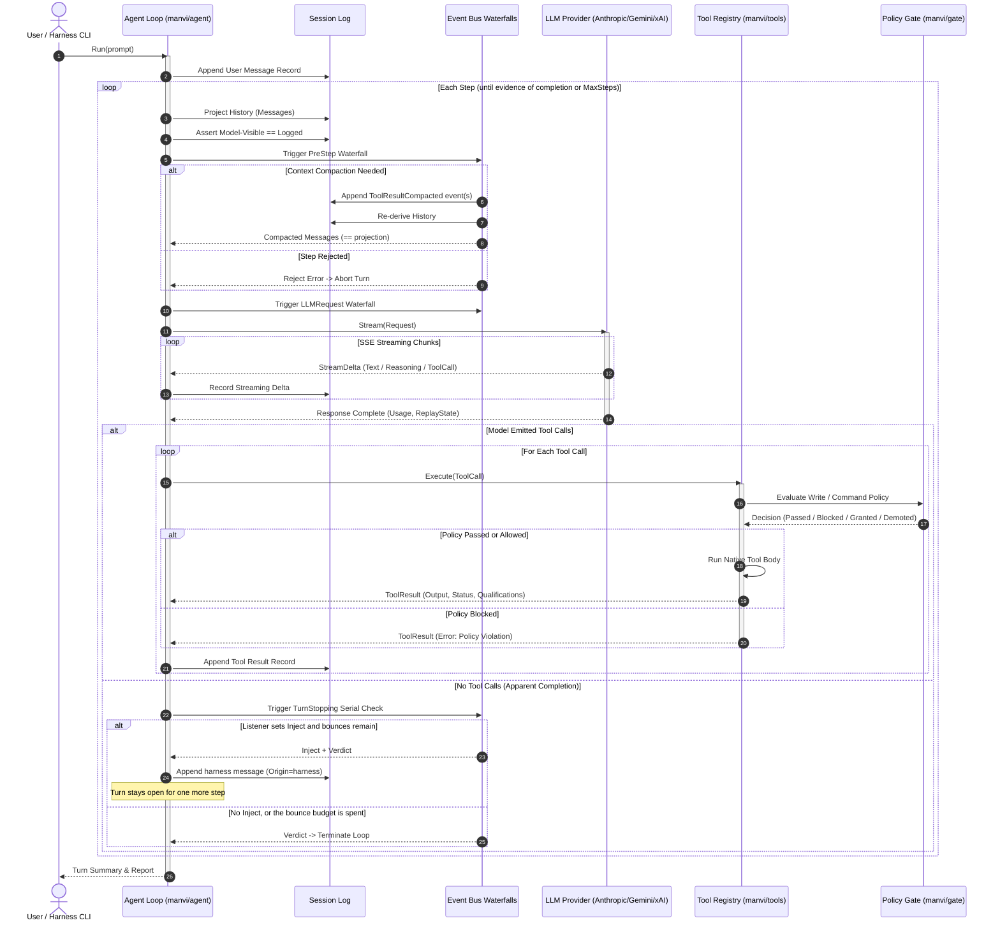
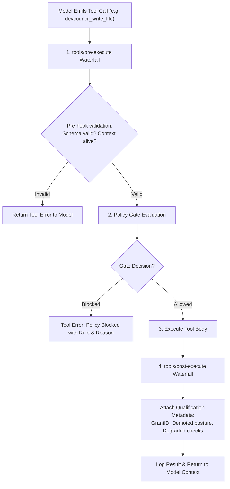
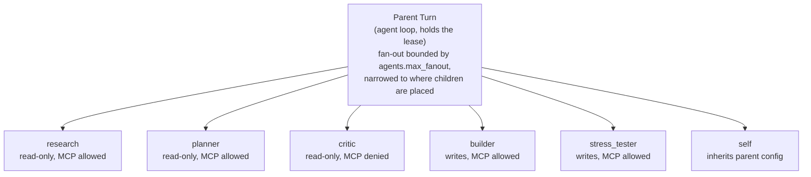
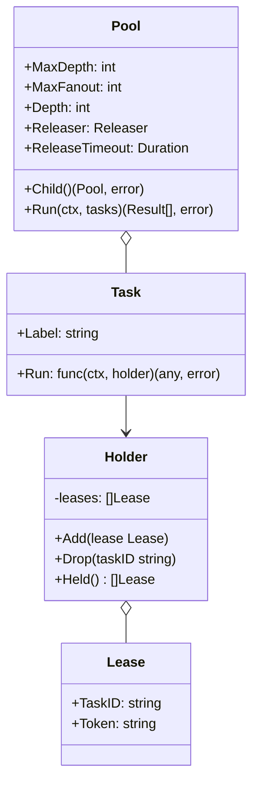
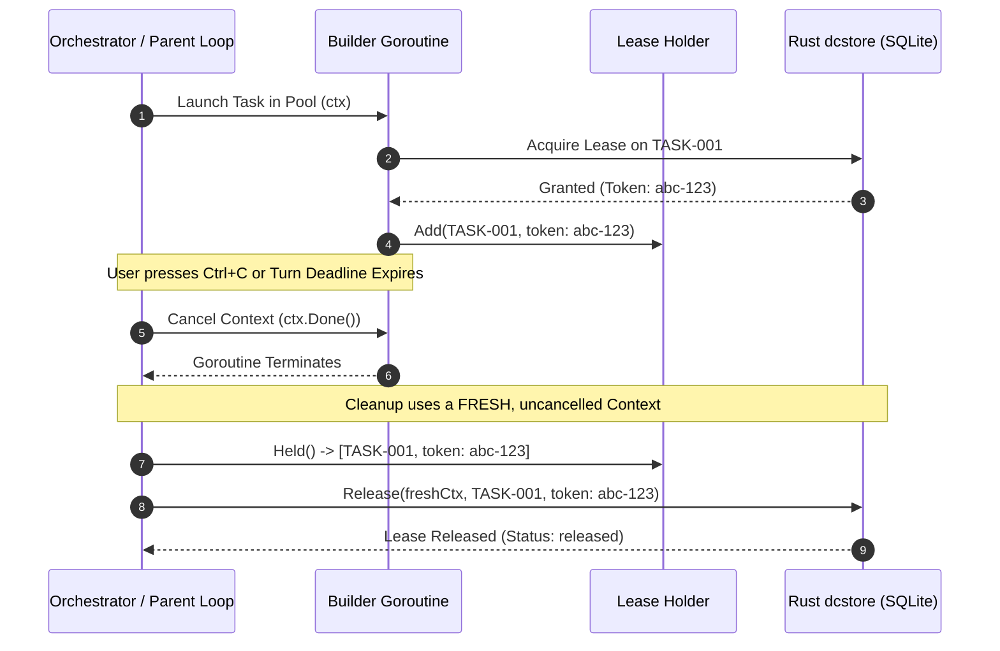
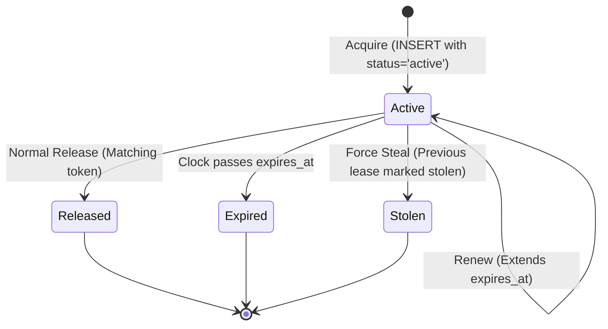

# MANVI Agent & Turn Lifecycle Specification

This document details the turn execution loop, tool execution waterfalls, multi-agent fan-out management, and SQLite task lease concurrency in **MANVI**.

---

## 1. The Turn Execution Lifecycle

The agent execution loop in `manvi/agent` is modeled as an evidence-driven, waterfall-augmented state machine.



### 1a. The terminal checkpoint

`TurnStopping` is where a turn that *looks* finished is judged. It carries what
the turn actually did — whether a mutating tool ran, which paths were changed,
whether the final answer was cut off by the output cap — and a listener answers
by setting a verdict and, when it wants another step, the text the model is to
act on.

Four rules hold it together:

- **A listener supplies the reason, and the loop appends it.** The contract used
  to be "return an error to keep the turn open", and the loop's response was to
  re-ask the model with an unchanged history — a spin, not a gate. A listener
  that wants another step now says what changed.
- **The inject is marked.** It occupies the `user` role on the wire, because a
  natural stop leaves no other model-visible slot, so it is written with
  `Origin: harness`. The transcript, a resumed session and an evidence report all
  render it as the harness speaking rather than as the operator.
- **Bounces are bounded** at `MaxCheckpointBounces` (two) per turn. Past that the
  turn closes and `Outcome.BouncesExhausted` records that the objection was still
  standing — the alternative, riding the 500-step ceiling, finds the same dead end
  an hour later.
- **A listener error closes the turn as degraded.** A check that could not run has
  not asked for anything, and it is never reported as a pass.

The harness registers one listener on both faces: the end-of-turn check in
`manvi/cmd/manvi/sensor.go`. It skips a turn that changed nothing, verifies the
paths a mutating turn actually wrote, and escalates to an adversarial reviewer
only on the evidence that telling the model was not enough — a second failure on
the same turn, or a turn the loop already judges to be going in circles. That is
the same rule `manvi/agent/effort.go` uses to decide when to buy more reasoning,
and it is deliberate: classifying the prompt up front would be a judgement made
on the least information the harness will ever have.

`manvi serve` is out of scope for all of this. The host owns the model call
there, `agent.Loop` does not run, and the checkpoint never fires.

---

## 2. Tool Execution Pipeline & Waterfalls

Every tool call dispatched by the model passes through a three-stage pipeline supporting reversible effects and policy gating:



---

## 3. Multi-Agent Roles & Hierarchy

MANVI ships six subagent roles, registered in `agents.NewRegistry`
(`manvi/agents/definition.go`). The parent turn is not one of them: it dispatches
these by name through `devcouncil_invoke_subagent` / `devcouncil_spawn_subagents`.

The tree is one level deep, and that is structural rather than counted. A child's
registry is built without the whole sub-agent dispatch group, so there is no path
to a grandchild for a counter to bound. Ordering between roles is the parent's
choice, not a pipeline the harness enforces.



| Role Name | Declared Role | Write Tools | MCP Tools | Primary Responsibility |
|---|---|---|---|---|
| `research` | Codebase & Documentation Researcher | No | Yes | Explores and comprehends the codebase, navigates symbols via the dev map, verifies official documentation, identifies structural gaps without mutating. |
| `builder` | Full-Stack Feature Builder | Yes | Yes | Builds on existing core functions without duplication, characterizes baseline behavior with tests first, verifies gap resolution. |
| `critic` | Adversarial Code & Security Reviewer | No | **No** | Audits proposed changes against invariants, edge cases (empty, nil, concurrent, timeout), credential safety, and regression risk. |
| `planner` | Problem Deconstructor & Hypothesis Architect | No | Yes | Deconstructs requirements, formulates verifiable hypotheses, drafts structured plans under `.devcouncil/artifacts/` without code mutations. |
| `stress_tester` | Adversarial Stress Tester & Hardener | Yes | Yes | Attacks solutions with boundary conditions, concurrent races, malformed inputs, and timeouts. |
| `self` | Autonomous Pair Subagent | Yes | Yes | Inherits the parent's configuration, tools, and system prompt for delegated concurrent work. |

Every shipped role declares `Model: "inherit"` — none pins its own model tier, so
a role runs on whatever model the parent session attached. The tool-permission
columns above are the two switches a definition actually carries
(`EnableWriteTools`, `EnableMCPTools`); finer-grained per-tool permissions are
not part of a role definition.

A role's two switches are enforced by building the child's registry without the
denied tools, not by hiding schemas — a registry that still holds a tool
dispatches it by name whether or not the schema was offered. A definition may
also carry an `allowed_tools` allowlist, which only ever removes: it is
intersected with the caller's read-only floor and the structural absence of
sub-agent dispatch, never unioned with them, so naming a tool there cannot hand a
child something those rules took away.

Roles are registered by name, so defining a role reuses a shipped name rather
than shadowing it. Whether a *model* may overwrite one of the six is decided at
the tool boundary — the only layer that knows a call came from a model — and
whether it may define new roles at all is governed by `subagents.dynamic.enabled`.

`manvi probe PROVIDER` is a CLI command that makes one live request to check a
provider's wire contract. It is not a subagent role and cannot be dispatched.

---

## 4. Sub-Agent Fan-Out & Concurrency Pool

The `manvi/agents` package manages concurrent agent trees with explicit bounds and cleanup guarantees.



### Cancellation with Fresh Contexts



> [!IMPORTANT]
> If lease release ran on the cancelled context, the subprocess or database call would abort instantly, abandoning the active lease until its TTL expired and blocking future turns!

---

## 5. SQLite Task Lease Mutex Model

Task mutual exclusion is enforced in SQLite (`.devcouncil/state.sqlite`) using a partial unique index:

```sql
CREATE TABLE task_leases (
    id INTEGER PRIMARY KEY AUTOINCREMENT,
    task_id TEXT NOT NULL,
    owner TEXT NOT NULL,
    token TEXT NOT NULL UNIQUE,
    status TEXT NOT NULL CHECK(status IN ('active', 'released', 'expired', 'stolen')),
    acquired_at TEXT NOT NULL,
    expires_at TEXT NOT NULL,
    renewed_at TEXT,
    released_at TEXT,
    metadata JSON
);

-- THE LOAD-BEARING PARTIAL UNIQUE INDEX:
CREATE UNIQUE INDEX ux_task_leases_active 
ON task_leases (task_id) 
WHERE status = 'active';
```



### Concurrency Guarantees

- **Single Winner**: When 12 threads attempt to acquire `TASK-001` simultaneously, SQLite's transactional partial index forces exactly 1 `INSERT` to succeed; 11 transactions fail with constraint errors.
- **Clock Drift Defense**: Lease expiration is evaluated on read and normalized using UTC ISO-8601 timestamps.
- **Safe Steal**: `dcstore force` atomically marks the previous holder's active lease as `stolen` and writes a new active row in a single immediate transaction.


## Context Compaction

Compaction shortens tool results to keep a turn inside the model's context
window. It does not rewrite the messages travelling through the pre-step
waterfall; it appends `context/tool_result_compacted` events to the session log
and re-derives history from the projection. Three properties follow, and each
one removes a defect:

**The log and the request cannot disagree.** Rewriting messages on the way out
meant the log recorded a request that was never sent, and the
model-visible-means-logged assertion — on by default — failed the first time
compaction touched a multi-line tool result. There is now no exemption in the
invariant check, because none is needed.

**A result is compacted once.** The text it is given is the text it keeps for
the rest of the session. Recomputing compaction every step, with tiers that
escalate as the turn grows, changed the prompt prefix on every step.

**Compaction aims past the threshold, not at it.** A local server's KV cache is
keyed on an unchanged token prefix: editing history invalidates it and costs a
full re-prefill — 120s for a 14.7k-token prompt on a 4-bit 27B, against 1.5s
warm. Landing exactly on the threshold re-triggers on the next tool result and
pays that cost again, so compaction targets 70% of the threshold and becomes a
rare event. Measured over a 12-step turn against a live server, this reduced
full re-prefills from one per step to two per turn.

The original tool result is never deleted. The `tool/result` event that carries
it stays in the log, so an evidence report can still show what the tool actually
returned while the model's history carries the short form.

When everything compactable has been compacted and history still exceeds the
budget, a `context/overflow` event records the shortfall. The turn continues —
the server's own refusal is more informative than a pre-emptive one — but a
request that is going to be truncated is never indistinguishable from one that
fits.

### Token budget

The budget counts the system prompt, the messages, **and the tool schemas**,
which are sent on every request and measure 1,755 real tokens on the shipped
DevCouncil surface. The estimator is a byte heuristic and runs about 25% high
against a real tokenizer, so every response's `prompt_tokens` — which the
adapter already requests — is fed back into a smoothed correction ratio. The
budget converges on what the tokenizer actually counts instead of what the
heuristic guessed.

---

## Related Documentation

- [Documentation Index](README.md)
- [Why MANVI is Different (Comparison)](COMPARISON.md)
- [Technical Architecture Specification](ARCHITECTURE.md)
- [Policy & Safety Engine Specification](POLICY_AND_SAFETY.md)
- [Running Against Local LLMs](LOCAL_LLMS.md)
- [Embedded Stdio Host Plane (`manvi serve`)](SERVE_HOST_PLANE.md)
- [Terminal UI & Event Subsystem](TUI_AND_EVENT_SUBSYSTEM.md)
- [DevCouncil Native Tool Suite](TOOLS_REFERENCE.md)
- [Hardening Ledger & Defects](HARDENING_LEDGER.md)

