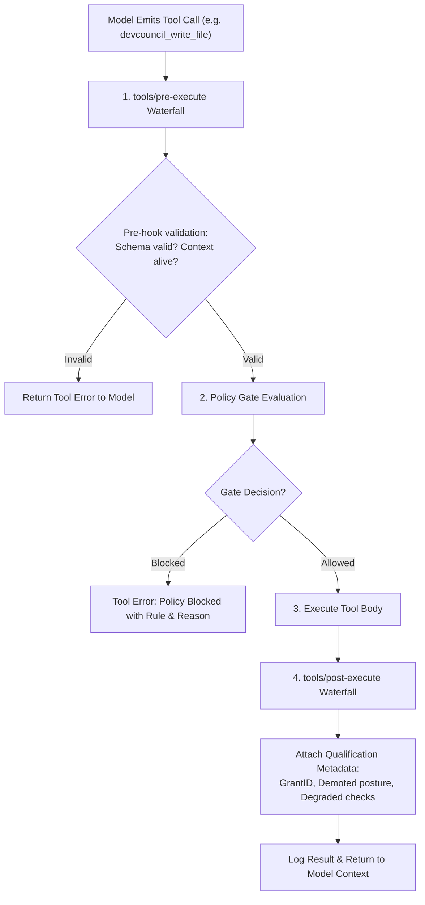
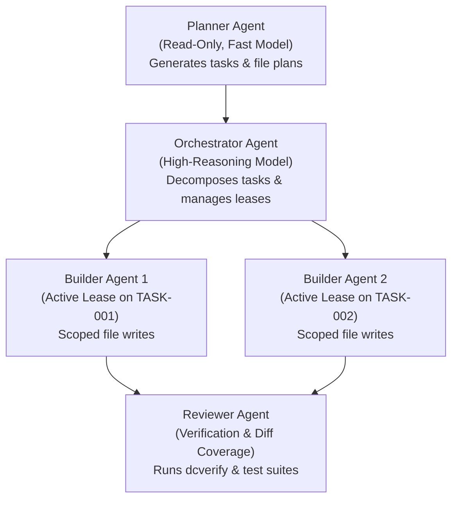
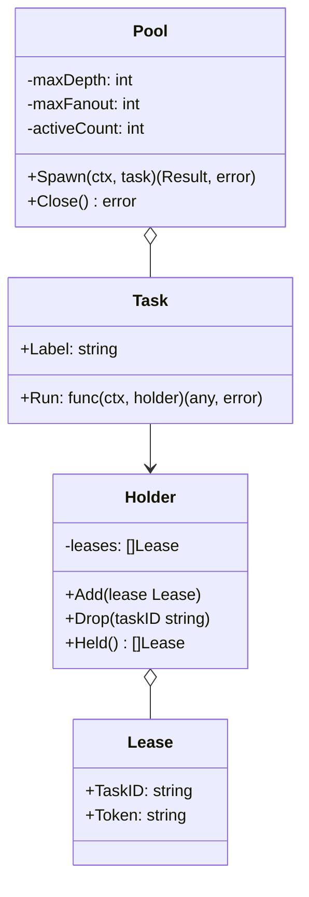
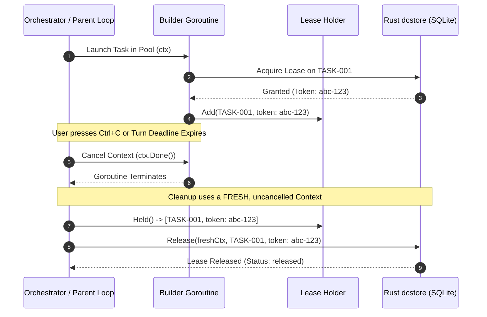
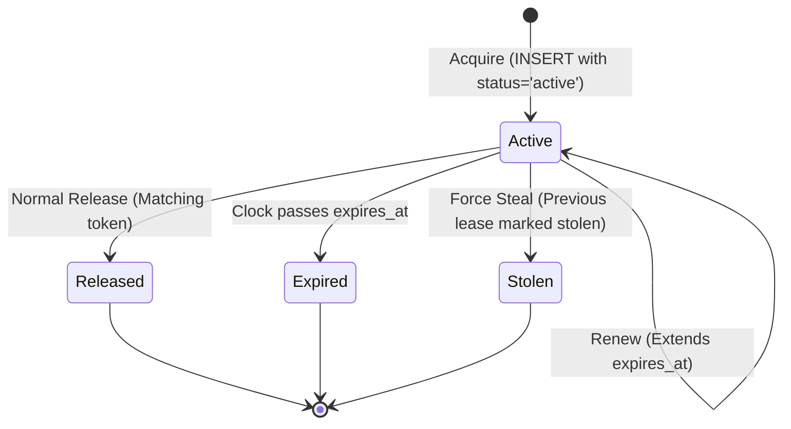

# MANVI Agent & Turn Lifecycle Specification

This document details the turn execution loop, tool execution waterfalls, multi-agent fan-out management, and SQLite task lease concurrency in **MANVI**.

---

## 1. The Turn Execution Lifecycle

The agent execution loop in `manvi/agent` is modeled as an evidence-driven, waterfall-augmented state machine.

```mermaid
sequenceDiagram
    autonumber
    actor User as User / Harness CLI
    participant Loop as Agent Loop (manvi/agent)
    participant Log as Session Log (session.jsonl)
    participant Waterfall as Event Bus Waterfalls
    participant Provider as LLM Provider (Anthropic/Gemini/xAI)
    participant ToolReg as Tool Registry (manvi/tools)
    participant Gate as Policy Gate (manvi/gate)

    User->>Loop: Run(prompt)
    activate Loop
    Loop->>Log: Append User Message Record
    
    loop Each Step (until evidence of completion or MaxSteps)
        Loop->>Log: Project History (Messages)
        Loop->>Log: Assert Model-Visible == Logged
        
        Loop->>Waterfall: Trigger PreStep Waterfall
        alt Context Compaction Needed
            Waterfall->>Log: Append ToolResultCompacted event(s)
            Waterfall->>Log: Re-derive History
            Waterfall-->>Loop: Compacted Messages (== projection)
        else Step Rejected
            Waterfall-->>Loop: Reject Error -> Abort Turn
        end

        Loop->>Waterfall: Trigger LLMRequest Waterfall
        Loop->>Provider: Stream(Request)
        activate Provider
        
        loop SSE Streaming Chunks
            Provider-->>Loop: StreamDelta (Text / Reasoning / ToolCall)
            Loop->>Log: Record Streaming Delta
        end
        Provider-->>Loop: Response Complete (Usage, ReplayState)
        deactivate Provider

        alt Model Emitted Tool Calls
            loop For Each Tool Call
                Loop->>ToolReg: Execute(ToolCall)
                activate ToolReg
                ToolReg->>Gate: Evaluate Write / Command Policy
                Gate-->>ToolReg: Decision (Passed / Blocked / Granted / Demoted)
                
                alt Policy Passed or Allowed
                    ToolReg->>ToolReg: Run Native Tool Body
                    ToolReg-->>Loop: ToolResult (Output, Status, Qualifications)
                else Policy Blocked
                    ToolReg-->>Loop: ToolResult (Error: Policy Violation)
                end
                deactivate ToolReg
                
                Loop->>Log: Append Tool Result Record
            end
        else No Tool Calls (Evidence of Completion)
            Loop->>Waterfall: Trigger TurnStopping Serial Check
            Waterfall-->>Loop: OK -> Terminate Loop
        end
    end
    
    Loop-->>User: Turn Summary & Report
    deactivate Loop
```

---

## 2. Tool Execution Pipeline & Waterfalls

Every tool call dispatched by the model passes through a three-stage pipeline supporting reversible effects and policy gating:



### Reversible Tool Effects

When an agent executes stateful file edits:
- Modifications maintain before/after hashes.
- In-memory backup snapshots allow rollback if a subsequent multi-file edit fails halfway.
- The session log captures diffs, allowing deterministic rewind during debug replay.

---

## 3. Multi-Agent Roles & Hierarchy

MANVI supports specialized agent personas with bounded scopes and permissions:



| Agent Role | Model Tier | Tool Permissions | Primary Responsibility |
|---|---|---|---|
| **Planner** | Fast / Lightweight | Read-only (Search, Map, Read) | Explores codebase, drafts task boundaries, specifies planned file globs. |
| **Orchestrator** | High-Reasoning | Read + Lease Acquisition | Decomposes requirements, checks out tasks in SQLite, assigns tasks to builders. |
| **Builder** | Code-Specialized | Read + Write + Test Exec | Executes task plan, performs edits within declared scope, creates tests. |
| **Reviewer** | High-Reasoning | Read + Verify + Gate Check | Audits diffs, runs `dcverify`, verifies coverage, validates rigor gates. |
| **Probe** | Diagnostic | Network / Wire Check | Probes live provider endpoints to verify wire contracts and token usage. |

---

## 4. Sub-Agent Fan-Out & Concurrency Pool

The `manvi/agents` package manages concurrent agent trees with explicit bounds and cleanup guarantees.



### Cancellation with Fresh Contexts



> [!IMPORTANT]
> If lease release ran on the cancelled context, the subprocess or database call would abort instantly, abandoning the active lease until its TTL expired and blocking future turns!

---

## 5. SQLite Task Lease Mutex Model

Task mutual exclusion is enforced in SQLite (`.devcouncil/state.sqlite`) using a partial unique index:

```sql
CREATE TABLE task_leases (
    id INTEGER PRIMARY KEY AUTOINCREMENT,
    task_id TEXT NOT NULL,
    owner TEXT NOT NULL,
    token TEXT NOT NULL UNIQUE,
    status TEXT NOT NULL CHECK(status IN ('active', 'released', 'expired', 'stolen')),
    acquired_at TEXT NOT NULL,
    expires_at TEXT NOT NULL,
    renewed_at TEXT,
    released_at TEXT,
    metadata JSON
);

-- THE LOAD-BEARING PARTIAL UNIQUE INDEX:
CREATE UNIQUE INDEX ux_task_leases_active 
ON task_leases (task_id) 
WHERE status = 'active';
```



### Concurrency Guarantees

- **Single Winner**: When 12 threads attempt to acquire `TASK-001` simultaneously, SQLite's transactional partial index forces exactly 1 `INSERT` to succeed; 11 transactions fail with constraint errors.
- **Clock Drift Defense**: Lease expiration is evaluated on read and normalized using UTC ISO-8601 timestamps.
- **Safe Steal**: `dcstore force` atomically marks the previous holder's active lease as `stolen` and writes a new active row in a single immediate transaction.


## Context Compaction

Compaction shortens tool results to keep a turn inside the model's context
window. It does not rewrite the messages travelling through the pre-step
waterfall; it appends `context/tool_result_compacted` events to the session log
and re-derives history from the projection. Three properties follow, and each
one removes a defect:

**The log and the request cannot disagree.** Rewriting messages on the way out
meant the log recorded a request that was never sent, and the
model-visible-means-logged assertion — on by default — failed the first time
compaction touched a multi-line tool result. There is now no exemption in the
invariant check, because none is needed.

**A result is compacted once.** The text it is given is the text it keeps for
the rest of the session. Recomputing compaction every step, with tiers that
escalate as the turn grows, changed the prompt prefix on every step.

**Compaction aims past the threshold, not at it.** A local server's KV cache is
keyed on an unchanged token prefix: editing history invalidates it and costs a
full re-prefill — 120s for a 14.7k-token prompt on a 4-bit 27B, against 1.5s
warm. Landing exactly on the threshold re-triggers on the next tool result and
pays that cost again, so compaction targets 70% of the threshold and becomes a
rare event. Measured over a 12-step turn against a live server, this reduced
full re-prefills from one per step to two per turn.

The original tool result is never deleted. The `tool/result` event that carries
it stays in the log, so an evidence report can still show what the tool actually
returned while the model's history carries the short form.

When everything compactable has been compacted and history still exceeds the
budget, a `context/overflow` event records the shortfall. The turn continues —
the server's own refusal is more informative than a pre-emptive one — but a
request that is going to be truncated is never indistinguishable from one that
fits.

### Token budget

The budget counts the system prompt, the messages, **and the tool schemas**,
which are sent on every request and measure 1,755 real tokens on the shipped
DevCouncil surface. The estimator is a byte heuristic and runs about 25% high
against a real tokenizer, so every response's `prompt_tokens` — which the
adapter already requests — is fed back into a smoothed correction ratio. The
budget converges on what the tokenizer actually counts instead of what the
heuristic guessed.

---

## Related Documentation

- [Documentation Index](README.md)
- [Why MANVI is Different (Comparison)](COMPARISON.md)
- [Technical Architecture Specification](ARCHITECTURE.md)
- [Policy & Safety Engine Specification](POLICY_AND_SAFETY.md)
- [Running Against Local LLMs](LOCAL_LLMS.md)
- [Embedded Stdio Host Plane (`manvi serve`)](SERVE_HOST_PLANE.md)
- [Terminal UI & Event Subsystem](TUI_AND_EVENT_SUBSYSTEM.md)
- [DevCouncil Native Tool Suite](TOOLS_REFERENCE.md)
- [Hardening Ledger & Defects](HARDENING_LEDGER.md)

