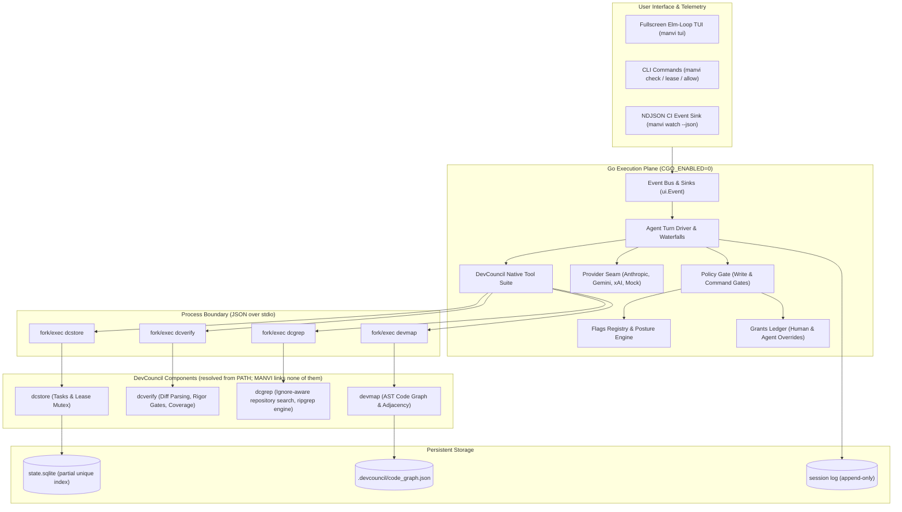
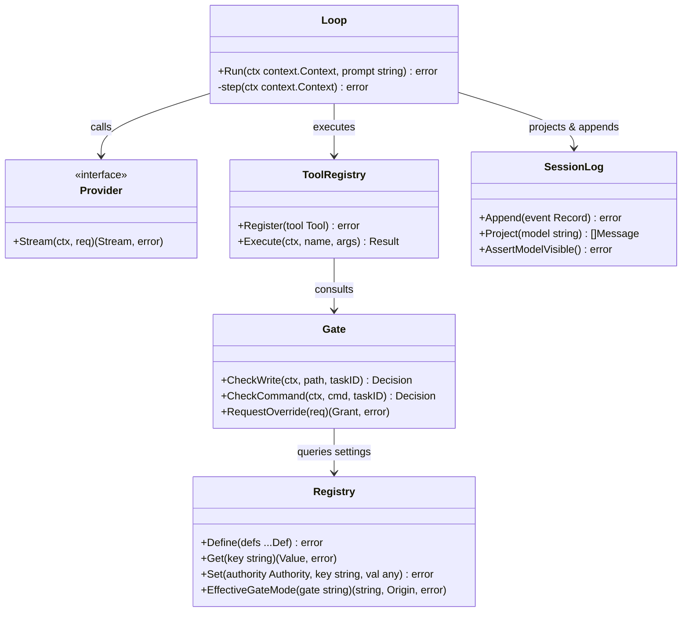
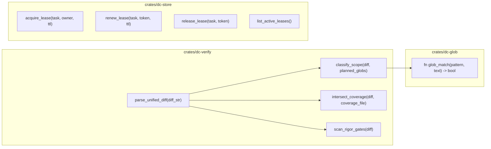
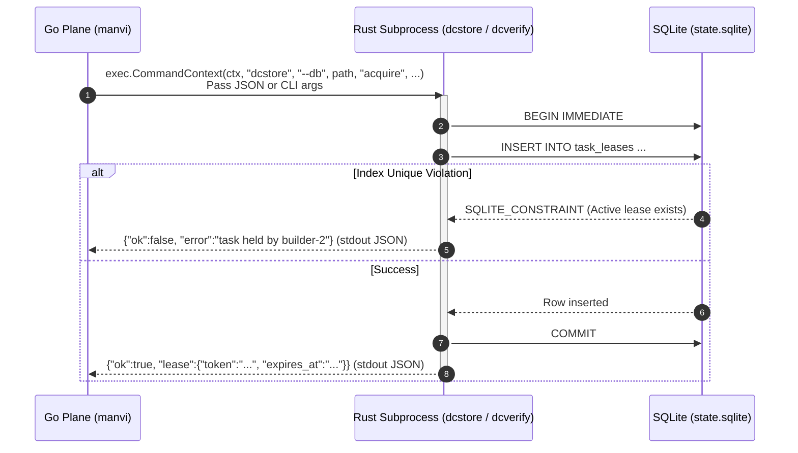

# MANVI Technical Architecture Specification

This document provides a comprehensive architectural reference for **MANVI** (*of Manu*), a self-hosted, dual-plane coding-agent harness built in pure Go and Rust.

---

## 1. High-Level Architectural Vision

**MANVI is the unification layer. DevCouncil is the components.**

DevCouncil owns the components. Four are already Rust and ship as standalone binaries with a JSON-on-stdio contract: the code-intelligence graph (`devmap`), the task and lease store (`dcstore`), the deterministic verifier (`dcverify`), and the repository searcher (`dcgrep`). Each is useful on its own and to anything else that speaks the contract.

**DevCouncil is mid-port.** Its remaining subsystems — the planning council, the deeper verification gates, campaign, knowledge and reporting — are still Python and are being ported to Rust/Go behind the same contract. As each lands, it becomes another binary on the boundary, and MANVI consumes it exactly the way it consumes the four above. Nothing in the harness changes shape when a component crosses over; that is the point of putting the contract at the process boundary. [`COMPONENTS_AND_HARNESS.md`](COMPONENTS_AND_HARNESS.md) is the current component inventory and the checklist a newly ported component has to satisfy.

MANVI is the harness that unifies them into a working coding agent: it drives the turn loop, the provider seam, the policy ladder, the session log and the terminal, and it reaches every component across that one boundary. It is not a rewrite of DevCouncil and does not replace it; it is what turns a set of components into something an operator or another application can run.

**That makes MANVI embeddable.** Because the harness is a single static Go binary (`CGO_ENABLED=0`) whose only external contract is `fork`/`exec` plus line-delimited JSON, it drops into other applications without dragging an interpreter, a shared library, or a package manager behind it. `manvi serve` exposes the whole harness — policy enforcement, capability discovery, token budgeting, completion settling — over NDJSON on stdio, which is what an IDE, an editor extension, or a host process integrates against. See [`SERVE_HOST_PLANE.md`](SERVE_HOST_PLANE.md).

The internal split is then a second, orthogonal decision: two planes divided strictly on **IO-bound concurrency vs CPU-bound determinism**.



### Architectural Axioms

1. **Process Boundary, Not CGO**: Go and Rust communicate strictly over child process boundaries (`fork`/`exec`) exchanging single line-delimited JSON objects over `stdin`/`stdout`. Linking them via `cgo` would sacrifice `CGO_ENABLED=0`, instantaneous cross-compilation, static binary portability, and process isolation.
2. **Mutual Exclusion in Storage, Not Application Code**: Multi-agent task concurrency is guaranteed by SQLite's partial unique index (`ON task_leases (task_id) WHERE status = 'active'`), not by an in-memory lock in Go.
3. **Session Log Invariant**: The history provided to LLMs is *always* projected on demand from the append-only session log, never accumulated in volatile local memory.
4. **Zero Third-Party Runtime Dependencies in Go**: The Go execution plane uses standard library `syscall` termios, pure Unicode width routines, custom damage-diffed terminal painting, and zero external packages.

---

## 2. Dual-Plane Responsibilities

| Responsibility Area | Plane | Implementation | Rationale |
|---|---|---|---|
| **Agent Loop & Turn Driving** | Go | `manvi/agent` | Goroutine concurrency, IO multiplexing, stream cancellation |
| **LLM Provider Seam** | Go | `manvi/llm` | HTTP SSE client, streaming parser, multi-provider normalization |
| **Policy & Overrides** | Go | `manvi/gate`, `manvi/policy` | Fast in-memory evaluation, origin tracking, grant ledger |
| **Terminal UI & Telemetry** | Go | `manvi/ui` | Event multiplexing, raw terminal IO, damage-diffed rendering |
| **Diff & Scope Parsing** | DevCouncil component | `dcverify` | CPU-bound text processing, unified diff parsing, regex matching |
| **Test Coverage Intersection** | DevCouncil component | `dcverify` | Fast line-level coverage bitsets (Go `-coverprofile`, LCOV) |
| **Task & Lease Persistence** | DevCouncil component | `dcstore` | `rusqlite` SQLite binding, ACID transactions, exclusion index |
| **Code Graph & Adjacency** | DevCouncil component | `devmap` | Tree-sitter extraction, resolution, dead-code and impact analysis |
| **Repository Search** | DevCouncil component | `dcgrep` | ripgrep's own `grep-regex`, `grep-searcher` and `ignore` crates; ignore-rule resolution and line-oriented matching |
| **Glob Pattern Matching** | Both sides | `dc-glob` (linked into `dcverify`), `manvi/internal/fnmatch` | The one rule both planes must agree on, so it is implemented twice and pinned by a shared 775-case CPython `fnmatch` parity fixture. `dc-glob` is a *library*, never a process — it has no binary and is not on the boundary diagram. |

---

## 3. The Go Execution Plane



### Component Breakdown

- **`manvi/core/plugin`**: Minimalist service container implementing topological dependency resolution and LIFO shutdown for modular harness extensions.
- **`manvi/core/bus`**: Typed asynchronous and synchronous publish-subscribe event bus.
- **`manvi/flags`**: Typed, origin-tracked configuration catalog (`Default`, `Config`, `Env`, `Override`, `Runtime`) with safety flags and posture resolution.
- **`manvi/gate`**: Unified evaluation point combining policy ladders, active grants, posture demotions, and TUI approval callbacks.
- **`manvi/policy`**: Pure rule definitions for file write and command execution gates.
- **`manvi/grants`**: In-memory and persisted override ledger with expiration and authority scoping.
- **`manvi/llm`**: Normalized interface for Anthropic, Gemini, xAI Grok, and local models with `AssistantProvenance.ReplayState` tracking.
- **`manvi/tools`**: Guarded tool execution pipeline with pre-execution validation and post-execution qualification.
- **`manvi/session`**: Append-only session event store with verification that all model-visible context is persisted. Records who authored each model-visible message, so a verdict the harness handed back is never rendered as the operator's words.
- **`manvi/fetch`**: The only outbound network path. Standard library only; refuses plaintext, unlisted hosts and every private address range, re-checking on each redirect hop and pinning the vetted address into the dialer against DNS rebinding. Off unless an operator sets an allowlist.
- **`manvi/ui`**: Damage-diffed terminal painter, Unicode width calculation, raw mode handling, and Elm-loop TUI.

---

## 4. The Analysis Components (DevCouncil)

These are **DevCouncil components**, not MANVI internals. The diagram below is
the internal structure of the binaries the harness execs; MANVI never calls any
of these functions directly, and never links the crates that contain them. The
crate paths shown are DevCouncil's, mirrored under MANVI's `crates/` so the
harness can be built and tested without a DevCouncil checkout — see
[`COMPONENTS_AND_HARNESS.md`](COMPONENTS_AND_HARNESS.md) §7.




### Crate Structure

1. **`dc-glob`**: Zero-dependency implementation of CPython's `fnmatch` glob semantics, ensuring `*` crosses directory separators and character classes `[a-z]` behave identically in Go and Rust.
2. **`dc-store`**: Direct wrapper around SQLite via `rusqlite`. Manages task metadata, leases, active ownership, and heartbeat extensions.
3. **`dc-verify`**: High-performance unified diff parser and verification engine:
   - Computes added line ranges per file.
   - Cross-references changes against task planned scopes.
   - Detects hard-coded secrets, syntax errors, and stub markers (`TODO`, `unimplemented!`, `panic!`).
   - Intersects added lines with Go `-coverprofile` or LCOV coverage maps.

---

## 5. Process Boundary & IPC Protocol

The interface between Go and Rust avoids CGO by invoking command-line tools with structured JSON stdio.



### IPC Safety Guarantees

- **Process-Group Scoped Deadlines**: Every `exec.CommandContext` isolates the child in a process group and terminates the entire process tree on timeout, preventing orphaned background workers from holding stdout open.
- **Strict Payload Validation**: Go decodes response JSON into strongly typed structs and verifies non-empty identifiers before accepting success.
- **Fail Closed**: Any exit code other than 0 or unparseable output results in a hard failure rather than a silent empty pass.

---

## 6. The Session Log & Invariant Engine

The session log is the immutable ledger of an agent's lifecycle. On disk it is one
checksummed JSON document per generation — `<id>.<generation>.json` under the
sessions directory — not a single appended `.jsonl` stream: a generation is
written whole and linked into place atomically, which is what lets a corrupt
write be refused rather than half-read.


### The Invariant Contract

Before any request is transmitted to an LLM provider, `session.AssertModelVisible(history, log)` verifies:
- Every message in `history` originates from a validated log record.
- No synthetic text or tool response exists in the context window without a corresponding disk record.
- Replay state (`AssistantProvenance.ReplayState`) matches provider-specific cached tokens for deterministic replay.

---

## 7. Restricted-Dependency Design

MANVI restricts external dependencies across both planes, and the restriction is
a gate rather than a habit: `verify.sh` walks `go list -deps ./...` and fails on
any package outside the allowlist below, so a dependency cannot arrive without
the allowlist being edited and reviewed alongside it.

| Plane | Direct dependencies | Rationale |
|---|---|---|
| **Go (`manvi/go.mod`)** | `awnumar/memguard`, `samber/mo`, and `quasilyte/go-ruleguard/dsl` (lint-only) | memguard seals credentials at rest, bringing `memcall`, `x/crypto` and `x/sys`; `mo.Option` gives absence one spelling at the local provider's credential seam; the ruleguard DSL is excluded from every build by its `ruleguard` tag and must never appear in the build graph. Everything else is standard library: direct `syscall` for raw terminal mode, pure Go UTF-8 / ANSI renderers, standard-library HTTP. `CGO_ENABLED=0` still holds — all three are pure Go. |
| **Rust (`crates/Cargo.toml`)** | `rusqlite` (with `bundled`) and ripgrep's engine (`grep-regex`, `grep-searcher`, `ignore`) | Compiles SQLite from source so the store's partial unique index does not depend on the host's libsqlite3 (22 transitive crates), and embeds ripgrep's ignore-rule resolution and regex matching engine for repository search in `dc-grep` (31 transitive crates). `cargo audit` checks all dependencies on every run. `dc-glob` and `dc-verify` have no external dependencies. |

`valyala/fastjson` was measured for this list and refused; see the hardening
ledger for the numbers and the benchmark that was measuring the wrong condition.

---

## 8. Directory & Package Map

```
Dev_Harness/
├── manvi/                     # Go Execution Plane
│   ├── agent/                 # Turn loop and step state machine
│   ├── agents/                # Predefined agent roles & subagent fan-out pool
│   ├── cmd/manvi/             # Main executable CLI subcommands
│   ├── core/
│   │   ├── bus/               # Event bus
│   │   └── plugin/            # Topological plugin container
│   ├── credentials/           # Credential detection & terminal scrubber
│   ├── dc/                    # DevCouncil domain types & IPC client
│   │   ├── dcgrep/            # Search & enumeration IPC client
│   │   ├── devmap/            # Code graph IPC client
│   │   └── store/             # Task lease IPC client
│   ├── devcouncil/            # Native tool implementations & TUI escalation
│   ├── fetch/                 # Bounded https documentation lookup & egress policy
│   ├── flags/                 # Settings catalog, origin tracking & postures
│   ├── gate/                  # Composite policy & override gate
│   ├── grants/                # Human & agent grant ledger
│   ├── internal/
│   │   ├── fnmatch/           # Go fnmatch glob engine
│   │   └── testsupport/       # Test helper fixtures
│   ├── llm/                   # Multi-provider LLM seam & streaming codecs
│   │   ├── anthropic/         # Anthropic Claude adapter
│   │   ├── gemini/            # Google Gemini adapter
│   │   ├── local/             # Zero-config loopback discovery & MLX/Ollama engine
│   │   ├── openaicompat/      # OpenAI-compatible streaming & parser recovery
│   │   ├── xai/               # xAI Grok adapter
│   │   └── transport/         # SSE streaming client
│   ├── policy/                # Pure write gate & command gate ladders
│   ├── prompt/                # System prompts & template renderer
│   ├── repomap/               # Code graph adjacency engine
│   ├── serve/                 # Embedded stdio host plane (NDJSON over stdin/stdout)
│   ├── session/               # Append-only log & invariant checks
│   ├── tools/                 # Tool registry & execution pipeline
│   └── ui/                    # Terminal renderers & full Elm-loop TUI
│       ├── brand/             # Dark-red palette ramp
│       ├── input/             # Raw termios & escape sequence decoder
│       ├── logo/              # 7x7 module mark renderer
│       ├── render/            # Damage-diffed cell painter
│       ├── term/              # Terminal control & raw mode
│       └── tui/               # Elm-style full-screen interactive UI
│
├── crates/                    # Mirror of DevCouncil's components (upstream: DevCouncil)
│   ├── dc-glob/               # Zero-dependency glob engine (library, linked into dc-verify)
│   ├── dc-grep/               # Ignore-aware repository search (ripgrep engine)
│   ├── dc-store/              # SQLite lease mutex & task persistence
│   └── dc-verify/             # Diff parser, rigor gates & coverage mapper
│
├── testdata/                  # Shared cross-language test fixtures
│   ├── fnmatch-parity.tsv     # 775 glob test cases
│   └── command-parity.tsv     # 256 command policy test cases
│
├── docs/                      # Technical Documentation & Strategy Artifacts
├── assets/                    # Static assets (manvi-mark.svg)
└── verify.sh                  # Comprehensive cross-plane verification gate
```

`crates/` holds four members and no more. `devmap` is deliberately absent from
that list: it is a separate tool this repository does not build, resolved at run
time from `PATH` or `MANVI_MAP_BINARY`, and `manvi/dc/devmap` is only the client
that execs it. That is why the client probes capability rather than comparing
versions — every build of it reports the same `devmap 0.1.0` — and why its
absence is not fatal. Without it the neighbour rule answers
`repo_map.unavailable`, and `verify.sh` records repo navigation as a gate that
did not run rather than one that passed.

---

## 9. Related Documentation

- [Documentation Index](README.md)
- [Why MANVI is Different (Comparison)](COMPARISON.md)
- [Policy & Safety Engine Specification](POLICY_AND_SAFETY.md)
- [Agent & Turn Lifecycle Specification](AGENT_AND_TURN_LIFECYCLE.md)
- [Running Against Local LLMs](LOCAL_LLMS.md)
- [Embedded Stdio Host Plane (`manvi serve`)](SERVE_HOST_PLANE.md)
- [Terminal UI & Event Subsystem](TUI_AND_EVENT_SUBSYSTEM.md)
- [CLI & Configuration Reference](CLI_AND_CONFIGURATION.md)
- [DevCouncil Native Tool Suite](TOOLS_REFERENCE.md)
- [Hardening Ledger & Defects](HARDENING_LEDGER.md)
- [Architectural Trade-offs](TRADE_OFFS.md)
- [Verification & Parity Specification](VERIFICATION_AND_PARITY.md)

