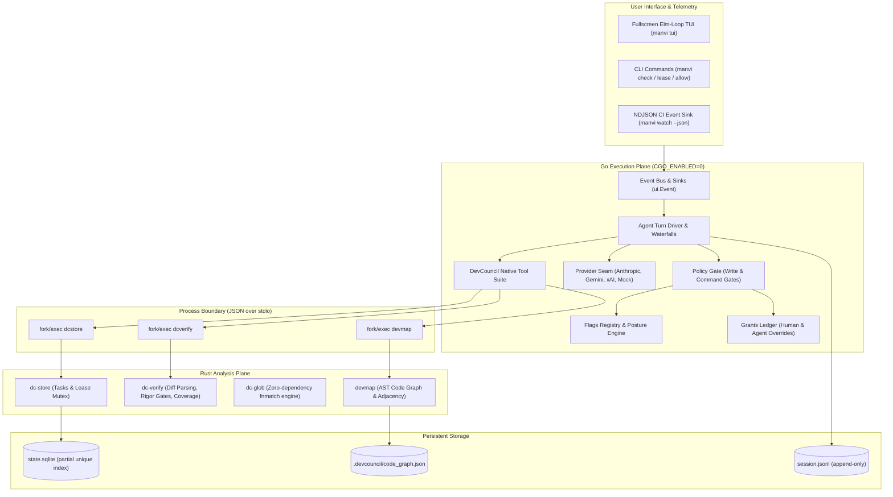
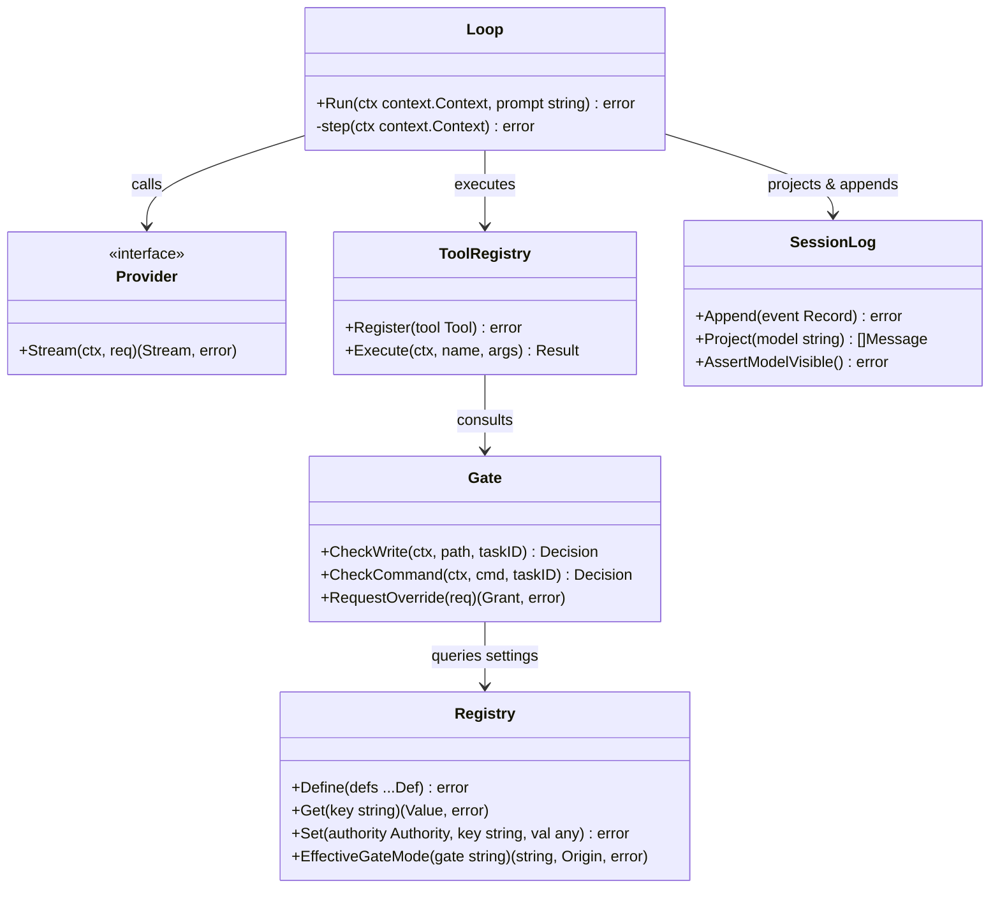
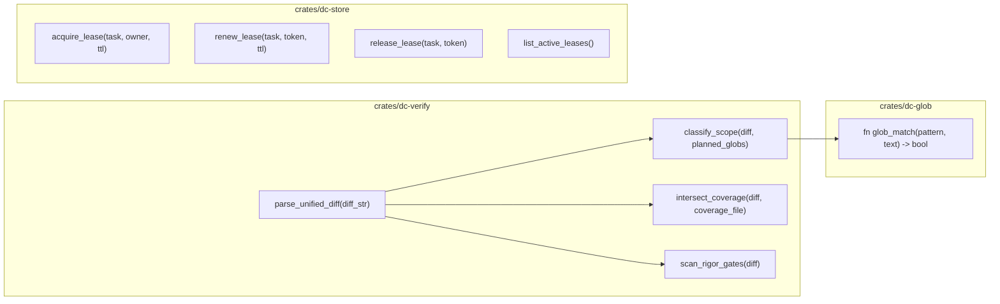
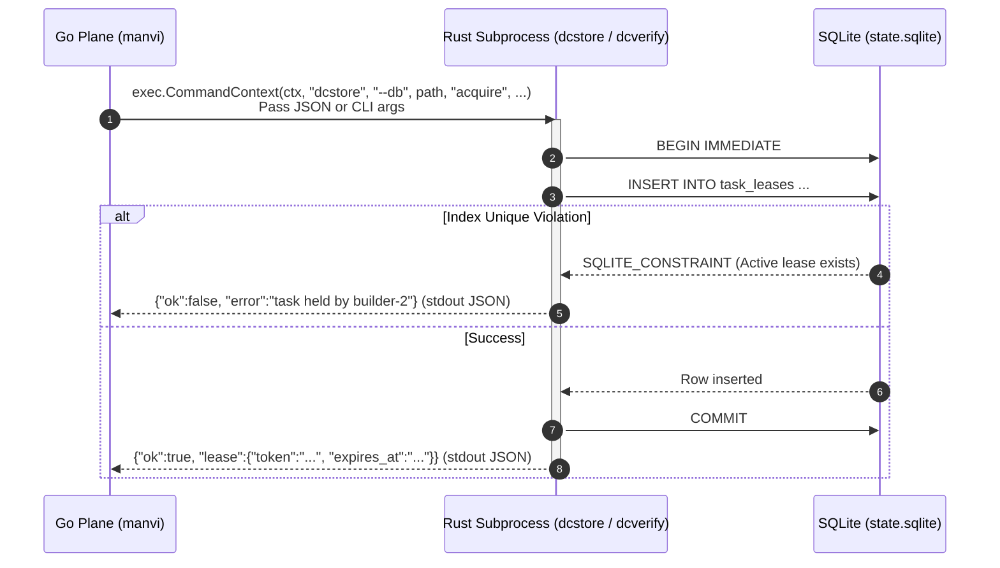
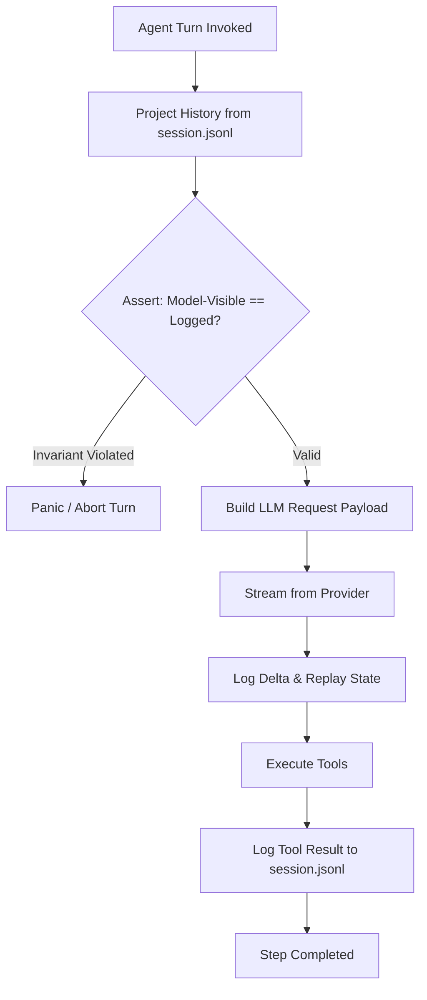

# MANVI Technical Architecture Specification

This document provides a comprehensive architectural reference for **MANVI** (*of Manu*), a self-hosted, dual-plane coding-agent harness built in pure Go and Rust.

---

## 1. High-Level Architectural Vision

MANVI executes DevCouncil's software development tools natively rather than shelling out to external agent scripts or runtime interpreters. It is architected around two planes split strictly on the axis of **IO-bound concurrency vs CPU-bound determinism**:



### Architectural Axioms

1. **Process Boundary, Not CGO**: Go and Rust communicate strictly over child process boundaries (`fork`/`exec`) exchanging single line-delimited JSON objects over `stdin`/`stdout`. Linking them via `cgo` would sacrifice `CGO_ENABLED=0`, instantaneous cross-compilation, static binary portability, and process isolation.
2. **Mutual Exclusion in Storage, Not Application Code**: Multi-agent task concurrency is guaranteed by SQLite's partial unique index (`ON task_leases (task_id) WHERE status = 'active'`), not by an in-memory lock in Go.
3. **Session Log Invariant**: The history provided to LLMs is *always* projected on demand from the append-only `session.jsonl` log, never accumulated in volatile local memory.
4. **Zero Third-Party Runtime Dependencies in Go**: The Go execution plane uses standard library `syscall` termios, pure Unicode width routines, custom damage-diffed terminal painting, and zero external packages.

---

## 2. Dual-Plane Responsibilities

| Responsibility Area | Plane | Implementation | Rationale |
|---|---|---|---|
| **Agent Loop & Turn Driving** | Go | `manvi/agent` | Goroutine concurrency, IO multiplexing, stream cancellation |
| **LLM Provider Seam** | Go | `manvi/llm` | HTTP SSE client, streaming parser, multi-provider normalization |
| **Policy & Overrides** | Go | `manvi/gate`, `manvi/policy` | Fast in-memory evaluation, origin tracking, grant ledger |
| **Terminal UI & Telemetry** | Go | `manvi/ui` | Event multiplexing, raw terminal IO, damage-diffed rendering |
| **Diff & Scope Parsing** | Rust | `crates/dc-verify` | CPU-bound text processing, unified diff parsing, regex matching |
| **Test Coverage Intersection** | Rust | `crates/dc-verify` | Fast line-level coverage bitsets (Go `-coverprofile`, LCOV) |
| **Task & Lease Persistence** | Rust | `crates/dc-store` | `rusqlite` SQLite binding, ACID transactions, exclusion index |
| **Glob Pattern Matching** | Rust & Go | `crates/dc-glob`, `manvi/internal/fnmatch` | Shared 775-case CPython `fnmatch` parity fixture |

---

## 3. The Go Execution Plane



### Component Breakdown

- **`manvi/core/plugin`**: Minimalist service container implementing topological dependency resolution and LIFO shutdown for modular harness extensions.
- **`manvi/core/bus`**: Typed asynchronous and synchronous publish-subscribe event bus.
- **`manvi/flags`**: Typed, origin-tracked configuration catalog (`Default`, `Config`, `Env`, `Override`, `Runtime`) with safety flags and posture resolution.
- **`manvi/gate`**: Unified evaluation point combining policy ladders, active grants, posture demotions, and TUI approval callbacks.
- **`manvi/policy`**: Pure rule definitions for file write and command execution gates.
- **`manvi/grants`**: In-memory and persisted override ledger with expiration and authority scoping.
- **`manvi/llm`**: Normalized interface for Anthropic, Gemini, xAI Grok, and local models with `AssistantProvenance.ReplayState` tracking.
- **`manvi/tools`**: Guarded tool execution pipeline with pre-execution validation and post-execution qualification.
- **`manvi/session`**: Append-only session event store with verification that all model-visible context is persisted.
- **`manvi/ui`**: Damage-diffed terminal painter, Unicode width calculation, raw mode handling, and Elm-loop TUI.

---

## 4. The Rust Analysis Plane



### Crate Structure

1. **`dc-glob`**: Zero-dependency implementation of CPython's `fnmatch` glob semantics, ensuring `*` crosses directory separators and character classes `[a-z]` behave identically in Go and Rust.
2. **`dc-store`**: Direct wrapper around SQLite via `rusqlite`. Manages task metadata, leases, active ownership, and heartbeat extensions.
3. **`dc-verify`**: High-performance unified diff parser and verification engine:
   - Computes added line ranges per file.
   - Cross-references changes against task planned scopes.
   - Detects hard-coded secrets, syntax errors, and stub markers (`TODO`, `unimplemented!`, `panic!`).
   - Intersects added lines with Go `-coverprofile` or LCOV coverage maps.

---

## 5. Process Boundary & IPC Protocol

The interface between Go and Rust avoids CGO by invoking command-line tools with structured JSON stdio.



### IPC Safety Guarantees

- **Process-Group Scoped Deadlines**: Every `exec.CommandContext` isolates the child in a process group and terminates the entire process tree on timeout, preventing orphaned background workers from holding stdout open.
- **Strict Payload Validation**: Go decodes response JSON into strongly typed structs and verifies non-empty identifiers before accepting success.
- **Fail Closed**: Any exit code other than 0 or unparseable output results in a hard failure rather than a silent empty pass.

---

## 6. The Session Log & Invariant Engine

The session log (`session.jsonl`) is the immutable ledger of an agent's lifecycle.



### The Invariant Contract

Before any request is transmitted to an LLM provider, `session.AssertModelVisible(history, log)` verifies:
- Every message in `history` originates from a validated log record.
- No synthetic text or tool response exists in the context window without a corresponding disk record.
- Replay state (`AssistantProvenance.ReplayState`) matches provider-specific cached tokens for deterministic replay.

---

## 7. Zero-Dependency Design

MANVI strictly restricts external dependencies across both Go and Rust:

| Plane | Dependencies | Rationale |
|---|---|---|
| **Go (`manvi/go.mod`)** | *Zero external dependencies* (`empty`) | Direct `syscall` for raw terminal mode; pure Go UTF-8 / ANSI renderers; standard library HTTP & crypto. Guarantees pure static compilation (`CGO_ENABLED=0`) and zero supply-chain risk. |
| **Rust (`crates/Cargo.toml`)** | `rusqlite`, `serde`, `serde_json`, `chrono` | Embedded SQLite engine with static linking; zero web or heavy framework crates. |

---

## 8. Directory & Package Map

```
Dev_Harness/
├── manvi/                     # Go Execution Plane
│   ├── agent/                 # Turn loop and step state machine
│   ├── agents/                # Predefined agent roles & subagent fan-out pool
│   ├── cmd/manvi/             # Main executable CLI subcommands
│   ├── core/
│   │   ├── bus/               # Event bus
│   │   └── plugin/            # Topological plugin container
│   ├── credentials/           # Credential detection & terminal scrubber
│   ├── dc/                    # DevCouncil domain types & IPC client
│   │   ├── devmap/            # Code graph IPC client
│   │   └── store/             # Task lease IPC client
│   ├── devcouncil/            # Native tool implementations & TUI escalation
│   ├── flags/                 # Settings catalog, origin tracking & postures
│   ├── gate/                  # Composite policy & override gate
│   ├── grants/                # Human & agent grant ledger
│   ├── internal/
│   │   ├── fnmatch/           # Go fnmatch glob engine
│   │   └── testsupport/       # Test helper fixtures
│   ├── llm/                   # Multi-provider LLM seam & streaming codecs
│   │   ├── anthropic/         # Anthropic Claude adapter
│   │   ├── gemini/            # Google Gemini adapter
│   │   ├── local/             # Zero-config loopback discovery & MLX/Ollama engine
│   │   ├── openaicompat/      # OpenAI-compatible streaming & parser recovery
│   │   ├── xai/               # xAI Grok adapter
│   │   └── transport/         # SSE streaming client
│   ├── policy/                # Pure write gate & command gate ladders
│   ├── prompt/                # System prompts & template renderer
│   ├── repomap/               # Code graph adjacency engine
│   ├── serve/                 # Embedded stdio host plane (NDJSON over stdin/stdout)
│   ├── session/               # Append-only log & invariant checks
│   ├── tools/                 # Tool registry & execution pipeline
│   └── ui/                    # Terminal renderers & full Elm-loop TUI
│       ├── brand/             # Dark-red palette ramp
│       ├── input/             # Raw termios & escape sequence decoder
│       ├── logo/              # 7x7 module mark renderer
│       ├── render/            # Damage-diffed cell painter
│       ├── term/              # Terminal control & raw mode
│       └── tui/               # Elm-style full-screen interactive UI
│
├── crates/                    # Rust Analysis Plane
│   ├── dc-glob/               # Zero-dependency glob engine
│   ├── dc-store/              # SQLite lease mutex & task persistence
│   └── dc-verify/             # Diff parser, rigor gates & coverage mapper
│
├── testdata/                  # Shared cross-language test fixtures
│   ├── fnmatch-parity.tsv     # 775 glob test cases
│   └── command-parity.tsv     # 256 command policy test cases
│
├── docs/                      # Technical Documentation & Strategy Artifacts
├── assets/                    # Static assets (manvi-mark.svg)
└── verify.sh                  # Comprehensive cross-plane verification gate
```

---

## 9. Related Documentation

- [Documentation Index](README.md)
- [Why MANVI is Different (Comparison)](COMPARISON.md)
- [Policy & Safety Engine Specification](POLICY_AND_SAFETY.md)
- [Agent & Turn Lifecycle Specification](AGENT_AND_TURN_LIFECYCLE.md)
- [Running Against Local LLMs](LOCAL_LLMS.md)
- [Embedded Stdio Host Plane (`manvi serve`)](SERVE_HOST_PLANE.md)
- [Terminal UI & Event Subsystem](TUI_AND_EVENT_SUBSYSTEM.md)
- [CLI & Configuration Reference](CLI_AND_CONFIGURATION.md)
- [DevCouncil Native Tool Suite](TOOLS_REFERENCE.md)
- [Hardening Ledger & Defects](HARDENING_LEDGER.md)
- [Architectural Trade-offs](TRADE_OFFS.md)
- [Verification & Parity Specification](VERIFICATION_AND_PARITY.md)

