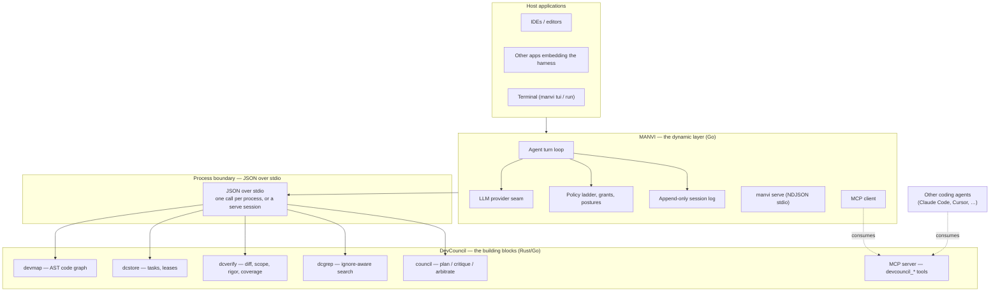

# Components and Harness: how MANVI and DevCouncil relate

Two repositories, two jobs, one boundary between them.

**DevCouncil is the component layer.** Every capability it has is being ported to
Rust/Go, and each lands as a component with a process contract: a binary that
answers one JSON object on stdout, or an MCP server exposing tools. When the port
is complete DevCouncil is a set of building blocks usable by *any* coding agent —
Claude Code, Cursor, Codex, or MANVI — not an application anyone runs end to end.

**MANVI is the dynamic layer.** It is the harness that unifies those components
into a working agent: the turn loop, the LLM provider seam, the policy ladder,
the session log, the TUI, and `manvi serve` for embedding into other
applications. It supplies what a component cannot — judgement, conversation,
model calls, and the decision about *when* to invoke which block.



The direction of dependency is one-way and must stay that way: **the harness
knows about the components; no component knows about the harness.** A component
that needed MANVI to run would stop being a building block.

---

## 1. The division

| | DevCouncil | MANVI |
|---|---|---|
| **Is** | A set of components, each answering one question well | The harness that unifies them into a working agent |
| **Ships** | Standalone binaries, one contract each | One static Go binary, plus `manvi serve` |
| **Owns** | Code intelligence, task/lease state, verification, search — and the planning council as it lands | Turn loop, provider seam, policy ladder, grants, session log, TUI, tool suite |
| **Consumed by** | MANVI, and anything else that speaks JSON on stdio | IDEs, editors, host applications, CI |
| **Depends on** | Nothing in MANVI | Every component, at the process boundary only |

That one-way dependency is what keeps the components reusable: a component that
had to be told about the harness would be a harness feature wearing a
component's name.

---

## 2. The contract a component satisfies

Every DevCouncil component, current or future, meets all of these. They are what
make a component consumable by an agent that is not MANVI.

1. **A process, not a library.** JSON on stdio — one call per process, or a
   `serve` session answering many over one, as `dcstore` does — or an MCP
   server. Never a linked library: linking would forfeit `CGO_ENABLED=0`,
   static binaries, cross-compilation and process isolation, and would make the
   component's language the consumer's problem.
2. **Every outcome is JSON on stdout, including failures.** A caller never parses
   prose or infers from an exit code alone. The exit code is a coarse duplicate.
3. **A contended or negative result is a normal answer, not an error.** `dcstore
   acquire` on a held task exits 0 with `{"ok":false,"code":"lease_held_by_other"}`,
   because contention is expected when two builders run, and a caller forced to
   distinguish "busy" from "broken" by reading stderr will eventually get it wrong.
4. **A check that could not run never reports what a check that ran and passed
   reports.** The cardinal rule. A malformed diff is an error, never an empty
   finding list; an unbuilt index is unavailable, never a confident zero.
5. **An identity a caller can assert.** `health` names the component and its
   schema version, so a caller can tell it is talking to the real thing and not
   to some other program that prints JSON.
6. **Bounded.** Every call has a timeout, every payload a ceiling, every
   subprocess its own process group so a cancelled turn does not leak children.

Points 3–5 are why these are components rather than scripts. They are what let a
consumer be written once against the contract instead of against a build.

---

## 3. Why MANVI is embeddable, and what that costs the design

MANVI's reason to exist is that a set of good components is not a thing you can
run. Somebody has to drive a turn, decide whether a write is allowed, keep the
model's view of history honest, and hand results back. That is the harness, and
because it is a single static Go binary (`CGO_ENABLED=0`) whose only external
contract is `fork`/`exec` plus line-delimited JSON, it embeds into other
applications without dragging an interpreter, a shared library, or a package
manager behind it.

`manvi serve` is the surface for that: policy enforcement, capability discovery,
token budget preparation and completion settling, over NDJSON on stdio. See
[`SERVE_HOST_PLANE.md`](SERVE_HOST_PLANE.md).

The cost is a rule that has to hold everywhere: **MANVI links no component.**
Not by `cgo`, not by vendoring a crate, not by importing a Python module. The
moment one component is linked, the harness stops being a static binary, stops
cross-compiling instantly, and starts carrying that component's dependency tree
into every application that embeds it. The boundary is what makes the embedding
claim true, so it is not negotiable for convenience.

---

## 4. How the harness consumes them

**Verified** (`cmd/manvi/toolbinary.go`): MANVI resolves each component as an
executable and links none of them. Resolution is explicit-beats-PATH-beats-local:

1. an environment variable, because an operator who named a path meant it;
2. `PATH`, which is the installed case;
3. a build in the local `crates/target`, so a compiled-but-not-installed artifact
   is found rather than reported missing.

| Component | Env override | Go client |
|---|---|---|
| `devmap` | `MANVI_MAP_BINARY` | `manvi/dc/devmap` |
| `dcstore` | `MANVI_STORE_BINARY` | `manvi/dc/store` |
| `dcverify` | `MANVI_VERIFY_BINARY` | — (invoked from `devcouncil/verify.go`) |
| `dcgrep` | `MANVI_GREP_BINARY` | `manvi/dc/dcgrep` |
| Optional inspect pin | `MANVI_DEVCOUNCIL_BINARY` | `manvi/devcouncil/devbridge.go` (never PATH `dev`) |

The Go clients transport answers; they do not compute them and must never cache
one. Everything deciding whether work may proceed — mutual exclusion, expiry,
ownership — lives in the component, where the schema's partial unique index
enforces it. A cached lease is a lease that has already expired somewhere else.

**A missing component degrades visibly, never silently.** Without `devmap` the
neighbour rule reports `repo_map.unavailable` and `verify.sh` records repository
navigation as a gate that *did not run*, rather than one that passed.

### The inspect bridge is pinned, and it is read-only

`devcouncil/devbridge.go` used to shell out to DevCouncil's Python `dev` CLI
for project-level status/gaps/check. That package is deleted. The Go
`devcouncil` binary still exists, but those subcommands are not on it (`mcp`,
`integrate`, `skills`, `verify`, `map`). Native tools own the live views:
`devcouncil_get_gaps`, `devcouncil_verify_task`, `manvi map`.

The handler therefore requires `MANVI_DEVCOUNCIL_BINARY`. An unpinned call is
unavailable and names the native replacements — it does **not** LookPath
`dev` or `devcouncil`, because `dev` is a common unrelated name and the Go
binary would be invoked with argv it rejects. It still does not fall back to
reading `state.sqlite` itself.

---


### The resolution ladder

One rule, identical for every component, implemented in
`manvi/cmd/manvi/toolbinary.go`:

1. `MANVI_<NAME>_BINARY`, if set. An explicit path always wins.
2. `PATH`. This is the normal case for an installed DevCouncil.
3. A sibling cargo build directory, release before debug. A development
   convenience, not the intended deployment.
4. The bare name, so the failure is a clear `exec` error rather than a silent
   skip.

```bash
# Point the harness at a specific build of a component.
MANVI_MAP_BINARY=/path/to/DevCouncil/rust-port/target/release/devmap manvi doctor
```

The environment variables are `MANVI_MAP_BINARY`, `MANVI_STORE_BINARY`,
`MANVI_VERIFY_BINARY` and `MANVI_GREP_BINARY`.

`manvi doctor` prints which binary each one resolved to and whether it answered,
so "which component am I actually running" is never a guess. A real run, showing
three components resolved from three different rungs of the ladder:

```
  verifier        /Users/…/.local/bin/dcverify
                  reachable — secret_scan, stub_detection, diff_coverage will run
  searcher        /Users/…/crates/target/debug/dcgrep
                  reachable — devcouncil_grep will search, honouring ignore rules
  store           /Users/…/.local/bin/dcstore -> …/.devcouncil/state.sqlite
                  UNAVAILABLE: … did not report its lease exclusion index as
                  "verified" — without the partial unique index on task_id, two
                  builders racing for one task both win
                  lease checks cannot run; writes that need one will be refused
  devmap          index holds no symbols — run `manvi map build`
                  no …/code_graph.json — the scope rung will record repo_map.unavailable
```

Two things worth reading off that output. The verifier came from an installed
component and the searcher from a local build, which is the ladder working as
intended. And the store is an **installed component older than its contract** —
it predates the exclusion-index assertion, so it cannot make the claim the
harness requires. The harness does not shrug and continue: it refuses the writes
that would need a lease. That is the version-skew hazard of §10, caught by the
component's own health check rather than by a corrupted run.

### A missing component degrades loudly, and never silently passes

This is the rule the whole arrangement rests on. When a component cannot be
reached, the gate that needed it reports **`degraded`** — a distinct outcome from
`passed`, rendered differently, and never collapsed into it. `verify.sh` records
such a gate as one that *did not run*, not one that ran and was clean.

Concretely: without `devmap`, the neighbour rule reports `repo_map.unavailable`
and repository navigation is recorded as an unrun gate. Without `dcverify`,
`secret_scan`, `stub_detection` and `diff_coverage` report as degraded rather
than as clean. A check that could not run must never report what a check that
ran and passed reports.

---

## 5. Component inventory

**Ported (Rust/Go), verified building and tested in DevCouncil:**

| Component | Home | Answers |
|---|---|---|
| `devmap` | `rust-port/` (49,675 lines) | What does this code mean — AST graph, callers, impact, dead code |
| `dcstore` | `rust/dc-store` | Which task, held by whom, until when |
| `dcverify` | `rust/dc-verify` | Does this diff match its scope, and was it exercised |
| `dcgrep` | `rust/dc-grep` | What is in this repository (ripgrep's engine, linked) |
| `dc-glob` | `rust/dc-glob` | CPython `fnmatch` semantics — a library, not a binary; the one exception, shared by source between the components |

**Not yet ported — still Python in DevCouncil.** The full inventory, sizes and
sequencing are in [`DEVCOUNCIL_PORT_ROADMAP.md`](DEVCOUNCIL_PORT_ROADMAP.md).
The three that matter most: the MCP server surface (29 `devcouncil_*` handlers —
this is literally what "MCP layer for coding agents" means), the council
(plan → critique → rebuttal → arbitrate), and verification.

---


`dc-glob` is deliberately absent: it is a *library* linked into `dcverify`, has
no binary, and never appears on the boundary. Its Go counterpart is
`manvi/internal/fnmatch`, and the two are pinned to each other by a shared
775-case CPython `fnmatch` parity fixture — the one rule both sides must agree
on, so it is implemented twice on purpose and checked against a third party.

**Not yet ported — still Python in DevCouncil.** Roughly 50k lines, of which the
load-bearing pieces for the harness are the planning council (`planning/`,
`council/`), the deeper verification gates (`verification/`), and the
integrations layer (`integrations/`). Until a subsystem is ported and has a
contract, MANVI does not reach it at all — there is deliberately no Python
fallback path in the harness, because a fallback is what lets a broken primary
path go unnoticed.

**In flight.** The task model now carries `requirement_ids` and
`acceptance_criterion_ids` across the boundary, and `dc.Requirement` /
`dc.AcceptanceCriterion` mirror DevCouncil's model field for field. That is the
substrate the council port needs; the council itself has not moved.

---

## 6. Which language each component belongs in

**The contract in §2 is what makes this a real question.** Every component is a
process exchanging JSON on stdio, so nothing links and no consumer knows or cares
what a component is written in. Language is therefore a **per-component decision
with no coupling cost** — chosen on the component's own merits, never for
uniformity. Two toolchains are already paid for; a third component in the wrong
one costs more than the split does.

### The decision rule

Ask in order. The first *yes* decides it.

1. **Does it parse untrusted or complex input at volume?** → **Rust.** Source
   files, diffs, coverage profiles. A parser is where a memory bug becomes a
   security bug and where throughput actually matters.
2. **Does it hold a large structure in memory where per-item cost multiplies?**
   → **Rust.** Graphs, indices, bitsets. Go's GC and interface boxing are a real
   cost at hundreds of thousands of nodes; deterministic memory is worth more
   than it looks.
3. **Would writing it here duplicate an engine that already exists in Rust?**
   → **Rust.** Reimplementing ripgrep's ignore resolution or tree-sitter's
   grammars in Go means keeping a second engine in step with the first, forever.
   This is the reason `dc-grep` links ripgrep's crates instead of shelling out to
   `rg`.
4. **Otherwise** → **Go.** IO-bound work, process orchestration, RPC protocols,
   templating, reporting, model calls, anything with a concurrency story.

**Tiebreaker: build and iteration cost.** A full Rust build with tree-sitter
grammars takes minutes; the Go module builds in seconds. A component that changes
weekly and does no heavy lifting belongs in Go even when Rust would work.

**Hard constraint on the Go side: `CGO_ENABLED=0`.** Verified in `verify.sh` —
cgo is enabled only for the race detector, never for a shipped build. It is what
buys the static binary and instant cross-compilation. A Go component needing
SQLite would therefore need a pure-Go driver, which is a large third-party
dependency in a module that today has **zero**. That pushes anything touching the
store to Rust, on dependency grounds rather than speed.

### Already ported — was the choice right?

| Component | Language | Verdict |
|---|---|---|
| `devmap` | **Rust** | **Vital, and measured.** 12,821 files → 116,418 symbols and 853,421 edges in 70 s at 3.00 GiB peak, with memory linear in edges at ~410 B/edge (`rust-port/STATUS.md`, SC29). Rules 1, 2 and 3 all fire: it parses arbitrary source through 32 tree-sitter grammars, holds the whole graph, and the grammars are Rust. This is the clearest Rust case in the system. |
| `dcgrep` | **Rust** | **Effectively forced** by rule 3. The value *is* ripgrep's `grep-regex` / `grep-searcher` / `ignore` crates. A Go rewrite would be a second search engine to keep in step. |
| `dcverify` | **Rust** | **Right, by rule 1** — it parses diffs and coverage profiles, both untrusted, both adversarial. Note the subsystem it comes from does not port wholly; see the split below. |
| `dcstore` | **Rust** | **Right, for the dependency reason rather than the speed one.** It is IO-bound, so rules 1–3 do not fire on their own. What decides it is `CGO_ENABLED=0`: `rusqlite` bundled compiles SQLite into the binary and keeps the store independent of the host's `libsqlite3`. Being honest about *why* matters — quoting speed here would set a bad precedent for the next component. |
| `dc-glob` | **Both, deliberately** | Rust `rust/dc-glob` **and** Go `manvi/internal/fnmatch`, held together by a shared 775-case CPython parity fixture. The right answer for a small, pure, hot-path function both planes need: duplication is cheaper than a process call, and the fixture is what makes it safe. |

### Not yet ported — the recommendation

Confidence is **high** where the rule fires cleanly, **medium** where judgement is
doing the work.

| Subsystem | Python LOC | Language | Why | Confidence |
|---|---|---|---|---|
| `integrations` (MCP server) | 11,284 | **Go** | Rule 4, decisively. JSON-RPC over stdio with 29 handlers and concurrent tool calls is goroutine work; there is no CPU-bound step anywhere in it. Rust would buy nothing and cost an async runtime. MANVI's 4,492-line MCP **client** is also the closest existing reference for the wire format. | High |
| `council` + `planning` | 1,470 | **Go** | Rule 4. Streaming HTTP, retries, schema-validated round trips. Per D2 the prompts and schemas are data that lives in DevCouncil; the execution is harness-side. | High |
| `storage` (14 remaining tables) | 1,574 | **Rust** | Extends `dcstore`, same file, same schema, same connection. Splitting one SQLite database across two languages means two writers with different assumptions — which this system's own docs name as how "compatible" drifts apart. | High |
| `verification` | 9,800 | **Split — see below** | The one subsystem that genuinely divides. | High |
| `gating` (component-side write gate) | 692 | **Go** | Rule 4. In-memory policy evaluation with no heavy input. MANVI's own gate is Go (`gate` + `policy` = 8,496 lines) and is the natural shape to follow. | High |
| `knowledge` | 2,338 | **Go** | Rule 4. Document store, wiki generation, templating. | High |
| `reporting` | 1,947 | **Go** | Rule 4. HTML and bundle generation; Go's stdlib templating is the right tool. | High |
| `campaign` | 1,700 | **Go** | Rule 4. Multi-task orchestration is concurrency and process supervision. | High |
| `live` | 1,212 | **Go** | Rule 4. Review cards and repair prompts; model-adjacent, IO-bound. | High |
| `optimization` | 998 | **Go** | Rule 4. GEPA / SkillOpt are rollout→reflect→propose loops around model calls, not computation. | High |
| `telemetry` | 918 | **Go** | Rule 4. Counters and events. | High |
| `repo` | 870 | **Go** | Rule 4. CI scaffolding, gitignore, SCA — file IO and process spawning. | High |
| `app` | 1,472 | **Go** | Rule 4. Config and bootstrap. | Medium — audit first; MANVI's `flags`/`bootstrap` may already cover most of it. |
| `skills` | 487 | **Go** (mostly assets) | Rule 4. Largely markdown that needs a loader, not a port. | Medium |
| `executors` | 3,765 | **Go**, if any survives | Rule 4 — process spawning. But most of this likely disappears: under this architecture other agents consume DevCouncil's MCP server rather than being driven by it. **Confirm before deleting**; inverting a dependency is not removing a feature. | Medium |
| `cli` | 16,547 | **Per component** | Not one decision. Each component's CLI is written in that component's language; commands that were only application glue are dropped rather than ported. | High |
| `domain` | 305 | **Both, with parity gates** | These are the wire contract, so they exist wherever they are consumed — already Go (`dc.Requirement`) and Rust (`dcstore`). See the note below. | High |

### The one subsystem that splits: `verification`

Three parts, three answers, and the middle one is the interesting call.

- **Diff, scope, coverage, secrets → Rust**, extending `dcverify`. Rule 1: these
  parse untrusted input. Already largely done.
- **Test execution, sandboxing, coverage instrumentation → Go.** `command_runner`,
  `sandbox` and `coverage_measurement` spawn processes, bound timeouts, stream
  output and clean up process groups. Rule 4, and MANVI's `internal/proc` already
  does exactly this shape of work.
- **AST-based stub detection → Rust, and specifically inside `devmap`.** This is
  the recommendation that is not obvious. `dc-verify`'s `detect_stubs` is
  substring matching, and §4 of the port ledger records that DevCouncil's Python
  is genuinely ahead here because it parses the file. Reaching parity needs an AST
  — and `devmap` already links 32 tree-sitter grammars and records byte spans per
  symbol. Writing a second AST parser in Go, or a third in `dc-verify`, is rule 3
  in its purest form: a second engine to keep in step with the first. The stub
  question is better asked as a `devmap` query over spans it already has.
  **Inferred, not verified** — no `devmap` surface for "is this body a stub"
  exists yet, and whether the extraction retains enough of the body to answer is
  unchecked.

### Shared schemas need a parity gate, not a language

`domain` types cross the wire, so each consumer implements them and the risk is
silent divergence. Two patterns in this system already solve that and should be
the standard for every shared schema:

- **A generated fixture both sides read.** `dc-glob` and `manvi/internal/fnmatch`
  share a 775-case CPython-generated `fnmatch` table; if they drift, one fails.
- **A test that interrogates the other implementation directly.** Historically
  `dc/requirement_interop_test.go` read `Literal` members out of DevCouncil's
  Python types. That package is deleted; do not restore a Python import. Shared
  schemas now need a fixture or a Go/Rust interop test against the live
  component, not `src/devcouncil/`.

Adding a schema to two languages without one of these is how the contract rots.

### What this means for the schedule

**The Rust surface is nearly complete; the remaining port is overwhelmingly Go.**
(The Python-line counts below are a 2026-09-01 snapshot of the deleted
`src/devcouncil/` tree, kept as schedule history, not a live inventory.)

Measured then (`wc -l` over `src/devcouncil/`): **96,174** lines of Python total.
**26,473** of it — `indexing` + `codeintel` — is already done as `devmap`, and it
was the single hardest, most memory-sensitive part. **64,828** remain.

Of that remainder, the Rust work is small and bounded: `storage`'s 14 outstanding
tables (**1,574**) extending `dcstore`, plus targeted extensions to `dcverify`
and `devmap` — call it **3,000–4,500** lines of Python's worth, most of it
already scoped. **Everything else is Go**: the MCP server (11,284), the council,
knowledge, reporting, campaign, live, telemetry, repo, and whatever of `cli`
survives as component operations.

So the ratio for what is left is roughly **1 : 15 in Go's favour**. That is worth
knowing before planning: the slow-to-build, memory-sensitive, hard-to-get-right
half of DevCouncil is **already behind you**. What remains is mostly the kind of
work Go builds in seconds and iterates on quickly — which also means the
tiebreaker above (build cost) will keep pointing the same way.

---

## 7. Where a change belongs

Ask what the change is *about*, not which repository is convenient.

| The change is… | It belongs in |
|---|---|
| How a diff is parsed, what counts as a stub, how coverage intersects | DevCouncil (`dcverify`) |
| What the code graph contains, how symbols resolve | DevCouncil (`devmap`) |
| The task schema, the lease, mutual exclusion | DevCouncil (`dcstore`) |
| How search walks a tree or honours ignore rules | DevCouncil (`dcgrep`) |
| How a turn is driven, a stream cancelled, a tool dispatched | MANVI |
| Whether a write is allowed, how a grant is recorded | MANVI (`gate`, `policy`, `grants`) |
| How a result is rendered, logged, or replayed | MANVI (`ui`, `session`) |
| What the harness *asks* a component for | MANVI's client (`manvi/dc/...`) |

The last row is the one that is easy to get wrong. `manvi/dc/store`,
`manvi/dc/devmap` and `manvi/dc/dcgrep` are **clients** — they transport
answers, they do not compute them. A client that started deciding whether a
lease is valid, or caching one, would be re-implementing the component badly and
on the wrong side of the boundary. A cached lease is a lease that has already
expired somewhere else.

---

## 8. What this means for work in progress

Three consequences worth stating plainly, because each reverses an earlier
assumption in this repository's own docs.

**DevCouncil is not being retired.** An earlier draft of the roadmap described
moving DevCouncil's capabilities *into* MANVI and deleting the Python. That is
wrong. DevCouncil's capabilities are ported to Rust/Go **inside DevCouncil**,
where they stay as components. MANVI gains no subsystem it does not already own.

**The `dc-*` crates are DevCouncil's, not MANVI's.** They were authored here and
ported there, but authorship is history, not ownership. They are edited in
DevCouncil now; MANVI's `crates/` copy is a development convenience. Note that
only the *sources* are duplicated — nothing links, so the deployed arrangement is
already correct: one set of component binaries, one harness consuming them.

**MANVI's `mcp/` being a client is correct, not a gap.** An earlier assessment
called it a structural problem that MANVI has no MCP *server*. Under this
architecture that is exactly right: DevCouncil is the server, MANVI is a client,
and the same server serves every other coding agent too. The gap is not in MANVI
— it is that DevCouncil's MCP surface is still Python.

---

## 9. Porting a component: the checklist

> Assigned a task? [`PORTING_TASKS.md`](PORTING_TASKS.md) carries this checklist
> plus the testing protocol and the cautions. This section is the short form.

When a DevCouncil subsystem lands in Rust/Go, it is done when:

- [ ] It is a binary (or MCP tool) with the §2 contract, not a library MANVI links.
- [ ] `health` names it and its schema version; a caller can assert identity.
- [ ] Every failure path emits JSON on stdout; nothing panics to stderr with an
      empty stdout.
- [ ] A negative or contended result is a normal answer with a `code`, not an error.
- [ ] A check that could not run is distinguishable, by the caller, from one that
      ran and passed — with a test proving it.
- [ ] Every call is bounded: timeout, payload ceiling, own process group.
- [ ] Cross-language interop is tested against the incumbent while both exist, and
      the test **fails** rather than skips when it cannot run
      (`DC_STORE_REQUIRE_INTEROP=1` is the pattern).
- [ ] MANVI resolves it through `toolBinary` with an env override, and degrades
      visibly when it is absent.
- [ ] It does not import, reference, or assume MANVI.

DevCouncil is mid-port. Each subsystem that crosses from Python to Rust/Go
becomes another binary on the same boundary, and MANVI's shape does not change
when it does. A component is ready to be depended on when all of these hold:

1. **One JSON object on stdout, including on failure.** A caller must never have
   to parse prose or infer from an exit code alone. The exit code is a coarse
   duplicate, for shell use.
2. **Expected outcomes are not errors.** Contention, a missing task, an unknown
   id — these exit 0 with a code in the payload. A caller that has to
   distinguish "busy" from "broken" by reading stderr will eventually get it
   wrong.
3. **A check that could not run is distinguishable from one that ran clean.**
   Empty results and unavailability must not share a representation.
4. **A `health` subcommand that asserts identity**, so a caller can confirm it is
   talking to this component and not to some other program that prints JSON.
5. **Bounded everything** — payload size, nesting depth, timeouts — since input
   crosses a trust boundary.
6. **A live-contract test on the MANVI side** that drives the real binary rather
   than a fake. A fake asserts only that the test and the code were written by
   the same hand; the field names are a contract with a producer built from
   another repository. `manvi/dc/devmap`'s `TestTheLive*` tests are the pattern:
   they skip visibly when the binary is absent, and a skip must never read as a
   pass.
7. **Resolution wired into `toolBinary`** with a `MANVI_<NAME>_BINARY` override,
   and the degraded path proven — the gate must report `degraded`, not `passed`,
   when the binary is removed.

Point 6 has teeth: verify it by removing the binary from `PATH` and confirming
the test reports `SKIP` rather than `PASS`. A live test that passes without the
producer is not testing the producer.

### Command-policy fixture after Python deletion

Some of MANVI's Go is a *port* of DevCouncil Python rather than a client of a
component. The Python `devcouncil` package has been deleted. The fixtures:

| Fixture | Cases | Generated from | Status |
|---|---|---|---|
| `testdata/command-parity.tsv` | 256 | Was `scripts/gen-command-parity.py` importing `devcouncil.execution.policy_engine` | **Frozen.** The generator refuses to import Python and exits 2. Named divergences stay in the TSV header. The live gate is DevCouncil Go policy. |
| `testdata/fnmatch-parity.tsv` | 775 | `scripts/gen-fnmatch-parity.py`, which imports **CPython's** `fnmatch` | Unchanged — CPython is not being ported |

Do not set `DEVCOUNCIL_SRC`, `uv run` a `devcouncil` module, or regenerate the
command TSV from a deleted tree. `TestCommandParityWithPythonEngine` lives in
DevCouncil (`backend/go_orchestrator/policy/command_test.go`) and reads the
committed TSV as the Go gate's expected answers, including the documented
divergences. That is a snapshot of policy, not a claim that Python still runs.

---

## 10. Working across the two repositories

The components and the harness are separate repositories with no build-time
relationship, which is the intended coupling — but it means nothing fails when
they drift.

- **Edit a component in DevCouncil.** Build it, put it on `PATH` (or point
  `MANVI_<NAME>_BINARY` at it), then run MANVI's live-contract tests for that
  component. Those tests are the only thing that will notice a contract change.
- **A contract change is a breaking change** for every consumer, not only MANVI.
  Version the payload — `dcverify` carries `schema_version`, `devmap` a store
  `user_version` — and fail closed on an unknown one rather than guessing.
- **The `dc-*` crate sources currently exist in both repositories.** DevCouncil
  is the component home and therefore upstream; MANVI's `crates/` copy is a
  development convenience that lets the harness be built and tested without a
  DevCouncil checkout. It is a duplication with a known end: when DevCouncil's
  components are installed as a matter of course, MANVI's copy should go, and
  `toolBinary`'s step 3 becomes the only thing that needs it. Until then, edit in
  DevCouncil and mirror.
