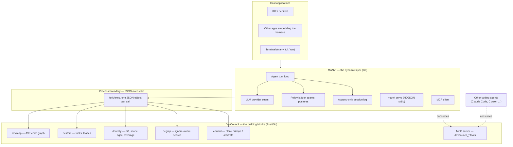

# Components and Harness: how MANVI and DevCouncil relate

Two repositories, two jobs, one boundary between them.

**DevCouncil is the component layer.** Every capability it has is being ported to
Rust/Go, and each lands as a component with a process contract: a binary that
answers one JSON object on stdout, or an MCP server exposing tools. When the port
is complete DevCouncil is a set of building blocks usable by *any* coding agent —
Claude Code, Cursor, Codex, or MANVI — not an application anyone runs end to end.

**MANVI is the dynamic layer.** It is the harness that unifies those components
into a working agent: the turn loop, the LLM provider seam, the policy ladder,
the session log, the TUI, and `manvi serve` for embedding into other
applications. It supplies what a component cannot — judgement, conversation,
model calls, and the decision about *when* to invoke which block.

The direction of dependency is one-way and must stay that way: **the harness
knows about the components; no component knows about the harness.** A component
that needed MANVI to run would stop being a building block.

---

## 1. The contract a component satisfies

Every DevCouncil component, current or future, meets all of these. They are what
make a component consumable by an agent that is not MANVI.

1. **A process, not a library.** `fork`/`exec` with line-delimited JSON on stdio,
   or an MCP server. Never a linked library — linking would forfeit
   `CGO_ENABLED=0`, static binaries, cross-compilation and process isolation, and
   would make the component's language the consumer's problem.
2. **Every outcome is JSON on stdout, including failures.** A caller never parses
   prose or infers from an exit code alone. The exit code is a coarse duplicate.
3. **A contended or negative result is a normal answer, not an error.** `dcstore
   acquire` on a held task exits 0 with `{"ok":false,"code":"lease_held_by_other"}`,
   because contention is expected when two builders run, and a caller forced to
   distinguish "busy" from "broken" by reading stderr will eventually get it wrong.
4. **A check that could not run never reports what a check that ran and passed
   reports.** The cardinal rule. A malformed diff is an error, never an empty
   finding list; an unbuilt index is unavailable, never a confident zero.
5. **An identity a caller can assert.** `health` names the component and its
   schema version, so a caller can tell it is talking to the real thing and not
   to some other program that prints JSON.
6. **Bounded.** Every call has a timeout, every payload a ceiling, every
   subprocess its own process group so a cancelled turn does not leak children.

Points 3–5 are why these are components rather than scripts. They are what let a
consumer be written once against the contract instead of against a build.

---

## 2. How the harness consumes them

**Verified** (`cmd/manvi/toolbinary.go`): MANVI resolves each component as an
executable and links none of them. Resolution is explicit-beats-PATH-beats-local:

1. an environment variable, because an operator who named a path meant it;
2. `PATH`, which is the installed case;
3. a build in the local `crates/target`, so a compiled-but-not-installed artifact
   is found rather than reported missing.

| Component | Env override | Go client |
|---|---|---|
| `devmap` | `MANVI_MAP_BINARY` | `manvi/dc/devmap` |
| `dcstore` | `MANVI_STORE_BINARY` | `manvi/dc/store` |
| `dcverify` | `MANVI_VERIFY_BINARY` | — (invoked from `devcouncil/verify.go`) |
| `dcgrep` | `MANVI_GREP_BINARY` | `manvi/dc/dcgrep` |
| DevCouncil CLI | `MANVI_DEVCOUNCIL_BINARY` | `manvi/devcouncil/devbridge.go` |

The Go clients transport answers; they do not compute them and must never cache
one. Everything deciding whether work may proceed — mutual exclusion, expiry,
ownership — lives in the component, where the schema's partial unique index
enforces it. A cached lease is a lease that has already expired somewhere else.

**A missing component degrades visibly, never silently.** Without `devmap` the
neighbour rule reports `repo_map.unavailable` and `verify.sh` records repository
navigation as a gate that *did not run*, rather than one that passed.

### The dev bridge is the seam, and it is read-only

`devcouncil/devbridge.go` is the one place the harness shells out to DevCouncil's
CLI, for the project-level view only DevCouncil has: requirement coverage, cost
accounting, live review cards, the evidence gate over the whole tree. It is
read-only on purpose — the component "can inform a decision, never enforce one" —
and it deliberately does **not** fall back to reading `state.sqlite` itself,
because two readers of one database with different assumptions about its schema
is how "compatible" drifts apart.

As DevCouncil's port completes, this bridge's target becomes a native binary
rather than a Python process. The read-only restriction is then a choice to
re-examine rather than a constraint imposed by the incumbent.

---

## 3. Component inventory

**Ported (Rust/Go), verified building and tested in DevCouncil:**

| Component | Home | Answers |
|---|---|---|
| `devmap` | `rust-port/` (49,675 lines) | What does this code mean — AST graph, callers, impact, dead code |
| `dcstore` | `rust/dc-store` | Which task, held by whom, until when |
| `dcverify` | `rust/dc-verify` | Does this diff match its scope, and was it exercised |
| `dcgrep` | `rust/dc-grep` | What is in this repository (ripgrep's engine, linked) |
| `dc-glob` | `rust/dc-glob` | CPython `fnmatch` semantics — a library, not a binary; the one exception, shared by source between the components |

**Not yet ported — still Python in DevCouncil.** The full inventory, sizes and
sequencing are in [`DEVCOUNCIL_PORT_ROADMAP.md`](DEVCOUNCIL_PORT_ROADMAP.md).
The three that matter most: the MCP server surface (29 `devcouncil_*` handlers —
this is literally what "MCP layer for coding agents" means), the council
(plan → critique → rebuttal → arbitrate), and verification.

---

## 4. What this means for work in progress

Three consequences worth stating plainly, because each reverses an earlier
assumption in this repository's own docs.

**DevCouncil is not being retired.** An earlier draft of the roadmap described
moving DevCouncil's capabilities *into* MANVI and deleting the Python. That is
wrong. DevCouncil's capabilities are ported to Rust/Go **inside DevCouncil**,
where they stay as components. MANVI gains no subsystem it does not already own.

**The `dc-*` crates are DevCouncil's, not MANVI's.** They were authored here and
ported there, but authorship is history, not ownership. They are edited in
DevCouncil now; MANVI's `crates/` copy is a development convenience. Note that
only the *sources* are duplicated — nothing links, so the deployed arrangement is
already correct: one set of component binaries, one harness consuming them.

**MANVI's `mcp/` being a client is correct, not a gap.** An earlier assessment
called it a structural problem that MANVI has no MCP *server*. Under this
architecture that is exactly right: DevCouncil is the server, MANVI is a client,
and the same server serves every other coding agent too. The gap is not in MANVI
— it is that DevCouncil's MCP surface is still Python.

---

## 5. Checklist for a newly ported component

When a DevCouncil subsystem lands in Rust/Go, it is done when:

- [ ] It is a binary (or MCP tool) with the §1 contract, not a library MANVI links.
- [ ] `health` names it and its schema version; a caller can assert identity.
- [ ] Every failure path emits JSON on stdout; nothing panics to stderr with an
      empty stdout.
- [ ] A negative or contended result is a normal answer with a `code`, not an error.
- [ ] A check that could not run is distinguishable, by the caller, from one that
      ran and passed — with a test proving it.
- [ ] Every call is bounded: timeout, payload ceiling, own process group.
- [ ] Cross-language interop is tested against the incumbent while both exist, and
      the test **fails** rather than skips when it cannot run
      (`DC_STORE_REQUIRE_INTEROP=1` is the pattern).
- [ ] MANVI resolves it through `toolBinary` with an env override, and degrades
      visibly when it is absent.
- [ ] It does not import, reference, or assume MANVI.
