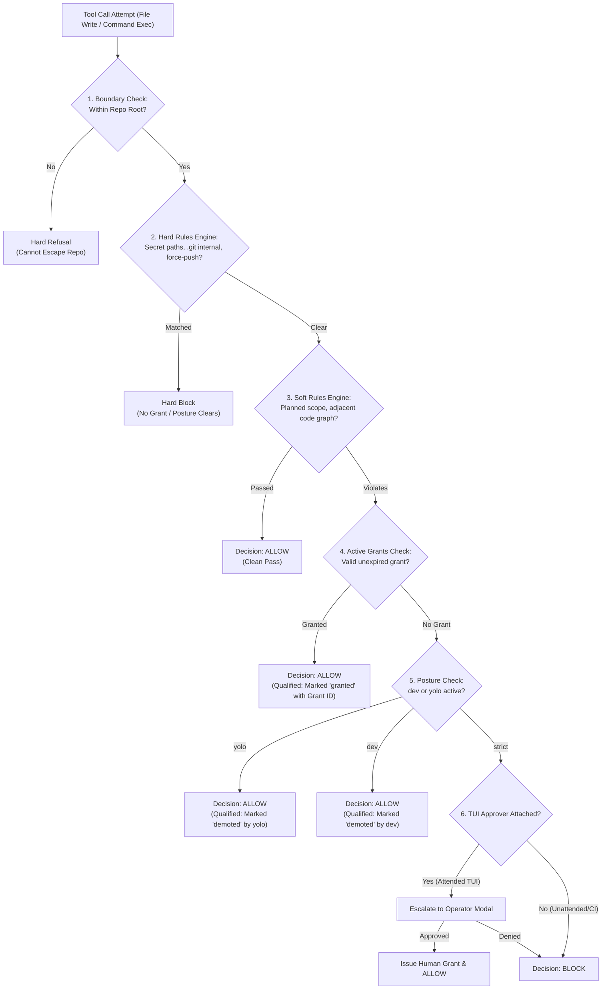
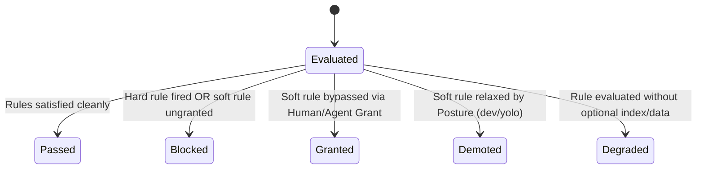
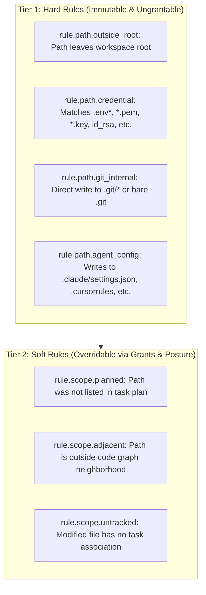
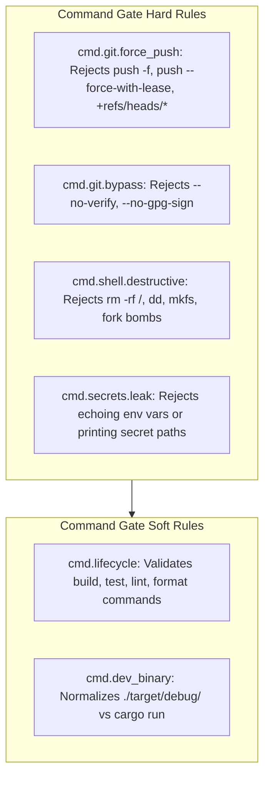
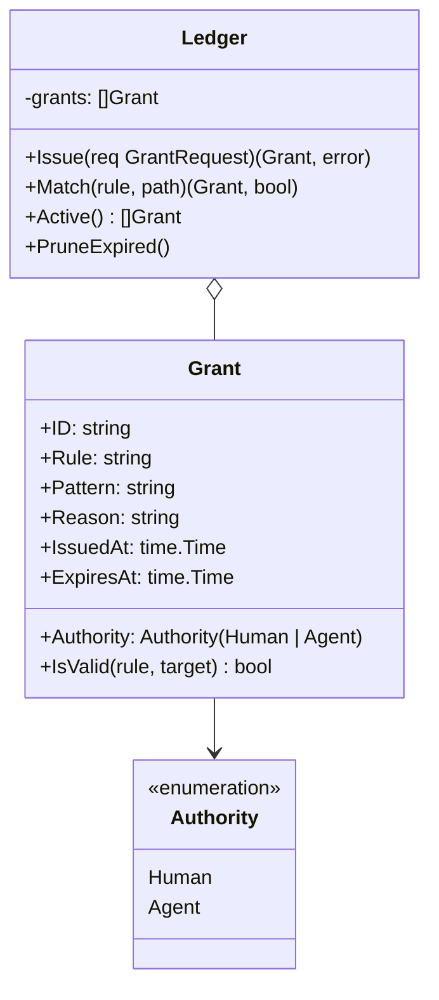
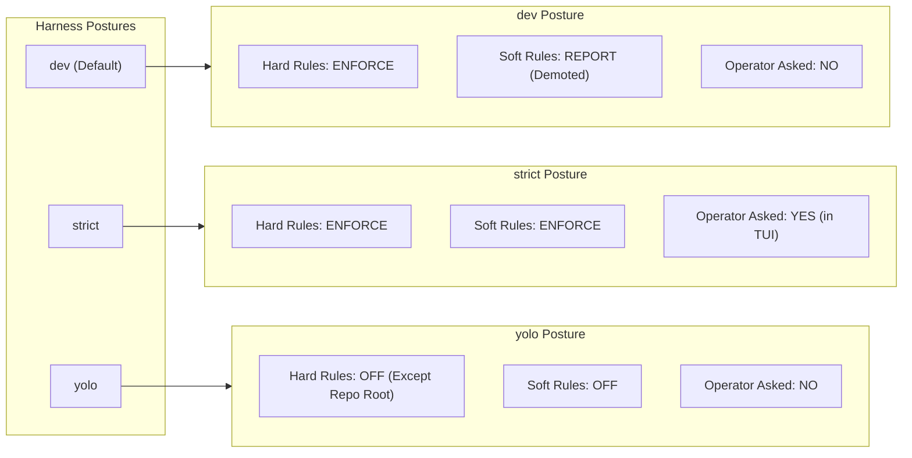
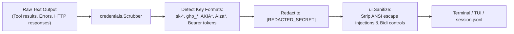

# MANVI Policy & Safety Engine Specification

This document details the security model, policy evaluation hierarchy, override mechanics, and containment boundaries in **MANVI**.

---

## 1. Overview & Core Tenet

In MANVI:
> **A check that did not run must never report the same result as a check that ran and passed.**  
> **A grant that cleared a rule must never report as a clean pass.**  
> **Blocks are overridable when appropriate, but never invisible.**

---

## 2. Five Outcome States

The policy evaluation engine categorizes every operation into five distinct semantic states:

| Outcome | Visual Marker | Semantics | Carries Metadata |
|---|---|---|---|
| **Passed** | `✓` (Green) | Strict clean pass. All rules evaluated and satisfied. | None |
| **Blocked** | `✗` (Red) | Operation prevented by hard rule or ungranted soft rule. | Fired Rule, Reason, Severity |
| **Granted** | `✓ [granted]` (Yellow) | Allowed because an explicit override was recorded. | Rule, Grant ID, Grantor, Reason, Expiry |
| **Demoted** | `✓ [demoted]` (Amber) | Allowed because harness posture is `dev` or `yolo`. | Demoting Posture, Shadowed Rule |
| **Degraded** | `✓ [degraded]` (Magenta)| Check executed with missing dependencies or disabled tools. | Degraded Subsystem Name |

---

## 3. The Write Gate Ladder

The Write Gate controls all file creations, overwrites, modifications, and deletions.

### Write Gate Rule Details

| Rule ID | Tier | Default Action | Overridable By | Description |
|---|---|---|---|---|
| `path.outside_root` | Hard | **Reject** | *Never* | Traversal attempts (`../`), absolute paths outside workspace. |
| `path.credential` | Hard | **Block** | *Never* | Matches sensitive files (`.env`, `credentials.json`, `id_ed25519`). |
| `path.git_internal` | Hard | **Block** | *Never* | Protects `.git/config`, `.git/HEAD`, git hooks, and `.git` worktree pointers. |
| `path.agent_config` | Hard | **Block** | *Never* | Protects harness configuration and agent system settings. |
| `scope.unplanned` | Soft | **Block** | Human, Posture | Changes to files not declared during `devcouncil_checkout_task`. |
| `scope.neighbourhood`| Soft | **Block** | Human, Agent | Modifying files outside the extracted AST dependency graph. |

---

## 4. The Command Gate Ladder

The Command Gate verifies shell commands before execution by the agent.

### What a Command Line Writes

A command line has two things to judge, not one: the command, and the files its
redirections open. The second is judged through exactly the path a `WriteFile`
call faces, so `cmd > .env` cannot be treated differently from writing `.env`
directly.

Three properties make that hold rather than merely intend it:

- **Redirect enumeration descends into command substitutions.** `sh -c` executes
  what is inside `$( )`, backticks, `<( )` and `>( )`, redirections included, so
  `echo $(echo x > .env)` writes `.env`. Targets are collected from every span
  the ladder recurses into, to the same depth bound.
- **The rung is skipped only for a *hard* denial.** A hard denial is undemotable
  and ungrantable, so the command cannot run. Every other outcome — including a
  *soft* denial — has its redirections judged, because a soft denial is exactly
  what a gate mode demotes or a grant clears. The two verdicts are merged by
  `policy.BlockStrength`, so the stronger survives into the grant-and-mode step.
- **A target that cannot be resolved refuses.** `> $HOME/x`, `> ~/.ssh/keys`, and
  any target inside a construct that could not be read to its end are refused as
  unverifiable writes rather than skipped.

The invariant these add up to, and the one the differential test in
`gate/redirect_test.go` asserts against the real filesystem, is:

> The gate's verdict on a command line is never more permissive than its verdict
> on the files that command writes.

### Bounded Cost

The gate is asked about every command an agent runs, and the command is a string
a model composed, so deciding must cost a bounded amount and the bound cannot
rest on the model's restraint. Two limits enforce that, and both refuse rather
than truncate:

- `command.too_long` (Hard, 128 KiB) is checked once before any rung reads the
  line. It is not a rung inside the ladder, because a rung is reached per clause
  — after the splitter has already walked the whole input, which is most of the
  cost it exists to avoid.
- `maxRedirectTargets` (64 distinct paths) bounds how many writes one command
  line may be judged to perform. Exceeding it is reported as an *incomplete*
  enumeration, so the caller fails closed instead of judging the first sixty-four
  and ignoring the rest.

`gate/bounds_test.go` asserts that every adversarial shape decides inside a
budget, which is what keeps these from silently drifting into "large enough not
to matter".

### The Boundary: Inline Code vs. Code On Disk

Two rungs — `command.heredoc` and `command.reparse` — refuse constructs whose
meaning is not in the text being judged. A heredoc body has no statically
checkable end; an `eval` argument is a single quoted word until sh discards the
quotes that made it one. Both are refused outright rather than guessed at.

Executing a script that lives **on disk** is deliberately not addressed by this
ladder. `sh x.sh`, `make`, `pytest` and every test runner load code that is not
in the command string at all, so no reading of that string could catch it; the
allowlist decides whether those command words may run, and the write gate
decides what the resulting process may write through the harness's own tools.
Refusing the command words that read files would deny ordinary development work
while leaving the capability one rename away. This boundary is stated here so it
is a known limit rather than an assumed guarantee.

### Parity with Python Incumbent

Command policy normalization matches DevCouncil's Python `TaskPolicyEngine` across 256 test vectors in `testdata/command-parity.tsv`:
- Unwraps `uv run`, `poetry run`, `bundle exec`, `npx`.
- Decodes shell chaining (`&&`, `||`, `;`, `|`).
- Detects refspec force pushes (e.g. `git push origin +main:main`).
- Intercepts `--no-verify` and `--no-gpg-sign` on git commit and push.

---

## 5. The Grants Ledger & Overrides

Grants provide a traceable, scoped, time-bounded exemption from soft policy rules.

### Grant Authority Invariants

1. **Hard Rules Are Ungrantable**: Any attempt to issue a grant for a hard rule (`path.credential`, `path.outside_root`, `cmd.git.force_push`) fails immediately with `ErrUngrantableRule`.
2. **Mandatory Reason**: Every grant must specify a non-empty human-readable justification.
3. **Bounded TTL**: Grants have a maximum lifetime (default: 15 minutes). A negative or zero TTL fails validation.
4. **Literal vs Glob Matching**: Path patterns are matched strictly; literal paths cannot alias to globs.

---

## 6. Harness Posture Matrix

Harness posture governs the baseline behavior of soft rules across the entire system.

### Detailed Posture Comparison

| Feature / Behavior | `strict` | `dev` (Shipped Default) | `yolo` |
|---|---|---|---|
| **Root Containment** | Absolute | Absolute | Absolute (In-root only) |
| **Credential & Git Hard Rules** | **Enforced** | **Enforced** | *Off* (Recorded as degraded) |
| **Task Scope Soft Rules** | **Enforced** | *Advisory* (Recorded as demoted) | *Off* |
| **Operator Escalation (TUI)** | Prompts Modal | No Prompts | No Prompts |
| **Run Classification** | Strict | Weakened | Weakened |
| **Permitted Authority** | Human / Agent | Human / Agent | Human Only |

---

## 7. Credential Scrubber Subsystem

Credential protection operates in multiple layers to prevent API keys and secrets from reaching the terminal, logs, or LLM providers:

- **`credentials.Scrubber`**: Regex-based token hunter that matches provider API keys, GitHub tokens, AWS credentials, and arbitrary high-entropy strings.
- **`credentials.Secret` type**: Prevents in-memory strings from printing via `fmt.Sprintf` `%v` or `%s`.
- **`ui.Sanitize`**: Cleans bi-directional override characters (Bidi), terminal control codes, and malformed UTF-8 sequences.

---

## 8. Related Documentation

- [Documentation Index](README.md)
- [Why MANVI is Different (Comparison)](COMPARISON.md)
- [Technical Architecture Specification](ARCHITECTURE.md)
- [Agent & Turn Lifecycle Specification](AGENT_AND_TURN_LIFECYCLE.md)
- [CLI & Configuration Reference](CLI_AND_CONFIGURATION.md)
- [DevCouncil Native Tool Suite](TOOLS_REFERENCE.md)
- [Hardening Ledger & Defects](HARDENING_LEDGER.md)
- [Architectural Trade-offs](TRADE_OFFS.md)

