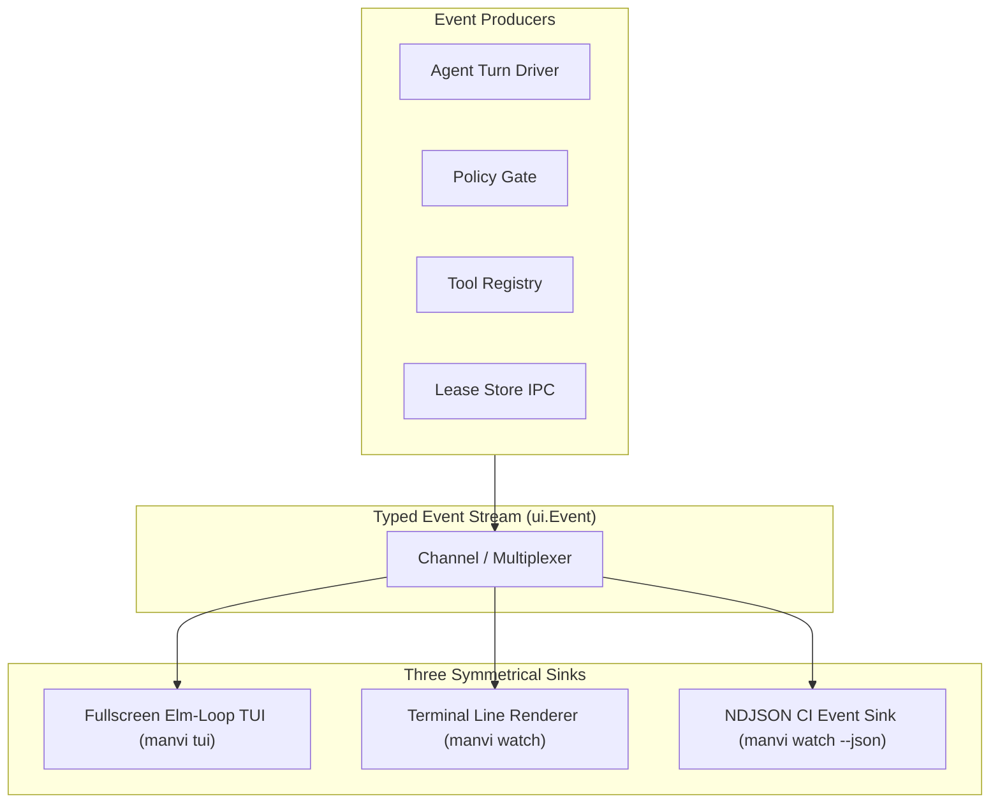
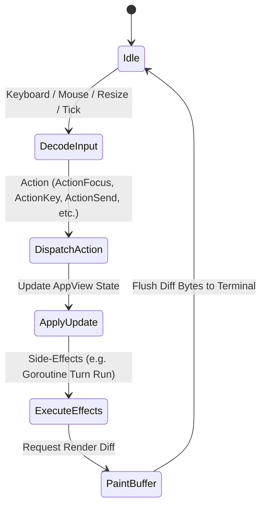
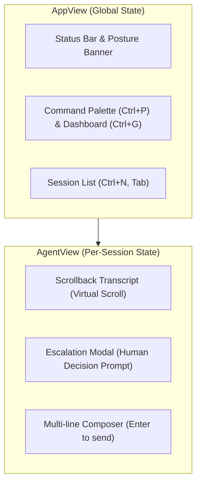
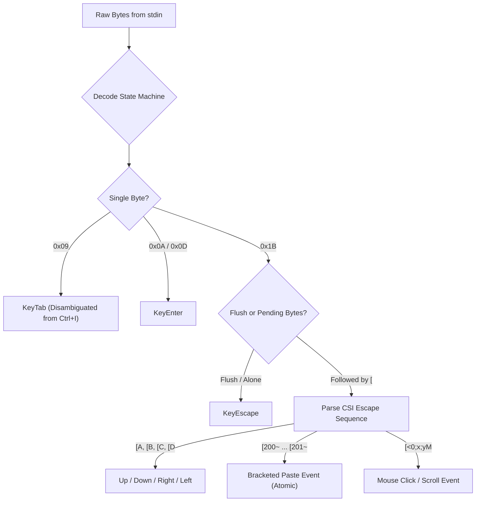
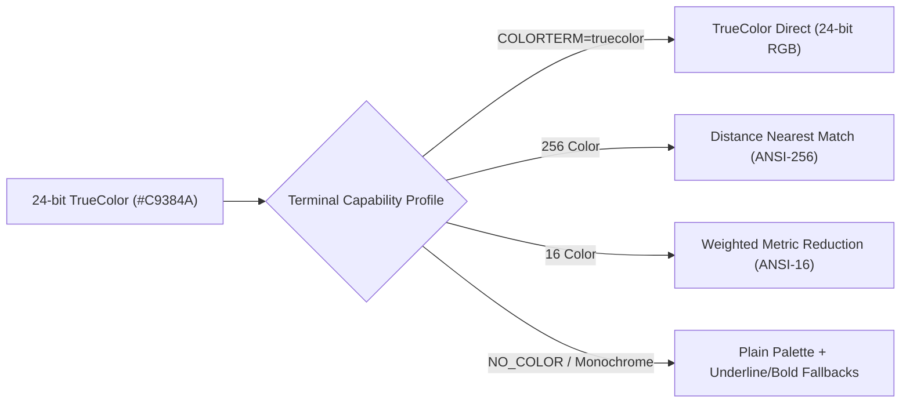
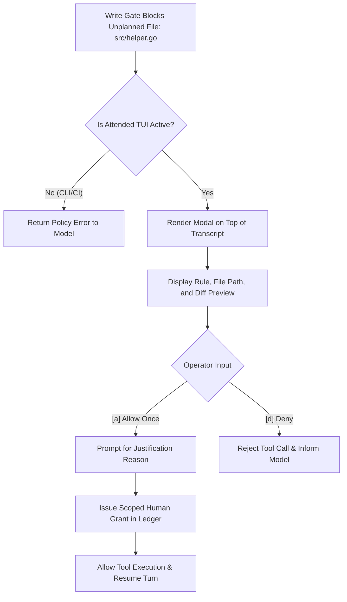

# MANVI Terminal UI & Event Subsystem Specification

This document details the telemetry pipeline, terminal rendering engine, Elm-style TUI state machine, and raw input decoders in **MANVI**.

---

## 1. Unified Event Wire Architecture

All telemetry in MANVI originates as a strongly-typed `ui.Event` stream. The terminal UI, streaming line renderer, and CI NDJSON sink consume the exact same events.



### The `ui.Event` Payload

The JSON names are the wire contract a CI job reads, so they are shown here
rather than only the Go names. `manvi/internal/contract` re-reads this block
against `manvi/ui/event.go` on every run; a field added, renamed or retagged in
one and not the other fails the suite.

```go
type Event struct {
    Kind Kind      `json:"kind"`
    At   time.Time `json:"at"`

    // Agent names the sub-agent an event came from, empty for the parent turn.
    // Two agents' evidence in one stream is only readable if each line says
    // whose it is.
    Agent string `json:"agent,omitempty"`

    Text   string `json:"text,omitempty"`
    Detail string `json:"detail,omitempty"`

    // Tool fields.
    Tool      string          `json:"tool,omitempty"`
    Arguments json.RawMessage `json:"arguments,omitempty"`
    IsError   bool            `json:"is_error,omitempty"`

    // Policy fields. Rule is set whenever a rule fired, including on a success
    // the posture or a grant allowed — a qualified pass is not a clean one.
    Rule       string   `json:"rule,omitempty"`
    Severity   string   `json:"severity,omitempty"`
    Path       string   `json:"path,omitempty"`
    Grantable  bool     `json:"grantable,omitempty"`
    GrantID    string   `json:"grant_id,omitempty"`
    GrantedBy  string   `json:"granted_by,omitempty"`
    Demoted    string   `json:"demoted,omitempty"`
    Degraded   []string `json:"degraded,omitempty"`
    Weakened   []string `json:"weakened,omitempty"`
    ApprovalID string   `json:"approval_id,omitempty"`

    // Set only by the NDJSON sink, on a line standing in for an event whose
    // fields would not all marshal. It names what that line is missing, so the
    // transcript carries a hole a reader can see rather than one that looks
    // like an event that never happened.
    EncodeError string `json:"encode_error,omitempty"`

    // Session fields.
    TaskID  string `json:"task_id,omitempty"`
    Posture string `json:"posture,omitempty"`
    Model   string `json:"model,omitempty"`

    // Usage.
    InputTokens  int `json:"input_tokens,omitempty"`
    OutputTokens int `json:"output_tokens,omitempty"`
}
```

---

## 2. The Elm Loop Architecture (`manvi/ui/tui`)

The full-screen TUI implements an Elm-style reactive loop (Input → Action → Dispatch → Effect → State Update), adapted from Grok Build's pager architecture:





### Key TUI Features

1. **Interactive Multi-Session Tab Strip**:
   - Visual tab bar displaying active sessions: `[ 1: S1 (ready) ]` `[ 2: S2 ⠋ ]` `[ + ]`.
   - Real-time status badges: busy spinner (`⠋`), pending human approval (`⚠`), and errors (`✕`).
   - Direct session navigation via `Ctrl+1`–`Ctrl+9`, `Ctrl+T` (new session), `Ctrl+W` (close), and mouse click hit-testing.
2. **Live Dynamic Theme Switcher (`/theme`, `Ctrl+Y`)**:
   - Instant live switching between **Dark**, **Light**, and **Plain** (monochrome) themes without restarting the process.
   - Interactive theme picker overlay modal with live palette preview.
3. **Interactive Session Switcher Modal (`/sessions`, `Ctrl+S`)**:
   - Searchable overlay modal displaying all running and idle sessions with task IDs, token counts, elapsed time, and status chips.
4. **Settings Picker (`/settings`)**:
   - Searchable overlay listing every setting in the catalogue with its value, origin layer, and mutability scope.
5. **Rich Markdown, Syntax Highlighting & Unified Diffs**:
   - Syntax highlighting for `go`, `rust`, `json`, `bash`, `python`, and `sql` with inset container borders (`┌─ go ─┐` / `└────┘`).
   - Colored diff line rendering (`+` additions in green, `-` deletions in red, `@@` hunk headers in cyan).

### Complete Keyboard Shortcuts Reference

| Shortcut | Scope | Action |
|---|---|---|
| `Ctrl+P` | Global | Open Command Palette / Fuzzy Tool Action Picker |
| `Ctrl+N` / `Ctrl+T` | Global | Spawn new concurrent agent session tab |
| `Ctrl+W` | Global | Close current agent session tab |
| `Ctrl+S` | Global | Open Interactive Session Switcher Modal |
| `Ctrl+Y` | Global | Open Live Theme Switcher Modal (`/theme`) |
| `Ctrl+G` | Global | Toggle System Telemetry Dashboard & Active Lease Inspector |
| `Ctrl+1` – `Ctrl+9` | Navigation | Switch directly to Session Tab 1–9 |
| `Tab` / `Shift+Tab` | Navigation | Cycle focus between panes / Accept autocompletion in prompt |
| `Enter` | Composer | Send prompt / Confirm modal decision |
| `Ctrl+C` | Agent Turn | Cancel currently executing turn (releasing all held leases) |
| `Ctrl+Z` | Shell | Suspend TUI and restore host terminal |

---

## 3. Zero-Allocation Damage-Diffed Painter

Unlike terminal libraries that redraw the entire screen on every frame, MANVI's painter maintains two in-memory cell grids: `front` (currently displayed on terminal) and `back` (newly computed layout).

```mermaid
sequenceDiagram
    autonumber
    participant Engine as TUI Render Loop
    participant Back as Back Buffer (Grid)
    participant Front as Front Buffer (Grid)
    participant TTY as stdout (/dev/tty)

    Engine->>Back: Paint Layout (Widgets, Panes, Modals)
    Engine->>Engine: Compare Back[y][x] vs Front[y][x]
    alt Cell Changed (Damage Detected)
        Engine->>TTY: Move Cursor (CUP: \x1b[y;xH) + Paint Runes + SGR Style
        Engine->>Front: Update Front[y][x] = Back[y][x]
    else Cell Identical (No Change)
        Engine->>Engine: Skip Cell (Zero Bytes)
    end
    alt No Cells Changed Across Frame
        Engine->>TTY: Emit 0 Bytes (Quiet Idle Tick)
    end
```

### Benefits

- **Zero Flicker**: No full-screen clear codes (`\x1b[2J`) during normal updates.
- **Minimal Bandwidth**: Idle ticks write exactly 0 bytes over SSH connections.
- **Accurate Widths**: Full East Asian Width (Ambiguous / Fullwidth) and emoji handling in pure Go.

---

## 4. Pure Go Terminal Input Decoder

Terminal input is decoded as a pure state transition function over raw byte slices: `decode(buf []byte, flush bool) (Event, int)`.



### Ambiguities Resolved by Unit Test

1. **Tab vs Ctrl+I**: Disambiguated in raw mode by tracking modifier state.
2. **Esc vs Arrow Keys**: Lone `0x1B` emits `KeyEscape` only when no CSI bytes follow within the read deadline.
3. **Bracketed Paste**: Multi-line pasted text is parsed as a single `EventPaste` payload, preventing premature submission if the paste contains carriage returns.

---

## 5. ANSI Color Reduction Matrix

MANVI dynamically adapts its color palette based on terminal capabilities:



### ANSI-16 Reduction Finding

Because standard ANSI-16 color conversion metrics are weighted heavily toward green luminance, deep red colors (such as `#C9384A`) collapse to *Bright Black* on 16-color terminals. To maintain legibility of critical UI elements:
- Deep dark red is used exclusively for background filled shapes (tiles, selection bands).
- A lighter, saturated red is used for text, glyphs, and status indicators.
- Under `NO_COLOR`, semantic status states use distinct glyphs (`✓`, `✗`, `⚠`, `⌁`) and ASCII text tags rather than relying on color.

---

## 6. Attended Approver Modal

When a soft rule triggers under `strict` posture in the interactive TUI, execution pauses and presents an approval dialog:



---

## 7. Related Documentation

- [Documentation Index](README.md)
- [Why MANVI is Different (Comparison)](COMPARISON.md)
- [Technical Architecture Specification](ARCHITECTURE.md)
- [Policy & Safety Engine Specification](POLICY_AND_SAFETY.md)
- [CLI & Configuration Reference](CLI_AND_CONFIGURATION.md)
- [Hardening Ledger & Defects](HARDENING_LEDGER.md)

