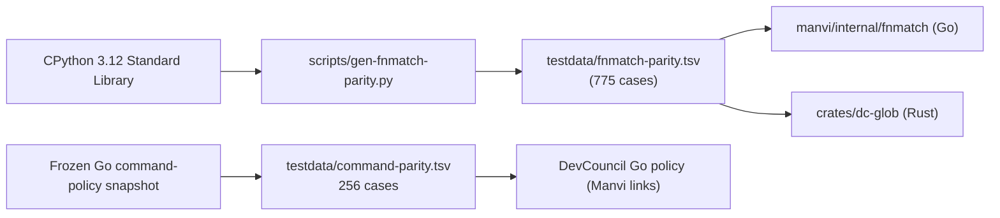
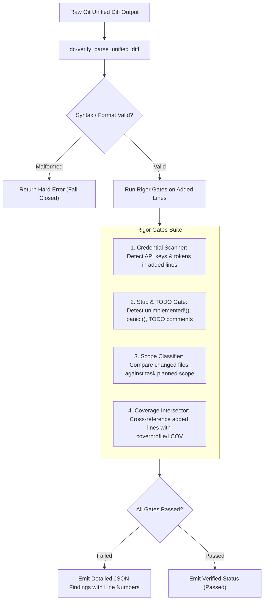
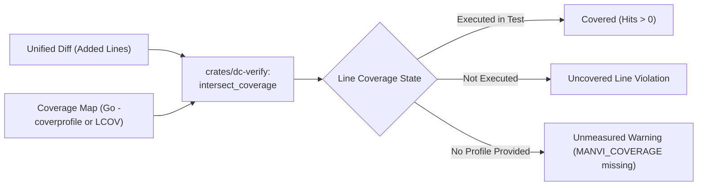

# MANVI Verification & Parity Specification

This document details the cross-language testing methodology, parity fixtures, diff-coverage intersection engine, and rigor verification gates in **MANVI**.

---

## 1. Parity Fixture Methodology

When porting critical policy systems from Python or external codebases, the failure mode is not a crash, but a subtle rule divergence that passes all conventional unit tests.

To eliminate human interpretation drift, glob matching is verified against a corpus generated from CPython's `fnmatch`. Command policy is pinned to a frozen snapshot of the Go gate (the Python `devcouncil` package that used to generate it is deleted):



### Parity Invariant

- Go's standard `path.Match` stops at `/` separators. Python's `fnmatch` crosses `/` separators.
- Using standard Go `path.Match` would have silently weakened glob-based secret path rules without raising an error.
- Both Go and Rust must evaluate all 775 glob test cases identically, and `verify.sh` verifies fixture integrity before running tests.

---

## 2. Unified Diff Parsing & Rigor Gates (`crates/dc-verify`)

The Rust analysis plane parses unified diffs and executes rigor gates before any patch is accepted:



---

## 3. Test Coverage Intersection Pipeline

A passing verification claim in MANVI requires proof that newly introduced code was executed by the test suite.



### Semantic Distinctions

- **Uncovered vs Unmeasured**:
  - `uncovered`: The file was measured by a test runner, and the added lines were **not** executed. (Blocks verification in strict mode).
  - `unmeasured`: No coverage profile was supplied. Stated explicitly as an unmeasured environment fact, never laundered into a passing claim.
- **Fail-Closed on Corrupt Data**: An unreadable or malformed coverage report produces an explicit error, rather than defaulting to zero or full coverage.

---

## 4. The `./verify.sh` Master Gate

The `./verify.sh` script is the single authoritative gate that validates both planes before code lands.

```mermaid
flowchart TD
    Start["Run ./verify.sh"] --> G1["Go: gofmt format check"]
    G1 --> G2["Go: go vet static analysis"]
    G2 --> G3["Go: go test with real subprocesses"]
    G3 --> G4["Go: Cross-boundary test assertion (>= 5 real calls)"]
    G4 --> G5["Go: Dependency surface — build graph held to the allowlist"]
    G5 --> G6["Go: golangci-lint enforced set — 20 linters at zero, plus ruleguard"]
    G6 --> G7["Go: golangci-lint debt ratchet — 11 linters, counts may only fall"]
    G7 --> G8["Go: govulncheck — reachable standard-library advisories"]
    G8 --> G9["Go: nilaway — cross-package nil analysis, held under a ceiling"]

    G9 --> R1["Rust: cargo fmt --check"]
    R1 --> R2["Rust: cargo clippy -D warnings"]
    R2 --> R2a["Rust: cargo audit — Cargo.lock against the RustSec database"]
    R2a --> R3["Rust: cargo test (unit & integration)"]
    
    R3 --> P1["Parity: fnmatch-parity.tsv >= 500 cases"]
    P1 --> P2["Parity: command-parity.tsv >= 200 cases"]
    
    P2 --> X1["Cross-Language: Rust dcstore schema & SQLite index validation"]
    X1 --> X2["Cross-Language: Python interop validation"]
    
    X2 --> V1["Verifier: Rigor credential & stub rejection"]
    V1 --> V2["Verifier: Coverage parsing & profile errors"]
    
    V2 --> M1["Brand: SVG asset parity check (assets/manvi-mark.svg)"]
    M1 --> T1["TUI: Raw terminal restore on exit check"]
    
    T1 --> Finish["PASS ALL GATES"]
```



### How to Run

```bash
# Complete verification run
./verify.sh

# Automatically fix Go and Rust formatting in place before running gates
./verify.sh --fix

# The Go suite again under the race detector, with cgo on
./verify.sh --race

# Every declared fuzz target actually executed, and proven to have executed
./verify.sh --fuzz
```

`--race` and `--fuzz` take one flag at a time; run the script twice for both.

Both are opt-in, for opposite reasons. `--race` needs cgo, and the default run
has to be the shipped `CGO_ENABLED=0` configuration. `--fuzz` spends a budget
rather than answering a fixed question, so a green unattended run would mean
less each time the machine got busier.

`--fuzz`'s budget is per target and adaptive, because the targets are not
alike. Measured on one flat-30s run: the pure-function targets reached 13.6M
inputs while `FuzzShellDifferentialOracle` reached 29,142 and the three that
drive a real child process reached 40–55k — three to four orders of magnitude
behind, and they are the differential oracles, which is where most of the
defects this gate has found actually came from. A budget calibrated on the fast
targets starves exactly the ones worth running.

So each target runs for `MANVI_FUZZTIME` (default `20s`); one that has not
reached `MANVI_FUZZMIN` inputs (default `1000000`) by then gets the remainder of
`MANVI_FUZZMAX` (default `120s`). Two invocations at most, because each one
re-gathers baseline coverage over the whole corpus and looping in small rounds
would spend the extra budget on setup rather than on fuzzing; the corpus
persists in `GOCACHE`, so the second round resumes rather than restarts. No list
of which targets are slow is kept anywhere — that would be a second source of
truth about the targets, wrong the first time someone made a slow target fast —
the measurement decides.

A target that still cannot reach the floor with the whole budget is named under
`NOT COVERED` with its actual count. Equalising the budget does not change the
physics: a fork-per-case target will never reach millions of inputs. What the
gate can do is stop reporting a sampled target as an explored one.

All three knobs are a whole number of seconds (a trailing `s` is allowed, and
anything else is refused rather than passed through to `go test`, which would
accept `2m` and make the budget arithmetic quietly wrong).

`--fuzz` also
cannot trust `go test`: `go test -fuzz=X ./pkg` prints `no fuzz tests to fuzz`
and **exits 0** when `X` is not in `pkg`, which is how a sweep once recorded
three passes for targets it never ran. The proof required is the fuzzer's own
execution count, asserted positive for each target individually, with the total
carried alongside the per-target numbers.

A target that fails leaves its input under
`manvi/<pkg>/testdata/fuzz/<Target>/`; the gate names that path, and the input
is committed as a seed once the defect is fixed.

Workers are bounded (`MANVI_FUZZ_WORKERS`, default 4). `go test -fuzz` otherwise
starts one per CPU, and this step runs after the suite, the linters and nilaway
have already saturated the machine; unbounded, the engine reported `context
deadline exceeded` — its own coordination timing out, with no failing input
written. The gate tells that apart from a real finding by whether the corpus
directory grew, and reports the first as a gate that did not run rather than as
a defect.

### Tooling the gate needs

Four of the steps above call binaries this repository cannot vendor. A missing
one is recorded and reprinted next to the final verdict rather than scrolling
past mid-run, because a gate that could not run must not be indistinguishable
from a gate that ran and passed — the run then ends in `PASS with gates that
did not run`, naming each.

```bash
go install github.com/golangci/golangci-lint/v2/cmd/golangci-lint@latest
go install golang.org/x/vuln/cmd/govulncheck@latest
go install go.uber.org/nilaway/cmd/nilaway@latest
cargo install cargo-audit
```

### Why the lint gate is two files

`manvi/.golangci.yml` holds the linters that are clean on the whole tree, so its
verdict is a number and the number is zero. `manvi/.golangci-debt.yml` holds the
checks worth having that this tree does not pass yet: 1059 findings, too many to
gate on and too many to leave unnamed. Their counts are recorded per linter in
`manvi/.golangci-debt.counts` and may only go down. Per linter rather than as a
sum, because one total lets a fix pay for a new defect.

Those counts are larger than any default `golangci-lint` run reports. Its own
summary said **197** for this same tree. `max-issues-per-linter` stops at 50,
`max-same-issues` at 3, and `uniq-by-line` keeps one finding per line — three
caps, all silent, withholding 850 findings behind a line that reads like a
total. Both config files turn all three off.

`manvi/gorules/rules.go` carries this repository's own invariants as ruleguard
patterns, loaded by the enforced set: the credential that must not reach `fmt`,
the verdict that must not be set from a literal, the peer-controlled stream that
must be bounded, the skip that must say what it is gating on.

---

## 5. Related Documentation

- [Documentation Index](README.md)
- [Why MANVI is Different (Comparison)](COMPARISON.md)
- [Technical Architecture Specification](ARCHITECTURE.md)
- [Hardening Ledger & Defects](HARDENING_LEDGER.md)
- [Architectural Trade-offs](TRADE_OFFS.md)

