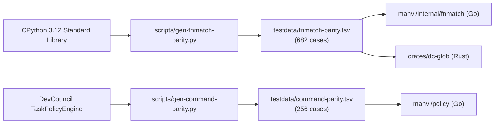
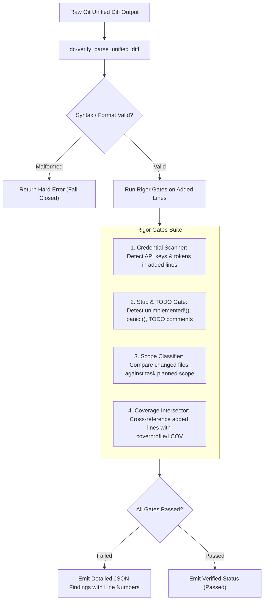
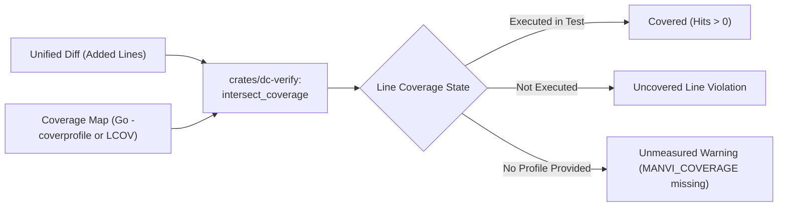
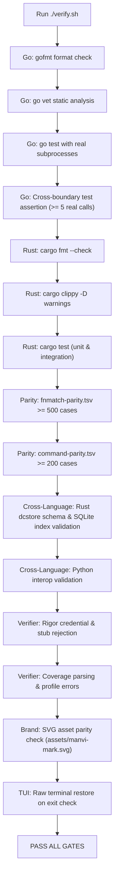

# MANVI Verification & Parity Specification

This document details the cross-language testing methodology, parity fixtures, diff-coverage intersection engine, and rigor verification gates in **MANVI**.

---

## 1. Parity Fixture Methodology

When porting critical policy systems from Python or external codebases, the failure mode is not a crash, but a subtle rule divergence that passes all conventional unit tests.

To eliminate human interpretation drift, MANVI's Go and Rust implementations are verified against shared corpora generated by running the incumbent engines:



### Parity Invariant

- Go's standard `path.Match` stops at `/` separators. Python's `fnmatch` crosses `/` separators.
- Using standard Go `path.Match` would have silently weakened glob-based secret path rules without raising an error.
- Both Go and Rust must evaluate all 682 glob test cases identically, and `verify.sh` verifies fixture integrity before running tests.

---

## 2. Unified Diff Parsing & Rigor Gates (`crates/dc-verify`)

The Rust analysis plane parses unified diffs and executes rigor gates before any patch is accepted:



---

## 3. Test Coverage Intersection Pipeline

A passing verification claim in MANVI requires proof that newly introduced code was executed by the test suite.



### Semantic Distinctions

- **Uncovered vs Unmeasured**:
  - `uncovered`: The file was measured by a test runner, and the added lines were **not** executed. (Blocks verification in strict mode).
  - `unmeasured`: No coverage profile was supplied. Stated explicitly as an unmeasured environment fact, never laundered into a passing claim.
- **Fail-Closed on Corrupt Data**: An unreadable or malformed coverage report produces an explicit error, rather than defaulting to zero or full coverage.

---

## 4. The `./verify.sh` Master Gate

The `./verify.sh` script is the single authoritative gate that validates both planes before code lands.



### How to Run

```bash
# Complete verification run
./verify.sh

# Automatically fix Go and Rust formatting in place before running gates
./verify.sh --fix
```

---

## 5. Related Documentation

- [Documentation Index](README.md)
- [Why MANVI is Different (Comparison)](COMPARISON.md)
- [Technical Architecture Specification](ARCHITECTURE.md)
- [Hardening Ledger & Defects](HARDENING_LEDGER.md)
- [Architectural Trade-offs](TRADE_OFFS.md)

